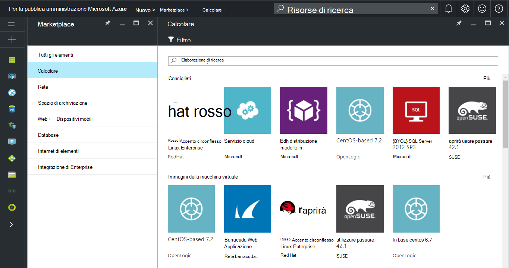

 <properties
    pageTitle="Documentazione per la pubblica amministrazione Azure | Microsoft Azure"
    description="In questo modo un confronto delle caratteristiche e le indicazioni sullo sviluppo di applicazioni per la pubblica amministrazione Azure."
    services="Azure-Government"
    cloud="gov"
    documentationCenter=""
    authors="VybavaRamadoss"
    manager="asimm"
    editor=""/>

<tags   ms.service="multiple"
    ms.devlang="na"
    ms.topic="article"
    ms.tgt_pltfrm="na"
    ms.workload="azure-government"
    ms.date="10/20/2016"
    ms.author="zakramer;vybavar"/>

# Azure Marketplace per la pubblica amministrazione
Azure Marketplace è disponibile per la pubblica amministrazione Azure con un elenco aggiornato delle immagini da editori marketplace. 

## Varianti
Di seguito sono riportate alcune considerazioni quando si usa Azure Marketplace per la pubblica amministrazione:

- Sono disponibili solo le immagini di visualizzare il proprio licenza (BYOL). Non è possibile accedere a tutte le immagini che richiedono l'operazione di acquisto tramite Azure Marketplace
- Solo un sottoinsieme di immagini è attualmente disponibile in confronto marketplace pubblico. È possibile trovare l'elenco delle immagini disponibili [qui](../azure-government-image-gallery.md) 
- Prima il provisioning di un'immagine, l'amministratore dell'organizzazione deve abilitare acquisti Marketplace per l'abbonamento Azure
  - Accedere al portale di come un amministratore dell'organizzazione
  - Passare a *gestire*
  - In *Registrazione dei dettagli* fare clic sull'icona matita accanto all'elemento di riga di *Azure Marketplace*
  - Attivare o disattivare *Attivato o disattivato* in base alle esigenze
  - Fare clic su *Salva*

>[AZURE.NOTE] Se si è interessati a rendere le immagini disponibili in Azure per enti pubblici, vedere [linee guida di onboarding di partner](documentation-government-manage-marketplace-partners.md) per ulteriori informazioni.

### Passaggio 1
Avvio di Marketplace

  

### Passaggio 2
Scorrere i diversi prodotti per trovare quello giusto.

Publisher marketplace comprende un elenco di certificazioni come parte della descrizione del prodotto per mettere la scelta migliore. 

### Passaggio 3
Scegliere un product\image

### Passaggio 4
Avviare il flusso di creare e immettere i parametri necessari per la distribuzione

>[AZURE.NOTE] Nell'elenco a discesa posizione sono visibili solo i percorsi di Azure per la pubblica amministrazione

### Passaggio 5
Osservare prezzi

### Passaggio 6
Completare tutti i passaggi e fare clic su Ok per avviare il processo di provisioning

## Passaggi successivi

Per informazioni aggiuntive e aggiornamenti, sottoscrivere il [Blog di Microsoft Azure per enti pubblici](https://blogs.msdn.microsoft.com/azuregov/).
