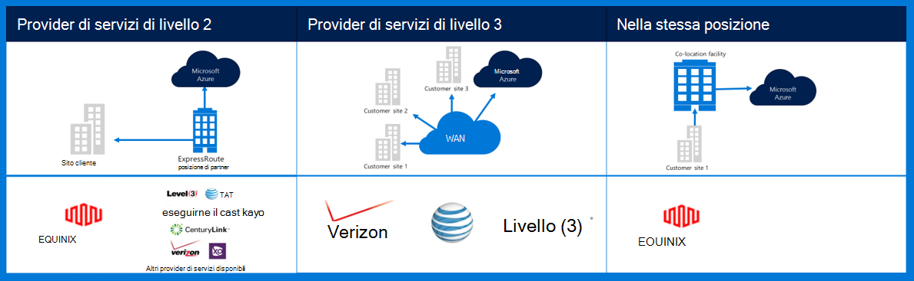
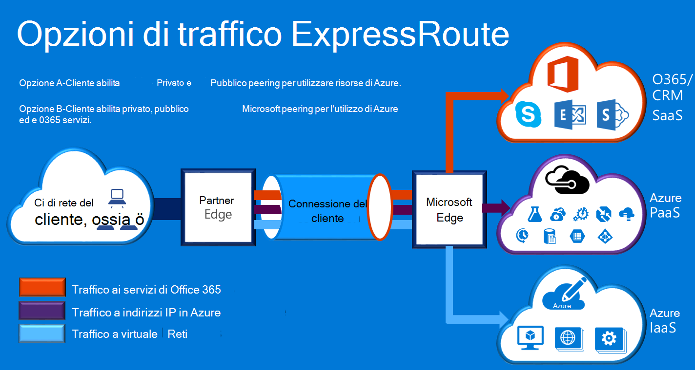

<properties
    pageTitle="Azure documentazione Governmenmt | Microsoft Azure"
    description="In questo modo un confronto delle caratteristiche e le indicazioni per la connettività privata e per la pubblica amministrazione"
    services="Azure-Government"
    cloud="gov" 
    documentationCenter=""
    authors="ryansoc"
    manager="zakramer"
    editor=""/>

<tags
    ms.service="multiple"
    ms.devlang="na"
    ms.topic="article"
    ms.tgt_pltfrm="na"
    ms.workload="azure-government"
    ms.date="09/28/2016"
    ms.author="ryansoc"/>

#  Reti per la pubblica amministrazione Azure

##  ExpressRoute (privato Connectivity)

ExpressRoute è generalmente disponibile in Azure per enti pubblici. Per ulteriori informazioni (inclusi i partner e peering posizioni), vedere la <a href="https://azure.microsoft.com/en-us/documentation/services/expressroute/">documentazione pubblica ExpressRoute </a>.

###  Varianti

ExpressRoute è generalmente disponibile (GA) in Azure per enti pubblici. 

- Clienti del governo connettono a una capacità fisica isolata tramite una connessione per la pubblica amministrazione Azure (Gov) ExpressRoute appositi dedicata

- Azure Gov offre maggiore disponibilità e durata sfruttando più coppie di area geografica si trova un minimo di 500 miglia divisione 

- Per impostazione predefinita la connettività di Azure Gov ER ridondanti con il supporto per la suddivisione configurato attivo-attivo e offre capacità di circuito fino a 10 G (più piccolo è 50MB)

- Percorsi Gov ER Azure offrono percorsi ottimizzati (hop più breve, bassa latenza, prestazioni elevate, ecc.) per clienti e delle aree geografiche geografico ridondanti Gov Azure

- La connessione privata Azure Gov ER non utilizza, scorrere o dipendono da Internet

- Infrastruttura di Azure Gov fisico e logico fisica è dedicato e separato e l'accesso è limitato alle persone degli Stati Uniti

- Microsoft possiede e gestisce tutta l'infrastruttura fiber tra le aree Gov Azure e Azure Gov ER soddisfano-personali che gli altri percorsi

- ER Gov Azure consente la connessione ai servizi cloud Microsoft Azure, Office 365 e CRM

### Considerazioni

Sono disponibili due servizi di base che forniscono la connettività di rete privata in Azure Government: VPN (da-sito per un'organizzazione tipica) ed ExpressRoute.

Azure ExpressRoute viene utilizzato per creare connessioni private tra i Data Center per enti pubblici Azure e infrastruttura locale o in un ambiente di installazione. Connessioni ExpressRoute non passare tramite Internet, che offrono ulteriori l'affidabilità, velocità e latenza inferiore rispetto alle connessioni Internet tipiche. In alcuni casi, utilizzando le connessioni ExpressRoute per trasferire i dati tra sistemi locale su Azure rese significative vantaggi dei costi.   

Con ExpressRoute, stabilire connessioni ai Azure in un percorso ExpressRoute (ad esempio una funzione di provider di Exchange), o direttamente Azure tramite la rete WAN esistente (ad esempio un multiprotocol etichetta commutazione VPN (MPLS), fornite da un provider di servizi di rete).

    

Per i servizi di rete per il supporto per la pubblica amministrazione Azure cliente applicazioni e soluzioni, è consigliabile che ExpressRoute (privato connectivity) è implementata per connettersi a Government Azure. Se si utilizzano le connessioni VPN, di seguito da considerare:

- I clienti, contattare loro per l'autorizzazione ufficiale/agenzia per determinare se è necessario connettività privata o altro meccanismo di connessione sicura e identificare eventuali limitazioni aggiuntive da prendere in considerazione.

- I clienti devono decidere se imporre che VPN da sito è stata distribuita tramite un'area di integrazione applicativa privato.

- I clienti possono ottenere un circuito MPLS o VPN con un provider di access con licenza connettività privato.

Tutti i clienti che utilizzano un'architettura di integrazione applicativa privato verificare che un'implementazione è stabilita ed mantenuta per la connessione con i clienti a Gateway di rete/Internet (gruppo / si) edge punto di demarcazione router per la pubblica amministrazione Azure. Allo stesso modo, l'organizzazione è necessario stabilire la connettività di rete tra l'ambiente locale e punto di demarcazione router bordo Gateway rete/cliente (gruppo/C) per la pubblica amministrazione Azure.

## Passaggi successivi

Per ulteriori informazioni e aggiornamenti abbonarsi alla <a href="https://blogs.msdn.microsoft.com/azuregov/">Blog di Microsoft Azure per enti pubblici.</a>
