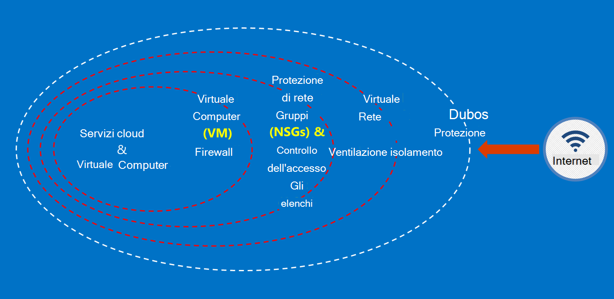

<properties
    pageTitle="Documentazione per la pubblica amministrazione Azure | Microsoft Azure"
    description="In questo modo un confronto delle caratteristiche e indicazioni sullo sviluppo di applicazioni per la pubblica amministrazione Azure"
    services="Azure-Government"
    cloud="gov" 
    documentationCenter=""
    authors="ryansoc"
    manager="zakramer"
    editor=""/>

<tags
    ms.service="multiple"
    ms.devlang="na"
    ms.topic="article"
    ms.tgt_pltfrm="na"
    ms.workload="azure-government"
    ms.date="08/25/2016"
    ms.author="ryansoc"/>

#  Panoramica della documentazione di Azure per la pubblica amministrazione

##  Introduzione alla documentazione per la pubblica amministrazione Azure

Questo sito descrive le funzionalità dei servizi [Microsoft Azure pubblici](https://azure.microsoft.com/features/gov/) e fornisce indicazioni generali applicabili a tutti i clienti. Prima di includere specificamente regolamentati dati nell'abbonamento per enti pubblici Azure, è necessario acquisire familiarità con le funzionalità per la pubblica amministrazione Azure e se hai domande, consultare il team di account.

Fare riferimento alla [Pagina Microsoft Azure attendibile centro conformità](http://www.microsoft.com/en-us/TrustCenter/Compliance/default.aspx) per informazioni aggiornate sui servizi per la pubblica amministrazione Azure coperti normative e seguito specifico. Servizi Microsoft aggiuntivi potrebbero essere disponibili, ma non rientrano nell'ambito dei servizi per enti pubblici Azure coperto e non previsti in questo documento. Servizi pubblici Azure potrebbero anche consentono di utilizzare una varietà di risorse aggiuntive, applicazioni o i servizi forniti da terze parti, o da Microsoft in termini separate dei criteri di utilizzo e la privacy, ovvero che non sono inclusi nell'ambito di questo documento. Sei responsabile per la revisione dei termini di tutti tali offerte "componente aggiuntivo", ad esempio offerte Marketplace, per assicurarsi che soddisfino le proprie esigenze riguardo.

Per la pubblica amministrazione Azure è disponibile per entità che gestiscono i dati che sono soggetto a determinate normative e requisiti (ad esempio NIST 800.171 DIB (), ITAR, 1075 IRS, DoD L4 e CJIS) in utilizzo di Azure Government è necessario per conformarsi alle normative. Azure clienti del governo sono soggetti alla convalida dell'idoneità.

Entità con domande su idoneità per la pubblica amministrazione Azure, rivolgersi al team account.

##  Principi per la protezione dei dati dei clienti in Azure per la pubblica amministrazione

Azure per la pubblica amministrazione offre una gamma di funzionalità e i servizi che è possibile utilizzare per creare soluzioni basate su cloud per soddisfare le esigenze di dati regolata controllati. Una soluzione clienti conforme è semplicemente l'implementazione effettiva delle funzionalità di Azure Government della casella, unitamente a una procedura di protezione dei dati a tinta unita.
Quando si ospita una soluzione per enti pubblici Azure, Microsoft gestisce molti di questi requisiti a livello di infrastruttura cloud.

Il diagramma seguente illustra il modello di difesa in Azure. Ad esempio Microsoft offre dell'infrastruttura cloud base DDOS, insieme a funzionalità cliente, ad esempio apparecchiature di sicurezza per applicazione specifica per un cliente che deve DDOS.

Questa pagina illustra i principi di base per la protezione dei servizi e applicazioni, le indicazioni e procedure consigliate su come applicare questi principi; in altre parole, come i clienti devono utilizzare smart del governo Azure per soddisfare gli obblighi e le responsabilità necessari per una soluzione che gestisce informazioni ITAR.

Principi generali per la protezione dei dati dei clienti sono:
* Protezione dei dati utilizzando la crittografia
* Gestione delle informazioni riservate
* Isolamento per limitare l'accesso ai dati

##  Protezione dei dati dei clienti utilizzando la crittografia

Riduzione dei rischi e riunioni obblighi normativi determinano l'ingrandimento lo stato attivo e priorità crittografia dei dati. Utilizzare un'implementazione di crittografia efficaci per migliorare misure di sicurezza di rete e l'applicazione corrente, ovvero e ridurre il rischio globale dell'ambiente cloud.

### Crittografia inattivi
La crittografia dei dati inattivi riguarda la protezione del testo dei clienti contenuto nella spazio su disco. Esistono diversi modi che questo problema può verificarsi:

### Crittografia del servizio di archiviazione

La crittografia del servizio di archiviazione Azure viene abilitata a livello di account di archiviazione, risultante in blocco BLOB e BLOB di pagine da crittografare automaticamente quando scritta allo spazio di archiviazione Azure. Quando si leggono dati dallo spazio di archiviazione di Azure, verrà decrittografare dal servizio di archiviazione prima di essere restituito. Consente di proteggere i dati senza dover modificare o aggiungere codice a tutte le applicazioni.

### Crittografia del Azure
Utilizzare la crittografia del Azure per crittografare il dischi di sistema operativo e quelli di dati utilizzati da una macchina virtuale Azure. Integrazione con Azure chiave archivio consente di controllare e semplifica la gestione delle chiavi di crittografia disco.

### Crittografia lato client
La crittografia lato client è integrata nel linguaggio e le librerie client lo spazio di archiviazione di .NET, che possono essere utilizzate Azure chiave archivio API, effettuare questa operazione semplice implementare. Utilizzare Azure chiave archivio per ottenere accesso alle informazioni riservate in Azure chiave archivio per le persone specifiche con Azure Active Directory.

### Crittografia durante il transito

La crittografia di base disponibile per la connettività per la pubblica amministrazione Azure supporta livello sicurezza protocollo TLS (Transport) 1.2 e certificati x. 509. Federal Information Processing Standard (FIPS) 140-2 livello 1 algoritmi utilizzati anche per le connessioni di rete infrastruttura tra i Data Center per enti pubblici Azure.  Windows Server 2012 R2 e Windows 8-plus macchine virtuali e nelle condivisioni File Azure possono utilizzare piccole e medie imprese 3.0 per la crittografia tra la macchina virtuale e la condivisione di file. Utilizzare la crittografia lato Client per crittografare i dati prima viene trasferita in archiviazione nelle applicazioni client e per decrittografare i dati dopo tale voce viene trasferita fuori dello spazio di archiviazione.

### Procedure consigliate per la crittografia

* Macchine virtuali IaaS: Utilizzare la crittografia di Azure disco. Attivare la crittografia del servizio di archiviazione per crittografare i file disco rigido virtuale utilizzato per eseguire il backup tali dischi in archiviazione Azure, ma questo solo appena scritti i dati vengono crittografati. Ciò significa che, se si crea una macchina virtuale e quindi attiva la crittografia del servizio di archiviazione per l'account di archiviazione che contiene il file disco rigido virtuale, solo le modifiche verranno crittografate, non il file disco rigido virtuale originale.
* La crittografia lato client: Questo è il metodo più sicuro per la crittografia dei dati, perché crittografa prima di transito e crittografa i dati inattivi. È necessario aggiungere codice alle applicazioni mediante lo spazio di archiviazione, si consiglia di effettuare. In questi casi, è possibile utilizzare HTTPs per i dati in transito e la crittografia del servizio di archiviazione per crittografare i dati inattivi. La crittografia lato client comporta anche un carico maggiore sul client, è necessario conto per i piani di scalabilità, soprattutto se si ha la crittografia e il trasferimento di una grande quantità di dati.

Per ulteriori informazioni sulle opzioni di crittografia in Azure vedere la [Guida sulla sicurezza di spazio di archiviazione](/storage-security-guide).

##  Protezione dei dati dei clienti tramite la gestione delle informazioni riservate

Gestione delle chiavi sicura è fondamentale per proteggere i dati nel cloud. I clienti consigliabile cercare di semplificare la gestione delle chiavi e mantenere il controllo delle chiavi utilizzate da servizi e applicazioni cloud per crittografare i dati.

### Procedure consigliate per la gestione delle informazioni riservate

* Consente di ridurre al minimo i rischi di informazioni riservate vengano esposti tramite file di configurazione hardcoded, script, o nel codice sorgente chiave archivio. Archivio chiave Azure crittografare chiavi (ad esempio, le chiavi di crittografia per la crittografia disco Azure) e informazioni riservate (ad esempio le password), per memorizzare le FIPS 140-2 livello 2 convalidati moduli di protezione hardware (HSM). Per garanzia aggiunta, è possibile importare o generare chiavi in queste HSM.
* Modelli e il codice dell'applicazione devono contenere solo riferimenti URI per le informazioni riservate (ovvero che l'effettivi informazioni riservate non sono nel codice, configurazione o codice sorgente archivi). In questo modo attacchi di phishing chiave in pronti contro termine interne o esterne, ad esempio raccolto Bot in GitHub.
* Utilizzare i controlli RBAC sicuri all'interno di archivio di chiave. Se un operatore attendibile lascia la società o trasferimenti a un nuovo gruppo all'interno della società, deve essere impediti possano accedere le informazioni riservate.  

Per ulteriori informazioni, vedere [Archivio chiave per la pubblica amministrazione Azure](/azure-government/azure-government-tech-keyvault)

##  Isolamento per limitare l'accesso ai dati

Isolamento è basato sui utilizzando limiti, segmentazione e contenitori per limitare l'accesso ai dati a solo gli utenti autorizzati, servizi e applicazioni. Ad esempio, la separazione tra tenant è un meccanismo di protezione essenziali per le piattaforme multi-tenant cloud, ad esempio Microsoft Azure. Isolamento logico consente di impedire un tenant di interferire con le operazioni di qualsiasi altro tenant.

### Isolamento dell'ambiente
L'ambiente per enti pubblici Azure è un'istanza di fisica separata dal resto della rete Microsoft. Grazie a una serie di controlli fisici e logici che includono quanto segue: proteggere gli ostacoli fisici utilizzando dispositivi biometrici e fotocamere.  Uso delle credenziali specifiche e autenticazione a più fattori da personale Microsoft che richiedono l'accesso logico all'ambiente di produzione.  Tutta l'infrastruttura del servizio per la pubblica amministrazione Azure si trova negli Stati Uniti.

#### Per ogni cliente isolamento
Controllo dell'accesso rete implementa Azure e separazione tramite isolamento VLAN, ACL, caricare bilanciamento del carico e filtri

I clienti possono inoltre isolare le risorse in più abbonamenti, gruppi di risorse, reti virtuali e subnet.

Per ulteriori informazioni sull'isolamento in Microsoft Azure vedere la [sezione di isolamento della Guida di sicurezza di Azure](/azure-security-getting-started/#isolation).

Per ulteriori informazioni e aggiornamenti abbonarsi alla <a href="https://blogs.msdn.microsoft.com/azuregov/">Blog di Microsoft Azure per enti pubblici.</a>
