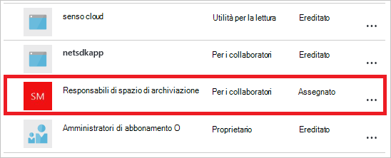

<properties
   pageTitle="Dashboard portale Azure accesso | Microsoft Azure"
   description="In questo articolo viene spiegato come condividere l'accesso a un dashboard nel portale di Azure."
   services="azure-portal"
   documentationCenter=""
   authors="tfitzmac"
   manager="timlt"
   editor="tysonn"/>

<tags
   ms.service="multiple"
   ms.devlang="NA"
   ms.topic="article"
   ms.tgt_pltfrm="NA"
   ms.workload="na"
   ms.date="08/01/2016"
   ms.author="tomfitz"/>

# Condivisione dashboard Azure

Dopo aver configurato un dashboard, è possibile pubblicarlo e condividerlo con altri utenti dell'organizzazione. Sia autorizzato ad altri utenti di accedere al dashboard utilizzando Azure [Controllo dell'accesso basato su ruoli](../active-directory/role-based-access-control-configure.md). Assegnare un utente o gruppo di utenti a un ruolo e tale ruolo definisce se gli utenti possono visualizzare o modificare dashboard pubblicati. 

Tutti i dashboard pubblicati sono implementati come risorse Azure, vale a dire esistano come gestibili elementi all'interno di abbonamento e sono contenuti in un gruppo di risorse.  Da una prospettiva di controllo di accesso, i dashboard sono diversi da altre risorse, ad esempio una macchina virtuale o un account di archiviazione.

> [AZURE.TIP] Singole sezioni nel dashboard di applicare le proprie esigenze di controllo di accesso basate sulle risorse che verranno visualizzati.  Di conseguenza, è possibile progettare un dashboard condivisi ampiamente durante comunque per proteggere i dati in singole sezioni.

## Controllo dell'accesso informazioni per i dashboard

Controllo dell'accesso basato sui ruoli, è possibile assegnare utenti ai ruoli in tre diversi livelli di ambito:

- abbonamento
- gruppo di risorse
- risorsa

Le autorizzazioni assegnate vengono ereditate dal abbonamento fino alla risorsa. Dashboard pubblicati rappresenta una risorsa. Di conseguenza, potrebbe essere già utenti assegnati ai ruoli per l'abbonamento che funzionano anche per il dashboard pubblicato. 

Ecco un esempio.  Supponiamo che si ha un abbonamento Azure e vari membri del team sono stati assegnati i ruoli di **proprietario**, **collaboratori**o **reader** per l'abbonamento. Utenti che usano i proprietari e i collaboratori in grado di elenco, visualizzare, creare, modificare o eliminare dashboard all'interno della sottoscrizione.  Gli utenti che appartengono ai lettori sono in grado di dashboard e visualizzazione, ma non è possibile modificare o eliminare.  Gli utenti che dispongono dell'accesso in lettura sono in grado di apportare modifiche locali a un dashboard pubblicato (ad esempio, per la risoluzione dei problemi), ma non sono in grado di pubblicare tali modifiche nel server.  Avranno l'opzione per creare una copia privata del dashboard per se stessi

È tuttavia possibile assegnare autorizzazioni al gruppo di risorse contenente diversi dashboard o a un singolo dashboard. Ad esempio, è possibile che un gruppo di utenti deve disporre di autorizzazioni limitate attraverso l'abbonamento ma maggiore accesso a un determinato dashboard. Assegnare utenti a un ruolo per tale dashboard. 

## Pubblicare dashboard

Si supponga di che aver configurato un dashboard che si desidera condividere con un gruppo di utenti l'abbonamento. La procedura indicata di seguito illustrano un gruppo personalizzato denominato responsabili di spazio di archiviazione, ma è possibile assegnare un nome al gruppo qualsiasi elemento desiderato. Per informazioni sulla creazione di un gruppo di Active Directory e aggiunta di utenti al gruppo, vedere [gestione dei gruppi di Azure Active Directory](../active-directory/active-directory-accessmanagement-manage-groups.md).

1. Il dashboard di selezionare **Condividi**.

     

2. Prima di assegnare l'accesso, è necessario pubblicare il dashboard. Per impostazione predefinita, il dashboard pubblicato a un gruppo di risorse denominato **Dashboard**. Selezionare **pubblica**.

     

Il dashboard a questo punto è pubblicato. Se le autorizzazioni ereditate dalla sottoscrizione sono adatte, non occorre fare nulla più. Altri utenti dell'organizzazione potranno accedere e modificare il dashboard in base al ruolo ricoperto livello di abbonamento a. Tuttavia, per questa esercitazione, è possibile assegnare un gruppo di utenti a un ruolo per tale dashboard.

## Assegnare l'accesso a un dashboard

1. Dopo la pubblicazione del dashboard, selezionare **Gestione utenti**.

     

2. Verrà visualizzato un elenco degli utenti esistenti che sono già state assegnate un ruolo per il dashboard. L'elenco degli utenti esistenti sarà diverso da quello nell'immagine seguente. È probabile che le assegnazioni vengono ereditate dall'abbonamento. Per aggiungere un nuovo utente o un gruppo, selezionare **Aggiungi**.

     

3. Selezionare il ruolo che rappresenta le autorizzazioni che si desidera concedere. In questo esempio, selezionare **Collaboratore**.

     

4. Selezionare l'utente o gruppo a cui si desidera assegnare al ruolo. Se non viene visualizzata all'utente o gruppo che si sta cercando nell'elenco, usare la casella di ricerca. L'elenco dei gruppi disponibili dipendono dai gruppi creati in Active Directory.

      

5. Al termine dell'operazione di aggiunta di utenti o gruppi, selezionare **OK**. 

6. La nuova assegnazione viene aggiunto all'elenco di utenti. Si noti che l' **accesso** è elencata come **assegnate** anziché **ereditate**.

     

## Passaggi successivi

- Per un elenco dei ruoli, vedere [RBAC: ruoli incorporati](../active-directory/role-based-access-built-in-roles.md).
- Per ulteriori informazioni sulla gestione delle risorse, vedere [gestire Azure risorse tramite portale](resource-group-portal.md).