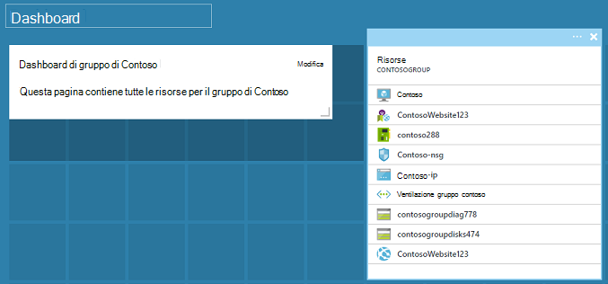

<properties
   pageTitle="Dashboard portale Azure | Microsoft Azure"
   description="In questo articolo viene spiegato come creare e modificare i dashboard nel portale di Azure."
   services="azure-portal"
   documentationCenter=""
   authors="sewatson"
   manager="timlt"
   editor="tysonn"/>

<tags
   ms.service="multiple"
   ms.devlang="NA"
   ms.topic="article"
   ms.tgt_pltfrm="NA"
   ms.workload="na"
   ms.date="09/06/2016"
   ms.author="sewatson"/>

# Creare e condividere dashboard nel portale di Azure

È possibile creare più dashboard e condividerli con altri utenti che hanno accesso alle sottoscrizioni Azure.  Questo post passa attraverso le nozioni di base di creazione o modifica, la pubblicazione e gestione dell'accesso ai dashboard.

## Personalizzazione di dashboard e pale

Dal lancio dashboard alcuni mesi, è stata una costante riduzione di personalizzazioni blade e un rapido incremento personalizzazioni dashboard. Questa tendenza l'uso sicuro mostra che si preferisce personalizzare i dashboard su blade. Per supportare tale tendenza, si comporta la rimozione la possibilità di personalizzare pale e dedicare impegno ottimizzazione delle funzionalità di dashboard. Se si ha personalizzato blade, la personalizzazione non appena vengono rimosse. Per mantenere la personalizzazione, bloccare i riquadri personalizzati a un dashboard. È sufficiente pulsante destro del mouse sul riquadro e selezionare **Aggiungi a dashboard** , come illustrato nell'immagine seguente.

## Creare un dashboard

Per creare un dashboard, selezionare il pulsante **nuovo dashboard** accanto al nome del dashboard corrente.  

Questa azione consente di creare un dashboard di nuovo, vuoto, privato e inserisce la modalità di personalizzazione nel punto in cui è possibile assegnare un nome al dashboard e aggiungere o ridisporre i riquadri.  In questa modalità, la raccolta riquadro comprimibile consente di accedere al menu di spostamento a sinistra.  La raccolta riquadro consente di trovare le sezioni per le risorse Azure in vari modi: è possibile passare dal [gruppo di risorse](../azure-resource-manager/resource-group-overview.md#resource-groups), in base al tipo di risorsa, con [tag](../resource-group-using-tags.md)o dalla ricerca per la risorsa in base al nome.  

Aggiungere riquadri, trascinarli e rilasciarli nell'area di dashboard nel punto desiderato.

Esiste una nuova categoria chiamata **Generale** per le sezioni che non sono associate a una determinata risorsa.  In questo esempio abbiamo bloccare il riquadro delle vendite promozionali.  Utilizzare questa sezione per aggiungere contenuto personalizzato per il dashboard.  Il riquadro supporta testo normale, [la sintassi delle vendite promozionali](https://daringfireball.net/projects/markdown/syntax)e un numero limitato di HTML.  (Per la sicurezza, non è possibile eseguire operazioni come inserire `<script>` tag o utilizzare determinato elemento relative agli stili di stile CSS che potrebbero interferire con il portale.) 

## Modificare un dashboard

Dopo aver creato il dashboard, è possibile bloccare i riquadri dalla raccolta di sezione o la rappresentazione riquadro pale. Di seguito bloccare la rappresentazione del gruppo di risorse. È possibile uno dei due pin durante l'esplorazione l'elemento o da e il gruppo delle risorse. Entrambi gli approcci risultato bloccare la rappresentazione riquadro del gruppo di risorse.

Dopo aver l'elemento, viene visualizzato nel dashboard.

Ora che si dispone di un riquadro delle vendite promozionali e un gruppo di risorse aggiunte al dashboard, è possibile ridimensionare e ridisporre i riquadri in un layout adatto.

Passaggio del mouse e selezionando "…" o mouse su un riquadro è possibile vedere tutti i comandi contestuali per tale riquadro. Per impostazione predefinita, sono disponibili due elementi:

1. **Rimuovi dal dashboard** : rimuove il riquadro nel dashboard
2.  Immette **Personalizza** : personalizzare la modalità

Selezionando personalizzare, è possibile ridimensionare e riordinare i riquadri. Per ridimensionare un riquadro, selezionare la nuova dimensione dal menu di scelta rapida, come illustrato nell'immagine seguente.

In alternativa, se il riquadro supporta qualsiasi dimensione, è possibile trascinare l'angolo inferiore destro per le dimensioni desiderate.

Dopo il ridimensionamento riquadri, visualizzare il dashboard.

Dopo aver personalizzazione di un dashboard, è sufficiente seleziona il **termine personalizzazione** per uscire dalla modalità di personalizzazione o mouse e scegliere **completato la personalizzazione** dal menu di scelta rapida.

## Pubblicare un dashboard e controllare l'accesso

Quando si crea un dashboard, è privato per impostazione predefinita, pertanto che si è l'unica persona che può essere visualizzato.  Per rendere più visibili agli altri utenti, utilizzare il pulsante **Condividi** che viene visualizzata accanto a altri comandi dashboard.

È necessario scegliere un abbonamento e il gruppo di risorse per il dashboard per la pubblicazione in. Per integrare i dashboard in ecosistema, è stata implementata dashboard condiviso come risorse Azure (in modo che non è possibile condividere digitando un indirizzo di posta elettronica).  Accesso alle informazioni visualizzate dalla maggior parte dei riquadri nel portale dipendono dal [Controllo di accesso in base al ruolo Azure](../active-directory/role-based-access-control-configure.md ). Da una prospettiva di controllo di accesso, dashboard condivisi non sono diverse da una macchina virtuale o un account di archiviazione.  

Supponiamo che si ha un abbonamento Azure e i membri del team sono stati assegnati i ruoli di **proprietario**, **collaboratori**o **lettore** della sottoscrizione.  Utenti che usano i proprietari e i collaboratori in grado di elenco, visualizzare, creare, modificare o eliminare dashboard all'interno di tale sottoscrizione.  Gli utenti che appartengono ai lettori sono in grado di dashboard e visualizzazione, ma non è possibile modificare o eliminare.  Gli utenti che dispongono dell'accesso in lettura sono in grado di apportare modifiche locali a un dashboard condiviso, ma non sono in grado di pubblicare tali modifiche nel server.  Tuttavia, che sia possibile apportare una copia del dashboard per uso proprio.  Come sempre singole sezioni nel dashboard di applicare le proprie regole di controllo di accesso basate sulle risorse a che corrispondono.  

Per maggiore comodità, funzionalità di pubblicazione del portale Guida l'utente verso un modello in cui inserire i dashboard in un gruppo di risorse denominato **Dashboard**.  

È anche possibile scegliere di pubblicare un dashboard in un determinato gruppo di risorse.  Il controllo di accesso per tale dashboard corrisponde al controllo di accesso per il gruppo di risorse.  Gli utenti che possono gestire le risorse in tale gruppo di risorse anche dispongano i dashboard.

Dopo la pubblicazione del dashboard, il riquadro di controllo **condivisione + access** verrà aggiornare e visualizzare informazioni su dashboard pubblicati, incluso un collegamento per gestire l'accesso degli utenti per il dashboard.  Questo collegamento Avvia e il controllo dell'accesso basato su ruoli standard usato per gestire l'accesso per tutte le risorse Azure.  Si può sempre tornare alla visualizzazione, selezionare **Condividi**.

## Passaggi successivi

- Per gestire le risorse, vedere [gestire Azure risorse tramite portale](resource-group-portal.md).
- Per distribuire le risorse, vedere [le risorse di distribuzione con Azure portale e modelli di Manager delle risorse](../resource-group-template-deploy-portal.md).