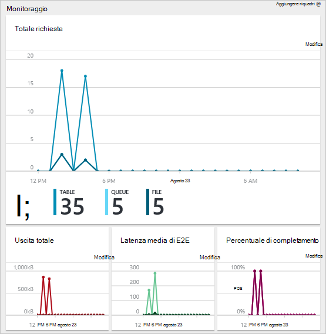

<properties 
    pageTitle="Consente di gestire le risorse Azure portale Azure | Microsoft Azure" 
    description="Portale di Azure e la gestione delle risorse di Azure consente di gestire le risorse. Viene illustrato come lavorare con i dashboard per monitorare le risorse." 
    services="azure-resource-manager,azure-portal" 
    documentationCenter="" 
    authors="tfitzmac" 
    manager="timlt" 
    editor="tysonn"/>

<tags 
    ms.service="azure-resource-manager" 
    ms.workload="multiple" 
    ms.tgt_pltfrm="na" 
    ms.devlang="na" 
    ms.topic="article" 
    ms.date="09/12/2016" 
    ms.author="tomfitz"/>

# Gestire le risorse Azure tramite portale

> [AZURE.SELECTOR]
- [PowerShell Azure](../powershell-azure-resource-manager.md)
- [CLI Azure](../xplat-cli-azure-resource-manager.md)
- [Portale](resource-group-portal.md) 
- [API REST](../resource-manager-rest-api.md)

In questo argomento viene illustrato come utilizzare il [portale Azure](https://portal.azure.com) con [Gestione risorse di Azure](../azure-resource-manager/resource-group-overview.md) per gestire le risorse Azure. Per informazioni sulla distribuzione delle risorse tramite il portale, vedere [risorse di distribuzione con Azure portale e modelli di Manager delle risorse](../resource-group-template-deploy-portal.md).

Non tutti i servizi attualmente supporta il portale e Manager delle risorse. Per i servizi, è necessario usare il [portale classica](https://manage.windowsazure.com). Per lo stato di ogni servizio, vedere [grafico Azure della disponibilità al portale](https://azure.microsoft.com/features/azure-portal/availability/).

## Gestire gruppi di risorse

1. Per visualizzare tutti i gruppi di risorse l'abbonamento, selezionare **i gruppi di risorse**.

    

1. Per creare un gruppo di risorse vuoto, selezionare **Aggiungi**.

    

1. Specificare un nome e un percorso per il nuovo gruppo di risorse. Selezionare **Crea**.

    

1. Potrebbe essere necessario selezionare **Aggiorna** per visualizzare il gruppo di risorse creati di recente.

    

1. Per personalizzare le informazioni visualizzate per i gruppi di risorse, selezionare le **colonne**.

    

1. Selezionare le colonne da aggiungere e quindi selezionare **Aggiorna**.

    

1. Per informazioni sulla distribuzione delle risorse per il nuovo gruppo di risorse, vedere [risorse di distribuzione con Azure portale e modelli di Manager delle risorse](../resource-group-template-deploy-portal.md).

1. Per accedere rapidamente a un gruppo di risorse, è possibile aggiungere e al dashboard.

    

1. Il dashboard consente di visualizzare il gruppo di risorse e le relative risorse. È possibile selezionare i gruppi di risorse o le relative risorse per passare all'elemento.

    

## Tag risorse

È possibile applicare contrassegni a gruppi di risorse e risorse per organizzare in modo logico le risorse. Per informazioni sull'uso di tag, vedere [usare i contrassegni per organizzare le risorse Azure](../resource-group-using-tags.md).

[AZURE.INCLUDE [resource-manager-tag-resource](../../includes/resource-manager-tag-resources.md)]

## Monitor risorse

Quando si seleziona una risorsa, e il risorsa presenta predefinito grafici e tabelle per controllare il tipo di risorsa.

1. Selezionare una risorsa e osservare la sezione **monitoraggio** . Includa grafici rilevanti per il tipo di risorsa. Nella figura seguente mostra il valore predefinito il monitoraggio dei dati per un account di archiviazione.

    

1. È possibile aggiungere una sezione della stessa e al dashboard, fare clic sui puntini di sospensione (…) sopra la sezione. È possibile personalizzare la dimensione la sezione e il o rimuoverlo completamente. Nella figura seguente viene illustrato come aggiungere, personalizzare o rimuovere la sezione CPU e memoria.

    

1. Dopo aver la sezione al dashboard, verrà visualizzato il riepilogo nel dashboard. E quindi selezionando immediatamente consente di accedere a ulteriori informazioni sui dati.

    

1. Per personalizzare completamente i dati che monitorare tramite il portale, passare al dashboard predefinito e selezionare **nuovo dashboard**.

    

1. Specificare un nome per il nuovo dashboard e trascinare i riquadri del dashboard. Vengono filtrati i riquadri per diverse opzioni.

    

     Per altre informazioni sull'uso di dashboard, vedere [creazione e condivisione dashboard nel portale di Azure](azure-portal-dashboards.md).

## Gestire le risorse

In blade per una risorsa, compaiono le opzioni per la gestione della risorsa. Il portale presenta le opzioni per il tipo di risorsa specifico. I comandi di gestione viene visualizzato nella parte superiore della stessa e delle risorse e sul lato sinistro.

Una delle opzioni seguenti, è possibile eseguire operazioni come avviare e arrestare una macchina virtuale o riconfigurare le proprietà della macchina virtuale.

## Spostare le risorse

Se è necessario spostare le risorse in un altro gruppo di risorse o un'altra sottoscrizione, vedere [spostare le risorse nuovo gruppo di risorse o l'abbonamento](../resource-group-move-resources.md).

## Risorse di blocco

È possibile bloccare un abbonamento, gruppo di risorse o delle risorse per impedire ad altri utenti dell'organizzazione da un'accidentale eliminazione o la modifica delle risorse critiche. Per ulteriori informazioni, vedere [risorse di blocco con Gestione risorse di Azure](../resource-group-lock-resources.md).

[AZURE.INCLUDE [resource-manager-lock-resources](../../includes/resource-manager-lock-resources.md)]

## Visualizzare la sottoscrizione e i costi

È possibile visualizzare informazioni sull'abbonamento e i costi di ricalcolo per tutte le risorse. Selezionare **le sottoscrizioni** e l'abbonamento a cui che si desidera visualizzare. Potrebbe essere solo una sottoscrizione a selezionare.

All'interno e l'abbonamento, viene visualizzato una velocità.

E un breakdown dei costi in base al tipo di risorsa.

## Modello di esportazione

Dopo aver configurato il gruppo di risorse, si desidera visualizzare il modello di Manager delle risorse per il gruppo di risorse. Esportazione del modello offre due vantaggi:

1. È possibile automatizzare facilmente distribuzioni future della soluzione poiché il modello contiene tutte l'infrastruttura di completamento.

2. È possibile acquisire familiarità con la sintassi dei modelli riconoscibili in JavaScript Object Notation (JSON) che rappresenta la soluzione.

Per istruzioni dettagliate, vedere [esportare Manager delle risorse di Azure modello dalle risorse esistenti](../resource-manager-export-template.md).

## Elimina gruppo di risorse o delle risorse

Se si elimina un gruppo di risorse, tutte le risorse contenute al suo interno. È inoltre possibile eliminare singole risorse all'interno di un gruppo di risorse. Si desidera prestare attenzione quando si elimina un gruppo di risorse in quanto potrebbero essere risorse in altri gruppi di risorse a esso collegati. Manager delle risorse non comporta l'eliminazione di risorse collegate, ma potrebbe non funzionare correttamente senza le risorse necessarie.

## Passaggi successivi

- Per visualizzare i log di controllo, vedere [controllare le operazioni con Gestione risorse](../resource-group-audit.md).
- Per risolvere gli errori di distribuzione, vedere [risoluzione dei problemi delle risorse gruppo il portale di Azure](../resource-manager-troubleshoot-deployments-portal.md).
- Per distribuire risorse tramite il portale, vedere [le risorse di distribuzione con Azure portale e modelli di Manager delle risorse](../resource-group-template-deploy-portal.md).
- Per gestire l'accesso alle risorse, vedere [le assegnazioni di ruolo usare per gestire l'accesso alle risorse dell'abbonamento Azure](../active-directory/role-based-access-control-configure.md).

