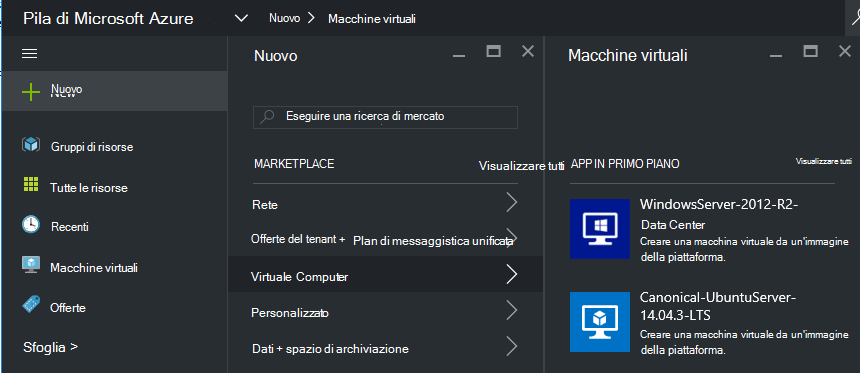
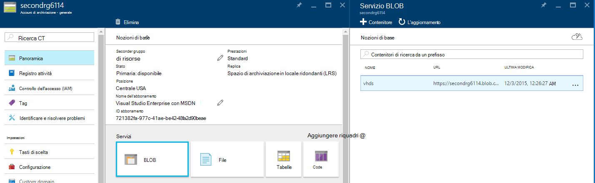
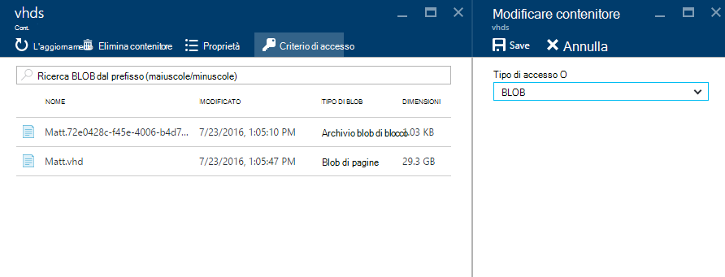
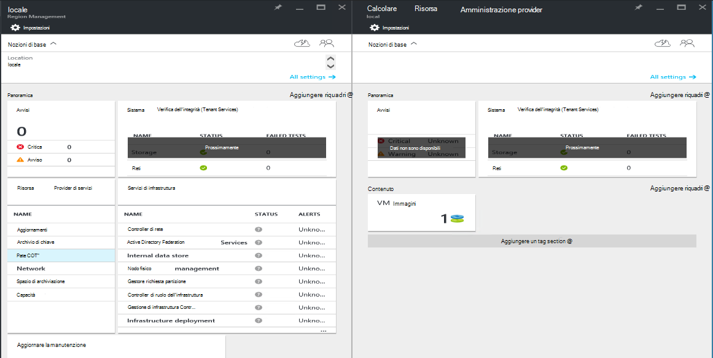
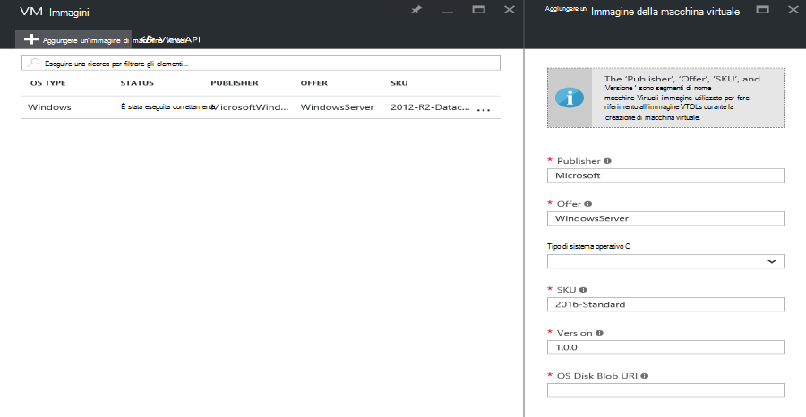

<properties
    pageTitle="Aggiunta di un'immagine di macchine Virtuali di Azure Stack | Microsoft Azure"
    description="Aggiungere Windows o Linux VM immagine personalizzata dell'organizzazione per tenant da utilizzare"
    services="azure-stack"
    documentationCenter=""
    authors="mattmcg"
    manager="darmour"
    editor=""/>

<tags
    ms.service="azure-stack"
    ms.workload="na"
    ms.tgt_pltfrm="na"
    ms.devlang="na"
    ms.topic="get-started-article"
    ms.date="09/26/2016"
    ms.author="mattmcg"/>

# <a name="make-a-custom-virtual-machine-image-available-in-azure-stack"></a>Creare un'immagine personalizzata macchina virtuale disponibile in pila di Azure


Pila di Azure consente agli amministratori di rendere disponibili per il tenant di immagini di macchine Virtuali, ad esempio disco rigido virtuale personalizzato della propria organizzazione. Le immagini possono essere a cui fa riferimento Manager delle risorse Azure modelli o aggiunte all'interfaccia utente Azure Marketplace con la creazione di un elemento Marketplace. Per impostazione predefinita in Azure Stack Technical Preview è inclusa un'immagine di Windows Server 2012 R2.

> [AZURE.NOTE] Immagini di macchine Virtuali con gli elementi Marketplace possono essere distribuite selezionando **Nuovo** nell'interfaccia utente e quindi selezionare la categoria di **macchine virtuali** . Sono elencati gli elementi di immagine macchine Virtuali.


## <a name="add-a-vm-image-to-marketplace-with-powershell"></a>Aggiungere un'immagine di macchine Virtuali al Marketplace con PowerShell

Se l'immagine di macchine Virtuali disco rigido virtuale è disponibile in locale in macchine Virtuali di console (o un altro dispositivo connesso esternamente), utilizzare la procedura seguente:

1. Preparare un'immagine di disco rigido virtuale del sistema operativo Windows o Linux in formato disco rigido virtuale (non VHDX).
    -   Per le immagini di Windows, l'articolo [caricare un'immagine macchine Virtuali di Windows Azure per le distribuzioni di Manager delle risorse](virtual-machines-windows-upload-image.md) è contenute istruzioni Preparazione immagine nella sezione **preparare il disco rigido virtuale per il caricamento** .
    -   Per le immagini di Linux, seguire i passaggi per preparare l'immagine o utilizzare un'immagine di Azure Stack Linux esistente come descritto nell'articolo [macchine virtuali Linux distribuire nella pila di Azure](azure-stack-linux.md).

2. Duplicare [repository Azure Stack strumenti](https://aka.ms/azurestackaddvmimage)e quindi come importare il modulo **ComputeAdmin**

    ```powershell
    Import-Module .\ComputeAdmin\AzureStack.ComputeAdmin.psm1
    ```

3. Aggiungere l'immagine di macchine Virtuali chiamando il cmdlet VMImage Aggiungi.
    -  Includono publisher, offerta, SKU e versione per l'immagine di macchina virtuale. Questi parametri vengono utilizzati modelli di gestione di risorse Azure che fanno riferimento a immagine macchine Virtuali.
    -  Specificare osType come Windows o Linux.
    -  Includere il proprio ID tenant di Azure Active Directory nel modulo * &lt;myaadtenant&gt;*. onmicrosoft.com.
    - Di seguito è una chiamata di esempio dello script:

    ```powershell
       Add-VMImage -publisher "Canonical" -offer "UbuntuServer" -sku "14.04.3-LTS" -version "1.0.0" -osType Linux -osDiskLocalPath 'C:\Users\AzureStackAdmin\Desktop\UbuntuServer.vhd' -tenantID <myaadtenant>.onmicrosoft.com
    ```

    > [AZURE.NOTE] Il cmdlet richiede le credenziali per l'aggiunta di immagini macchine Virtuali. Credenziali di amministratore di Azure Active Directory, ad esempio serviceadmin@ * &lt;myaadtenant&gt;*. onmicrosoft.com alla richiesta.  

Il comando esegue le operazioni seguenti:
- Autentica all'ambiente di Stack di Azure
- Consente di caricare il disco rigido virtuale locale un account di archiviazione temporaneo appena creato
- Aggiunge l'immagine di macchine Virtuali per l'archivio di immagini di macchine Virtuali
- Crea un elemento Marketplace

Per verificare che il comando è stato eseguito correttamente, connettersi al Marketplace nel portale e quindi verificare che l'immagine di macchine Virtuali disponibile nella categoria **macchine virtuali** .

> 

Di seguito è una descrizione dei parametri di comando.


| Parametro | Descrizione |
|----------| ------------ |
|**tenantID** | L'ID del tenant di Azure Active Directory nel modulo * &lt;AADTenantID*. onmicrosoft.com&gt;. |
|**Publisher** | Il segmento nome publisher dell'immagine macchine Virtuali che tenant usare durante la distribuzione dell'immagine. Un esempio è "Microsoft". Non includere uno spazio o altri caratteri speciali in questo campo.|
|**offerta** | Il segmento nome offerta dell'immagine macchine Virtuali che tenant usare durante la distribuzione immagine macchine Virtuali. Un esempio è "Windows Server". Non includere uno spazio o altri caratteri speciali in questo campo. |
| **SKU** | Il segmento nome SKU dell'immagine macchine Virtuali che tenant usare durante la distribuzione immagine macchine Virtuali. Un esempio è 'Datacenter2016'. Non includere uno spazio o altri caratteri speciali in questo campo. |
|**Versione** | La versione dell'immagine macchine Virtuali che tenant usare durante la distribuzione immagine macchine Virtuali. Questa versione è in formato * \#.\#. \#*. Un esempio è '1.0.0'. Non includere uno spazio o altri caratteri speciali in questo campo.|
| **osType** | OsType dell'immagine deve essere 'Windows' o 'Linux'. |
|**osDiskLocalPath** | Il percorso su disco del sistema operativo disco rigido virtuale che si sta caricando come immagine macchine Virtuali di Azure Stack. |
|**dataDiskLocalPaths**| Matrice facoltativa dei percorsi di locale per dischi dati che possono essere caricati come parte dell'immagine macchine Virtuali.|
|**CreateGalleryItem**| Contrassegno booleano che determina se si desidera creare un elemento in Marketplace. Il valore predefinito è impostato su true.|
|**titolo**| Nome visualizzato dell'elemento Marketplace. Il valore predefinito è impostato come lo Sku dell'immagine macchine Virtuali offerta di Publisher.|
|**Descrizione**| Descrizione dell'elemento Marketplace. |
|**osDiskBlobURI**| Facoltativamente, questo script accetta anche un'archiviazione Blob URI per osDisk.|
|**dataDiskBlobURIs**| Facoltativamente, questo script accetta anche una matrice di archiviazione Blob URI per l'aggiunta di dischi di dati all'immagine.|


## <a name="add-a-vm-image-through-the-portal"></a>Aggiungere un'immagine di macchine Virtuali tramite il portale

> [AZURE.NOTE] Questo metodo è necessario creare l'elemento Marketplace separatamente.

Un requisito di immagini è che può essere designati mediante un URI dello spazio di archiviazione Blob. Preparare un'immagine di disco rigido virtuale del sistema operativo Windows o Linux in formato disco rigido virtuale (non VHDX) e quindi caricare l'immagine a un account di archiviazione in Azure o in pila Azure. Se l'immagine è già caricato in archiviazione Blob Azure o Stack di Azure, è possibile ignorare questo passaggio.

Seguire i passaggi da [caricare un'immagine macchine Virtuali di Windows Azure per le distribuzioni di Manager delle risorse](https://azure.microsoft.com/documentation/articles/virtual-machines-windows-upload-image/) articolo tramite il passaggio **caricare l'immagine di macchine Virtuali al proprio account di archiviazione**. Tenere presente quanto segue:

-   Per un'immagine di Linux, seguire le istruzioni per preparare l'immagine o utilizzare un'immagine di Azure Stack Linux esistente come descritto nell'articolo [macchine virtuali Linux distribuire nella pila di Azure](azure-stack-linux.md).

- Risulta più efficiente per caricare un'immagine a archiviazione Blob Stack Azure rispetto a archiviazione Blob Azure perché meno tempo per inserire l'immagine di macchine Virtuali per l'archivio di immagini dello Stack di Azure. Mentre si seguendo le istruzioni di caricamento, assicurarsi di sostituire il passaggio di [PowerShell eseguire l'autenticazione con Microsoft Azure Stack](azure-stack-deploy-template-powershell.md) per il passaggio 'Login to Azure'.

- Prendere nota dell'archiviazione Blob URI nel punto in cui è caricare l'immagine. Ha il seguente formato: * &lt;storageAccount&gt;/&lt;blobContainer&gt;/&lt;targetVHDName&gt;*VHD

2.  Per rendere il blob in modalità anonima accessibile, passare al contenitore di blob account lo spazio di archiviazione **Blob,** in cui è stato caricato l'immagine di macchine Virtuali disco rigido virtuale e quindi selezionare **Criterio di accesso**. Se si desidera, è possibile generare una firma di accesso condiviso per il contenitore e includerli come parte del blob URI.





1.  Accedere a Stack di Azure come amministratore. Passare alla **gestione delle aree geografiche**. Selezionare **Calcolare Provider di risorse**in **RPs** > **Immagini macchine Virtuali** > **Add.**

    

2.  In e il seguente, immettere publisher, offerta, SKU e versione dell'immagine macchine Virtuali. Questi segmenti nome fare riferimento all'immagine macchine Virtuali nei modelli di gestione di risorse Azure. Assicurarsi di selezionare **osType** correttamente. Per **osDiskBlobURI**, immettere l'URI in cui è stata caricata l'immagine nel passaggio 1. Fare clic su **Crea** per iniziare a creare l'immagine di macchina virtuale.

    

3.  Lo stato di macchine Virtuali immagine diventa 'Completato' quando viene aggiunto l'immagine.

4.  Tenant possano distribuirla macchine Virtuali specificando publisher, offerta, SKU e versione dell'immagine macchine Virtuali in un modello di gestione di risorse Azure. Per rendere più facilmente disponibile per il consumo tenant immagine macchine Virtuali nell'interfaccia utente, è consigliabile [creare un elemento Marketplace](azure-stack-create-and-publish-marketplace-item.md).
