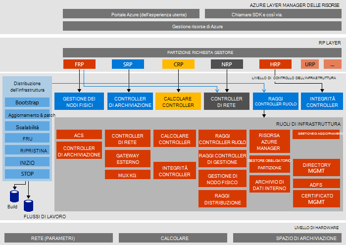

<properties
    pageTitle="Architettura di Microsoft Azure Stack prova di concetti | Microsoft Azure"
    description="Visualizzare l'architettura di Microsoft Azure Stack prova."
    services="azure-stack"
    documentationCenter=""
    authors="heathl17"
    manager="byronr"
    editor=""/>

<tags
    ms.service="azure-stack"
    ms.workload="na"
    ms.tgt_pltfrm="na"
    ms.devlang="na"
    ms.topic="article"
    ms.date="10/25/2016"
    ms.author="helaw"/>

# Architettura di Microsoft Azure Stack prova

PROVA di Stack Azure è una distribuzione di un nodo di Azure Stack Technical Preview 2. Tutti i componenti sono installati in macchine virtuali in esecuzione in un computer singolo host. 

## Diagramma architettura logica
Il diagramma seguente illustra l'architettura logica di prova di Stack Azure e dei relativi componenti.

## Ruoli macchina virtuale
PROVA di Stack Azure offre servizi tramite macchine virtuali seguenti sull'host prova:

 - **MAS ACS01** Macchina virtuale hosting di servizi di archiviazione di Azure Stack.

 - **MAS ADFS01** Macchina virtuale che ospita Active Directory Federation Services.  Questa macchina virtuale non viene usata in Technical Preview 2.  

 - **MAS ASQL01**  Fornire un archivio dati interno per i ruoli di infrastruttura dello Stack di Azure macchina virtuale.  

 - **MAS BGPNAT01** Macchina virtuale funge da router bordo e fornisce funzionalità VPN e NAT per Stack di Azure.

 - **MAS CA01** Fornire servizi autorità di certificati per i servizi di ruolo Azure Stack macchina virtuale.

 - **MAS CON01** Macchina virtuale disponibile per gli sviluppatori per l'installazione di PowerShell, Visual Studio e altri strumenti.

 - **DC01 MAS** Macchina virtuale che ospitano i servizi Active Directory, DNS e DHCP per Microsoft Azure Stack.

 - **MAS GWY01** Macchina virtuale servizi bordo gateway, ad esempio le connessioni da sito VPN per le reti tenant.

 - **MAS NC01**  Macchina virtuale Controller di rete, che gestisce i servizi di rete di Azure Stack di hosting.  

 - **MAS SLB01**  Macchina virtuale fornisce bilanciamento del carico servizi dello Stack di Azure per tenant e servizi di infrastruttura dello Stack di Azure.  

 - **MAS SUS01**  Virtuale computer hosting di servizi di aggiornamento di Windows Server e la responsabilità di fornire aggiornamenti apportati alle altre macchine virtuali di Azure Stack.

 - **MAS WAS01**  Macchina virtuale hosting portale e i servizi di gestione di risorse Azure.

 - **MAS XRP01** Macchina virtuale che ospita i provider di risorse principali di Microsoft Azure Stack, incluso il provider di risorse elaborazione, di rete e di archiviazione.

## Servizi di archiviazione
Servizi di archiviazione nel sistema operativo host fisico includono:

 - **Servizio Blob ACS** Azure coerente dello spazio di archiviazione Blob servizio, che offre servizi di archiviazione blob e una tabella.

 - **SoFS** Scalabilità File Server.

 - **Rif CSV** File flessibili sistema Cluster condiviso Volume.

 - **Disco virtuale**, **Lo spazio di archiviazione**e **Lo spazio di archiviazione spazi diretto** sono rispettivi archiviazione tecnologia in Windows Server per abilitare il provider di risorse di Microsoft Azure Stack core lo spazio di archiviazione.

## Passaggi successivi

[Distribuire Stack Azure](azure-stack-deploy.md)

[Scenari prima di provare](azure-stack-first-scenarios.md)

