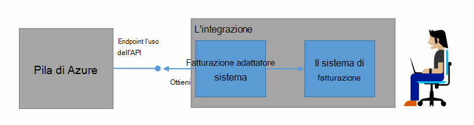
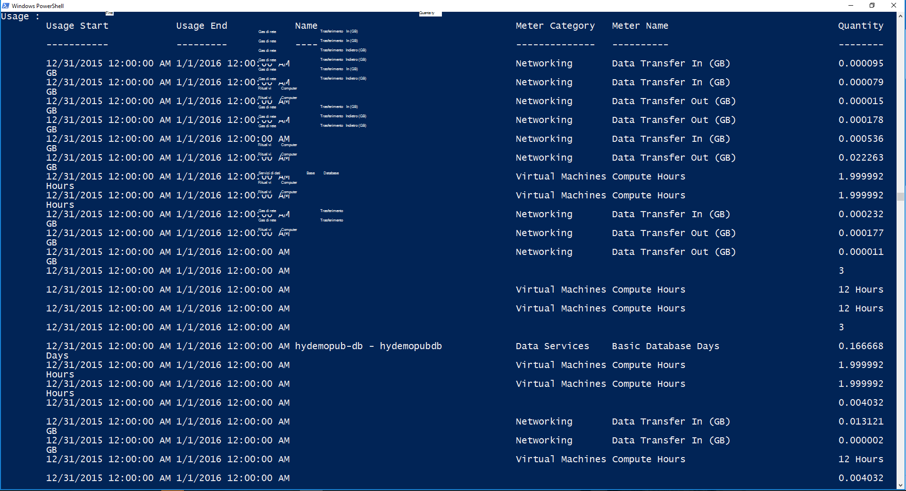

<properties
    pageTitle="Fatturazione dei clienti e rifiuto In pila Azure | Microsoft Azure"
    description="Informazioni su come recuperare informazioni sull'utilizzo delle risorse da Azure Stack."
    services="azure-stack"
    documentationCenter=""
    authors="AlfredoPizzirani"
    manager="byronr"
    editor=""/>

<tags
    ms.service="azure-stack"
    ms.workload="na"
    ms.tgt_pltfrm="na"
    ms.devlang="na"
    ms.topic="article"
    ms.date="10/18/2016"
    ms.author="alfredop"/>

# Fatturazione clienti e rifiuto in pila di Azure

Ora che si sta utilizzando dello Stack di Azure, è consigliabile valutare su come tenere traccia dell'utilizzo. Provider di servizi si basano su informazioni sull'utilizzo di fatturazione dei clienti e per comprendere il costo di fornitura dei servizi.
Aziende, anche in genere tenere traccia dell'utilizzo per reparto.

Pila di Azure non è un sistema di fatturazione. Essa non si carica il tenant per risorse che utilizzano. Tuttavia, Stack di Azure avere l'infrastruttura di raccogliere e aggregare i dati di utilizzo per ogni provider singola risorsa. È possibile accedere ai dati ed esportare in un sistema di fatturazione utilizzando una scheda fatturazione o esportare in uno strumento di business intelligence come Microsoft Power BI.

## Quali informazioni sull'utilizzo è possibile trovare e come?

Provider di risorse Stack Azure generare record di utilizzo intervalli orari. I record mostrano la quantità di ogni risorsa che è stata utilizzata e di abbonamento utilizzata la risorsa. Questi dati vengono archiviati. È possibile accedere ai dati tramite l'API REST.

Un amministratore del servizio è possibile recuperare dati di utilizzo per tutte le sottoscrizioni tenant. Tenant singoli possibile recuperare solo le proprie informazioni.

L'uso record hanno informazioni dello spazio di archiviazione, rete e l'uso di calcolo. Per un elenco dei contatori, vedere [questo articolo](azure-stack-usage-related-faq.md).

## Recuperare le informazioni sull'utilizzo

Per generare i record, è necessario disporre di risorse in esecuzione e che stanno utilizzando il sistema. Se non si è sicuri se si dispone di tutte le risorse in esecuzione, in pila Azure Marketplace distribuire, quindi eseguire una macchine (). Osservare la macchina virtuale monitoraggio blade per accertarsi che si è in esecuzione.

È consigliabile eseguire il cmdlet di Windows PowerShell per visualizzare dati di utilizzo.
PowerShell chiamate API di utilizzo delle risorse.

1.  [Installare e configurare Azure PowerShell](https://azure.microsoft.com/en-us/documentation/articles/powershell-install-configure/).

2.  Per accedere a Gestione risorse di Azure, utilizzare il cmdlet di PowerShell **AzureRmAccount Login**.

3.  Per selezionare l'abbonamento a cui è utilizzato per creare le risorse, digitare **AzureRmSubscription Get-SubscriptionName "il sub" | Selezionare AzureRmSubscription**.

4.  Per recuperare i dati, utilizzare il cmdlet di PowerShell [**Get-UsageAggregates**](https://msdn.microsoft.com/en-us/library/mt619285.aspx).
    Se i dati di utilizzo sono disponibili, viene restituito in PowerShell, come illustrato nell'esempio seguente. PowerShell restituisce 1.000 righe di utilizzo per la chiamata.
    È possibile utilizzare l'argomento di *continuazione* per recuperare i set di righe oltre i primi 1.000. Per ulteriori informazioni sui dati di utilizzo, vedere il [riferimento all'API di utilizzo delle risorse](azure-stack-provider-resource-api.md).

    

## Passaggi successivi

[Utilizzo delle risorse provider API](azure-stack-provider-resource-api.md)

[Utilizzo delle risorse API del tenant](azure-stack-tenant-resource-usage-api.md)

[Domande frequenti relative l'uso](azure-stack-usage-related-faq.md)
