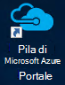
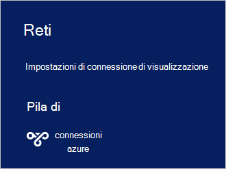

<properties
    pageTitle="Connettersi a Stack Azure | Microsoft Azure"
    description="Informazioni su come connettere dello Stack di Azure"
    services="azure-stack"
    documentationCenter=""
    authors="ErikjeMS"
    manager="byronr"
    editor=""/>

<tags
    ms.service="azure-stack"
    ms.workload="na"
    ms.tgt_pltfrm="na"
    ms.devlang="na"
    ms.topic="get-started-article"
    ms.date="10/18/2016"
    ms.author="erikje"/>

# <a name="connect-to-azure-stack"></a>Connettersi a Stack Azure
Per gestire le risorse, è necessario connettersi al computer di prova Stack Azure. È possibile utilizzare una delle seguenti opzioni di connessione:

 - Desktop remoto: consente di un singolo utente simultaneo connettersi rapidamente dal computer di prova.
 - Rete privata virtuale (VPN): consente di più utenti concorrenti connettersi dal client di fuori dell'infrastruttura di Azure Stack (richiede configurazione).

## <a name="connect-with-remote-desktop"></a>Connettersi con Desktop remoto
Con una connessione Desktop remoto, un singolo utente simultaneo possibile collaborare con il portale di gestione delle risorse. È possibile anche utilizzare strumenti sul computer virtuale MAS CON01.

1.  Accedere al computer Azure Stack prova.

2.  Aprire una connessione Desktop remoto e connettersi a MAS CON01. Immettere **AzureStack\AzureStackAdmin** come il nome utente e la password amministrativa fornito durante l'installazione dello Stack di Azure.  

3.  Sul desktop MAS CON01 fare doppio clic sull'icona di **Microsoft Azure Stack Portal** (https://portal.azurestack.local/) per aprire il [portale](azure-stack-key-features.md#portal).

    

4.  Accedere usando le credenziali di Azure Active Directory specificate durante l'installazione.

## <a name="connect-with-vpn"></a>Connettersi con VPN
Connessioni di rete privata virtuale consentono a più utenti simultanei di connettersi dal client di fuori dell'infrastruttura di Azure Stack. È possibile utilizzare il portale di gestione risorse dalle. È anche possibile utilizzare strumenti, ad esempio Visual Studio e PowerShell, sul client locale.

1.  Installare il modulo AzureRM tramite il comando seguente:
   
    ```PowerShell
    Install-Module -Name AzureRm -RequiredVersion 1.2.6 -Scope CurrentUser
    ```   
   
2. Scaricare gli script di Azure Stack Tools.  Questi esplorazione [GitHub archivio](https://github.com/Azure/AzureStack-Tools)oppure eseguire il seguente script di Windows PowerShell come amministratore, è possibile scaricare i file di supporto:
    
    >[AZURE.NOTE]  Le operazioni seguenti richiedono PowerShell 5.0.  Per verificare la versione in uso, eseguire $PSVersionTable.PSVersion e confrontare la versione "Principale".  

    ```PowerShell
       
       #Download the tools archive
       invoke-webrequest https://github.com/Azure/AzureStack-Tools/archive/master.zip -OutFile master.zip

       #Expand the downloaded files. 
       expand-archive master.zip -DestinationPath . -Force

       #Change to the tools directory
       cd AzureStack-Tools-master
    ````

3.  Nella stessa sessione di PowerShell, passare alla cartella **connettersi** e importare il modulo AzureStack.Connect.psm1:

    ```PowerShell
    cd Connect
    import-module .\AzureStack.Connect.psm1
    ```

4.  Per creare la connessione VPN Stack di Azure, eseguire le operazioni seguenti di Windows PowerShell. Prima dell'esecuzione, inserire campi indirizzo host dello Stack di Azure e la password di amministratore. 
    
    ```PowerShell
    #Change the IP Address below to match your Azure Stack host
    $hostIP = "<HostIP>"

    # Change password below to reference the password provided for administrator during Azure Stack installation
    $Password = ConvertTo-SecureString "<Admin Password>" -AsPlainText -Force

    # Add Azure Stack One Node host & CA to the trusted hosts on your client computer
    Set-Item wsman:\localhost\Client\TrustedHosts -Value $hostIP -Concatenate
    Set-Item wsman:\localhost\Client\TrustedHosts -Value mas-ca01.azurestack.local -Concatenate  

    # Update Azure Stack host address to be the IP Address of the Azure Stack POC Host
    $natIp = Get-AzureStackNatServerAddress -HostComputer $hostIP -Password $Password

    # Create VPN connection entry for the current user
    Add-AzureStackVpnConnection -ServerAddress $natIp -Password $Password

    # Connect to the Azure Stack instance. This command (or the GUI steps in step 5) can be used to reconnect
    Connect-AzureStackVpn -Password $Password 
    ```

5. Quando richiesto, considerare attendibile l'host dello Stack di Azure.

6. Quando richiesto, installare un certificato (viene visualizzato il messaggio dietro la finestra di sessione di Powershell).

7. Per verificare la connessione al portale, in un browser Internet, passare a *https://portal.azurestack.local*.

8. Per visualizzare e gestire la connessione dello Stack di Azure, utilizzare **le reti** sul client:

    

>[AZURE.NOTE] La connessione VPN non fornisce connettività per macchine virtuali o altre risorse. Per informazioni sulla connessione alle risorse, vedere [Una connessione VPN nodo](azure-stack-create-vpn-connection-one-node-tp2.md)


## <a name="next-steps"></a>Passaggi successivi
[Attività iniziali](azure-stack-first-scenarios.md)

[Installare e connettersi con PowerShell](azure-stack-connect-powershell.md)

[Installare e connettersi con CLI](azure-stack-connect-cli.md)


