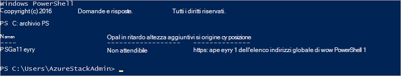

<properties
    pageTitle="Connettersi a Stack Azure con PowerShell | Microsoft Azure"
    description="Informazioni su come gestire Stack di Azure con PowerShell"
    services="azure-stack"
    documentationCenter=""
    authors="HeathL17"
    manager="byronr"
    editor=""/>

<tags
    ms.service="azure-stack"
    ms.workload="na"
    ms.tgt_pltfrm="na"
    ms.devlang="na"
    ms.topic="article"
    ms.date="10/19/2016"
    ms.author="helaw"/>

# Installare PowerShell e connettersi a Stack di Azure
In questa guida è ripetere i passaggi per la connessione a Stack di Azure con PowerShell. Al termine, questa procedura anche consente di gestire e distribuire le risorse.

## Installare i cmdlet di PowerShell Stack di Azure

1.  Cmdlet di AzureRM vengono installati nella raccolta di PowerShell. Per iniziare, aprire una Console di PowerShell su MAS CON01 ed eseguire il seguente comando per restituire un elenco di archivi di PowerShell disponibili:

        Get-PSRepository

      

2.  Eseguire il comando seguente per installare il modulo AzureRM:

        Install-Module -Name AzureRM -RequiredVersion 1.2.6 -Scope CurrentUser

    >[AZURE.NOTE] *-Ambito CurrentUser* è facoltativo. Se si desidera più l'utente corrente abbia accesso ai moduli, utilizzare un prompt dei comandi con privilegi elevato e lasciare disattivato il parametro di *ambito* .

3.  Per confermare l'installazione dei moduli AzureRM, eseguire i comandi seguenti:

        Get-Command -Module AzureRM.AzureStackAdmin

## Connettersi a Stack Azure
Un modulo è disponibile per il download che gestisce la configurazione della connessione di PowerShell allo Stack di Azure dell'utente.  Visitare [Azure Stack strumenti](http://aka.ms/ConnectToAzureStackPS) per il modulo e altre operazioni aggiuntive. 

## Recuperare un elenco delle sottoscrizioni
In questa sezione, verificare i cmdlet di PowerShell vengono eseguito Stack Azure il recupero e selezionando una sottoscrizione per l'utilizzo.

Eseguire il comando seguente per recuperare un elenco delle sottoscrizioni di Azure Stack associati all'account:

    Get-AzureRmSubscription

## Passaggi successivi
[Distribuire modelli con PowerShell](azure-stack-deploy-template-powershell.md)

[Connettersi a CLI Azure](azure-stack-connect-cli.md)

[Distribuire modelli con Visual Studio](azure-stack-deploy-template-visual-studio.md)

