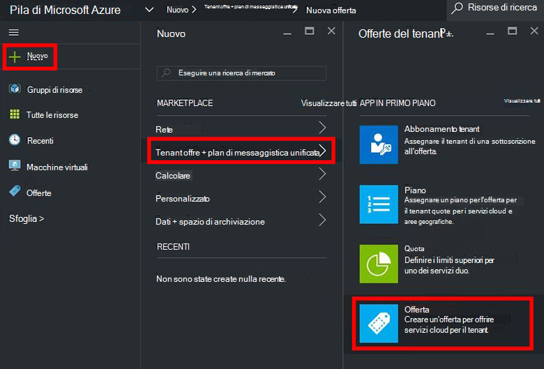
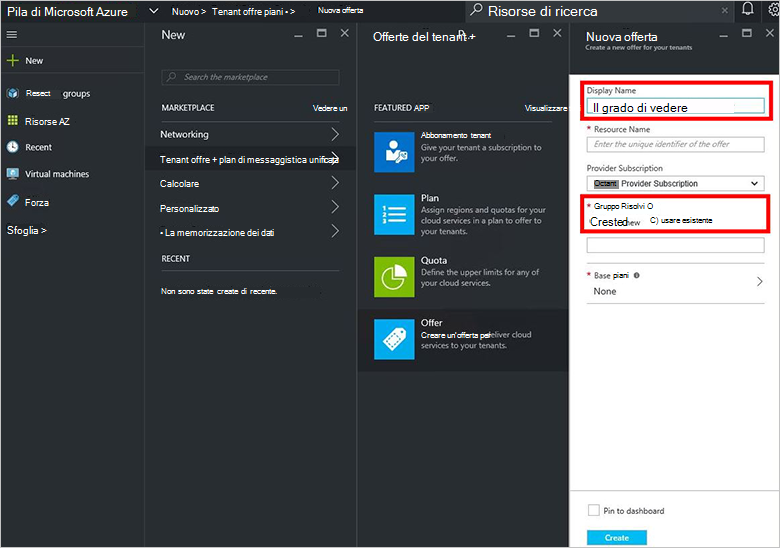
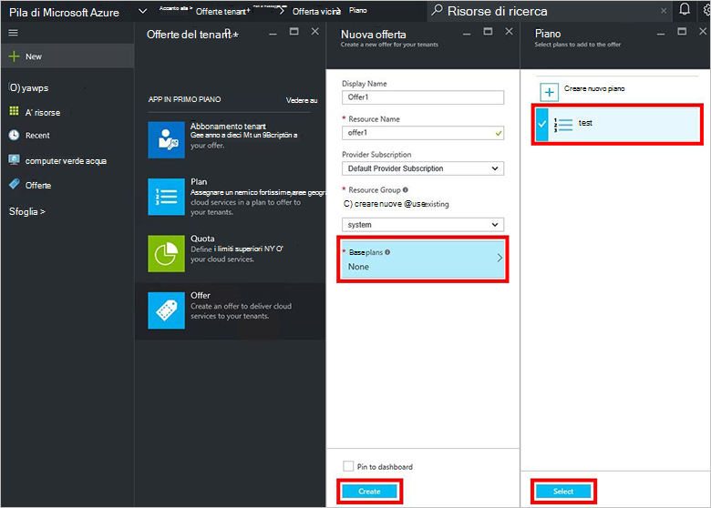
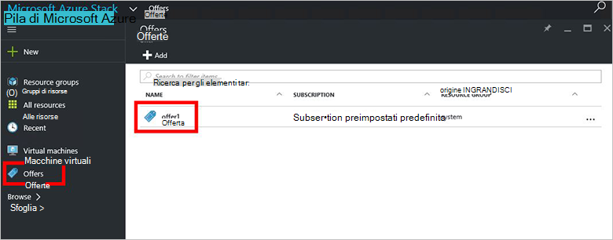
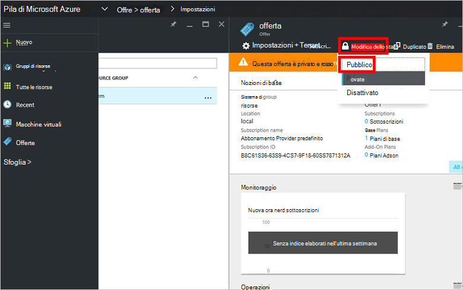

<properties
    pageTitle="Creare un'offerta in pila Azure | Microsoft Azure"
    description="L'amministratore del servizio di informazioni su come creare un'offerta per il tenant in pila Azure."
    services="azure-stack"
    documentationCenter=""
    authors="ErikjeMS"
    manager="byronr"
    editor=""/>

<tags
    ms.service="azure-stack"
    ms.workload="na"
    ms.tgt_pltfrm="na"
    ms.devlang="na"
    ms.topic="get-started-article"
    ms.date="09/26/2016"
    ms.author="erikje"/>

# Creare un'offerta in pila di Azure

[Sono disponibili](azure-stack-key-features.md#services-plans-offers-and-subscriptions) sono gruppi di uno o più piani provider presentano ai tenant per acquistare o sottoscrivere. In questo documento viene illustrato come creare un'offerta che include il [piano a cui è stato creato](azure-stack-create-plan.md) nell'ultimo passaggio. Questa offerta offre gli abbonati la possibilità di effettuare il provisioning di macchine virtuali.

1.  [Accedere](azure-stack-connect-azure-stack.md#log-in-as-a-service-administrator) al portale di come un amministratore del servizio e quindi fare clic su **Nuovo** > **Tenant offre + piani** > **offerta**.
    

2.  Nella e **Nuovo offrono** compilare **Nome visualizzato** e il **Nome di risorsa**e quindi selezionare un **Gruppo di risorse**di nuovo o esistente. Il nome visualizzato è nome descrittivo dell'offerta. Solo l'amministratore può visualizzare il nome di risorsa. È il nome usati dagli amministratori per l'uso con l'offerta come risorsa Manager delle risorse di Azure.

    

3.  Fare clic su **Base plan di messaggistica unificata** e, in e il **piano** selezionare il piano che si desidera includere nell'offerta di e quindi fare clic su **Seleziona**. Fare clic su **Crea** per creare l'offerta.

    
    
4. Fare clic su **offre** e quindi fare clic sull'offerta che appena creata.

    

5.  Fare clic su **Cambia stato**e quindi fare clic su **pubblica**.
  
    

Offerte devono essere rese pubbliche per tenant ottenere la visualizzazione completa per la sottoscrizione. Possono essere offerte:

- **Pubblico**: visibile ai tenant.

- **Privato**: visibile solo per gli amministratori dei servizi. Utili durante l'elaborazione il piano o l'offerta, o se l'amministratore del servizio desidera approvare ogni abbonamento.

- **Non utilizzabile nei**: chiuso alla nuove sottoscrizione. L'amministratore del servizio è possibile utilizzare per impedire sottoscrizioni future, ma lasciare invariate abbonati correnti delle autorizzazioni.

Modifiche all'offerta non sono immediatamente visibili nel tenant. Per visualizzare le modifiche, potrebbe essere necessario disconnessione/accesso per visualizzare la nuova sottoscrizione in "selezione abbonamento" durante la creazione di gruppi di risorse/risorse.

## Passaggi successivi

[Sottoscrivere un'offerta e quindi effettuare il provisioning di una macchina virtuale](azure-stack-subscribe-plan-provision-vm.md)
