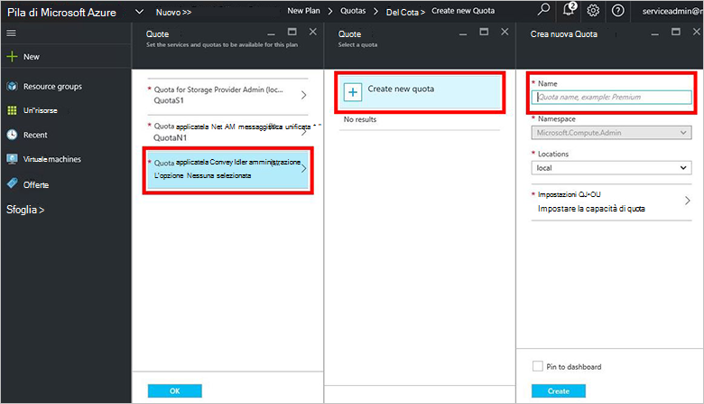

<properties
    pageTitle="Creare un piano in pila Azure | Microsoft Azure"
    description="Come un amministratore del servizio, creare un piano che consente di macchine virtuali degli abbonati a disposizione."
    services="azure-stack"
    documentationCenter=""
    authors="ErikjeMS"
    manager="byronr"
    editor=""/>

<tags
    ms.service="azure-stack"
    ms.workload="na"
    ms.tgt_pltfrm="na"
    ms.devlang="na"
    ms.topic="get-started-article"
    ms.date="09/26/2016"
    ms.author="erikje"/>

# Creare un piano in pila di Azure

[Plan di messaggistica unificata](azure-stack-key-features.md#services-plans-offers-and-subscriptions) sono raggruppamenti di uno o più servizi. Come provider, è possibile creare piani per l'offerta per il tenant. A sua volta, i tenant sottoscrivere le offerte da utilizzare i piani e i servizi che includono. In questo esempio viene illustrato come creare un piano che include il calcolo, rete e il provider di risorse di archiviazione. Il piano consente sottoscrittori di effettuare il provisioning di macchine virtuali.

1.  In un browser internet, passare a https://portal.azurestack.local.

2.  [Accedere](azure-stack-connect-azure-stack.md#log-in-as-a-service-administrator) al portale di Stack di Azure come amministratore di servizio e immettere le credenziali di amministratore di servizio (account creato durante il passaggio 5 della sezione [eseguire lo script di PowerShell](azure-stack-run-powershell-script.md) ) e quindi fare clic su **Accedi**.

    Gli amministratori dei servizi possono creare offerte e piani e gestire gli utenti.

3.  Per creare un piano e offerta tenant di effettuare la sottoscrizione, fare clic su **Nuovo** > **Tenant offre + piani** > **piano**.

    

4.  In e il **Nuovo piano** , immettere **Nome visualizzato** e il **Nome della risorsa**. Il nome visualizzato è nome del piano che tenant visualizzato. Solo l'amministratore può visualizzare il nome di risorsa. È il nome usati dagli amministratori per l'uso con il piano di una risorsa di gestione di risorse Azure.

    

5.  Creare un nuovo **Gruppo di risorse**o selezionarne uno esistente, come contenitore per il piano (ad esempio "OffersAndPlans")

    

6.  Fare clic su **servizi**, selezionare **Microsoft.Compute**, **Microsoft.Network**e **Microsoft.Storage**e quindi fare clic su **Seleziona**.

    

7.  Fare clic su **quote**, fare clic su **Microsoft.Storage (locale)**e quindi selezionare la quota predefinita o fare clic su **Crea nuova quota** per personalizzare la quota.

    

8.  Digitare un nome per la quota, fare clic su **Impostazioni di Quota**, impostare i valori di quota e fare clic su **OK**e quindi fare clic su **Crea**.

    

9. Fare clic su **Microsoft.Network (locale)**, quindi selezionare la quota predefinita o fare clic su **Crea nuova quota** per personalizzare la quota.

    

10. Digitare un nome per la quota, fare clic su **Impostazioni di Quota**, impostare i valori di quota e fare clic su **OK**e quindi fare clic su **Crea**.

    

11. Fare clic su **Microsoft.Compute (locale)**, quindi selezionare la quota predefinita o fare clic su **Crea nuova quota** per personalizzare la quota.

    

12.  Digitare un nome per la quota, fare clic su **Impostazioni di Quota**, impostare i valori di quota e fare clic su **OK**e quindi fare clic su **Crea**.

    

13. Nella e **quote** , fare clic su **OK**e quindi in e il **Nuovo piano** , fare clic su **Crea** per creare il piano.

    

14. Per visualizzare il nuovo piano, fare clic su **tutte le risorse**, quindi eseguire una ricerca per il piano e fare clic sul nome.

    

## Passaggi successivi

[Creare un'offerta](azure-stack-create-offer.md)
