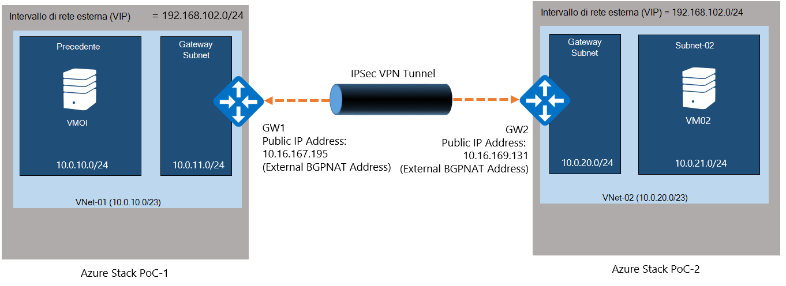
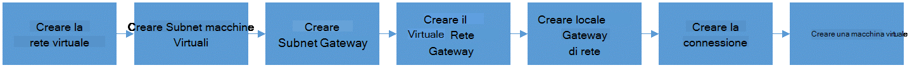
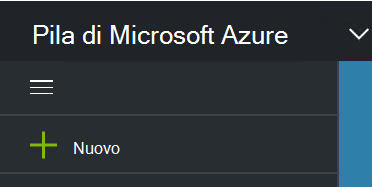
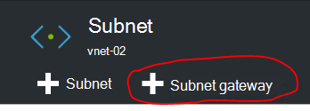
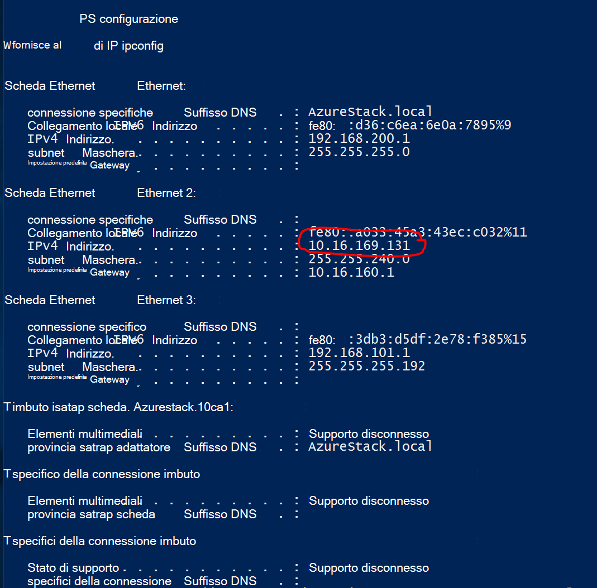
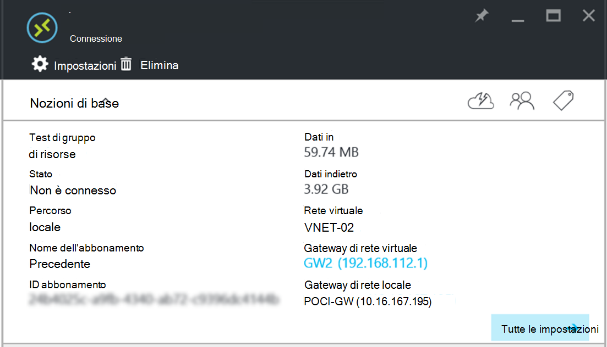

<properties
    pageTitle="Creare una connessione VPN da sito tra due reti virtuali in ambienti di prova Stack Azure diversi | Microsoft Azure"
    description="Procedura dettagliata per consentirà un amministratore cloud creare una connessione VPN da sito tra due ambienti di prova di un nodo in TP2."
    services="azure-stack"
    documentationCenter=""
    authors="ScottNapolitan"
    manager="darmour"
    editor=""/>

<tags
    ms.service="azure-stack"
    ms.workload="na"
    ms.tgt_pltfrm="na"
    ms.devlang="na"
    ms.topic="get-started-article"
    ms.date="09/26/2016"
    ms.author="scottnap"/>

# Creare una connessione VPN da sito tra due reti virtuali in ambienti di prova Stack Azure diversi

## Panoramica

In questo articolo sono illustrati i passaggi per creare una connessione VPN da sito tra due reti virtuali nei due ambienti Azure Stack di prova (prova) separati. Lo scopo di questo è per aiutare gli utenti che stanno valutando da sito gateway per imparare a configurare le connessioni VPN tra reti virtuali in due diversi distribuzioni di Azure Stack.  In questo modo, sarà possibile ottenere una conoscenza funzionamento dei gateway VPN in pila Azure.

>[AZURE.NOTE] In questo documento si applica specificamente per la prova pratica TP2 Stack di Azure.

### Diagramma di connessione

Di seguito è un diagramma che mostra l'aspetto la configurazione quando è completata.

### Prima di iniziare

Per completare questa configurazione, è necessario gli elementi seguenti per assicurarsi che dispone di queste operazioni prima di iniziare.

-   Due server che soddisfano i requisiti hardware Azure Stack prova definiti dai [Prerequisiti per la distribuzione di Azure Stack](azure-stack-deploy.md)e degli altri prerequisiti definiti dal documento.

-   Il pacchetto di distribuzione di Azure Stack Technical Preview 2.

## Distribuzione di ambienti di prova

Distribuire entrambi gli ambienti di Azure Stack prova per completare la configurazione.

-   Per ogni prova che si distribuisce, è possibile eseguire semplicemente le istruzioni di distribuzione dettagliate vedere l'articolo [Distribuire Azure Stack prova](azure-stack-run-powershell-script.md).
    Si farà riferimento a ogni ambiente di prova del documento in modo generico come POC1 e POC2.

## Configurare quote per elaborazione, di rete e di archiviazione

È necessario configurare quote per elaborazione, di rete e di archiviazione in modo che questi servizi possono essere associati a un piano e quindi un'offerta tenant di effettuare la sottoscrizione.

>[AZURE.NOTE] È necessario eseguire questi passaggi per ogni ambiente di prova Stack Azure.

L'esperienza per creare le quote per i servizi è stato modificato da TP1. Sono disponibili informazioni sulle procedure per creare le quote in TP2 in <http://aka.ms/mas-create-quotas>. È possibile accettare le impostazioni predefinite per tutte le impostazioni di quota per questa esercitazione.

## Creare un piano e offerta

[Plan di messaggistica unificata](azure-stack-key-features.md) sono raggruppamenti di uno o più servizi. Come provider, è possibile creare piani per l'offerta per il tenant. A sua volta, i tenant sottoscrivere le offerte da utilizzare i piani e i servizi che includono.

>[AZURE.NOTE] È necessario eseguire questi passaggi per ogni ambiente di prova Stack Azure.

1.  Creare un piano. A questo scopo è possibile eseguire la procedura descritta in [creare un piano](azure-stack-create-plan.md) online articolo.

2.  Creare un'offerta seguendo la procedura descritta in [creare un'offerta in pila Azure](azure-stack-create-offer.md).

3.  Accedere al portale di come amministratore Tenant e [sottoscrivere l'offerta è stato creato] (azure-stack-sottoscritti-piano-provisioning-vm.md.

## Creare le risorse di rete in prova 1

Ora che verranno effettivamente creare le risorse che è necessario impostare la configurazione. La procedura seguente viene illustrato cosa è necessario eseguire le operazioni. Queste istruzioni mostrerà come creare risorse tramite il portale, ma la stessa operazione può essere eseguita tramite PowerShell.

### Eseguire l'accesso come un tenant

Un amministratore del servizio può eseguire l'accesso come un tenant per verificare il piano, offerte e abbonamenti utilizzate loro tenant. Se non già una, [creare un account tenant](azure-stack-add-new-user-aad.md) prima di accedere.

### Usato per creare la rete virtuale & subnet macchine Virtuali

1.  Accedere usando un account tenant.

2.  Nel portale di Azure fare clic sull'icona di **Nuovo** .

     
3.  Selezionare **rete** dal menu Marketplace.

4.  Fare clic sull'elemento di **rete virtuale** nel menu.

5.  Fare clic sul pulsante **Crea** nella parte inferiore della stessa e descrizione delle risorse. Immettere i seguenti valori nei campi appropriati in base a questa tabella.

  	| **Campo**             | **Valore** |
  	|----------------------- | ------ |
  	| Nome                  |01 vnet |
  	| Spazio di indirizzi         | 10.0.10.0/23 |
  	| Nome subnet           | 01 subnet |
  	| Intervallo di indirizzi subnet  | 10.0.10.0/24 |

6.  Verrà visualizzato l'abbonamento è stato creato in precedenza inserito nel campo **abbonamento** .

7.  Per il gruppo di risorse, creare un nuovo gruppo di risorse o se si dispone già di uno, selezionare Usa esistente.

8.  Verificare che il percorso predefinito.

9.  Fare clic sul pulsante **Crea** .

### Creare Subnet Gateway

1.  Aprire la risorsa di rete virtuale appena creato (Vnet-01) nel dashboard.

2.  Scegliere subnet e l'impostazioni

3.  Fare clic sul pulsante **Subnet Gateway** per aggiungere una Subnet Gateway alla rete virtuale.

     
4.  Il nome della Subnet è impostato su **GatewaySubnet** per impostazione predefinita.
    Gateway subnet sono speciali e deve avere questo nome specifico per il corretto funzionamento.

5.  Nella casella **intervallo di indirizzi** , immettere **10.0.11.0/24**.

6.  Fare clic sul pulsante **Crea** per creare subnet Gateway.

### Creare il Gateway di rete virtuale

1.  Nel portale di Azure, fare clic sull'icona di **Nuovo** .

    

2.  Selezionare **rete** dal menu Marketplace.

3.  Selezionare **il gateway di rete virtuale** dall'elenco delle risorse di rete.

4.  Esaminare la descrizione e fare clic su **Crea**.

5.  Nel campo **nome** digitare **GW1**.

6.  Fare clic sull'elemento di **rete virtuale** per scegliere una rete virtuale.
    Selezionare **Vnet-01** dall'elenco.

7.  Fare clic sulla voce di menu **indirizzo IP pubblico** . Quando si apre e di indirizzo IP pubblico lo scegliere fare clic sul pulsante Crea nuovo.

8.  Nel campo **nome** immettere **GW1 PiP** e fare clic su **Ok.**

9.  Il **tipo di Gateway** dovrebbe avere **VPN** selezionata per impostazione predefinita. Mantenere questa impostazione.

10. Il **tipo di VPN** dovrebbe avere **basate su Route** selezionata per impostazione predefinita.
    Mantenere questa impostazione.

11. Verificare **l'abbonamento** e il **percorso** siano corretti. Se si preferisce, è possibile aggiungere risorse al dashboard. Fare clic su **Crea**.

### Creare il Gateway di rete locale

La risorsa di Gateway di rete locale è un po' strana in questo scenario.
È la stessa risorsa che si trova nella Azure, ma in Azure è in genere sinonimo per rappresentare un dispositivo fisico, in locale da usare per connettersi al gateway virtuali in Azure. In questo esempio, entrambe le estremità della connessione sono effettivamente virtuali gateway!

Un modo per pensare più in generale è che la risorsa di Gateway di rete locale sia sempre utilizzata per indicare che il gateway remoto all'estremità della connessione. A causa del modo che è stata progettata la prova, è necessario effettivamente fornire l'indirizzo della scheda di rete esterna nell'ambito VM NAT di altri prova come l'indirizzo IP pubblico del Gateway di rete locale. Si creerà quindi i mapping NAT su VM NAT per assicurarsi che entrambe le estremità siano collegate correttamente.

### Ottenere l'indirizzo IP della scheda esterna di VM NAT

1.  Accedere al computer dello Stack di Azure per POC2.

2.  [Tasto Windows] + R per aprire il menu **Esegui** e digitare **mstsc** e premere INVIO.

3.  Nel campo **Computer** immettere il nome **MAS BGPNAT01** e fare clic sul pulsante **Connetti** .

4.  Fare clic sul Menu Start e fare clic su PowerShell e selezionare **Esegui come amministratore**.

5.  Tipo **IPConfig/tutti**.

6.  Trovare la scheda Ethernet che sia connesso alla rete locale e prendere nota dell'indirizzo IPv4 associato a tale scheda. Dell'ambiente operativo è **10.16.167.195** ma quello personale più sarà qualcosa di diverso.

7.  Registrare questo indirizzo. Si tratta cosa verrà usata come l'indirizzo IP pubblico della risorsa Gateway rete locale che viene creata in POC1.

### Creare la risorsa di Gateway di rete locale

1.  Accedere al computer dello Stack di Azure per POC1.

2.  Nel campo **Computer** immettere il nome **MAS CON01** e fare clic sul pulsante **Connetti** .

3.  Nel portale di Azure fare clic sull'icona di **Nuovo** .

    

4.  Selezionare **rete** dal menu Marketplace.

5.  Selezionare **il gateway di rete locale** dall'elenco delle risorse.

6.  Nel campo **nome** immettere **POC2 GW**.

7.  Non si sa ancora l'indirizzo IP del nostro altro Gateway, ma è ok perché possiamo torni e modificarlo in un secondo momento. Per ora, immettere **10.16.167.195** nel **campo indirizzo IP**.

8.  Nel campo **Spazio di indirizzi** immettere lo spazio di indirizzi di Vnet che che verrà creata in POC2. Si sta per essere **10.0.20.0/23** quindi immettere il valore.

9.  Verificare che **l'abbonamento**, **Gruppo di risorse** e il **percorso** siano corretti tutti e fare clic su **Crea**.

### Creare la connessione

1.  Nel portale di Azure fare clic sull'icona di **Nuovo** .

     

2.  Selezionare **rete** dal menu Marketplace.

3.  Selezionare **connessione** dall'elenco delle risorse.

4.  Scegliere **sito a sito (IPSec)** e l'impostazioni di **base** , come il **tipo di connessione**.

5.  Selezionare **l'abbonamento**, **Gruppo di risorse** e il **percorso** e fare clic su **Ok**.

6.  Scegliere il **Gateway di rete virtuale** (**GW1**) creata in precedenza e **l'Impostazioni** .

7.  Scegliere **locale** **Gateway di rete** (**POC2 GW**) creata in precedenza.

8.  Nel campo **Nome connessione** immettere **POC1 POC2**.

9.  Nel campo **Chiave condivisa (PSK)** immettere **12345**. Fare clic su **Ok**.

### Creare una macchina virtuale

Per convalidare i dati in viaggio attraverso la connessione VPN, è necessario macchine virtuali di inviare e ricevere dati in ciascuna prova. Verrà creato una macchina virtuale in POC1 ora e pubblicarla nostro subnet macchine Virtuali rete virtuale.

1. Nel portale di Azure, fare clic sull'icona di  **Nuovo** .

     

2.  Selezionare **macchine virtuali** dal menu Marketplace.

3.  Nell'elenco delle immagini macchina virtuale, selezionare l'immagine di **Data Center di Windows Server 2012 R2** .

4.  Nel campo **nome** e il **Nozioni di base** , immettere il valore **VM01**.

5.  Immettere un nome utente valido e la password. Utilizzare questo account per accedere a macchina virtuale dopo averlo creato.

6.  Fornire un **abbonamento**, **Gruppo di risorse** e un **percorso** e quindi fare clic su **Ok**.

7.  Nella e **dimensioni** , scegliere una dimensione macchine Virtuali per questa istanza e quindi fare clic su **Seleziona**.

8.  In e l'impostazioni, è possibile accettare le impostazioni predefinite, assicurarsi che la rete virtuale selezionata è **VNET-01** e alla Subnet è impostata su **10.0.10.0/24**. Fare clic su **Ok**.

9.  Esaminare le impostazioni e il **Riepilogo** e fare clic su **Ok**.

## Creare le risorse di rete in prova 2

### Eseguire l'accesso come un tenant

Un amministratore del servizio può eseguire l'accesso come un tenant per verificare il piano, offerte e abbonamenti utilizzate loro tenant. Se non già una, [creare un account tenant](azure-stack-add-new-user-aad.md) prima di accedere.

### Usato per creare la rete virtuale & subnet macchine Virtuali

1. Accedere usando un account tenant.

2. Nel portale di Azure, fare clic sull'icona di  **Nuovo** .

     

3.  Selezionare **rete** dal menu Marketplace.

4.  Fare clic sulla voce **virtuale rete** del menu.

5.  Fare clic sul pulsante **Crea** nella parte inferiore della stessa e descrizione delle risorse. Immettere i valori seguenti per i campi appropriati elencati nella tabella seguente.

  	|**Campo**              |**Valore** |
  	| ----------------------|----------|
  	| Nome                  | 02 vnet |
  	| Spazio di indirizzi         | 10.0.20.0/23 |
  	| Nome subnet           | subnet 02 |
  	| Intervallo di indirizzi subnet  | 10.0.20.0/24 |

6.  Verrà visualizzato l'abbonamento è stato creato in precedenza inserito nel campo **abbonamento** .

7.  Per il gruppo di risorse, creare un nuovo gruppo di risorse o se si dispone già di uno, selezionare Usa esistente.

8.  Verificare il **percorso**predefinito. Se si desidera, è possibile aggiungere la rete virtuale per il Dashboard per facilitare l'accesso.

9.  Fare clic sul pulsante **Crea** .

### Creare Subnet Gateway

1.  Aprire la risorsa di rete virtuale creata (**Vnet-02**) nel dashboard.

2.  Scegliere e **l'Impostazioni** **subnet.**

3.  Fare clic sul pulsante **Subnet Gateway** per aggiungere una Subnet Gateway alla rete virtuale.

     

4.  Il nome della Subnet è impostato su **GatewaySubnet** per impostazione predefinita.
    Gateway subnet sono speciali e deve avere questo nome specifico per il corretto funzionamento.

5.  Nella casella **intervallo di indirizzi** , immettere **10.0.20.0/24**.

6.  Fare clic sul pulsante **Crea** per creare subnet Gateway.

### Creare il Gateway di rete virtuale

1. Nel portale di Azure fare clic sull'icona di  **Nuovo** .

     

2.  Selezionare **rete** dal menu Marketplace.

3.  Selezionare **il gateway di rete virtuale** dall'elenco delle risorse di rete.

4.  Esaminare la descrizione e fare clic su **Crea**.

5.  Nel campo **nome** digitare **GW2**.

6.  Fare clic sull'elemento di **rete virtuale** per scegliere una rete virtuale.
    Selezionare **Vnet 02** dall'elenco.

7.  Fare clic sulla voce di menu **indirizzo IP pubblico** . Quando si apre e di indirizzo IP pubblico lo scegliere fare clic sul pulsante Crea nuovo.

8.  Nel campo **nome** immettere **GW2 PiP** e fare clic su **Ok.**

9.  Il **tipo di Gateway** dovrebbe avere **VPN** selezionata per impostazione predefinita. Mantenere questa impostazione.

10. Il **tipo di VPN** dovrebbe avere **basate su Route** selezionata per impostazione predefinita.
    Mantenere questa impostazione.

11. Verificare **l'abbonamento** e il **percorso** siano corretti. Se si preferisce, è possibile aggiungere risorse al dashboard. Fare clic su **Crea**.

### Creare il Gateway di rete locale

#### Ottenere l'indirizzo IP della scheda esterna di VM NAT

1.  Accedere al computer dello Stack di Azure per POC1.

2.  Premere e attesa [tasto Windows] + R per aprire il menu **Esegui** e digitare **mstsc** e quindi immettere.

3.  Nel campo **Computer** immettere il nome **MAS BGPNAT01** e fare clic sul pulsante **Connetti** .

4.  Fare clic sul pulsante Start e fare clic su PowerShell e selezionare **Esegui come amministratore**.

5.  Tipo **IPConfig/tutti**.

6.  Trovare la scheda Ethernet che sia connesso alla rete locale e prendere nota dell'indirizzo IPv4 associato a tale scheda. Dell'ambiente operativo è **10.16.169.131** ma con un diverso.

7.  Registrare questo indirizzo. Si tratta di cosa si verrà utilizzato come l'indirizzo IP pubblico della risorsa Gateway rete locale che viene creata in POC1.

#### Creare la risorsa di Gateway di rete locale

1.  Accedere al computer dello Stack di Azure per POC2.

2.  Nel campo **Computer** immettere il nome **MAS CON01** e fare clic sul pulsante **Connetti** .

3. Nel portale di Azure fare clic sull'icona di **Nuovo** .

     

4.  Selezionare **rete** dal menu Marketplace.

5.  Selezionare **il gateway di rete locale** dall'elenco delle risorse.

6.  Nel campo **nome** immettere **POC1 GW**.

7.  A questo punto è necessario l'indirizzo IP pubblico è registrati per il gateway di rete virtuale in POC1. Immettere **10.16.169.131** nel **campo indirizzo IP**.

8.  Nel campo di **Spazio di indirizzi** immettere lo spazio di indirizzi 01 **Vnet** da POC1 - **10.0.0.0/16**.

9.  Verificare che **l'abbonamento**, **Gruppo di risorse** e il **percorso** siano corretti tutti e fare clic su **Crea**.

## Creare la connessione

1. Nel portale di Azure fare clic sull'icona di  **Nuovo** .

     

2.  Selezionare **rete** dal menu Marketplace.

3.  Selezionare **connessione** dall'elenco delle risorse.

4.  Scegliere **sito a sito (IPSec)** e l'impostazioni di **base** , come il **tipo di connessione**.

5.  Selezionare **l'abbonamento**, **Gruppo di risorse** e il **percorso** e fare clic su **Ok**.

6.  Scegliere il **Gateway di rete virtuale** (**GW1**) creata in precedenza e **l'Impostazioni** .

7.  Scegliere **locale** **Gateway di rete** (**POC1 GW**) creata in precedenza.

8.  Nel campo **Nome connessione** immettere **POC2 POC1**.

9.  Nel campo **Chiave condivisa (PSK)** immettere **12345**. Se si sceglie un valore diverso, tenere presente che deve corrispondere il valore di chiave condivisa è stata assegnata in POC1. Fare clic su **Ok**.

## Creare una macchina virtuale

Creare ora una macchina virtuale in POC1 e pubblicarla nostro subnet macchine Virtuali rete virtuale.

1.  Nel portale di Azure, fare clic sull'icona di **Nuovo** .

     

2.  Selezionare **macchine virtuali** dal menu Marketplace.

3.  Nell'elenco delle immagini macchina virtuale, selezionare l'immagine di **Data Center di Windows Server 2012 R2** .

4.  Nel campo **nome** e il **Nozioni di base** , immettere il valore **VM02**.

5.  Immettere un nome utente valido e la password. Utilizzare questo account per accedere a macchina virtuale dopo averlo creato.

6.  Fornire un **abbonamento**, **Gruppo di risorse** e un **percorso** e quindi fare clic su **Ok**.

7.  Nella e **dimensioni** , scegliere una dimensione macchine Virtuali per questa istanza e quindi fare clic su **Seleziona**.

8.  In e l'impostazioni, è possibile accettare le impostazioni predefinite, assicurarsi che la rete virtuale selezionata è **02 VNET** e alla Subnet è impostata su **20.0.0.0/24**. Fare clic su **Ok**.

9.  Esaminare le impostazioni e il **Riepilogo** e fare clic su **Ok**.

## Configurare VM NAT in ciascuna prova per scorrimento gateway

Poiché la prova è stata progettata per essere indipendente e isolato dalla rete in cui viene distribuito host fisico, la rete VIP "Esterni" connesse al gateway non è effettivamente esterna, ma se, tuttavia è nascosta dietro un router eseguendo Network Address Translation (NAT). Il router è effettivamente una Windows Server macchina virtuale (**MAS BGPNAT01**) esegue il ruolo di Routing e servizi di accesso remoto (RRAS) dell'infrastruttura di prova. È necessario configurare NAT nella macchina virtuale MAS BGPNAT01 per consentire la connessione VPN da sito per connettersi a entrambe le estremità.

>[AZURE.NOTE] Questa configurazione è necessaria prova solo per ambienti.

### Configurare NAT

È necessario eseguire questa procedura in ambienti di prova entrambi.

1.  Accedere al computer dello Stack di Azure per POC1.

2.  Premere e attesa [tasto Windows] + R per aprire il menu **Esegui** e digitare **mstsc** e quindi immettere.

3.  Nel campo **Computer** immettere il nome **MAS BGPNAT01** e fare clic sul pulsante **Connetti** .

4.  Fare clic sul pulsante Start e fare clic su PowerShell e selezionare **Esegui come amministratore**.

5.  Tipo **IPConfig/tutti**.

6.  Trovare la scheda Ethernet che sia connesso alla rete locale e prendere nota dell'indirizzo IPv4 associato a tale scheda. Dell'ambiente operativo, si tratta di **10.16.169.131** (cerchiato seguito in rosso), ma quello personale più sarà qualcosa di diverso.

     

7.  Immettere il seguente comando di PowerShell per specificare l'indirizzo NAT esterno per le porte di autenticazione IKE. È necessario modificare l'indirizzo IP a quello che corrisponde all'ambiente.

        Add-NetNatExternalAddress -NatName BGPNAT -IPAddress 10.16.169.131 PortStart 499 -PortEnd 501

8. Successivamente, si creerà un mapping NAT statico per eseguire il mapping indirizzo esterno all'indirizzo IP pubblico Gateway per associare la porta ISAKMP 500 per la fase 1 del tunnel IPSEC.

        Add-NetNatStaticMapping -NatName BGPNAT -Protocol UDP -ExternalIPAddress 10.16.169.131 -InternalIPAddress 192.168.102.1 -ExternalPort 500 -InternalPort 500

9.  Infine, è necessario eseguire scorrimento NAT che utilizza la porta 4500 per stabilire il tunnel IPEC completo sui dispositivi NAT.

         Add-NetNatStaticMapping -NatName BGPNAT -Protocol UDP -ExternalIPAddress 10.16.169.131 -InternalIPAddress 192.168.102.1 -ExternalPort 4500 -InternalPort 4500

10.  Ripetere i passaggi da 1 a 9 in POC2.

## Verificare la connessione

Ora che è stata stabilita la connessione al sito che è necessario confermare che è possibile ottenere il traffico flusso attraversata. Questa operazione è semplice come implica semplicemente il ping macchine Virtuali creato in un ambiente di e accedere a una delle macchine virtuali creata in entrambi gli ambienti di prova. Per essere certi che è in corso inserire il traffico attraverso la connessione al sito, si desidera assicurarsi che è il ping dell'indirizzo di accesso diretto IP dispone di macchine Virtuali nella subnet remote, non l'indirizzo VIP. A questo scopo è necessario conoscere l'indirizzo in cui viene effettuata la connessione.

### Accedere al tenant macchine Virtuali di POC1

1.  Accedere al computer dello Stack di Azure per POC1 e accedere al portale usando un account tenant.

3.  Fare clic sull'icona di **macchine virtuali** nella barra di spostamento sinistro.

4.  **VM01** creato in precedenza nell'elenco di macchine virtuali di individuare e fare clic su di esso.

5. Scegliere **Connetti**e il per la macchina virtuale.

     

6.  Aprire un prompt dei comandi all'interno della macchina virtuale e digitare **IPConfig/tutti**.

7.  Trovare l' **Indirizzo IPv4** nell'output e prendere nota di esso. Questo è l'indirizzo che esegue il ping da POC2. In questo ambiente, l'indirizzo è **10.0.10.4**ma nel proprio ambiente potrebbero essere diverso. Tuttavia dovrebbe rientrare subnet **10.0.10.0/24** che è stata creata in precedenza.

### Accedere al tenant macchine Virtuali di POC2

1.  Accedere al computer dello Stack di Azure per POC2 e accesso al portale usando un account tenant.

3.  Fare clic sull'icona di **macchine virtuali** nella barra di spostamento sinistro.

4.  **VM02** creato in precedenza nell'elenco di macchine virtuali di individuare e fare clic su di esso.

5.  Scegliere **Connetti**e il per la macchina virtuale.

     

6.  Aprire un prompt dei comandi all'interno della macchina virtuale e digitare **IPConfig/tutti**.

7.  Verrà visualizzato un indirizzo IPv4 che rientrano in 10.0.20.0/24. In personale di laboratorio, l'indirizzo è 10.0.20.4, ma quello personale più potrebbero essere diversi.

8.  A questo punto da macchine Virtuali in POC2 si desidera effettuare il ping macchine Virtuali in POC1, attraverso il tunnel. A tale scopo che è effettuare il ping DIP registrate da VM01.
    Nel mio laboratorio si tratta 10.0.10.4, ma effettuare il ping dell'indirizzo trovato nell'ambiente. Verrà visualizzato il risultato è simile alla seguente.

     

9.  Una risposta dalla macchina virtuale remota indica un test ha esito positivo! È possibile chiudere la finestra macchine Virtuali connettersi o, se si preferisce, provare a eseguire alcuni altri trasferimenti di dati per verificare la connessione (ad esempio una copia di file).

### Visualizzazione dei dati trasferire statistiche tramite la connessione di gateway

Se si vuole conoscere la quantità di dati passaggio attraverso la connessione al sito, queste informazioni sono disponibili in e il connessione. Questo test è anche un'altra ottima soluzione per verificare che il ping che appena inviato in realtà è verificato un attraverso la connessione VPN.

1.  Mentre si è ancora connessi a **ClientVM** in POC2, accesso al **Portale di Microsoft Azure Stack prova** usando l'account del tenant.

2.  Fare clic sulla voce di menu **Sfoglia** e selezionare **le connessioni**.

3.  Fare clic sulla connessione di **POC2 POC1** nell'elenco.

4.  Nella e connessione, è possibile visualizzare le statistiche di dati in e indietro. Nella figura seguente viene visualizzato che alcuni numeri maggiori rispetto a ping solo da account per. Ciò avviene perché abbiamo anche alcuni trasferimenti di file. Verrà visualizzato sono alcuni valori di diverso da zero.

     
