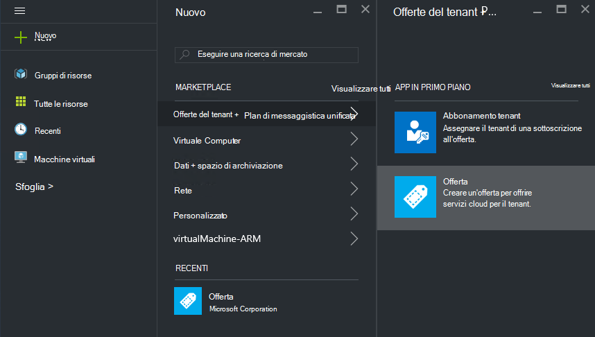

<properties
    pageTitle="Delega di offerte in pila Azure | Microsoft Azure"
    description="Informazioni su come inserire altre persone utenti responsabili della creazione delle offerte e iscrizione gli utenti dell'utente."
    services="azure-stack"
    documentationCenter=""
    authors="AlfredoPizzirani"
    manager="byronr"
    editor=""/>

<tags
    ms.service="azure-stack"
    ms.workload="na"
    ms.tgt_pltfrm="na"
    ms.devlang="na"
    ms.topic="article"
    ms.date="10/07/2016"
    ms.author="alfredop"/>

#Delega di offerte in pila di Azure

Come un amministratore del servizio, spesso si desidera inserire altre persone utenti responsabili della creazione delle offerte e iscrizione gli utenti dell'utente. Questo problema può verificarsi, ad esempio, se ci si trova un provider di servizi e si desidera rivenditori effettuare l'accesso dei clienti e gestirli per proprio conto. Può inoltre verificarsi in un'organizzazione se si fanno parte di un gruppo IT centrale e si vuole divisioni o società affiliate di iscriversi a utenti senza l'intervento dell'utente.

Delega consente queste attività, consentendo di raggiungere e gestire più utenti, è possibile eseguire direttamente. L'illustrazione seguente mostra un livello di delega, ma Azure Stack supporta più livelli. Provider delegato a sua possono delegare ad altri provider, fino a cinque livelli.

Gli amministratori possono delegare la creazione di offerte e tenant ad altri utenti tramite la funzionalità di delega.

##Ruoli e i passaggi in delega

Per comprendere la delega, tenere presente che esistono tre ruoli coinvolti:

-   L' **amministratore del servizio** consente di gestire l'infrastruttura di Azure pila, viene creato un modello di offerta e delega ad altri utenti per offrire agli utenti.

-   Gli utenti delegati sono denominati **delegati provider**. Appartengono ad altre organizzazioni (ad esempio altri tenant di Azure Active Directory).

-   **Utenti di** iscriversi per le offerte e utilizzarli per gestire i carichi di lavoro, la creazione di macchine virtuali, l'archiviazione dei dati e così via.

Come mostrato nell'immagine seguente, sono disponibili due passaggi per impostare la delega.

1.  Identificare il provider di delegati. Ripetere l'operazione mediante la sottoscrizione un'offerta in base a un piano che contiene solo il servizio di abbonamenti.
    Gli utenti con abbonamento a questa offerta acquisiscono alcune delle funzionalità dell'amministratore del servizio, compresa la possibilità di estendere offerte e accedere agli utenti per loro.

2.  Delegare un'offerta al provider di delegati. Questa offerta funge da un modello per il provider di delegata offrono. Il provider di delegato è in grado di eseguire l'offerta, scegliere un nome al file, ma non modificare i servizi e le quote e offrire ai clienti.

Per agire come delegato provider, gli utenti devono stabilire una relazione con il provider principale; in altre parole, è necessario creare una sottoscrizione. In questo scenario la sottoscrizione identifica i provider delegati con il diritto di presentare offerte per conto del provider principale.

Una volta definita la relazione, l'amministratore di sistema può delegare un'offerta al provider di delegati. Il provider delegato sarà in grado di eseguire l'offerta, rinominarlo (ma non di modificare la sostanza) e offrire ai propri clienti.

Per stabilire un provider di delegato, delegare un'offerta e verificare che gli utenti possono iscriversi a essa, eseguire le istruzioni nelle sezioni seguenti.

##Configurare i ruoli

Per visualizzare un provider delegato in ufficio, è necessario altri account Azure Active Directory oltre al proprio account di amministratore di servizio. Se non si dispone loro, creare due account. Gli account a cui possono appartenere a qualsiasi tenant AAD. Abbiamo riguarderanno loro provider delegato (DP) e l'utente.

| **Ruolo** | **Diritti dell'organizzazione** |
| -------------------- | ----------------------- |
|  Provider di delegati | Utente |
| Utente | Utente |

##Identificare il provider di delegati

1.  Accedere come amministratore del servizio.

2.  Creare l'offerta che consentirà tenant imparare a provider delegato. È necessario creare un piano e un'offerta basata su di essa:

    un.  [Creare un piano](azure-stack-create-plan.md).
        Il piano dovrebbe includere solo il servizio di abbonamenti. In questo articolo serve un piano chiamato PlanForDelegation.

    b.  [Creare un'offerta](azure-stack-create-offer.md) 
     in base al piano. In questo articolo viene utilizzata un'offerta chiamata OfferToDP.

    c.  Una volta completata la creazione dell'offerta, aggiungere l'ID utente del provider delegato come un tenant a questa offerta facendo clic su     **sottoscrizioni** &gt; **Aggiungi** &gt; **Nuova sottoscrizione Tenant**.

  

> [AZURE.NOTE]Con tutte le offerte dello Stack di Azure, hanno la possibilità di effettuare l'offerta pubblici e consentire agli utenti iscriversi a o di mantenere private e affidare la gestione di iscrizione amministratore del servizio. Provider delegato sono in genere un piccolo gruppo e si vuole controllare chi ammessi su di esso, in modo mantenere private questa offerta essere utile nella maggior parte dei casi.

##Amministratore del servizio creato l'offerta delegata

A questo punto è stata attivata il proprio provider di delegati. Il passaggio successivo consiste nel creare il piano e offerta che si intende delegare e che utilizzeranno i clienti. È necessario definire questa offerta nel modo desiderato i clienti a visualizzarlo, perché il provider di delegata non potranno essere modificati i piani e le quote che includa.

1.  Come amministratore del servizio, [creare un piano](azure-stack-create-plan.md) e [un'offerta](azure-stack-create-offer.md) basata su di essa. Per questo articolo viene utilizzata un'offerta chiamata DelegatedOffer.
> [AZURE.NOTE]Questa offerta non è necessario essere resi pubblici. È possibile renderla pubblica se si sceglie, ma, nella maggior parte dei casi, si vuole solo delegato provider per accedervi. Una volta si delega un'offerta privata come descritto nei passaggi seguenti, il provider di delegata avranno di accedervi.

2.  Delegare l'offerta. Passare alla DelegatedOffer e nel riquadro impostazioni, fare clic su **Delega provider** &gt; **Aggiungi**.

3.  Selezionare la sottoscrizione del provider delegata dalla casella di riepilogo a discesa e fare clic su **delega**.

> 

##Provider delegata consente di personalizzare l'offerta

Eseguire l'accesso come provider di delegati e creare una nuova offerta utilizzando l'offerta delegata come modello.

1.  Fare clic su **Nuovo** &gt; **Tenant offre + plan di messaggistica unificata** &gt; **offerta**.

    

2.  Assegnare un nome per l'offerta. Di seguito viene scelta ResellerOffer. Selezionare l'offerta delegata basare su e quindi fare clic su **Crea**.
    
    

    >[AZURE.NOTE] Si noti la differenza rispetto all'offerta di creazione come esperti dall'amministratore del servizio. Il provider di delegata non creerà l'offerta da piani di base e dei componenti aggiuntivi piani; Anna può solo sceglierlo dall'offerte che sono state delegate a lui e verrà non apportarvi modifiche.

3. Rendere pubblica l'offerta facendo clic su **Sfoglia** &gt; **offre**, selezionando l'offerta e fare clic su **Cambia stato**.

4. Il provider delegato presenta queste offerte tramite le proprie portale URL. Si noti che queste offerte sono visibili solo tramite il portale delegato. Per trovare e modificare questo URL:

    un.  Fare clic su **Sfoglia** &gt; **impostazioni del Provider** &gt; **URL del portale**.

    b.  Se lo si desidera, modificare l'ID di Provider.

    c.  Copiare il portale di URL per un percorso diverso, ad esempio Blocco note.

    
<!-- -->
È stata completata la creazione di un'offerta delegata come provider di delegati. Eseguire la disconnessione come provider di delegati. Chiudere la scheda del browser che è stato utilizzato.

##Effettuare l'iscrizione per l'offerta

1.  In una nuova finestra del browser, accedere al portale di delegata URL è stato salvato nel passaggio precedente. Accedere al portale di come utente. Nota: è necessario utilizzare il portale delegato per questo passaggio. L'offerta delegata non sarà visibile in caso contrario.

2.  Nel dashboard, fare clic su **ottenere una sottoscrizione**. Si noterà che il delegato offre creato dal provider di delegata sono presentato all'utente:

> 

Questo conclude il processo di delega offerta. L'utente può ora iscriversi a questa offerta per ottenere una sottoscrizione per renderla.

##Delega di più livelli

Delega di più livelli consente al provider delegato delegare l'offerta ad altre entità. In questo modo, ad esempio la creazione di più approfondite canali dei rivenditori, in cui il provider di gestione di Azure Stack delega un'offerta al server di distribuzione, che a sua volta delega al rivenditore.
Pila di Azure supporta fino a cinque livelli di delega.

Per creare più livelli di delega di offerta, il provider di delegata delega, a sua volta l'offerta al provider di successivo. Il processo è la stessa operazione per il provider di delegati che venisse eseguito per l'amministratore di servizio (vedere [amministratore del servizio creato l'offerta delegata](#service-admin-creates-the-delegated-offer)).

##Passaggi successivi
[Effettuare il provisioning di una macchina virtuale](azure-stack-provision-vm.md)
