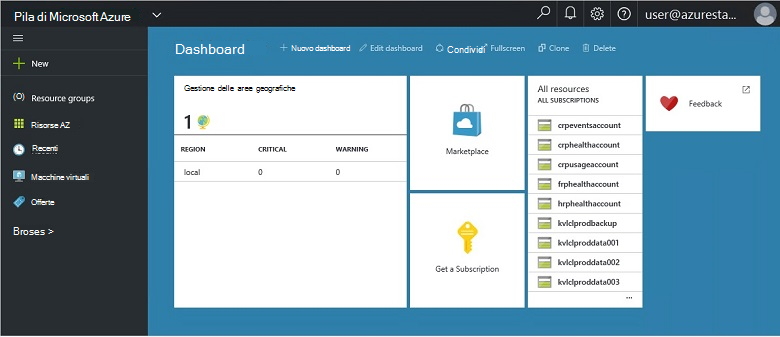
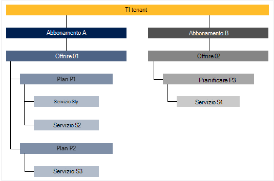

<properties
    pageTitle="Principali caratteristiche e dei concetti in pila Azure | Microsoft Azure"
    description="Informazioni sulle caratteristiche chiave e concetti in pila Azure."
    services="azure-stack"
    documentationCenter=""
    authors="Heathl17"
    manager="byronr"
    editor=""/>

<tags
    ms.service="azure-stack"
    ms.workload="na"
    ms.tgt_pltfrm="na"
    ms.devlang="na"
    ms.topic="article"
    ms.date="10/25/2016"
    ms.author="helaw"/>

# Caratteristiche chiave e concetti in pila di Azure

Se ha familiarità con Microsoft Azure Stack, queste condizioni e descrizioni delle funzionalità può essere utile.

## Utenti tipo

Esistono due tipi di utenti di Microsoft Azure Stack, l'amministratore di servizio e tenant (cliente).

-  Un **amministratore del servizio** è possibile configurare e gestire provider di risorse, offerte tenant, piani, servizi, le quote e prezzi.
-  Un **tenant** acquisisce o acquista servizi offerti dall'amministratore del servizio. Tenant possono effettuare il provisioning, monitorare e gestire i servizi che si sono sottoscritti, ad esempio Web Apps, lo spazio di archiviazione e macchine virtuali.

## Portale

I metodi principali per interagire con Microsoft Azure Stack è il portale e PowerShell.

Il portale di Microsoft Azure Stack è un'istanza del portale di Azure in esecuzione nel server. È un sito web che offre un'esperienza self-service per gli amministratori dei servizi e tenant con controllo dell'accesso basato sui ruoli (RBAC) alle risorse e la capacità cloud, abilitazione di sviluppo di servizi e applicazioni veloce e distribuzione.

## Aree, servizi, piani, offerte e le sottoscrizioni

In pila di Azure, servizi vengono inviati al tenant usando aree, abbonamenti, offerte e piani. Tenant possono sottoscrivere più offerte. Offerte possono avere uno o più piani e piani possono avere uno o più servizi.

Gerarchia di esempio delle sottoscrizioni del tenant di offerte, ognuna con diversi plan di messaggistica unificata e servizi.

### Aree
Le aree dello Stack Azure sono un elemento di base di scala e gestione.  Un'organizzazione potrebbe essere più aree geografiche con le risorse disponibili in ogni area.  Aree potrebbero anche essere diversi servizi disponibili.

### Servizi

Microsoft Azure Stack consente ai provider offrire una vasta gamma di servizi e applicazioni, ad esempio macchine virtuali, SQL Server database, SharePoint, Exchange e altro ancora.

### Plan di messaggistica unificata

Piani sono raggruppamenti di uno o più servizi. Provider di creare piani per l'offerta per il tenant. A sua volta, i tenant sottoscrivere le offerte da utilizzare i piani e i servizi che includono.

Ogni servizio aggiunto a un piano può essere configurato con le impostazioni delle quote per gestire la capacità cloud. Le quote possono includere le restrizioni, ad esempio limiti macchine Virtuali, RAM e CPU e verranno applicate per sottoscrizione utente. Le quote di possano differenziano posizione. Ad esempio, un piano che contiene i servizi di calcolo dall'area potrebbe avere una quota di due macchine virtuali, 4GB di RAM e 10 core CPU.

Quando si scrive un'offerta, l'amministratore di servizio può includere **i piani di base**. Questi piani di base sono inclusi per impostazione predefinita quando un tenant si iscrive a tale offerta. Non appena un utente si sottoscrive e la creazione della sottoscrizione, l'utente ha accesso a tutti i provider di risorse specificati in questi piani di base (con quote corrispondente).

L'amministratore del servizio può includere anche **i piani di componenti aggiuntivi** in un'offerta. Piani di componenti aggiuntivi non sono inclusi per impostazione predefinita nella sottoscrizione. Piani di componenti aggiuntivi sono disponibili in un'offerta che il proprietario di un abbonamento è possibile aggiungere alle loro sottoscrizioni altri piani (quote).

### Offerte

Offerte sono gruppi di uno o più piani provider presentano ai tenant per acquistare (sottoscrivere). Ad esempio, offrire alfa può contenere piano A (da 1 area contenente un insieme di servizi di elaborazione) e pianificare B (da 2 area contenente un insieme di servizi di archiviazione e di rete).

Un'offerta viene fornito con un set di piani di base e gli amministratori di servizio possono creare piani di componente aggiuntivo che tenant possono aggiungere al proprio abbonamento.

### Sottoscrizioni

Una sottoscrizione è come tenant acquistano le offerte. Una sottoscrizione è una combinazione di un tenant con un'offerta. Le sottoscrizioni a più offerte sono un tenant. Ogni abbonamento si applica a un solo offerta. Le sottoscrizioni del tenant stabilire quali piani o servizi possono accedere.

Sottoscrizioni di organizzare i provider di accesso e uso delle risorse cloud e servizi.

## Gestione risorse di Azure

Tramite Gestione risorse di Azure, è possibile utilizzare con le risorse dell'infrastruttura in un modello basato sul modello, dichiarativi.   Fornisce un'unica interfaccia che è possibile utilizzare per distribuire, gestire e monitorare i componenti della soluzione, ad esempio macchine virtuali, gli account di archiviazione, web App e database. Per ulteriori informazioni e indicazioni, vedere la [Panoramica di gestione di risorse Azure](../azure-resource-manager/resource-group-overview.md).

### Gruppi di risorse

Gruppi di risorse sono raccolte di risorse, servizi e applicazioni, ma ogni risorsa è un tipo, ad esempio macchine virtuali di reti virtuali, pubblico IP, gli account di archiviazione e siti Web. Ogni risorsa deve essere in un gruppo di risorse e in modo che i gruppi di risorse utili in modo logico organizzare risorse, ad esempio per il carico di lavoro o posizione.

Ecco alcuni aspetti importanti da considerare quando si definisce un gruppo di risorse:

-   Ogni risorsa è disponibile solo in un gruppo di risorse.

-   Si verrà distribuire, aggiornare ed eliminare elementi in un gruppo di risorse insieme. Se una risorsa, ad esempio un server di database deve esistere su un ciclo di distribuzione diversi, deve essere in un altro gruppo di risorse.

-   È possibile aggiungere o rimuovere una risorsa a un gruppo di risorse in qualsiasi momento.

-   È possibile spostare una risorsa da un gruppo di risorse in un altro gruppo.

-   Un gruppo di risorse può contenere risorse che si trovano in diverse aree geografiche.

-   Un gruppo di risorse può essere usato per definire l'ambito di controllo di accesso per le attività amministrative.

-   Una risorsa può essere collegata a una risorsa in un altro gruppo di risorse quando le due risorse devono interagire tra loro ma non condividere la stessa del ciclo di vita. Ad esempio App più necessario connettersi a un database, ma il database non dovrà essere aggiornato o eliminato alla stessa velocità come le app.

-   In Microsoft Azure Stack, ad esempio i piani e offerte anche gestione delle risorse in gruppi di risorse.

-   È possibile ridistribuire un gruppo di risorse.  Questo è utile per motivi di sviluppo e verifica.  

### Modelli di Azure Manager delle risorse

Azure Gestione risorse, è possibile creare un modello semplice (in formato JSON) che definisce la distribuzione e configurazione dell'applicazione. Questo modello è nota come modello di gestione di risorse Azure e offre un modo dichiarativo per definire la distribuzione. Utilizzando un modello, è possibile distribuire l'applicazione durante il ciclo di vita di app ripetutamente e fiducia che le risorse sono distribuite in uno stato coerente.

## Provider di risorse (RPs), ovvero RP di rete, calcolare RP archiviazione RP

Provider di risorse sono servizi web che sono alla base di tutti i IaaS basate su Azure e i servizi PaaS. Gestione risorse di Azure si basa su diversi RPs per consentire l'accesso ai servizi dell'host.

Esistono tre RPs principale: rete, lo spazio di archiviazione e calcolo. Ognuna di queste RPs consente di configurare e controllare le rispettive risorse. Gli amministratori dei servizi è anche possibile aggiungere nuovi provider di risorse.

### Calcolare RP

Calcolare risorse Provider (CRP) consente di Azure Stack tenant creare le proprie macchine virtuali. Inoltre, sono disponibili funzionalità per l'amministratore del servizio installare e configurare il provider di risorse per tenant. Il CRP include la possibilità di creare macchine virtuali, nonché le estensioni macchina virtuale. Il servizio di estensione macchina virtuale consente di fornire funzionalità IaaS per macchine virtuali di Windows e Linux.

### Rete RP

Il Provider di risorse di rete (NRP) offre una serie di caratteristiche Software definito Networking (SDN) e di rete funzione virtualizzazione (NFV) per il cloud privato. Queste funzioni sono coerenti con il cloud pubblica Azure in modo che i modelli di applicazione possono essere scritti una volta e distribuiti sia nel cloud pubblica Azure o locale Microsoft Azure Stack. RP rete offre maggiore controllo di rete, metatag, configurazione più veloce, la personalizzazione rapida e ripetibile e più interfacce di controllo (inclusi PowerShell, .NET SDK, Node SDK, API basata su resto). È possibile utilizzare il NRP per creare software carico bilanciamento del carico, IP pubblico, rete dei gruppi di sicurezza le reti virtuali, tra gli altri.

### Spazio di archiviazione RP

RP lo spazio di archiviazione offre servizi di archiviazione Azure coerente quattro: blob, tabella, coda e la gestione degli account. Inoltre, offre un servizio di amministrazione di archiviazione cloud per semplificare l'amministrazione del provider del servizio di servizi di archiviazione Azure coerenti. Spazio di archiviazione Azure offre flessibilità necessaria per archiviare e recuperare grandi quantità di dati non strutturati, ad esempio documenti e i file multimediali con BLOB Azure, e NoSQL strutturata in base a dati con le tabelle di Azure. Per ulteriori informazioni sull'archiviazione Azure, vedere [Introduzione a Microsoft Azure archiviazione](../storage/storage-introduction.md).

#### Archiviazione BLOB

Archiviazione BLOB archivia qualsiasi set di dati. Un blob può essere qualsiasi tipo di testo o dati binari, ad esempio un documento, un file multimediale o un programma di installazione applicazioni. Archiviazione tabella archivia set di dati strutturati. Archiviazione tabelle è un archivio di dati dell'attributo chiave NoSQL, che consente di accedere rapidamente alle grandi quantità di dati e un rapido sviluppo. Spazio di archiviazione coda offre messaggistica affidabile per l'elaborazione del flusso di lavoro e per le comunicazioni tra i componenti di servizi cloud.

Ogni blob sono organizzate in un contenitore. I contenitori anche consentono di assegnare criteri di sicurezza dei gruppi di oggetti. Un account di archiviazione può contenere un numero di contenitori, e un contenitore può contenere qualsiasi numero di BLOB fino al limite di capacità di 500 TB dell'account di archiviazione. BLOB archiviazione offre tre tipi di BLOB, bloccare BLOB, accodare BLOB e BLOB di pagina (dischi). Blocco BLOB sono ottimizzati per streaming e archiviazione di oggetti cloud e costituiscono un'ottima scelta per l'archiviazione di documenti, file multimediali, l'esecuzione di backup e così via. Accodare BLOB sono simili a BLOB blocco, ma sono ottimizzati per le operazioni di Accodamento. Solo per l'aggiunta di un nuovo blocco alla fine, è possibile aggiornare un blob di Accodamento. Accodare BLOB costituiscono un'ottima scelta per gli scenari, ad esempio la registrazione, nel punto in cui devono essere scritti solo fino alla fine del blob nuovi dati. Pagina BLOB sono ottimizzati per la rappresentazione IaaS dischi e supporto casuale scrive e potrebbe essere fino a 1 TB dimensioni. Una rete macchina virtuale Azure associati IaaS disco è un disco rigido virtuale memorizzato come blob pagina.

#### Archiviazione tabella

Archiviazione tabella archivio di chiave/attributo NoSQL Microsoft, che contiene una struttura senza schemi, rendendo diversa da database relazionali tradizionali. Poiché gli schemi mancanza archivi dati, è facile adattare i dati come le esigenze dei evolve applicazione. Archiviazione tabelle è facile da usare in modo che gli sviluppatori possono creare rapidamente le applicazioni. Archiviazione tabelle è un archivio attributo key, vale a dire che ogni valore in una tabella viene archiviato con un nome di proprietà tipizzata. Il nome della proprietà utilizzabili per filtrare e specificare i criteri di selezione. Un insieme di proprietà e i rispettivi valori costituiscono un'entità. Poiché gli schemi mancanza di spazio di archiviazione tabella, due entità nella stessa tabella possono contenere diversi insiemi di proprietà e tali proprietà possono essere di tipo diverso. È possibile utilizzare lo spazio di archiviazione tabella per memorizzare flessibile set di dati, ad esempio dati utente per le applicazioni web, rubriche, informazioni sul dispositivo e qualsiasi altro tipo di metadati richiesti dal servizio. È possibile archiviare qualsiasi numero di entità in una tabella e un account di archiviazione può contenere qualsiasi numero di tabelle, fino al limite di capacità dell'account di archiviazione.

#### Spazio di archiviazione coda
Lo spazio di archiviazione di Azure coda fornisce cloud messaggistica tra componenti dell'applicazione. Nella progettazione di applicazioni per scala, componenti dell'applicazione spesso sono disaccoppiati, in modo che sia possibile adattarli in modo indipendente. Spazio di archiviazione coda offre messaggistica asincrono delle comunicazioni tra componenti dell'applicazione, se sono in esecuzione nel cloud, sul desktop, su un server locale o in un dispositivo mobile. Archiviazione coda supporta anche la gestione attività asincrone e creazione di flussi di lavoro di processo.

## Controllo di accesso (RBAC) basato sui ruoli

È possibile utilizzare RBAC per concedere l'accesso di sistema per gli utenti autorizzati, gruppi e servizi tramite l'assegnazione di ruoli di livello un abbonamento, gruppo di risorse o delle risorse individuali. Ogni ruolo definisce il livello di accesso che ha un utente, gruppo o servizio sulle risorse di Microsoft Azure Stack.

RBAC Azure sono previsti tre ruoli di base che si applicano a tutti i tipi di risorse: proprietario, collaboratori e utilità per la lettura. Proprietario ha accesso completo a tutte le risorse compreso il diritto di delega accesso ad altri utenti. Per i collaboratori possono creare e gestire tutti i tipi di risorse Azure ma non consente l'accesso ad altri utenti. Lettore può solo visualizzare risorse Azure esistenti. Il resto dei ruoli RBAC in Azure consente la gestione di risorse Azure specifiche. Ad esempio, il ruolo di collaboratore macchina virtuale consente di creare e gestire le macchine virtuali ma non consente la gestione di rete virtuale o subnet che la macchina virtuale si connette a.

## Dati di utilizzo

Microsoft Azure Stack raccoglie e aggrega i dati di utilizzo per tutti i provider di risorse per fornire un rapporto conciso per ogni utente. Dati possono essere costituiti semplicemente da conteggio risorsa utilizzata o più complessi come singoli contatori proporzioni e le prestazioni. I dati sono disponibili in pratici API REST. È un Azure coerente API Tenant, nonché Provider e delega API Provider per recuperare dati di utilizzo in tutte le sottoscrizioni tenant. Questo dati possono essere utilizzati per l'integrazione con un strumento esterno o un servizio per la fatturazione o rifiuto.

## Passaggi successivi

[Distribuire Stack Azure Technical Preview di 2 (prova)](azure-stack-deploy.md)
