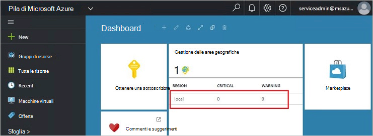
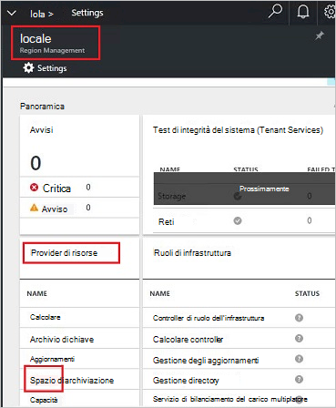
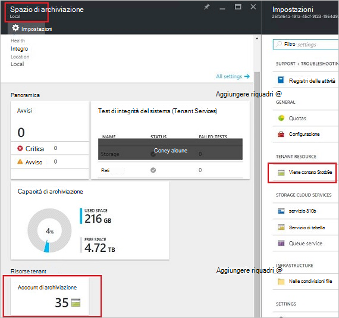
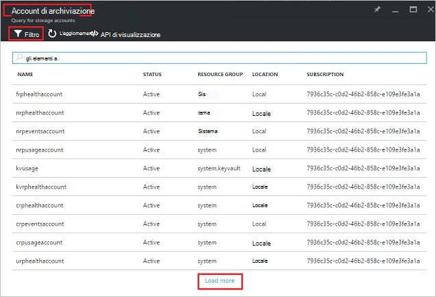
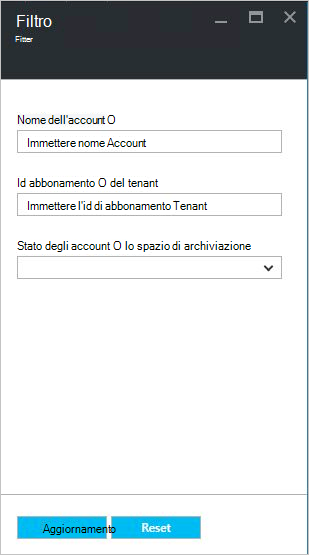
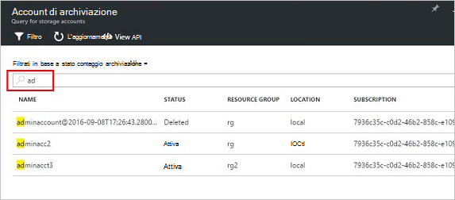
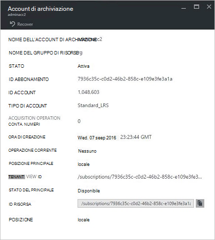
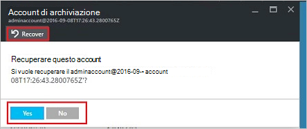
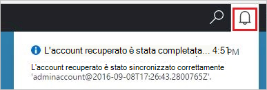
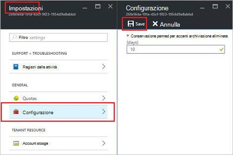

<properties
    pageTitle="Gestire gli account di archiviazione di Azure Stack | Microsoft Azure"
    description="Informazioni su come trovare, gestire, recuperare e recuperare gli account di archiviazione dello Stack di Azure"
    services="azure-stack"
    documentationCenter=""
    authors="AniAnirudh"
    manager="darmour"
    editor=""/>

<tags
    ms.service="azure-stack"
    ms.workload="na"
    ms.tgt_pltfrm="na"
    ms.devlang="na"
    ms.topic="get-started-article"
    ms.date="09/26/2016"
    ms.author="anirudha"/>

# <a name="manage-storage-accounts-in-azure-stack"></a>Gestire gli account di archiviazione in pila Azure

Informazioni su come gestire gli account di archiviazione in pila Azure per trovare, ripristinare e recuperare capacità di archiviazione in base alle esigenze aziendali.

## <a name="find-a-storage-account"></a>Trovare un account di archiviazione

Elenco degli account di archiviazione nell'area può essere visualizzata in pila Azure da:

1.  In un browser internet, passare a [https://portal.azurestack.local](https://portal.azurestack.local/).

2.  Accedere al portale di Azure Stack come amministratore (usando le credenziali fornite durante la distribuzione)

3.  Nel dashboard predefinito: trovare l'elenco di **gestione delle aree geografiche** e fare clic su area geografica che si desidera esplorare, ad esempio **(locale**).

    

4.  Selezionare **lo spazio di archiviazione** dall'elenco di **Provider di risorse** .

    

5.  A questo punto, su e l'amministrazione Provider risorse lo spazio di archiviazione, scorrere fino a scheda "Lo spazio di archiviazione account" e fare clic su di esso.

    
    
    La pagina risultante è l'elenco degli account di archiviazione in quell'area.

    

Per impostazione predefinita, vengono visualizzati i primi 10 account. È possibile scegliere di recuperare più facendo clic sul collegamento "caricare più" nella parte inferiore dell'elenco <br>
OR <br>
Se si è interessati in un account di archiviazione specifico, è possibile **filtrare e recuperare conti pertinenti** solo.<br>

Per filtrare per gli account:

1. Fare clic sul pulsante filtro nella parte superiore e il.

2. In e il filtro, è possibile specificare **nome dell'account**,  **ID abbonamento** o **stato** per perfezionare l'elenco degli account di archiviazione da visualizzare. Usarli in base alle esigenze.

3. Fare clic su Aggiorna. L'elenco deve essere aggiornata di conseguenza.

    

4. Per reimpostare il filtro, fare clic sul pulsante filtro, cancellare le selezioni e aggiornare.

Casella di testo Cerca nella parte superiore e l'elenco conti lo spazio di archiviazione, consente di evidenziare il testo selezionato nell'elenco degli account. Si tratta realmente utile nel caso quando il nome completo o l'id non è disponibile con facilità.<br>
È possibile utilizzare qui testo libero per aiutare a trovare l'account che interessa.




## <a name="look-at-account-details"></a>Esaminare i dettagli di account

Dopo avere individuato gli account di cui che si desidera visualizzare, è possibile fare clic sull'account specifico per visualizzare determinati dettagli. Verrà aperta una nuova pala con i dettagli del conto come tipo di account, ora di creazione, luogo e così via.




## <a name="recover-a-deleted-account"></a>Ripristinare un account eliminato

Potrebbe essere in situazioni in cui si desidera ripristinare un account eliminato.<br>
In AzureStack esiste un modo semplice.

1.  Passare a passare all'elenco di account di archiviazione. [Vedere ricerca di un account di archiviazione](#find-a-storage-account)

2.  Individuare quel particolare conto nell'elenco. Potrebbe essere necessario filtrare.

3.  Controllare lo stato dell'account. Dovrebbe essere indicato "eliminati".

4.  Fare clic sull'account che si apre e il dettagli account.

5.  Nella parte superiore di blade-individuare il pulsante "Recupera" e fare clic su di esso.

6.  Confermare premendo "Sì"

    

7.  Il ripristino si trova nel processo attesa per l'indicazione che ha esito negativo.
    È anche possibile fare clic sull'icona "mente" nella parte superiore del portale per visualizzare le indicazioni lo stato di avanzamento.

    

  Una volta che l'account recuperato correttamente sincronizzato, una possibile tornare a usarlo.

### <a name="some-gotchas"></a>Alcuni trucchi

- L'account eliminato Mostra lo stato come "fuori conservazione".

  Ciò significa che l'account eliminato ha superato il periodo di conservazione e potrebbe non essere più recuperabile.

- L'account eliminato non è presente nell'elenco degli account.

  Questo significa che l'account eliminato è già stato eliminazione. In questo caso non è possibile recuperarla più. Vedere "occupata capacità" più avanti.

## <a name="set-retention-period"></a>Impostare il periodo di conservazione

Impostazione del periodo di conservazione consente un amministratore specificare un periodo di tempo in giorni (compreso tra 0 e 9999 giorni) durante il quale potenzialmente possono essere recuperati tutti gli account eliminati. Il periodo di conservazione predefinito è impostato su 15 giorni. Impostazione del valore su "0", che tutti gli account eliminati immediatamente sarà fuori criteri di conservazione e contrassegnato per simultanea periodici.

Per modificare il periodo di conservazione:

1.  In un browser internet, passare a [https://portal.azurestack.local](https://portal.azurestack.local/).

2.  Accedere al portale di Azure Stack come amministratore (usando le credenziali fornite durante la distribuzione)

3.  Nel dashboard predefinito: trovare l'elenco di **gestione delle aree geografiche** e fare clic su area geografica che si desidera esplorare, ad esempio **(locale**).

4.  Selezionare **lo spazio di archiviazione** dall'elenco di **Provider di risorse** .

5.  Fare clic sull'icona impostazioni nell'angolo superiore per aprire e l'impostazione.

6.  Fare clic su configurazione - periodo di conservazione.

7.  È possibile modificare il valore e salvarlo.

 Questo valore verrà immediatamente efficace e riflettere lungo l'intera area.



## <a name="reclaim-capacity"></a>Recuperare capacità

Uno degli effetti di lato di disporre di un periodo di conservazione è che un account eliminato continuerà a utilizzare capacità fino a quando non viene fuori del periodo di conservazione. A questo punto l'amministratore che può essere necessario un modo per recuperare questa eliminati spazio account anche se il periodo di conservazione non è ancora scaduto. Attualmente è possibile utilizzare una riga di comando per ignorare in modo esplicito il periodo di conservazione e recuperare immediatamente capacità. Per eseguire questa operazione:

1.  Supponendo che è stato Azure PowerShell installato e configurato. In caso contrario, seguire le istruzioni visualizzate: per installare l'ultima versione di PowerShell Azure e associare all'abbonamento Azure, informazioni su [come installare e configurare Azure PowerShell](http://azure.microsoft.com/documentation/articles/powershell-install-configure/).
    Per ulteriori informazioni sui cmdlet Gestione risorse di Azure, vedere [Uso di PowerShell Azure Gestione risorse Azure](http://go.microsoft.com/fwlink/?LinkId=394767)

2.  Eseguire questo cmdlet:

    ```
    PS C:\\>; Clear-ACSStorageAccount -ResourceGroupName system
    -FarmName <your farmname>
    ```

> Per ulteriori informazioni, fare riferimento alla [documentazione di powershell AzureStack](https://msdn.microsoft.com/library/mt637964.aspx)

> [AZURE.NOTE] Eseguire questo cmdlet eliminerà definitivamente l'account e il relativo contenuto. Non saranno recuperato. Utilizzare con cautela.

