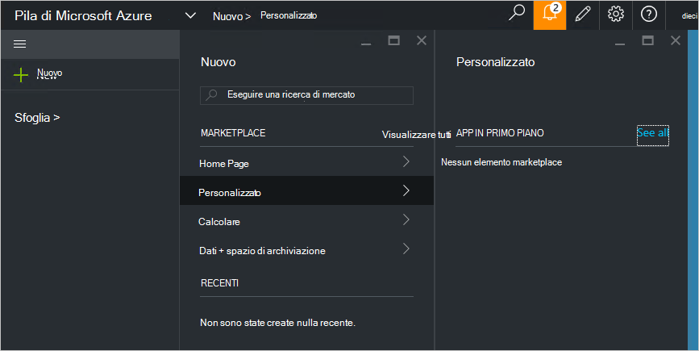

<properties
    pageTitle="Pubblicazione di un elemento marketplace personalizzato in pila Azure (amministratore del servizio) | Microsoft Azure"
    description="L'amministratore del servizio di informazioni su come pubblicare un elemento marketplace personalizzato in pila di Azure."
    services="azure-stack"
    documentationCenter=""
    authors="rupisure"
    manager="byronr"
    editor=""/>

<tags
    ms.service="azure-stack"
    ms.workload="na"
    ms.tgt_pltfrm="na"
    ms.devlang="na"
    ms.topic="article"
    ms.date="09/26/2016"
    ms.author="rupisure"/>

# In pila Azure Marketplace

Il Marketplace è una raccolta di elementi personalizzati per Stack di Azure, come i servizi, applicazioni e risorse. È il punto in cui tenant provengono per creare nuove risorse e distribuire nuove applicazioni. Gli amministratori dei servizi è possibile aggiungere gli elementi personalizzati al Marketplace e tenant saranno possibile vedere immediatamente.

Per aprire il Marketplace, fare clic su **Nuovo**.

Il Marketplace viene aggiornato ogni cinque minuti.

## Elementi Marketplace

Marketplace di ogni elemento è:

-   Un modello di gestione di risorse Azure per il provisioning di risorse

-   Metadati, ad esempio stringhe, icone e altri materiali di marketing

-   Informazioni sulla formattazione per visualizzare l'elemento nel portale

Tutti gli elementi pubblicati Marketplace utilizza un formato denominato il pacchetto di raccolta Azure (azpkg). Risorse di distribuzione o runtime (ad esempio codice, con estensione zip con software o le immagini della macchina virtuale) devono essere aggiunto dello Stack di Azure separatamente, non come parte dell'elemento Marketplace. 

## Passaggi successivi

[Creare e pubblicare un elemento marketplace](azure-stack-create-and-publish-marketplace-item.md)
