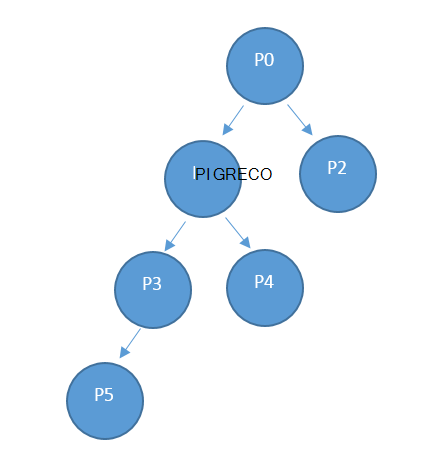

<properties
    pageTitle="Utilizzo delle risorse provider API | Microsoft Azure"
    description="Guida di riferimento per l'utilizzo delle risorse API, che recuperare informazioni sull'utilizzo dello Stack di Azure."
    services="azure-stack"
    documentationCenter=""
    authors="AlfredoPizzirani"
    manager="byronr"
    editor=""/>

<tags
    ms.service="azure-stack"
    ms.workload="na"
    ms.tgt_pltfrm="na"
    ms.devlang="na"
    ms.topic="article"
    ms.date="10/18/2016"
    ms.author="alfredop"/>

# Utilizzo delle risorse provider API

Il provider di termini è applicabile per l'amministratore di servizio e a tutti i provider delegati. Amministratori dei servizi e dei gestori di delegata è possono utilizzare API di utilizzo del Provider per visualizzare l'uso della loro tenant diretto. Ad esempio P0 possono chiamare API del Provider per ottenere informazioni sull'utilizzo diretto del P1 e del P2 utilizzo e P1 possono chiamare per informazioni sull'utilizzo P3 e P4.

## Guida di riferimento API chiamata

### Richiesta

La richiesta ottiene consumo dettagli per gli abbonamenti richiesti e per l'intervallo di tempo richiesta. Non esiste alcun corpo della richiesta.

Questo utilizzo API è una API di Provider, in modo che il chiamante deve essere assegnato a un ruolo di proprietario, collaboratori o Reader in abbonamento del provider.

| **Metodo**  | **URI richiesta** |
| ------------ | ------------------------------------------------------------------------------------------------------------------------------------------------------------------------------------------------------------------------------------------------------------------------------------------------------ |
|  Ottieni        | https://{armendpoint}/subscriptions/{subId}/providers/Microsoft.Commerce/subscriberUsageAggregates?reportedStartTime={reportedStartTime}&reportedEndTime={reportedEndTime}&aggregationGranularity={granularity}&subscriberId={sub1.1}&api-version=2015-06-01-preview&continuationToken={token-value} |

### Argomenti

| **Argomento**              | **Descrizione** |
| -------------------------- | --------------------------------------------------------------------------------------------------------------------------------------------------------------------------------------------------------------------------------------------------------------------------------------------------------------------------------------------------------- |
| *armendpoint*             | Azure endpoint Manager delle risorse dell'ambiente dello Stack di Azure. La convenzione di Azure Stack è che il nome dell'endpoint ARM si trovi in https://api formato. {nome di dominio}'. Ad esempio, se il nome di dominio è azurestack.local, l'endpoint ARM sarà https://api.azurestack.local. |
| *subId*                   | ID abbonamento dell'utente che sta effettuando la chiamata. |
| *reportedStartTime*       | Ora di inizio della query. Il valore per *DateTime* deve essere in formato UTC e all'inizio dell'ora, ad esempio 13:00. Per l'aggregazione giornaliera, impostare questo valore su mezzanotte ora UTC. Il formato è *escape* ISO8601, ad esempio 2015-06-16T18% 3a53% 3a11% 2b00% 3a00Z, in cui i due punti diventa un % 3a e plus diventa un % 2b in modo che sia URI descrittivo. |
| *reportedEndTime*         | Ora di fine della query. I vincoli che si applicano a *reportedStartTime* applicano anche a questo argomento. Il valore di *reportedEndTime* non può essere una data futura. |
| *aggregationGranularity*  | Parametro facoltativo che contiene due valori potenziali distinti: ogni giorno e ogni ora. Come suggeriscono i valori, uno restituisce i dati in granularità giornaliera e l'altra è una risoluzione oraria. L'opzione giornaliera è il valore predefinito. |
| *subscriberId*            | ID abbonamento. Per ottenere i dati filtrati, è necessario l'ID di sottoscrizione di un tenant diretto del provider. Se viene specificato alcun parametro di ID abbonamento, la chiamata restituisce dati di utilizzo per tenant diretta del provider. |
| *versione API*             | Versione del protocollo utilizzato per creare la richiesta. È necessario utilizzare Anteprima 01 di 06 2015. |
| *continuationToken*       | Token recuperato dopo l'ultima chiamata al provider l'uso dell'API. Questa operazione è necessaria per una risposta è maggiore di 1.000 righe. Questo è il segnalibro per lo stato di avanzamento. Se non è presente, i dati vengono recuperati dall'inizio del giorno o ora, in base al livello di dettaglio passato. |

### Risposta

OTTENERE /subscriptions/sub1/providers/Microsoft.Commerce/subscriberUsageAggregates?reportedStartTime=reportedStartTime=2014-05-01T00%3a00%3a00%2b00%3a00 & reportedEndTime = 2015-06-01T00% 3a00% 3a00% 2b00% 3a00 & aggregationGranularity = giornaliera & subscriberId = sub1.1 & versione api = 1.0

{

"valore":\[

{

"id": "/subscriptions/sub1.1/providers/Microsoft.Commerce/UsageAggregate/sub1.1-

meterID1 ",

"nome": "sub1.1 meterID1"

"tipo": "Microsoft.Commerce/UsageAggregate"

"proprietà": {

"subscriptionId": "sub1.1"

"usageStartTime": "2015-03-03T00:00:00 + 00:00",

"usageEndTime": "2015-03-04T00:00:00 + 00:00",

"instanceData": "{\\" Microsoft.Resources\\": {\\" resourceUri\\":\\" resourceUri1\\",\\"posizione\\

":\\" Alaska\\",\\" tag\\": null,\\" additionalInfo\\": null}}",

"quantità":2.4000000000,

"meterId": "meterID1"

}

},

…

### Dettagli sulla risposta

| **Argomento**       | **Descrizione**
| ------------------ | ------------------------------------------------------------------------------------------------------------- |
| *ID*               | ID univoco dell'aggregazione utilizzo
| *nome*             | Nome dell'aggregato utilizzo
| *tipo*             | Definizione delle risorse
| *subscriptionId*   | Identificatore di sottoscrizione dell'utente dello Stack di Azure
| *usageStartTime*   | Ora UTC ora di inizio dell'intervallo di utilizzo a cui appartiene l'aggregazione di utilizzo
| *usageEndTime*     | Ora di fine UTC dell'intervallo di utilizzo a cui appartiene l'aggregazione di utilizzo
| *instanceData*     | Valore di chiave coppie di dettagli istanza (in un nuovo formato):  *resourceUri*: completo ID risorsa, che include i gruppi di risorse e il nome dell'istanza   *posizione*: l'area geografica in cui è stato eseguito il servizio   *tag*: tag di risorse specificato dall'utente   *additionalInfo*: ulteriori informazioni sulle risorse utilizzata, ad esempio tipo di immagine o versione del sistema operativo |
| *quantità*         | Importo del consumo della risorsa che si sono verificati in questo periodo di tempo |
| *meterId*          | ID univoco per la risorsa è stata utilizzata (anche chiamato *ResourceID*) |

## Passaggi successivi

[Utilizzo delle risorse tenant riferimento all'API](azure-stack-tenant-resource-usage-api.md)

[Domande frequenti relative l'uso](azure-stack-usage-related-faq.md)
