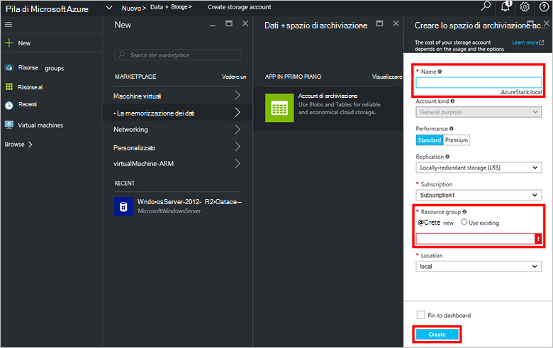

<properties
    pageTitle="Gli account di archiviazione in pila Azure | Microsoft Azure"
    description="Informazioni su come creare un account di archiviazione di Azure Stack."
    services="azure-stack"
    documentationCenter=""
    authors="ErikjeMS"
    manager="byronr"
    editor=""/>

<tags
    ms.service="azure-stack"
    ms.workload="na"
    ms.tgt_pltfrm="na"
    ms.devlang="na"
    ms.topic="get-started-article"
    ms.date="09/26/2016"
    ms.author="erikje"/>

# Account di archiviazione in pila di Azure

Gli account di archiviazione includono servizi Blob e tabella e lo spazio dei nomi univoco per gli oggetti di dati di spazio di archiviazione. Per impostazione predefinita, i dati nel proprio account sono disponibili solo per l'utente, il proprietario dell'account di archiviazione.

1.  Nel computer di prova dello Stack di Azure, accedere a `https://portal.azurestack.local` come [amministratore](azure-stack-connect-azure-stack.md#log-in-as-a-service-administrator)e quindi fare clic su **Nuovo** > **dati + spazio di archiviazione** > **account di archiviazione**.

    

2.  In e il **creare account di archiviazione** , digitare un nome per il proprio account di archiviazione. Creare un nuovo **Gruppo di risorse**, oppure selezionarne uno esistente, quindi fare clic su **Crea** per creare l'account di archiviazione.

    

3. Per visualizzare il nuovo account di archiviazione, fare clic su **tutte le risorse**, quindi eseguire una ricerca per l'account di archiviazione e fare clic sul nome.

    
    
## Passaggi successivi

[Utilizzare i modelli di Manager delle risorse di Azure](azure-stack-arm-templates.md)

[Informazioni sugli account di archiviazione Azure](../storage/storage-create-storage-account.md)

[Scarica la Guida di convalida lo spazio di archiviazione Azure coerente Stack Azure](http://aka.ms/azurestacktp1doc)
