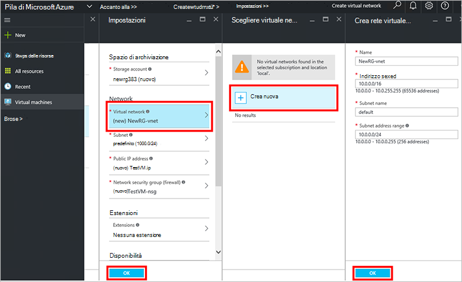

<properties
    pageTitle="Effettuare il provisioning di una macchina virtuale in pila Azure (tenant) | Microsoft Azure"
    description="Come un tenant, informazioni su come effettuare il provisioning di una macchina virtuale in pila Azure."
    services="azure-stack"
    documentationCenter=""
    authors="ErikjeMS"
    manager="byronr"
    editor=""/>

<tags
    ms.service="azure-stack"
    ms.workload="na"
    ms.tgt_pltfrm="na"
    ms.devlang="na"
    ms.topic="get-started-article"
    ms.date="10/12/2016"
    ms.author="erikje"/>

# Effettuare il provisioning di una macchina virtuale

Un amministratore, è possibile creare macchine virtuali per valutare risorse prima offrendo loro nei piani.

## Effettuare il provisioning di una macchina virtuale

1.  Nel computer di prova dello Stack di Azure, accedere a `https://portal.azurestack.local` come [amministratore](azure-stack-connect-azure-stack.md#log-in-as-a-service-administrator)e quindi fare clic su **Nuovo** > **macchine virtuali** > **Windows Server del 2012 R2 centro**.  

    

2.  In e il **Nozioni di base** , digitare un **nome**, **nome utente**e **Password**. Per **tipo di disco macchine Virtuali**, scegliere **disco rigido**. Scegliere un **abbonamento**. Creare un **gruppo di risorse**, oppure selezionarne uno esistente e quindi fare clic su **OK**.  

3.  In e lo **scegliere una dimensione** , fare clic su **A1 base**e quindi fare clic su **Seleziona**.  

4.  In e **l'Impostazioni** , fare clic su **rete virtuale**. In e il **virtuali scegliere** , fare clic su **Crea nuovo**. In e il **Crea rete virtuale** accettare tutte le impostazioni predefinite e fare clic su **OK**. In e **l'Impostazioni** , fare clic su **OK**.

    

5.  In e il **Riepilogo** , fare clic su **OK** per creare la macchina virtuale.  

6. Per visualizzare la nuova macchina virtuale, fare clic su **tutte le risorse**, quindi eseguire una ricerca per la macchina virtuale e fare clic sul nome.

    

## Passaggi successivi

[Account di archiviazione](azure-stack-provision-storage-account.md)
