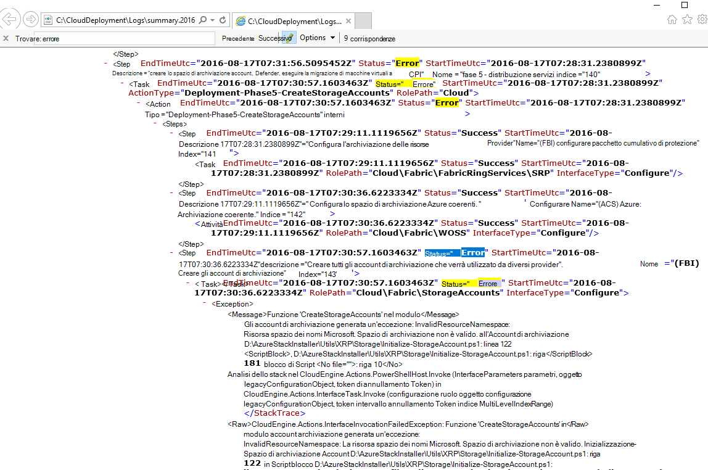
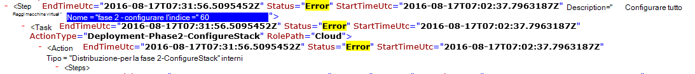

<properties
    pageTitle="Rieseguire una distribuzione da un passaggio non riuscito | Microsoft Azure"
    description="Se si verifica un errore durante l'installazione, è possibile provare la procedura seguente per eseguire di nuovo la distribuzione nel punto in cui non è riuscito."
    services="azure-stack"
    documentationCenter=""
    authors="ErikjeMS"
    manager="byronr"
    editor=""/>

<tags
    ms.service="azure-stack"
    ms.workload="na"
    ms.tgt_pltfrm="na"
    ms.devlang="na"
    ms.topic="get-started-article"
    ms.date="09/26/2016"
    ms.author="erikje"/>
    
# Rieseguire una distribuzione da un passaggio non riuscito
  
Se si verifica un errore durante l'installazione, è possibile provare la procedura seguente per eseguire di nuovo la distribuzione nel punto in cui non è riuscito.

## Trovare l'errore

Non è possibile prendere nota dell'errore, in particolare la parte che effettua una chiamata in quale passaggio la chiamata. Per esempio

**2016-08-17: 00:30:57 errore 1 > 1 > azione: chiamata del passaggio 60.140.143 non riuscita. Interruzione della chiamata di piano d'azione.**

Si tratta in fase di distribuzione in cui si inizierà rieseguire della distribuzione.

## Trovare ulteriori dettagli sull'errore

Se si desiderano ulteriori dettagli sull'errore, trovare associato **riepilogo. YYYY-MM-DD.tt.N.log.xml** nel **C:\CloudDeployment\Logs\* * cartella.
Cercare la stringa "Errore" e seguire verso il basso tramite l'output a finché non viene visualizzata una grande quantità di testo non in formato XML che contiene il messaggio di errore (in questa sezione spesso coincide con l'ultima istanza della stringa "Errore"). Per esempio:

È anche possibile usare queste informazioni per tenere traccia del passaggio eseguire di nuovo, il completamento i numeri "Indice" da tale ultimo errore. Nell'immagine, è possibile vedere (a partire dal basso): 143, 140 e, se scorrere verso l'alto, viene visualizzato 60:

Inserire tutti (ora è possibile dall'alto verso il basso), viene visualizzato 60.140.143, come nell'output della console PS dell'errore (come illustrato nella sezione "Individuare l'errore" sopra).

## Eseguire di nuovo la distribuzione in un passaggio specifico

Dopo aver creato il passaggio di distribuzione non riuscita in, è possibile tentare-rieseguire della distribuzione da eseguirli.

> [AZURE.IMPORTANT] I comandi seguenti devono essere eseguiti da utente corrette, nel contesto con l'errore si è verificato. Se l'errore prima che l'HOST è stato aggiunto al dominio, eseguire questa procedura come account dell'amministratore locale. Se l'errore dopo l'HOST è stato aggiunto al dominio, eseguire questa procedura come amministratore di dominio (azurestack\azurestackadmin).

### Eseguire il comando richiama EceAction

1. Da una console PS con privilegi elevata, importare i moduli seguenti:

        Import-Module C:\CloudDeployment\CloudDeployment.psd1 -Force
        Import-Module C:\CloudDeployment\ECEngine\EnterpriseCloudEngine.psd1 -Force 

2. Eseguire il comando seguente (ad esempio da usati qui sopra):

        Invoke-EceAction -RolePath Cloud -ActionType Deployment -Start 60.140.143 -Verbose

3.  Verrà avviata la distribuzione del passaggio identificato dal - parametro Start del comando richiama EceAction

### Risultati di-rieseguire /-inizio

Indipendentemente dall'opzione scegliere, la distribuzione inizierà nuovamente iniziare specificato - parametro.

1.  Se l'errore è reversibile, la distribuzione continuerà fino al completamento.

2.  Se la distribuzione non riesce a nuovamente...
    
    - stessa posizione: probabile che non è reversibile l'errore e approfondimento è necessario.

    - una nuova finestra di dialogo dopo nel punto in cui non è riuscito questa volta: è possibile provare la stessa procedura per ottenere successive nuovamente.

    - una nuova finestra di dialogo prima nel punto in cui non è riuscito questa volta: un altro elemento è verificato un problema con una chiamata idempotente che richiede ulteriori indagini.

## Passaggi successivi

[Connettersi a Stack Azure](azure-stack-connect-azure-stack.md)

