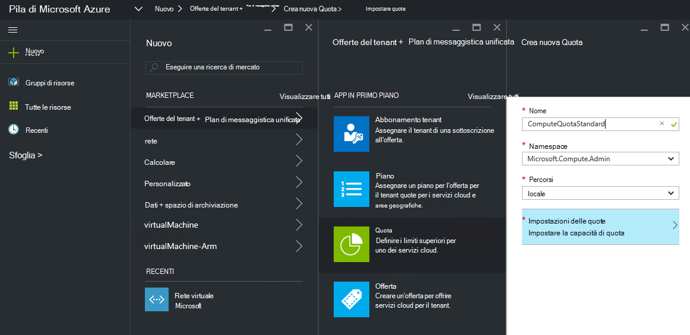
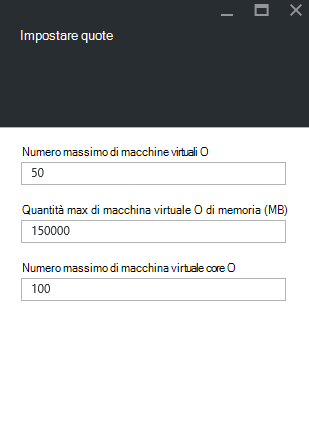
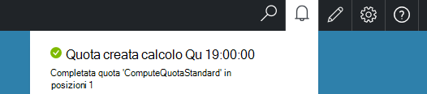

<properties
    pageTitle="Le quote di Azure Stack | Microsoft Azure"
    description="Gli amministratori impostare quote per limitare la maggior quantità di risorse tenant autorizzati ad accedere."
    services="azure-stack"
    documentationCenter=""
    authors="mattmcg"
    manager="byronr"
    editor=""/>

<tags
    ms.service="azure-stack"
    ms.workload="na"
    ms.tgt_pltfrm="na"
    ms.devlang="na"
    ms.topic="get-started-article"
    ms.date="09/26/2016"
    ms.author="mattmcg"/>

# Impostare quote per le in pila di Azure

Le quote di definiscono i limiti delle risorse che è possibile eseguire il provisioning o utilizzare una sottoscrizione tenant. Ad esempio, una quota potrebbe consentire un tenant creare un massimo di cinque macchine virtuali. Per aggiungere un servizio a un piano, l'amministratore deve configurare le impostazioni di quota per tale servizio.

Le quote possono essere configurate per ogni servizio e al percorso, consentendo agli amministratori di consentono di controllare granulare dell'utilizzo delle risorse. Gli amministratori possono creare uno o più risorse di quota e associarli piani, vale a dire che forniscono offerte applicazione per i servizi. Le quote per un determinato servizio possono essere create e amministrazione il **Provider di risorse** per tale servizio.

Un tenant sottoscrive un'offerta contenente più piani consentono tutte le risorse disponibili in ogni piano.

## Per creare una quota IaaS

1.  In un browser passare a [https://portal.azurestack.local](https://portal.azurestack.local/).

    Accedere al portale di Azure Stack come amministratore (mediante le credenziali fornite durante la distribuzione).

2.  Selezionare **Nuovo**e quindi selezionare **Quota**.

3.  Selezionare il primo servizio per il quale si desidera creare una quota. Per una quota IaaS, seguire questa procedura per i servizi di elaborazione, di rete e di archiviazione.
In questo esempio, è prima di tutto creare una quota per il servizio di calcolo. Nell'elenco **Namespace** selezionare lo spazio dei nomi **Microsoft.Compute.Admin** .

    > 

4.  Scegliere la posizione in cui è definita la quota (ad esempio, "locale").

5.  Elemento **Le impostazioni delle quote** un messaggio informa che **Imposta la capacità di Quota**. Fare clic su questo elemento per configurare le impostazioni di quota.

6.  Nella e **Impostare quote** sono elencate tutte le risorse di calcolo per il quale è possibile configurare limiti. Ogni tipo è un valore predefinito è associato. È possibile modificare questi valori oppure è possibile selezionare il pulsante **Ok** nella parte inferiore della stessa e per accettare le impostazioni predefinite.

    > 

7.  Dopo aver configurato i valori e fatto clic su **Ok**, viene visualizzato l'elemento **Le impostazioni delle quote** come **configurato**. Fare clic su **Ok** per creare la risorsa **Quota** .

    Verrà visualizzata una notifica che indica la risorsa quota creata.

8.   Dopo la creazione di set di quota correttamente, si riceve una notifica seconda. La quota di servizio di elaborazione è ora pronta per essere associati a un piano. Ripetere questi passaggi con i servizi di rete e lo spazio di archiviazione e si è pronti creare un piano IaaS!

    >   

## Calcolare i tipi di quota

|**Tipo**                    |**Valore predefinito**| **Descrizione**|
|--------------------------- | ------------------------------------|------------------------------------------------------------------|
|Numero massimo di macchine virtuali   |50|Numero massimo di macchine virtuali che è possibile creare una sottoscrizione in questa posizione. |
|Numero massimo di core macchina virtuale              |100|Il numero massimo di core che è possibile creare una sottoscrizione in questa posizione (ad esempio, una macchina virtuale A3 contiene quattro core).|
|Max memoria macchina virtuale (GB)         |150|La maggior quantità di RAM viene completato il provisioning in megabyte (ad esempio una macchina virtuale A1 utilizza 1,75 GB di RAM).|

> [AZURE.NOTE] Calcolare le quote non vengono applicate in questa versione di anteprima tecnica.

## Tipi di quota di archiviazione

|**Elemento**                           |**Valore predefinito**   |**Descrizione**|
|---------------------------------- |------------------- |-----------------------------------------------------------|
|Capacità massima (GB)              |500                 |Capacità di archiviazione totale che possono essere utilizzate da una sottoscrizione in questa posizione.|
|Numero totale di account di archiviazione   |20                  |Numero massimo di account di archiviazione che una sottoscrizione è possibile creare in questa posizione.|

## Tipi di quota di rete

|**Elemento**                                                   |**Valore predefinito**   |**Descrizione**|
|----------------------------------------------------------| ------------------- |--------------------------------------------------------------------------------------------------------------------------------------------------------------------|
| Indirizzi IP pubblico max                         |50                  |Numero massimo di indirizzi IP pubblico che una sottoscrizione è possibile creare in questa posizione. |
| Reti virtuali max                   |50                  |Numero massimo di reti virtuali che una sottoscrizione è possibile creare in questa posizione. |
| Gateway virtuali max           |1                   |Numero massimo di gateway virtuali (VPN gateway) che può creare una sottoscrizione in questa posizione. |
| Numero massimo di connessioni di rete                |2                   |Numero massimo di connessioni di rete (punto o al sito) che consente di creare una sottoscrizione in tutti i gateway virtuali in questa posizione. |
| Servizi di bilanciamento del carico max                     |50                  |Numero massimo di servizi di bilanciamento del carico che una sottoscrizione è possibile creare in questa posizione. |
| NIC max                               |100                 |Numero massimo di interfacce di rete che è possibile creare una sottoscrizione in questa posizione. |
| Gruppi di sicurezza di rete max            |50                  |Numero massimo di gruppi di sicurezza di rete che una sottoscrizione è possibile creare in questa posizione. |
