<properties
    pageTitle="Distribuire il provider di risorse di SQL Server in pila Azure | Microsoft Azure"
    description="Procedura dettagliata per distribuire una scheda di Provider SQL Server delle risorse in pila Azure."
    services="azure-stack"
    documentationCenter=""
    authors="Dumagar"
    manager="byronr"
    editor=""/>

<tags
    ms.service="multiple"
    ms.workload="na"
    ms.tgt_pltfrm="na"
    ms.devlang="na"
    ms.topic="article"
    ms.date="09/26/2016"
    ms.author="dumagar"/>

# Distribuire adattatore Provider di SQL Server risorse nella pila Azure

> [AZURE.NOTE] Le informazioni seguenti si applicano solo alle distribuzioni TP1 Stack Azure.

Consente di seguire le istruzioni dettagliate per la configurazione adattatore di SQL Server risorse Provider Nell'Elenco Azure prova (prova) in questo articolo. Vedere [usare il database SQL Azure elenco](azure-stack-sql-rp-deploy-short.md) conoscere architettura e funzionalità del provider di risorse.

## Configurare la procedura prima di distribuire

Prima di distribuire il provider di risorse, è necessario:

- Dispone di un'immagine di Windows Server predefinito con .NET 3.5
- Disattivare la protezione avanzata di Internet Explorer (IE)
- Installare la versione più recente di PowerShell di Azure

### Creare un'immagine di Windows Server inclusi .NET 3.5

Se è stato scaricato bit dello Stack di Azure dopo il 23/2/2016 perché l'immagine di Windows Server 2012 R2 base predefinito include .NET framework 3.5 in questo download e versioni successive, è possibile ignorare questo passaggio.

Se è stato scaricato prima 23/2/2016, è necessario creare un Windows Server 2012 R2 del Data Center del disco rigido virtuale con con immagine .NET 3.5 e set è possibile eseguire l'immagine predefinita in archivio piattaforma immagine.

### Disattiva IE enhanced sicurezza e abilitare i cookie

Per distribuire un provider di risorse, eseguire dell'ambiente di Scripting integrato PowerShell (ISE) come amministratore, in modo che sia necessario consentire i cookie e JavaScript nel profilo di Internet Explorer che è possibile accedere a Azure Active Directory per gli accessi utente e amministratore.

**Per disattivare la IE protezione avanzata:**

1. Accedere al computer Azure Stack di prova (prova) come AzureStack/amministratore e quindi aprire Server Manager.

2. Disattivare **La protezione avanzata di Internet Explorer** per amministratori e utenti.

3. Accedere al computer virtuale **ClientVM.AzureStack.local** come amministratore e quindi aprire Server Manager.

4. Disattivare **La protezione avanzata di Internet Explorer** per amministratori e utenti.

**Per abilitare i cookie:**

1. Nella schermata Start di Windows, fare clic su **tutte le app**, fare clic su **Accessori di Windows**, rapida **Internet Explorer**, scegliere **altre**e quindi fare clic su **Esegui come amministratore**.

2. Se richiesto, controllare **sicurezza è consigliabile utilizzare**e quindi fare clic su **OK**.

3. In Internet Explorer, fare clic su **Strumenti (icona dell'ingranaggio)** &gt; **Opzioni Internet** &gt; scheda **Privacy** .

4. Fare clic su **Avanzate**, verificare che siano selezionati entrambi i pulsanti **accetta** , fare clic su **OK**e quindi fare clic su **OK** .

5. Chiudere Internet Explorer e riavviare PowerShell ISE come amministratore.

### Installare una versione compatibile Azure Stack di PowerShell di Azure

1. Disinstallare eventuali PowerShell Azure esistente da macchine Virtuali il Client.

2. Accedere al computer di prova Stack Azure come AzureStack/amministratore.

3. Usa Desktop remoto, accedere al computer virtuale **ClientVM.AzureStack.local** come amministratore.

4. Aprire il pannello di controllo, fare clic su **Disinstalla un programma** &gt; fare clic su **Azure PowerShell** &gt; fare clic su **Disinstalla**.

5. [Scaricare il più recente PowerShell di Azure che supporta Stack di Azure](http://aka.ms/azstackpsh) e installarlo.

    Dopo aver installato PowerShell, è possibile eseguire la verifica script di PowerShell per assicurarsi che sia possibile connettersi all'istanza di Azure Stack (dovrebbero essere visualizzate una pagina web di accesso).

## Eseguire l'avvio della distribuzione di provider di risorse PowerShell

1. Connessione desktop remoto Azure Stack prova a clientVm.AzureStack.Local e accedere come azurestack\\azurestackuser.

2. [Scaricare i file binari SQLRP](http://aka.ms/massqlrprfrsh) file. Potrebbe essere necessario rimuovere il blocco di sicurezza di download di Internet facendo clic sul file, scegliere **proprietà** e dalla scheda **Generale** , segni di graduazione **Sblocca** **OK**. Questo dovrebbe impedire 'Impossibile caricare il file o assembly' eccezioni correlate a DeploymentTelemetry.dll ed eccezioni traccia distribuzione.

3. Estrarre i file in d:\\SQLRP.

4. Eseguire d:\\SQLRP\\Bootstrap.cmd file come amministratore (azurestack\\amministratore).

    Si apre il file Bootstrap.ps1 in PowerShell ISE.

5. Quando la finestra di PowerShell ISE ha completato il caricamento, fare clic sul pulsante Riproduci oppure premere F5.

    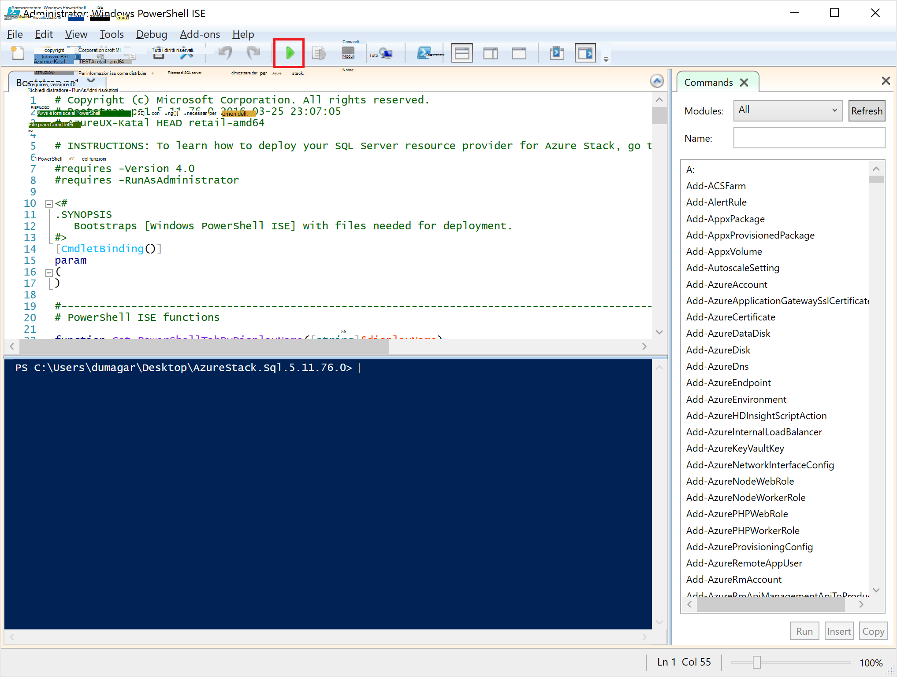

    Verrà caricato due schede principali, ciascuno contenente tutti gli script e i file necessari per distribuire il provider di risorse.

## Preparare i prerequisiti

Fare clic sulla scheda **Preparare i prerequisiti** per:

- Creare certificati necessari
- Caricare gli elementi in un account di archiviazione in pila di Azure
- Pubblicare elementi della raccolta

### Creare i certificati necessari
Questo script di **Nuovo SslCert.ps1** aggiunge il \_. Certificato SSL di AzureStack.local.pfx sull'unità d:\\SQLRP\\prerequisiti\\BlobStorage\\cartella contenitore. Il certificato consente di proteggere le comunicazioni tra il provider di risorse e l'istanza locale di gestione risorse di Azure.

1. Nella scheda principale **Preparare prerequisiti** , fare clic sulla scheda **Nuovo SslCert.ps1** ed eseguirlo.

2. Nel messaggio che viene visualizzata, digitare una password PFX che consente di proteggere la chiave privata e **prendere nota della password**. È necessario in un secondo momento.

### Caricare tutti gli elementi in un account di archiviazione in pila di Azure

1. Fare clic sulla scheda **RP.ps1 di Microsoft.Sql carica** ed eseguirlo.

2. In Windows PowerShell credenziali richiesta la finestra di dialogo, digitare le credenziali di amministratore di servizio Stack di Azure.

3. Quando richiesto per l'ID di Tenant Azure Active Directory, digitare il nome di dominio completo tenant di Azure Active Directory: ad esempio microsoftazurestack.onmicrosoft.com.

    Una finestra popup richiede le credenziali.

    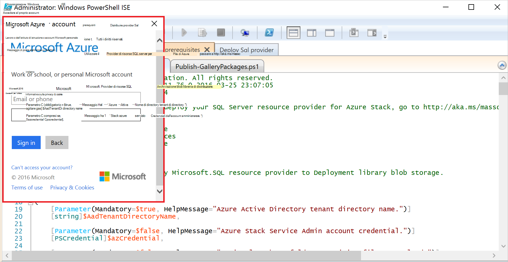

    > [AZURE.TIP] Se non viene visualizzata la finestra popup, che uno non sono stati disattivati IE migliore sicurezza per abilitare JavaScript in questo computer e di un utente o non hanno accettato i cookie in Internet Explorer. Vedere [configurare la procedura prima di distribuire](#set-up-steps-before-you-deploy).

4. Digitare le proprie credenziali di amministratore del servizio Stack Azure e quindi fare clic su **Accedi**.

### Pubblicare elementi della raccolta per la successiva creazione di risorse

Selezionare la scheda **Pubblica GalleryPackages.ps1** ed eseguirlo. Questo script aggiunge due elementi marketplace marketplace del portale Azure Stack prova che è possibile utilizzare per distribuire le risorse di database come elementi marketplace.

## Distribuire il Provider di risorse SQL Server macchine Virtuali

Ora che è stato creato la prova pratica dello Stack di Azure con i certificati necessari e gli elementi di marketplace, è possibile distribuire un Provider di risorse di SQL Server. Fare clic sulla scheda **provider per distribuire SQL** per:

   - Fornire i valori in un file JSON che fa riferimento il processo di distribuzione
   - Distribuire il provider di risorse
   - Aggiornare il sistema DNS locale
   - Registrare la scheda Provider delle risorse SQL Server

### Fornire i valori nel file JSON

Fare clic su **Microsoft.Sqlprovider.Parameters.JSON**. Questo file con i parametri il modello di gestione di risorse Azure deve distribuire correttamente in pila Azure.

1. Compilare i parametri nel file JSON **vuota** :

    - Assicurarsi di specificare la **adminusername** e **adminpassword** per la macchina virtuale Provider risorse SQL:

        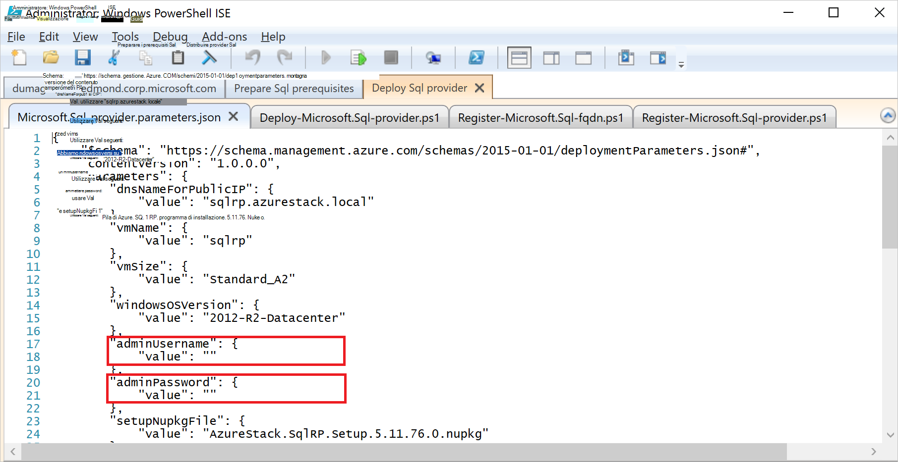

    - Assicurarsi di specificare la password per il parametro **SetupPfxPassword** apportate annotare nel passaggio [Prepara prequisites](#prepare-prerequisites) :

    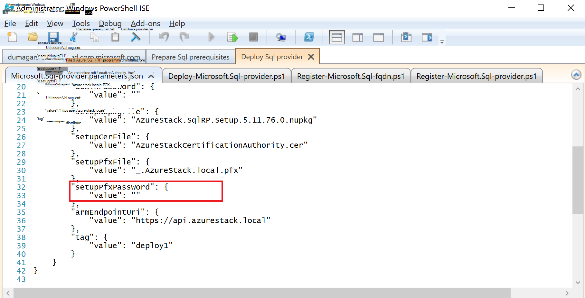

2. Fare clic su **Salva** per salvare il file di parametro.

### Distribuire il provider di risorse

1. Fare clic sulla scheda **distribuzione-Microsoft.sql-provider.PS1** ed eseguire lo script.
2. Digitare il nome del tenant di Azure Active Directory quando richiesto.
3. Nella finestra popup, inviare le credenziali di amministratore di servizio Stack di Azure.

La distribuzione completa può richiedere tra 25 e 55 minuti su alcune altamente utilizzata POCs Stack Azure. La procedura più lunga sarà l'estensione bene accolta stato configurazione (DSC) e l'esecuzione di PowerShell, ovvero il passaggio finale. Ogni corso 10-25.

### Aggiornare il sistema DNS locale

1. Fare clic sulla scheda **fqdn.ps1 di Microsoft.SQL registro** ed eseguire lo script.
2. Quando viene richiesto di Azure Active Directory Tenant ID, immettere il nome di dominio completo tenant di Azure Active Directory: ad esempio **microsoftazurestack.onmicrosoft.com**.

### Registrare il Provider di risorse RP SQL##

1. Fare clic sulla scheda **provider.ps1 di Microsoft.SQL registro** ed eseguire lo script.

2. Quando richiesto per le credenziali, usare i valori seguenti per nome utente e password:

   - **sqlRpUsername**
   - **sqlRpPassw0rd**

   > [AZURE.IMPORTANT] Questi sono i valori *letterali* che è necessario digitare alla richiesta di credenziali. Non sono i segnaposto. * *Eseguire *non* tipo * * nomeutente\password è stato salvato nel file di parametri prima di distribuire la macchina virtuale.

## Verificare la distribuzione tramite il portale di Stack di Azure

1. Disconnettersi dalla ClientVM e accedere nuovamente come **AzureStack\AzureStackUser**.

2. Sul desktop, fare clic su **Azure Stack prova portale** e accedere al portale come amministratore del servizio.

3. Verificare che la distribuzione completata. Fare clic su **Sfoglia** &gt; **Gruppi di risorse** &gt; fare clic sul gruppo di risorse è stato utilizzato (impostazione predefinita è **SQLRP**) e quindi assicurarsi che la parte nozioni di base della stessa e (metà superiore) legge **distribuzione completata**.

      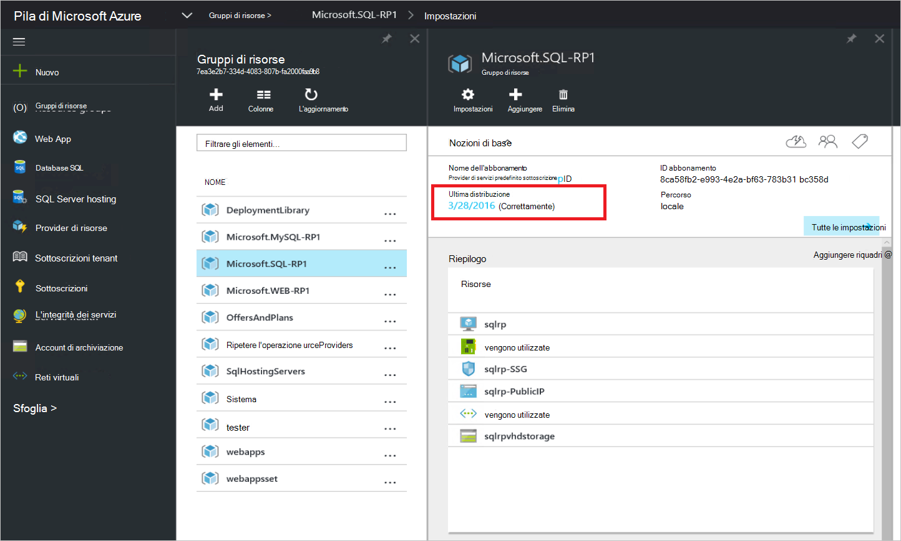

4. Verificare che la registrazione è stata eseguita correttamente. Fare clic su **Sfoglia** &gt; **provider di risorse**e quindi cercare **SQL locale**:

      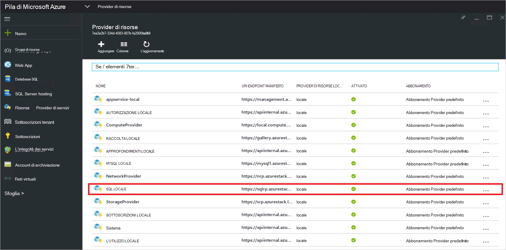

## Fornire capacità al proprio Provider di risorse SQL mediante la connessione a un server SQL host

1. Accedere al portale di Azure Stack prova come un amministratore del servizio

2. Fare clic su **provider di risorse** &gt; **locale SQL** &gt; **passare alla gestione dei Provider di risorse** &gt; **server** &gt; **aggiungere**.

    E il **Server che ospita SQL** consiste nel punto in cui è possibile connettersi il Provider di risorse di SQL Server effettive istanze di SQL Server da utilizzare come back-end del provider di risorse.

    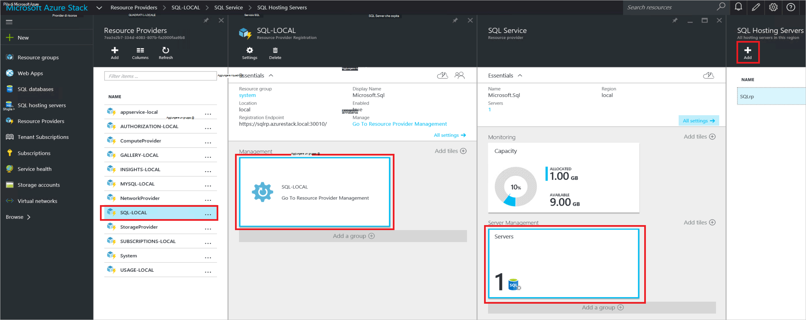

3. Compilare il modulo con i dettagli della connessione dell'istanza di SQL Server. Per impostazione predefinita, un Server SQL preconfigurato denominato "SQLRP" con il nome utente amministratore "sa" e la password che è evidenziato nel parametro "adminpassword" nei parametri che JSON è in esecuzione nella macchina virtuale.

## Creare il primo Database di SQL per testare la distribuzione

1. Accedere al portale di Azure Stack prova come amministratore del servizio.

2. Fare clic su **Sfoglia** &gt; **database SQL** &gt; **aggiungere**
  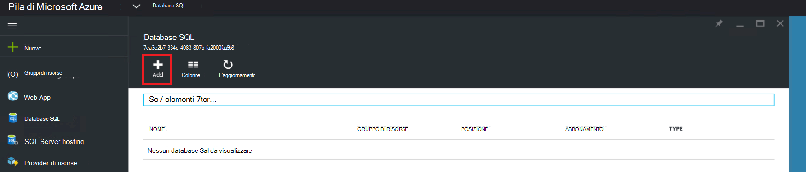

3. Compilare il modulo con i dettagli del database, incluso un **Nome del Server**, un **Account di accesso amministratore Server**e una **Password** per un nuovo *server virtuale* e il **Nuovo Server** .

    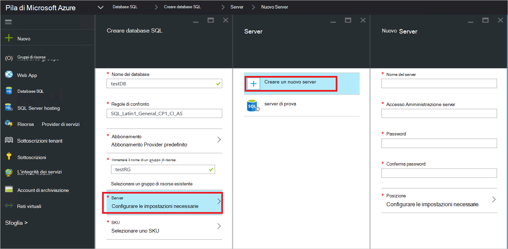

    Il server virtuale è un costrutto artificiale. Non eseguire il mapping a SQL Server, ma invece manifesti tramite il nome utente all'interno della stringa di connessione, il provider di risorse generato alla fine di questo processo. **Nota la password input separatamente per il server virtuale**. Il portale non mostrerà mai la password.

4. Viene richiesto di selezionare un livello prezzo per il database.

    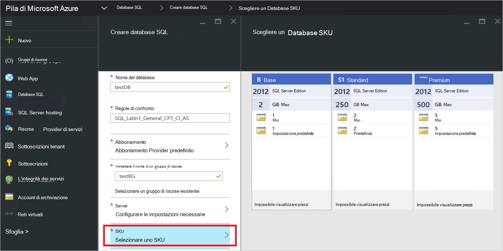

    Livelli non è implementati in questa versione, ma il consumo registrato da Gestione risorse di Azure un modo per presentare distinzione che è possibile creare in imposizione di quota e così via.

5. Inviare il modulo e attendere che la distribuzione completare.

6. Nella finestra e risultante, controllare il campo "Stringa di connessione". È possibile utilizzare la stringa in qualsiasi applicazione che richiede l'accesso di SQL Server (ad esempio un'app web) in pila Azure.

    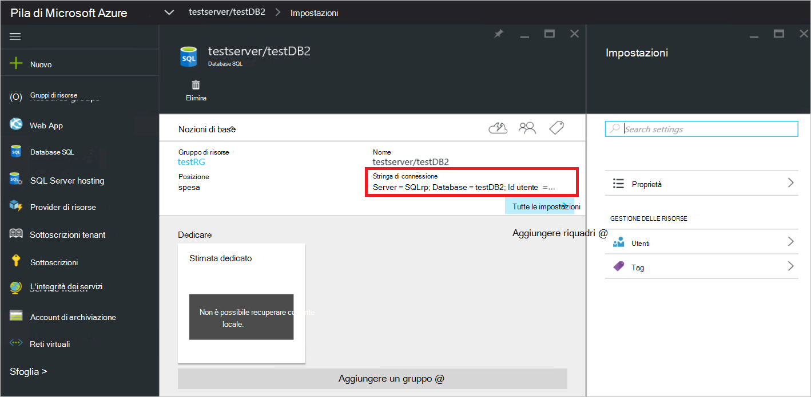

## Passaggi successivi

Provare ad altri [servizi PaaS](azure-stack-tools-paas-services.md) come [provider di risorse MySQL Server](azure-stack-mysql-rp-deploy-short.md) e il [provider di risorse Web Apps](azure-stack-webapps-deploy.md).
