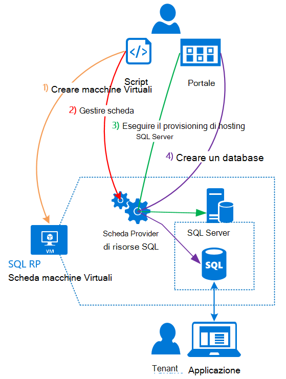

<properties
    pageTitle="Utilizzo di database SQL Azure elenco | Microsoft Azure"
    description="Informazioni su come distribuire database SQL come servizio su Azure Stack e le azioni rapide per distribuire la scheda provider delle risorse di SQL Server."
    services="azure-stack"
    documentationCenter=""
    authors="Dumagar"
    manager="byronr"
    editor=""/>

<tags
    ms.service="multiple"
    ms.workload="na"
    ms.tgt_pltfrm="na"
    ms.devlang="na"
    ms.topic="article"
    ms.date="09/26/2016"
    ms.author="dumagar"/>

# Connetti a database SQL Azure elenco

> [AZURE.NOTE] Le informazioni seguenti si applicano solo alle distribuzioni TP1 Stack Azure.

Utilizzare la scheda provider delle risorse di SQL Server per esporre i database SQL come servizio dello Stack di Azure. Dopo aver installato il provider di risorse, tutti gli utenti possono creare database per App cloud nativo, sito Web in cui sono basati su SQL e carichi di lavoro basati su SQL senza dovere effettuare il provisioning di una macchine () che ospita SQL Server ogni volta.

Poiché il provider di risorse non dispone di tutte le funzionalità di Database SQL Azure durante la prova di prova, in questo articolo inizia con una panoramica dell'architettura di provider di risorse. Si otterrà una rapida panoramica delle procedure per impostare il provider di risorse, con collegamenti a informazioni più dettagliati passaggi in [Distribuisci la scheda provider risorsa Database SQL Azure Stack prova](azure-stack-sql-rp-deploy-long.md).

## Architettura scheda provider delle risorse di SQL Server
Il provider di risorse non offre funzionalità di gestione di Database SQL Azure di tutti i database. Ad esempio la possibilità di comporre alto e verso il basso le prestazioni del database in modo semplice e flessibile database pool non sono disponibili. Tuttavia, il provider di risorse supporta la stessa crea, lettura, aggiornamento e le operazioni di eliminazione (CRUD) disponibili nel Database di SQL Azure.

Il provider di risorse è costituito da tre componenti:

- **Scheda provider di risorse SQL macchine Virtuali**, che include il processo di provider di risorse e i server che ospitano SQL Server.
- **Il provider di risorse**, che elabora richieste di provisioning ed espone risorse del database.
- **Server che ospitano SQL Server**, che forniscono capacità per i database.

Il diagramma concettuale seguente illustra questi componenti e i passaggi da eseguire quando si distribuisce il provider di risorse, imposta un server che ospita SQL Server e quindi creare un database.

## Azioni rapide per distribuire il provider di risorse
Utilizzare questa procedura se si ha già familiarità con Stack di Azure. Se si desiderano ulteriori dettagli, seguire i collegamenti in ogni sezione o passare direttamente alle [Distribuisci la scheda provider risorsa Database SQL Azure Stack prova](azure-stack-sql-rp-deploy-long.md).

1.  Assicurarsi di che aver completato tutte [configurare passaggi prima di distribuire](azure-stack-sql-rp-deploy-long.md#set-up-steps-before-you-deploy) il provider di risorse:

  - .NET framework 3.5 è già impostato in immagine di Windows Server base. (Se è stato scaricato bit dello Stack di Azure dopo il 23 febbraio 2016, è possibile ignorare questo passaggio.)
  - [È installata una versione di Azure PowerShell compatibile con Stack di Azure](http://aka.ms/azStackPsh).
  - Impostazioni di sicurezza di Internet Explorer in ClientVM, [Internet Explorer sicurezza avanzata è disattivata e i cookie sono abilitati](azure-stack-sql-rp-deploy-long.md#Turn-off-IE-enhanced-security-and-enable-cookies).

2. [Scaricare il file binari di SQL Server RP](http://aka.ms/massqlrprfrsh) ed estrarre a ClientVM in prova la pila Azure.

3. [Eseguire script e bootstrap.cmd](azure-stack-sql-rp-deploy-long.md#Bootstrap-the-resource-provider-deployment-PowerShell-and-Prepare-for-deployment).

    Una serie di script è raggruppata per due schede principali aperte nell'ambiente di Scripting integrato PowerShell (ISE). Eseguire tutti gli script caricati in sequenza da sinistra a destra in ogni scheda.

    1. Esegui script nella scheda della **Preparazione** da sinistra a destra per:

        - Creare un certificato con caratteri jolly per proteggere le comunicazioni tra il provider di risorse e gestione di risorse di Azure.
        - Caricare i certificati e tutti gli altri elementi in un account di archiviazione per Stack di Azure.
        - Pubblicare pacchetti raccolta in modo che è possibile distribuire SQL e risorse attraverso la raccolta.

        > [AZURE.IMPORTANT] Se uno degli script si blocca senza alcun motivo evidente dopo l'invio del tenant di Azure Active Directory, le impostazioni di protezione potrebbero essere bloccato una DLL necessaria per la distribuzione per l'esecuzione. Per risolvere il problema, cercare Microsoft.AzureStack.Deployment.Telemetry.Dll nella cartella del provider di risorse, pulsante destro del mouse, fare clic su **proprietà**e quindi selezionare **Sblocca** nella scheda **Generale** .

    1. Esegui script nella scheda **Distribuisci** da sinistra a destra per:

        - [Distribuire una macchina virtuale](azure-stack-sql-rp-deploy-long.md#Deploy-the-SQL-Server-Resource-Provider-VM) che ospita la provider di risorse e di SQL Server. Questo script fa riferimento a un file di parametri JSON, è necessario aggiornare con alcuni valori prima di eseguire lo script.
        - [Registrare un record DNS locale](azure-stack-sql-rp-deploy-long.md#Update-the-local-DNS) che esegue il mapping al provider macchine Virtuali di risorsa.
        - [Registrare il provider di risorse](azure-stack-sql-rp-deploy-long.md#Register-the-SQL-RP-Resource-Provider) con locale Manager delle risorse Azure.

        > [AZURE.IMPORTANT] Tutti gli script presuppongono che l'immagine di base del sistema operativo soddisfi i prerequisiti (.NET 3.5 installato, JavaScript e cookie attivati la ClientVM e una versione compatibile di Azure PowerShell installato). Se si riceve errori durante l'esecuzione di script, verificare di soddisfare i prerequisiti.

6. [Connettere il provider di risorse in un server che ospita SQL Server](#Provide-capacity-to-your-SQL-Resource-Provider-by-connecting-it-to-a-hosting-SQL-server) nel portale di Azure Stack. Fare clic su **Sfoglia** &gt; **provider di risorse** &gt; **SQLRP** &gt; **passare alla gestione dei Provider di risorse** &gt; **server** &gt; **aggiungere**.

    Utilizzare "sa" nome utente e la password utilizzati per la distribuzione di macchine Virtuali di provider di risorse.

7. Per [verificare il nuovo provider di risorse di SQL Server](/azure-stack-sql-rp-deploy-long.md#create-your-first-sql-database-to-test-your-deployment), distribuire un database SQL nel portale di Azure Stack. Fare clic su **Crea** &gt; **personalizzata** &gt; **Database di SQL Server**.

È visualizzato il provider di risorse SQL Server e l'esecuzione di circa 45 minuti (a seconda dell'hardware).
