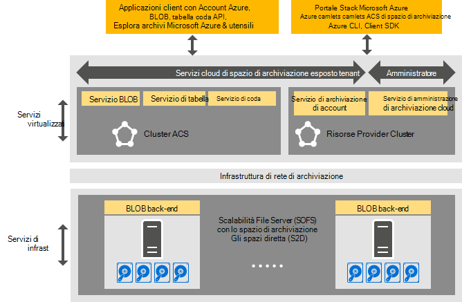

<properties
    pageTitle="Introduzione all'archiviazione coerente Azure | Microsoft Azure"
    description="Informazioni sull'archiviazione coerente Azure"
    services="azure-stack"
    documentationCenter=""
    authors="AniAnirudh"
    manager="darmour"
    editor=""/>

<tags
    ms.service="azure-stack"
    ms.workload="na"
    ms.tgt_pltfrm="na"
    ms.devlang="na"
    ms.topic="get-started-article"
    ms.date="09/26/2016"
    ms.author="anirudha"/>

# Introduzione all'archiviazione coerente Azure
Spazio di archiviazione Azure coerente è l'insieme di servizi cloud di spazio di archiviazione in Microsoft Azure pila. Spazio di archiviazione Azure coerente fornisce blob, tabella, coda e funzionalità di gestione di account con semantica di Azure coerente. Inoltre, sono disponibili funzionalità per gestire un amministratore cloud services lo spazio di archiviazione. In questo articolo viene presentato lo spazio di archiviazione Azure coerenti e illustrato come servizi cloud di spazio di archiviazione in pila Azure integrano al meglio le potenti [funzionalità di archiviazione definiti software in Windows Server 2016](https://blogs.technet.microsoft.com/windowsserver/2016/04/14/ten-reasons-youll-love-windows-server-2016-5-software-defined-storage/).

Spazio di archiviazione Azure coerente offre categorie generali di funzionalità seguenti:

- **BLOB**: pagina BLOB, bloccare BLOB e accoda BLOB con   [blob Azure coerente](https://msdn.microsoft.com/library/azure/dd179355.aspx#Anchor_1) 
   comportamento

- **Tabelle**: entità, partizioni e altre proprietà tabella con   [Azure coerente tabella](https://msdn.microsoft.com/library/azure/dd179355.aspx#Anchor_3) 
   comportamento

- **Code**: code con   [coda Azure coerenti](https://msdn.microsoft.com/library/azure/dd179355.aspx#Anchor_2) e messaggi affidabili e permanenti
   comportamento

- **Account**: gestione delle risorse account lo spazio di archiviazione con   [account Azure coerente](https://azure.microsoft.com/documentation/articles/storage-create-storage-account/) 
   comportamento per gli account di archiviazione generico viene completato il provisioning tramite il [modello di distribuzione di gestione risorse di Azure](https://azure.microsoft.com/documentation/articles/resource-manager-deployment-model/)

- **Amministrazione**: gestione dei servizi di interno dello spazio di archiviazione archiviazione esposto tenant e Azure coerente (illustrata in altri articoli)

## Architettura di archiviazione Azure coerente

Figura 1. Spazio di archiviazione Azure coerente: visualizzazione soluzione

## Spazio di archiviazione Azure coerente virtualizzato cluster e servizi

Architettura di spazio di archiviazione Azure coerenti, tutti i tenant o i servizi di archiviazione accessibile all'amministratore sono virtualizzati. Vale a dire vengono eseguite nel servizio disponibilità, gestite provider che macchine virtuali in base alle funzionalità di [Hyper-V](https://technet.microsoft.com/library/dn765471.aspx) in [Windows Server 2016](http://www.microsoft.com/server-cloud/products/windows-server-2016/).
Anche se le macchine virtuali sono disponibile in base a tecnologia [Failover cluster di Windows](https://technet.microsoft.com/library/dn765474.aspx) , i servizi di archiviazione virtualizzato Azure coerente stessi sono raggruppate guest ad alta disponibili servizi basati su [tecnologia Azure servizio tessuti](http://azure.microsoft.com/campaigns/service-fabric/).

Spazio di archiviazione Azure coerente impiega due tessuti servizio cluster in una distribuzione di Azure Stack.
Il servizio di archiviazione delle risorse Provider viene distribuito in un cluster di servizio tessuti ("cluster RP") anche condivisi da altri servizi di provider di base delle risorse. Il resto dello spazio di archiviazione virtualizzato servizi percorso dati, tra cui Blob, tabella e coda servizi - sono ospitati in un cluster di servizio tessuti secondo ("Azure coerente cluster di memoria").

## Servizio BLOB e lo spazio di archiviazione definiti software

Blob terminare il servizio, invece, viene eseguito direttamente nei nodi del cluster [Scalabilità File Server](https://technet.microsoft.com/library/hh831349.aspx) . Architettura di soluzione dello Stack di Azure, scalabilità File Server basato su [Diretto di spazi di archiviazione](https://technet.microsoft.com/library/mt126109.aspx)-cluster di failover di base, condivisione. La figura 1 illustra i principali servizi di componente lo spazio di archiviazione Azure coerenti e il modello di installazione distribuita. Come illustrato nella figura, lo spazio di archiviazione Azure coerente dovetails con le funzionalità di archiviazione definiti software esistenti in Windows Server 2016. Non è necessario per l'archiviazione coerente Azure oltre questi requisiti della piattaforma Windows Server hardware speciale.

## Spazio di archiviazione Farm

Spazio di archiviazione Farm è l'insieme di infrastruttura di archiviazione, risorse e servizi back-end che forniscono insieme esposto tenant e amministratore esposto servizi lo spazio di archiviazione Azure coerente in una distribuzione di Azure Stack. In particolare, lo spazio di archiviazione Farm include le operazioni seguenti:

- Hardware di archiviazione (ad esempio nodi scalabilità File Server, dischi)

- Risorse dell'infrastruttura di archiviazione (ad esempio, condivisioni piccole e medie imprese)

- Servizi di infrastruttura di servizio correlati a spazio di archiviazione (ad esempio Blob endpoint servizio disattivare cluster di memoria coerente Azure)

- Servizi correlati a spazio di archiviazione che eseguono nei nodi scalabilità File Server (ad esempio, il servizio Blob)

## Scenari di utilizzo di spazio di archiviazione IaaS e PaaS

BLOB di pagine di spazio di archiviazione Azure coerenti, come illustrato di Azure, fornire dischi virtuali in tutta l'infrastruttura come un uso dei servizi (IaaS) scenari:

- Creare una macchina virtuale utilizzando il disco del sistema operativo personalizzata in un blob di pagine

- Creare una macchina virtuale utilizzando l'immagine del sistema operativo personalizzata in un blob di pagine

- Creare una macchina virtuale utilizzando un'immagine di Azure Marketplace in un nuovo blob di pagine

- Creare una macchina virtuale utilizzando un disco vuoto in un nuovo blob di pagine

Allo stesso modo, per piattaforma come un scenari servizio PaaS (), Azure coerente BLOB di blocco dello spazio di archiviazione, aggiungere BLOB, code, e le tabelle funzionano come in Azure.

## Ruoli degli utenti

Archiviazione Azure coerente è utile per due ruoli utente:

- Proprietari di applicazione, inclusi gli sviluppatori e IT aziendali. Non abbia più di mantenere o distribuire due versioni di un'applicazione e script per eseguire la stessa operazione su una cloud pubblica e di cloud/privato ospitato in un Data Center. Spazio di archiviazione Azure coerente offre servizi di spazio di archiviazione tramite API REST, SDK, cmdlet e portale dello Stack di Azure.

- Provider di servizi, inclusi enterprise IT, che distribuiscono e gestione dei servizi cloud lo spazio di archiviazione basato su Microsoft Azure Stack, multi-tenant.

## Passaggi successivi

- [Lo spazio di archiviazione azure coerente: differenze e considerazioni] (azure-stack-acs-differenze-tp2.md)
