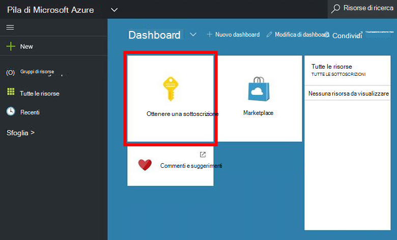
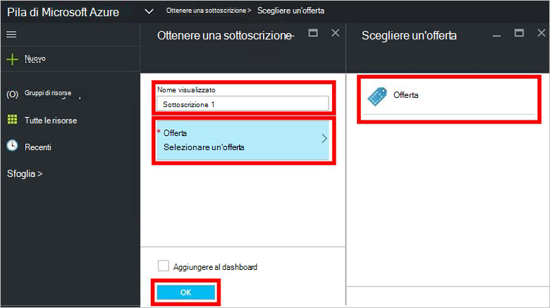
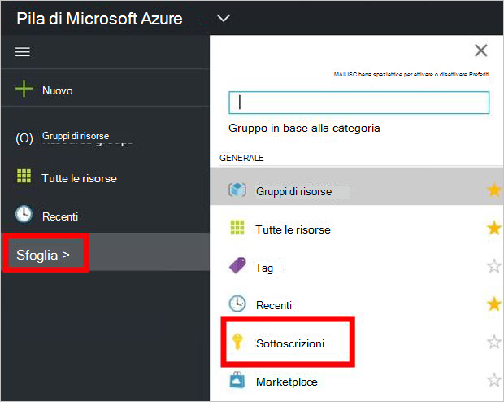

<properties
    pageTitle="Sottoscrivere un'offerta e quindi effettuare il provisioning di una macchina virtuale in pila Azure (tenant) | Microsoft Azure"
    description="Come un tenant, come sottoscrivere un'offerta e quindi effettuare il provisioning di una macchina virtuale in pila Azure."
    services="azure-stack"
    documentationCenter=""
    authors="ErikjeMS"
    manager="byronr"
    editor=""/>

<tags
    ms.service="azure-stack"
    ms.workload="na"
    ms.tgt_pltfrm="na"
    ms.devlang="na"
    ms.topic="get-started-article"
    ms.date="09/26/2016"
    ms.author="erikje"/>

# Sottoscrivere un'offerta

Ora che è stata [creata un'offerta](azure-stack-create-offer.md), verificare che il tenant può creare una sottoscrizione.

1.  Nel computer di prova dello Stack di Azure, accedere a `https://portal.azurestack.local` come [un tenant](azure-stack-connect-azure-stack.md#log-in-as-a-tenant) e fare clic su **Ottieni un abbonamento**.

    

2.  Nel campo **Nome visualizzato** digitare un nome per l'abbonamento, fare clic su **offrono**, fare clic su una delle offerte in e lo **Scegli un'offerta** e quindi fare clic su **Crea**.

    

4.  Per visualizzare l'abbonamento che è stato creato, fare clic su **Sfoglia**, fare clic su **abbonamenti**, quindi fare clic su nuova sottoscrizione.  

    

Dopo la sottoscrizione a un'offerta, aggiornare il portale per vedere quali servizi sono parte della nuova sottoscrizione.

## Passaggi successivi

[Effettuare il provisioning di una macchina virtuale](azure-stack-provision-vm.md)
