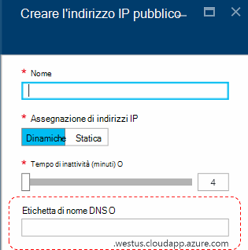
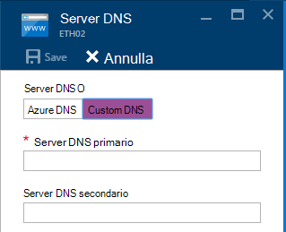
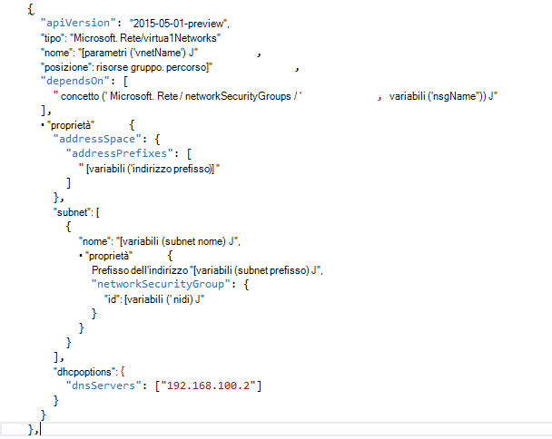

<properties
    pageTitle="Informazioni sui record DNS in pila Azure TP2 | Microsoft Azure"
    description="Informazioni sulle nuove caratteristiche DNS e le funzionalità di Azure Stack TP2"
    services="azure-stack"
    documentationCenter=""
    authors="ScottNapolitan"
    manager="darmour"
    editor=""/>

<tags
    ms.service="azure-stack"
    ms.workload="na"
    ms.tgt_pltfrm="na"
    ms.devlang="na"
    ms.topic="get-started-article"
    ms.date="09/26/2016"
    ms.author="scottnap"/>

# Introduzione a IDN per Stack di Azure
================================

IDN è una funzionalità nuova tecnologia anteprima 2 per Stack di Azure che consente di risolvere i nomi DNS esterni (ad esempio http://www.bing.com).
Consente inoltre la registrazione dei nomi di rete virtuale interna. In questo modo, è possibile risolvere macchine virtuali nella stessa rete virtuale nome anziché indirizzo IP, senza che sia necessario fornire le voci di server DNS personalizzate.

È che è sempre stata sono Azure, ma a questo punto è disponibile in Windows Server 2016 e Stack di Azure, troppo.

Cosa serve IDN?
------------------

Con IDN in pila di Azure, viene visualizzato le seguenti funzionalità, senza dovere specificare voci personalizzate di server DNS.

-   Condiviso servizi di risoluzione DNS per carichi di lavoro tenant.

-   Servizio DNS autorevole per la risoluzione dei nomi e la registrazione DNS all'interno della rete virtuale tenant.

-   Servizio Recursive DNS per la risoluzione dei nomi Internet da tenant macchine virtuali. Tenant non è più necessario specificare le voci DNS personalizzate per la risoluzione dei nomi Internet (ad esempio www.bing.com).

Si possono comunque visualizzare il proprio DNS e se si desidera utilizzare i server DNS personalizzati. Ma a questo punto, se desidera semplicemente essere in grado di risolvere DNS Internet i nomi e in grado di connettersi alle altre macchine virtuali nella stessa rete virtuale, non è necessario specificare nulla e funziona solo.

Cosa serve IDN non?
---------------------

Quali IDN consentono di eseguire la creazione di un record DNS per un nome che può essere risolto dall'esterno della rete virtuale.

In Azure, è possibile specificare un'etichetta di nome DNS che può essere associata a un indirizzo IP pubblico. È possibile scegliere l'etichetta (prefisso), ma Azure sceglie il suffisso, si basa sull'area in cui viene creato l'indirizzo IP pubblico.

Nell'immagine precedente Azure creerà un "Un" record DNS per l'etichetta di nome DNS specificato sotto l' area **westus.cloudapp.azure.com**. Il prefisso e un suffisso insieme comporre un dominio nome (completo) che possono essere risolte da un punto qualsiasi nella rete Internet pubblica.

In TP2, Stack di Azure supporta solo IDN per la registrazione di nome interno, in modo che non è possibile eseguire le operazioni seguenti.

-   Creare un record DNS in una zona DNS ospitato esistente (ad esempio azurestack.local).

-   Creare una zona DNS (ad esempio Contoso.com).

-   Creare un record in zona DNS personalizzato.

-   Supporta l'acquisto di nomi di dominio.

Modifiche in DNS da TP1 Stack Azure
-----------------------------------

Nella versione Technology Preview 1 (TP1) dello Stack di Azure, era necessario fornire i server DNS personalizzati se si desidera essere in grado di risolvere host in base al nome anziché in base all'indirizzo IP. Ciò significa che se si crea una rete virtuale oppure una macchina virtuale, era necessario fornire almeno una voce del server DNS. Per l'ambiente di prova TP1, in questo modo immettere l'indirizzo IP del server DNS dell'infrastruttura di prova, vale a dire 192.168.200.2.

Se è stata creata una macchina virtuale tramite il portale, era necessario selezionare **Custom DNS** nella rete virtuale o le impostazioni della scheda ethernet.

In TP2, è possibile selezionare DNS Azure e non è necessario specificare le voci di server DNS personalizzate.

Se una macchina virtuale tramite un modello è stato creato con la propria immagine aggiungere la proprietà **DHCPOptions** e risoluzione per l'uso di nomi server DNS per ottenere il DNS. Nella figura seguente mostra cosa questo simile.

In TP2, non è più necessario apportare queste modifiche per i modelli di macchine Virtuali per consentire il macchine virtuali risolvere i nomi di Internet. Dovrebbero appena funzionare correttamente.