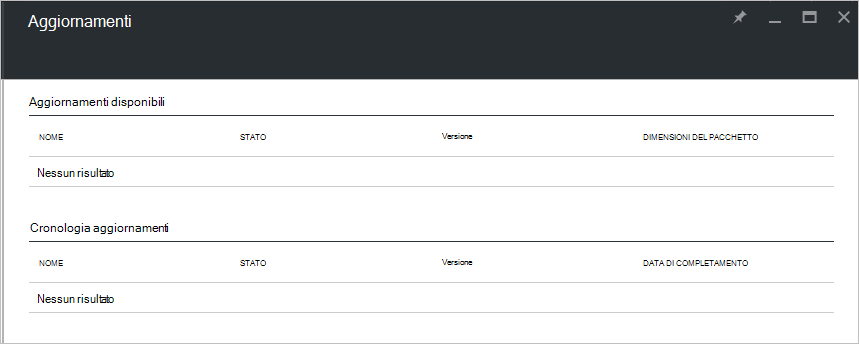

<properties
    pageTitle="Gli aggiornamenti in pila Azure | Microsoft Azure"
    description="Informazioni sugli aggiornamenti in pila di Azure"
    services="azure-stack"
    documentationCenter=""
    authors="HeathL17"
    manager="byronr"
    editor=""/>

<tags
    ms.service="azure-stack"
    ms.workload="na"
    ms.tgt_pltfrm="na"
    ms.devlang="na"
    ms.topic="article"
    ms.date="09/26/2016"
    ms.author="Helaw"/>

# Gestione degli aggiornamenti in pila di Azure
Technical Preview 2 introduce un'anteprima dell'esperienza utente per la gestione degli aggiornamenti dello Stack di Azure.  In questo argomento, si passerà al livello di nodo aggiornamenti.  

## Blade aggiornamenti
1.  Accesso e l'aggiornamenti, fare clic su **Sfoglia** e quindi fare clic su **aggiornamenti**.

2.  Fare clic sul percorso **locale** .

3.  Verrà visualizzata una schermata voce gli aggiornamenti disponibili e cronologia aggiornamenti.  Technical Preview 2, gli aggiornamenti non saranno disponibili per l'installazione.  

    

## Passaggi successivi
- [Comprendere l'architettura di prova Stack Azure](azure-stack-architecture.md)      
- [Comprendere i prerequisiti per la distribuzione](azure-stack-deploy.md)
- [Distribuire Stack Azure](azure-stack-run-powershell-script.md)
 
    
  

  

