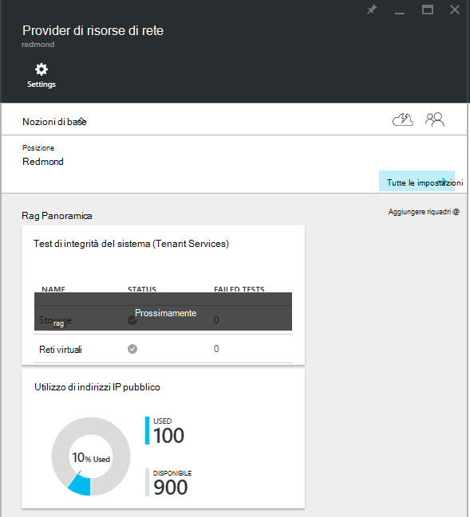
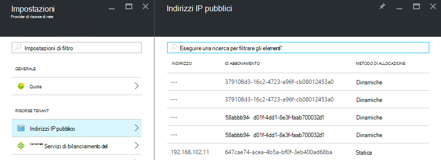

<properties
    pageTitle="Visualizzazione consumo indirizzo IP pubblico in TP2 | Microsoft Azure"
    description="Gli amministratori possono visualizzare il consumo di indirizzi IP in un'area"
    services="azure-stack"
    documentationCenter=""
    authors="ScottNapolitan"
    manager="darmour"
    editor=""/>

<tags
    ms.service="azure-stack"
    ms.workload="na"
    ms.tgt_pltfrm="na"
    ms.devlang="na"
    ms.topic="get-started-article"
    ms.date="09/26/2016"
    ms.author="scottnap"/>

# Visualizzare il consumo di indirizzo IP pubblico in Azure Stack TP2

Come un amministratore del servizio, è possibile visualizzare il numero di indirizzi IP che sono state assegnate ai tenant, il numero di indirizzi IP sono ancora disponibili per l'assegnazione e la percentuale di indirizzi IP pubblici che sono state assegnate in quella posizione.

Il riquadro di **Utilizzo di indirizzo IP pubblico** Mostra il numero totale di indirizzi IP che sono stati utilizzati in tutti i pool di indirizzi IP pubblici sulla rete, se sono stati utilizzati per tenant istanze IaaS VM, servizi di infrastruttura tessuti o le risorse indirizzo IP pubbliche create in modo esplicito i tenant.

Lo scopo di questa sezione è per gli amministratori di Azure Stack un'idea del numero complessivo di indirizzi IP utilizzati in questa posizione. Consente agli amministratori di determinare se eseguono basse a questa risorsa.

E **l'Impostazioni** la voce di menu **Indirizzi IP** in **risorse Tenant** sono elencati solo gli indirizzi IP pubblici che sono stati *creati in modo esplicito per tenant*. Di conseguenza, il numero di **utilizzato** il riquadro di indirizzi IP pubblici sull' **Utilizzo di indirizzo IP pubblico** è sempre diverso da (maggiore di) il numero nel riquadro **Indirizzi IP** in **risorse Tenant**.

## Visualizzare le informazioni sull'utilizzo di indirizzo IP pubbliche

Per visualizzare il numero totale di indirizzi IP utilizzati nell'area:

1.  Nel portale dello Stack di Azure, fare clic su **Sfoglia**e quindi selezionare **Provider di risorse**.

2.  Nell'elenco di **Provider di risorse**, selezionare **Amministratore di rete delle risorse Provider**.

3.  In alternativa, è possibile fare clic su Sfoglia **| Posizioni** e selezionare il percorso in cui si desidera visualizzare nell'elenco. Selezionare **Amministratore di rete delle risorse Provider**sul riquadro **Provider di risorse** .

4.  E di destinazione il **Provider di risorse di rete** consente di visualizzare il riquadro di **Utilizzo di indirizzo IP pubblico** nella sezione **Overview** .

Tenere presente che il numero **utilizzato** rappresenta il numero dell'indirizzo IP pubblico indirizzi da indirizzo IP pubblico tutti indirizzo pool in quella posizione assegnati. Il numero di **disponibile** rappresenta il numero dell'indirizzo IP pubblico indirizzi da indirizzo IP pubblico tutti indirizzo pool che non sono state assegnate e sono ancora disponibili. Il numero di **% utilizzate** rappresenta il numero di indirizzi usati o assegnati come percentuale del totale dell'indirizzo IP pubblico indirizzi IP tutti pubblico indirizzo pool in quella posizione.

## Visualizzare gli indirizzi IP pubblici che sono stati creati dagli abbonamenti tenant

Per visualizzare un elenco di indirizzi IP pubblici create in modo esplicito abbonamenti tenant in un'area specifica, passare a e **l'Impostazioni** dell' **Amministratore di rete delle risorse Provider**e quindi selezionare **Gli indirizzi IP pubblici**.

È possibile che alcuni indirizzi IP che sono stati assegnati dinamicamente visualizzati nell'elenco ma non dispone di un indirizzo associato ancora. In questo modo la risorsa indirizzo è ancora stata creata nel Provider di risorse di rete, ma non nel Controller di rete.

Controller di rete non assegna un indirizzo a questa risorsa fino a quando non è effettivamente associato a un'interfaccia, una scheda di rete (NIC), un servizio di bilanciamento del carico o un gateway di rete virtuale. Quando l'indirizzo IP pubblico è associato a un'interfaccia, Controller di rete assegna un indirizzo IP e viene visualizzato nel campo **indirizzo** .

## Visualizzare il pubblico informazioni riepilogo tabella di indirizzi IP

Sono disponibili molti diversi casi in cui vengono assegnati indirizzi IP pubblici che determinano se l'indirizzo viene visualizzato in un unico elenco o in un altro.

| **Maiuscole/minuscole assegnazione di indirizzo IP pubblico** | **Viene visualizzata nel riepilogo utilizzo** | **Viene visualizzata nell'elenco di indirizzi IP pubblico tenant** |
| ------------------------------------- | ----------------------------| ---------------------------------------------- |
| Dinamico indirizzo IP pubblico non ancora assegnata a un pulsante o per caricarli bilanciamento del carico (temporaneo) | No | Sì |
| Dinamico indirizzo IP pubblico assegnato a un servizio di bilanciamento del NIC o carica. | Sì | Sì |
| Pubblica indirizzo IP statico assegnata a un bilanciamento del carico o NIC tenant. | Sì | Sì |
| Statica indirizzo IP pubblico assegnato a un endpoint di servizi di infrastruttura tessuti. | Sì | No |
| Indirizzo IP pubblico in modo implicito creato per le istanze di IaaS VM e utilizzato per NAT in uscita in rete virtuale. Vengono creati automaticamente ogni volta che un tenant crea un'istanza di macchine Virtuali in modo da macchine virtuali possono inviare informazioni a Internet. | Sì | No |
