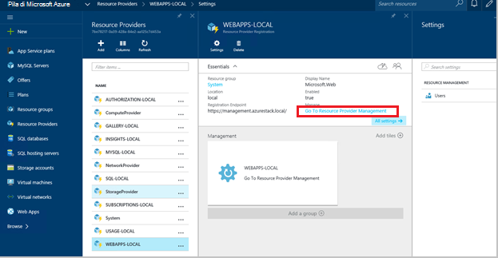
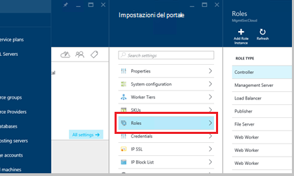
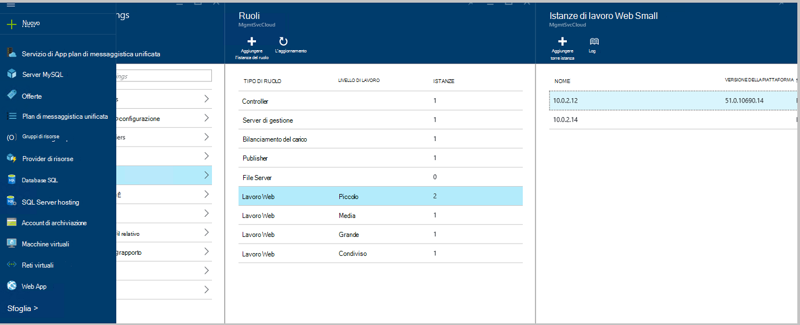
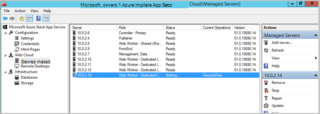
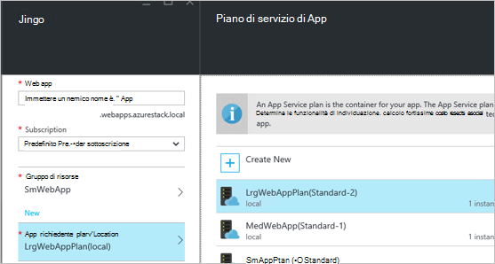
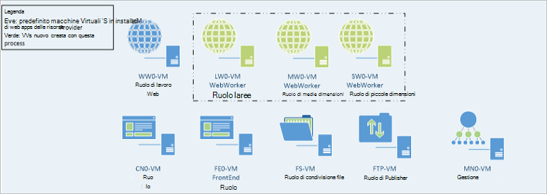

<properties
    pageTitle="Aggiunta di informazioni Web Apps Web ruoli di lavoro | Microsoft Azure"
    description="Istruzioni dettagliate per la scala di Azure Stack Web App"
    services="azure-stack"
    documentationCenter=""
    authors="kathm"
    manager="slinehan"
    editor=""/>

<tags
    ms.service="azure-stack"
    ms.workload="app-service"
    ms.tgt_pltfrm="na"
    ms.devlang="na"
    ms.topic="article"
    ms.date="09/26/2016"
    ms.author="kathm"/>

#   <a name="web-apps-adding-more-web-worker-roles"></a>Web App: Aggiunta di più ruoli di lavoro web

> [AZURE.NOTE] Le informazioni seguenti si applicano solo alle distribuzioni TP1 Stack Azure.

In questo documento vengono fornite istruzioni su come ridurre i ruoli di lavoro web Web Apps. Contiene i passaggi per la creazione di ruoli di lavoro aggiuntivi relativi al web per supportare offerte App web di qualsiasi dimensione.

Pila di Azure supporta distribuzione app web gratuito e condiviso. Per aggiungere altri tipi, è necessario aggiungere più ruoli di lavoro web.

Se non si è certi che cos'è stata distribuita con l'installazione di applicazioni Web predefinita, è possibile esaminare ulteriori informazioni [qui](azure-stack-webapps-overview.md).

I passaggi seguenti sono necessari per i ruoli di lavoro web scala:

1.  [Creare una nuova macchina virtuale](#step-1-create-a-new-vm-to-support-the-new-instance-size)

2.  [Configurare la macchina virtuale](#step-2-configure-the-virtual-machine)

3.  [Configurare il ruolo di lavoro web nel portale di Stack di Azure](#step-3-configure-the-web-worker-role-in-the-azure-stack-portal)

4.  [Configurare i piani di servizio app](#step-4-configure-app-service-plans)

##<a name="step-1-create-a-new-vm-to-support-the-new-instance-size"></a>Passaggio 1: Creare una nuova macchina virtuale per supportare le nuove dimensioni istanza

Creare una macchina virtuale come descritto in [questo articolo](azure-stack-provision-vm.md), garantire che vengono eseguite le selezioni seguenti:

 - Nome utente e password: specificare il nome utente e la password forniti al momento dell'installazione Web Apps.

 - Abbonamento: Usare l'abbonamento di provider predefinito.

 - Gruppo risorse: scegliere **AppService locale**.

> [AZURE.NOTE]Archiviare le macchine virtuali per i ruoli di lavoro nello stesso gruppo di risorse Web Apps applicazione viene distribuito in. (Consigliato per questa versione.)

##<a name="step-2-configure-the-virtual-machine"></a>Passaggio 2: Configurare la macchina virtuale

Una volta completata la distribuzione, configurazione seguente è necessario per supportare il ruolo di lavoro web:

1.  Aprire Server Manager nel computer host e fare clic su **Strumenti** &gt; **HyperV Manager**.

2.  Connettersi tramite protocollo RDP (Remote Desktop) per la nuova macchina virtuale creato nel passaggio 1. Il nome del server si trova nel riquadro di riepilogo quando ogni macchina virtuale sia selezionata.

3.  Aprire PowerShell facendo clic sul pulsante **Start** e digitando PowerShell. Pulsante destro del mouse **PowerShell.exe**e scegliere **Esegui come amministratore** per aprire PowerShell in modalità di amministratore.

4.  Copia e Incolla ogni dei comandi seguenti (uno alla volta) nella finestra di PowerShell e premere INVIO:

    ```netsh advfirewall firewall set rule group="File and Printer Sharing" new enable=Yes```
    ```netsh advfirewall firewall set rule group="Windows Management Instrumentation (WMI)" new enable=yes```
    ```reg add HKLM\\SOFTWARE\\Microsoft\\Windows\\CurrentVersion\\Policies\\system /v LocalAccountTokenFilterPolicy /t REG\_DWORD /d 1 /f```

5.  Riavviare il computer virtuale.

> [AZURE.NOTE]Nota: Questi sono i requisiti minimi per Web Apps. Sono le impostazioni predefinite dell'immagine Windows 2012 R2 incluso in pila Azure. Sono disponibili le istruzioni per riferimento futuro e per quelli con un'immagine diversa.

##<a name="step-3-configure-the-web-worker-role-in-the-azure-stack-portal"></a>Passaggio 3: Configurare il ruolo di lavoro web nel portale di Stack di Azure

1.  Aprire il portale come amministratore del servizio in **ClientVM**.

2.  Passare al **provider di risorse** &gt; **WEBAPP locale**.

    
 
3.  Fare clic su **Vai alla gestione dei Provider di risorse**.

4.  Fare clic su **ruoli**.

    
 
5.  Fare clic su **Aggiungi istanza del ruolo**.

6.  Fare clic su **livello** che si desidera distribuire la nuova istanza di (piccola, MEDA, grande o condiviso).

    
 
7.  Configurare le operazioni seguenti:
 - NomeServer: Specificare l'indirizzo IP del server che è stato creato in precedenza (nella sezione 1).
 - Tipo di ruolo: Web lavoro.
 - Livello di lavoro: Corrispondenze livello dimensioni selezionata.

8. Fare clic su **OK.**

9. Accedere a macchine Virtuali CN0 e aprire il **Web Cloud Management MMC**.

10. Passare al **Cloud Web** &gt; **server gestiti**.

11. Fare clic su nome del server che appena pubblicato. Esaminare la colonna stato e attendere per passare alla sezione successiva fino a ottenere lo stato "Pronto".

    

##<a name="step-4-configure-app-service-plans"></a>Passaggio 4: Configurare i piani di servizio app

> [AZURE.NOTE]Nella versione corrente di applicazioni Web, piani di servizio app devono venire archiviati nei gruppi di risorse separato. Creare un gruppo di risorse per ogni dimensione del web app e posizionare i piani di applicazione loro gruppi di risorse appropriato.

1.  Accedere al portale nella ClientVM.

2.  Passare alla **nuova** &gt; **Web e Mobile**.

3.  Selezionare l'applicazione web che si desidera distribuire.

4.  Le informazioni per l'applicazione web e quindi selezionare **AppService piano / posizione**.

-   Fare clic su **Crea nuova**.

-   Creare il nuovo piano, selezionare il livello di prezzo corrispondente per il piano.

> [AZURE.NOTE]È possibile creare più piani mentre è in corso questo blade. Prima di distribuire, tuttavia, verificare di avere selezionato il piano appropriato.

Di seguito viene illustrato un esempio di più piani disponibili:    

##<a name="final-web-app-service-vm-configuration"></a>Configurazione di macchine Virtuali di servizio Web App finale

Nell'immagine seguente fornisce una visualizzazione dell'ambiente dopo avere ridimensionato i ruoli di lavoro web. Gli elementi verdi rappresentano le novità di ruolo.
    
