<properties
     pageTitle="Come creare una richiesta di supporto Azure | Microsoft Azure"
     description="Come creare una richiesta di supporto Azure."
     services="Azure Supportability"
     documentationCenter=""
     authors="ganganarayanan"
     manager="scotthit"
     editor=""/>

<tags
     ms.service="azure-supportability"
     ms.workload="na"
     ms.tgt_pltfrm="na"
     ms.devlang="na"
     ms.topic="article"
     ms.date="10/25/2016"
     ms.author="gangan"/>

# Come creare una richiesta di supporto Azure

## Riepilogo
Creare e gestire le richieste di assistenza nel portale di Azure, [https://portal.azure.com](https://portal.azure.com)clienti Azure.
>[AZURE.NOTE] Il portale di Azure per la Germania è [https://portal.microsoftazure.de](https://portal.microsoftazure.de) e per il portale di Azure per la pubblica amministrazione è [https://portal.azure.us](https://portal.azure.us).

In base al feedback dei clienti, abbiamo aggiornato l'esperienza di richiesta di supporto per lo stato attivo sulle tre obiettivi principali:

- **Streamlined**: ridurre clic e blades per semplificare il processo di invio di una richiesta di assistenza.
- **Integrata**: quando si sta risolvendo un problema con una risorsa Azure, deve essere più semplice l'apertura di una richiesta di assistenza per la risorsa senza cambiare contesto.
- **Efficiente**: raccogliere le informazioni chiave il supporto tecnico sarà necessario in modo efficiente consente di risolvere il problema.

## Guida introduttiva
È possibile creare una richiesta di assistenza dal menu di spostamento superiore o direttamente da una pala delle risorse.

**Sulla barra di spostamento superiore**

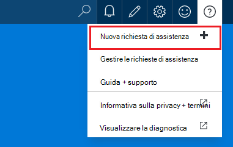

**Da una pala delle risorse**

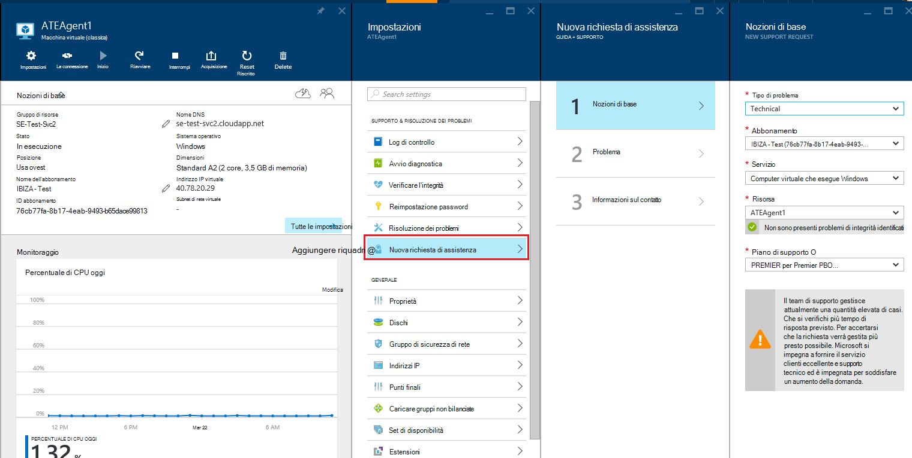

## Nozioni di base
Il primo passaggio del processo di richiesta di supporto raccoglie informazioni di base il problema e il piano di supporto.

Di seguito è illustrato un esempio: sta affiancate problemi tecnici con il computer virtuale e si ritiene un problema di connettività di rete.
Selezionare il servizio ("virtuale computer che esegue Windows") e la risorsa (il nome del computer virtuale) nel primo passaggio della procedura guidata avvia il processo di visualizzazione della Guida per risolvere il problema.

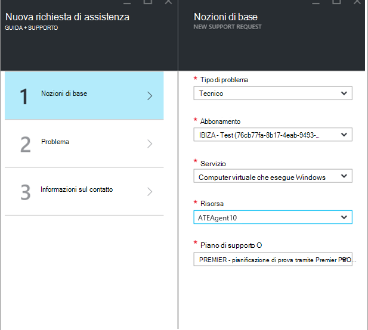

>[AZURE.NOTE] Azure fornisce supporto illimitato per la gestione di sottoscrizione (ad esempio fatturazione, regolazioni di quota e trasferimenti account). Per il supporto tecnico, è necessario un piano di supporto. [Altre informazioni sui piani di supporto](https://azure.microsoft.com/support/plans).

## Problema
Il secondo passaggio della procedura guidata raccoglie informazioni dettagliate sul problema. Fornire dettagli accurati in questo passaggio consente per instradare le maiuscole/minuscole del supporto tecnico migliore per risolvere il problema e iniziare la diagnosi presto il problema.

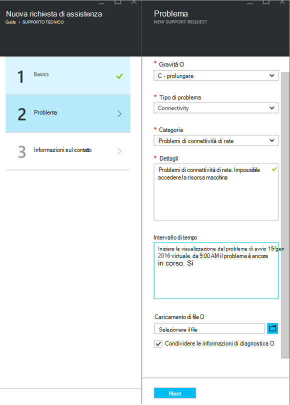

Continuare con l'esempio di integrazione applicativa macchina virtuale dall'alto, è necessario compilare questo modulo per indicare un problema di connettività di rete e da fornire ulteriori dettagli su questo problema, incluso il tempo approssimativo quando si è verificato il problema.

## Della Guida correlati
Per alcuni problemi, sono disponibili collegamenti alla Guida correlati per risolvere il problema. Se i documenti consigliati non consentono, è possibile continuare tramite la procedura per creare una richiesta di assistenza.
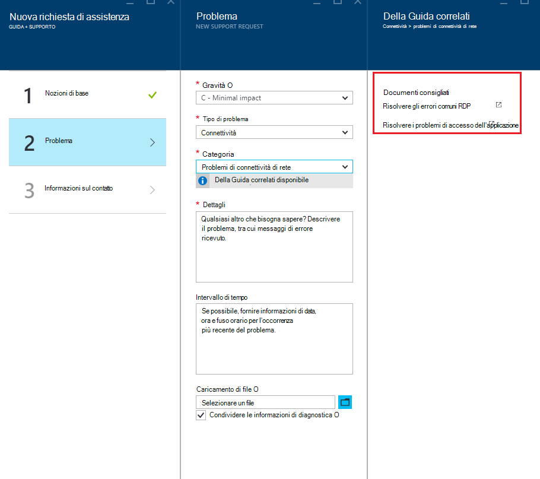

## Informazioni sul contatto
L'ultimo passaggio della procedura guidata consente di confermare le informazioni di contatto in modo da sapere come raggiungere è.
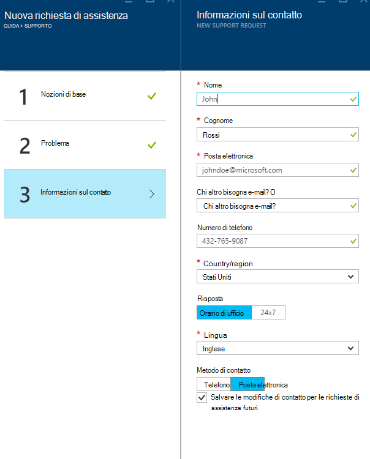

In base alla gravità del problema, potrebbe essere necessario indicare se si preferisce per contattare l'utente durante l'orario di ufficio o se si preferisce una risposta 24 / 7, ovvero di contatto in qualsiasi momento.
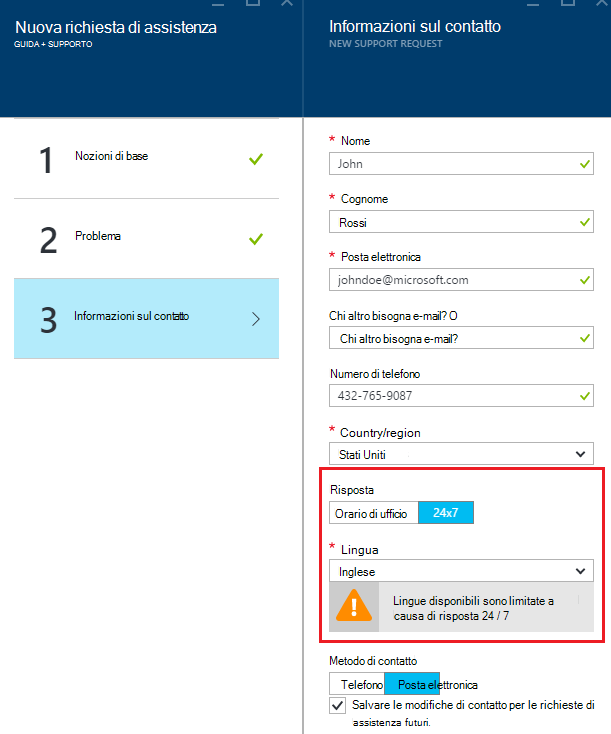

## Gestire le richieste di assistenza
Dopo aver creato la richiesta di supporto, è possibile visualizzare i dettagli nella pagina di **Gestire le richieste di supporto** .

**Sulla barra di spostamento superiore**

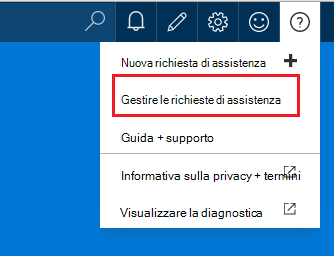

Nella pagina **Gestisci le richieste di assistenza** , è possibile visualizzare tutte le richieste di assistenza e il relativo stato.
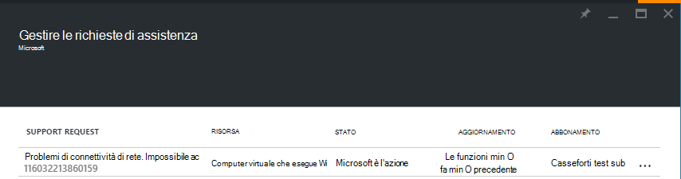

Selezionare la richiesta di supporto per visualizzare i dettagli, tra cui gravità e il tempo previsto che necessario per servizio di supporto tecnico rispondere.
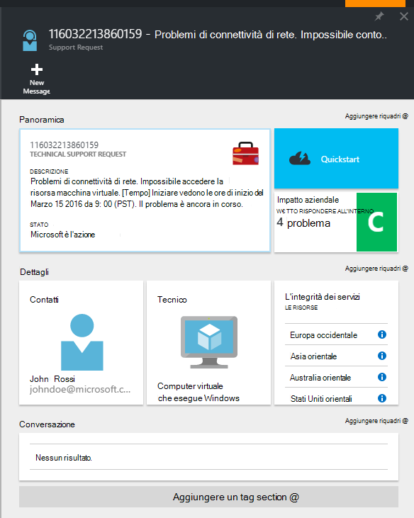

Se si desidera modificare la gravità della richiesta, fare clic sul riquadro **impatto aziendale** . Nell'esempio precedente, la richiesta attualmente è impostata su gravità C.

Fare clic sul riquadro viene visualizzato l'elenco di valori per la gravità che è possibile assegnare a una richiesta di assistenza aperto.

>[AZURE.NOTE] Il livello gravità varia in base al piano di supporto. [Altre informazioni sui piani di supporto](https://azure.microsoft.com/support/plans).

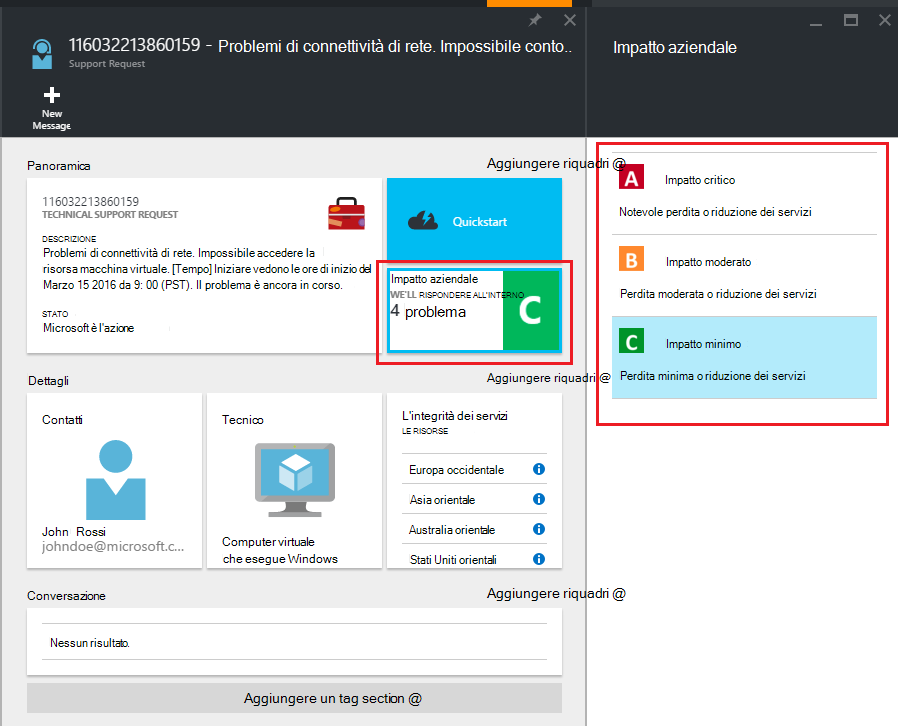

## Commenti e suggerimenti
È sempre sono aperte a commenti e suggerimenti! Inviare i [suggerimenti](https://feedback.azure.com/forums/266794-support-feedback). Inoltre, è possibile utilizzare con noi tramite i [forum MSDN](https://social.msdn.microsoft.com/Forums/azure)o [Twitter](https://twitter.com/azuresupport) .

## Ulteriori informazioni
[Domande frequenti sul supporto Azure](https://azure.microsoft.com/support/faq)
