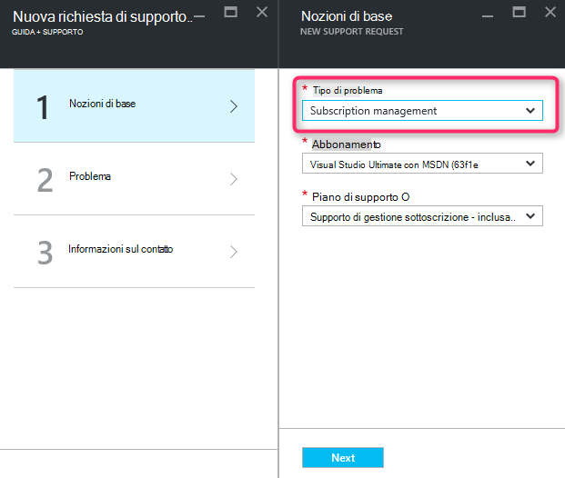
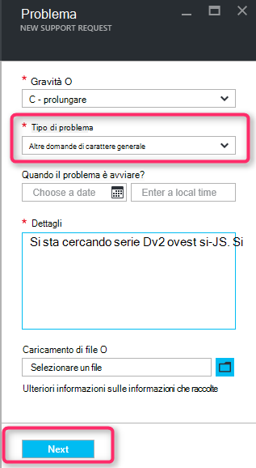
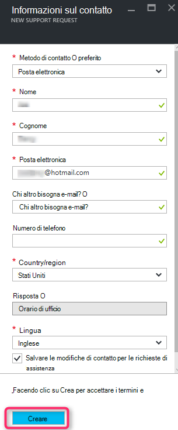

<properties
     pageTitle="Serie SKU disponibile | Microsoft Azure"
     description="Alcune serie di SKU non sono disponibili per la sottoscrizione per l'area selezionata."
     services="Azure Supportability"
     documentationCenter=""
     authors="ganganarayanan"
     manager="scotthit"
     editor=""/>

<tags
     ms.service="azure-supportability"
     ms.workload="na"
     ms.tgt_pltfrm="na"
     ms.devlang="na"
     ms.topic="article"
     ms.date="08/12/2016"
     ms.author="gangan"/>

# Serie SKU non è disponibile

In alcune aree determinate SKU non sono automaticamente disponibile in nuovi abbonamenti.  Questo può verificarsi quando [più potenti SKU introdotta in un'area](https://azure.microsoft.com/updates/announcing-new-dv2-series-virtual-machine-size/) e la diffusione di versioni precedenti SKU Rifiuta.
Durante la creazione di una richiesta di assistenza per ingrandire le dimensioni quota di base di calcolo, viene visualizzato il messaggio "*SKU alcune serie non sono disponibili per la sottoscrizione selezionata per questa area geografica*".

Per verificare la disponibilità SKU nella pagina [servizi Azure per area geografica](https://azure.microsoft.com/regions/#services) . 

Per richiedere l'accesso a uno SKU limitate dalla sottoscrizione, creare una richiesta di assistenza "Gestione delle sottoscrizioni".

- Nella pagina nozioni di base, selezionare il tipo di problema come "Gestione delle sottoscrizioni" e fare clic su "Avanti".

- Nella pagina problema selezionare il tipo di problema come "Altre domande di carattere generale" e immettere il paese esatta e SKU non viene visualizzato.
In questo modo accelerare il processo di supporto.

- Nella pagina informazioni sul contatto, immettere i dettagli dei contatti e fare clic su "Crea".

## Commenti e suggerimenti
È sempre sono aperte a commenti e suggerimenti! Inviare i [suggerimenti](https://feedback.azure.com/forums/266794-support-feedback). Inoltre, è possibile utilizzare con noi tramite i [forum MSDN](https://social.msdn.microsoft.com/Forums/azure)o [Twitter](https://twitter.com/azuresupport) .

## Ulteriori informazioni
[Domande frequenti sul supporto Azure](https://azure.microsoft.com/support/faq)
