<properties
    pageTitle="Recuperare i dati da un altro server di Data Protection Manager nell'archivio di backup | Microsoft Azure"
    description="Recuperare i dati che è stato protetto in un archivio di Backup di Azure da qualsiasi server Data Protection Manager registrati per l'archivio in questione."
    services="backup"
    documentationCenter=""
    authors="nkolli1"
    manager="shreeshd"
    editor=""/>

<tags
    ms.service="backup"
    ms.workload="storage-backup-recovery"
    ms.tgt_pltfrm="na"
    ms.devlang="na"
    ms.topic="article"
    ms.date="08/08/2016"
    ms.author="giridham;jimpark;trinadhk;markgal"/>

# Recuperare i dati da un altro server di Data Protection Manager nell'archivio di backup
È ora possibile ripristinare i dati che è stato protetto in un archivio di Backup di Azure da qualsiasi server Data Protection Manager registrati per l'archivio in questione. Il processo per eseguire queste così è completamente integrato con la console di gestione di Data Protection Manager ed è simile a altri flussi di lavoro ripristino.

Per recuperare dati da un altro server di Data Protection Manager nell'archivio di backup è necessario [System Center Data Protection Manager UR7](https://support.microsoft.com/en-us/kb/3065246) e l' [agente di Azure Backup più recente](http://aka.ms/azurebackup_agent).

## Recupera i dati da un altro Server di Data Protection Manager
Recuperare dati da un altro server di Data Protection Manager:

1. Dalla scheda **ripristino** della console di Data Protection Manager, fare clic su **' esterni DPM'** (nella parte superiore sinistra dello schermo).

    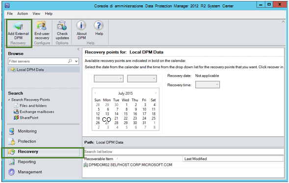

2. Scaricare nuove **archivio credenziali** dall'archivio associato al **server Data Protection Manager** in cui viene recuperati i dati, scegliere il server Data Protection Manager dall'elenco dei server Data Protection Manager registrate con l'archivio di backup e fornire la **crittografia passphrase** associato al server di Data Protection Manager viene recuperati contenente i dati.

    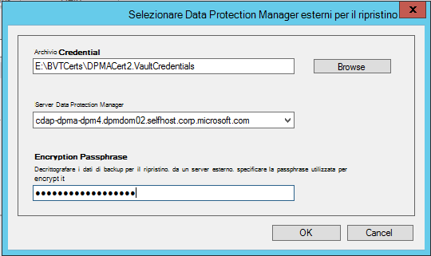

    >[AZURE.NOTE] Solo i server di Data Protection Manager associati con lo stesso archivio di registrazione consente di recuperare i dati.

    Una volta server Data Protection Manager esterno viene aggiunto correttamente, è possibile esplorare i dati del server di Data Protection Manager esterni e server Data Protection Manager locale dalla scheda **ripristino** .

3. Esaminare l'elenco dei server di produzione protetti dal server Data Protection Manager esterni disponibile e selezionare l'origine dati appropriato.

    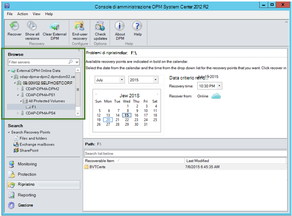

4. Selezionare **il mese e anno** da **punti di ripristino** elenco a discesa, selezionare la **Data di ripristino** necessari per quando è stato creato il punto di ripristino e selezionare l' **ora di ripristino**.

    Verrà visualizzato un elenco di file e cartelle nel riquadro inferiore che può essere esplorato e salvato in un punto qualsiasi.

    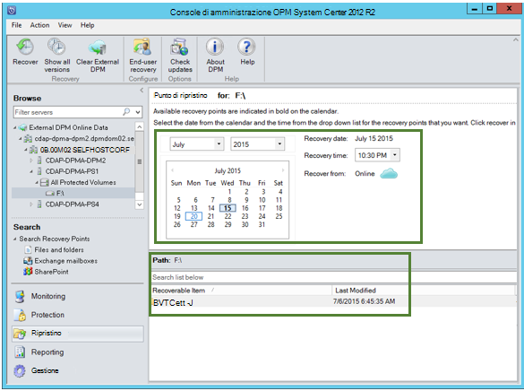

5. Fare clic con il pulsante destro l'elemento appropriato e fare clic su **Ripristina**.

    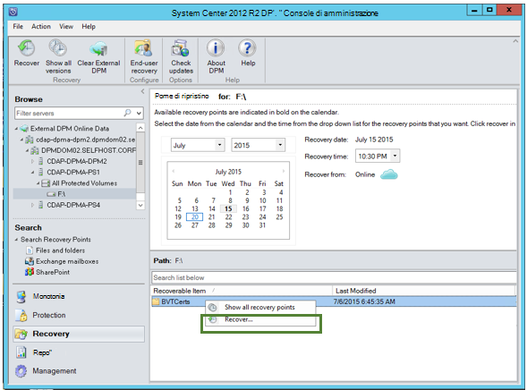

6. Esaminare **il ripristino di selezione**. Verificare che i dati e ora della copia di backup da ripristinare, nonché l'origine da cui è stata creata la copia di backup. Se la selezione è corretta, fare clic su **Annulla** per tornare alla scheda ripristino per selezionare un punto di ripristino appropriato. Se la selezione è corretta, fare clic su **Avanti**.

    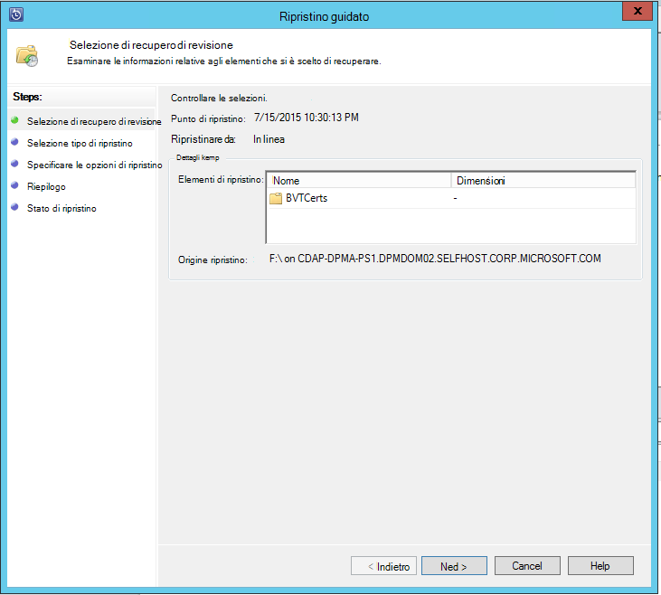

7. Selezionare **Ripristina in un percorso alternativo**. **Passare** al percorso corretto per il ripristino.

    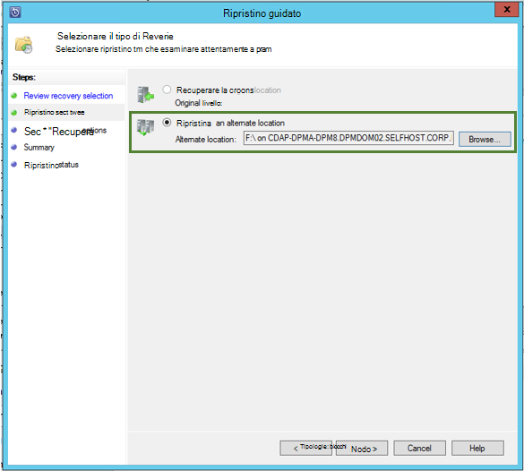

8. Scegliere l'opzione relative a **creare copia**, **Salta**o **Sovrascrivi**.
    - **Crea copia** verrà creata una copia del file nel caso in cui si verifica un conflitto di nome.
    - **Ignora** ignorerà sul ripristino del file nel caso in cui si verifica un conflitto di nome.
    - **Sovrascrivi** sovrascriverà la copia esistente nella posizione specificata in caso di conflitti.

    Scegliere l'opzione appropriata per **il ripristino di sicurezza**. È possibile applicare le impostazioni di protezione del computer di destinazione in cui viene recuperati i dati o le impostazioni di sicurezza è applicabile al prodotto al momento in cui che è stato creato il punto di ripristino.

    Determinare se verrà inviata una **notifica** quando viene eseguito correttamente al termine del ripristino.

    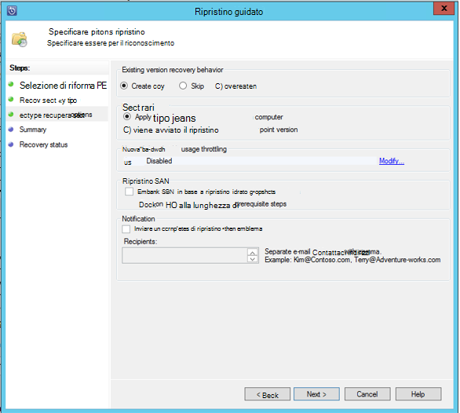

9. Schermata di **Riepilogo** vengono elencate le opzioni scelta finora. Quando si fa clic su **'Recupera'**, i dati verranno ripristinati nella posizione appropriata in locale.

    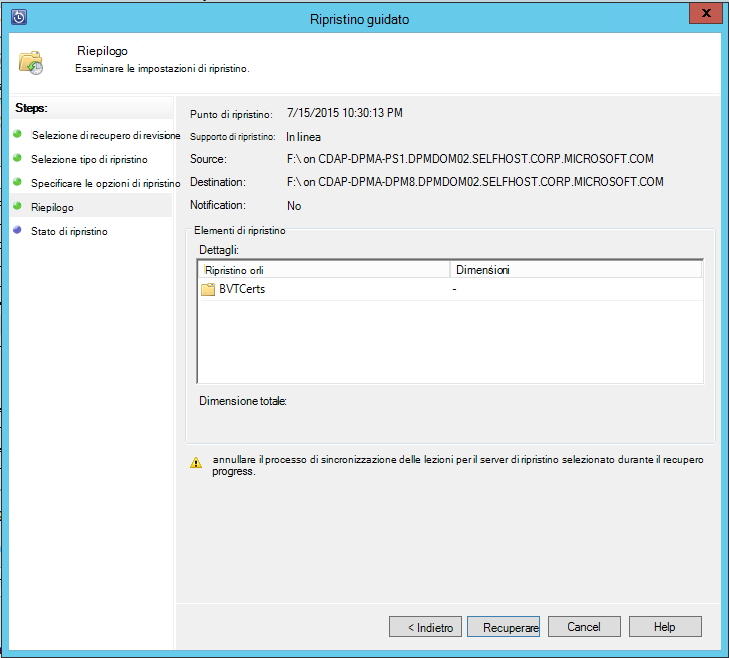

    >[AZURE.NOTE] È possibile controllare il processo di ripristino nella scheda **monitoraggio** del server Data Protection Manager.

    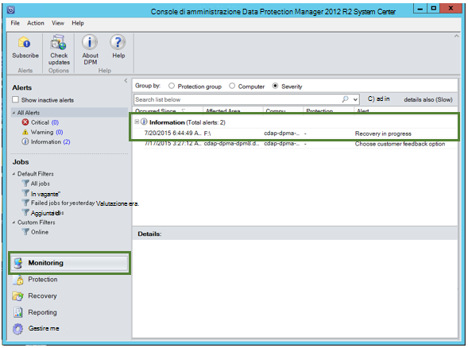

10. È possibile fare clic su **Cancella Data Protection Manager esterni** nella scheda **ripristino** del server Data Protection Manager per rimuovere la visualizzazione del server Data Protection Manager esterno.

    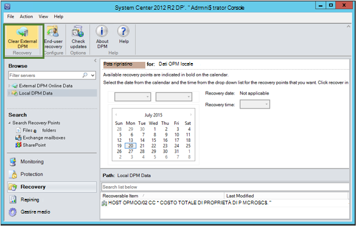

## Risoluzione dei problemi relativi a messaggi di errore
|No. |  Messaggio di errore | Risoluzione dei problemi |
| :-------------: |:-------------| :-----|
|1.|        Il server non è registrato nell'archivio specificato da credenziali archivio.|  **Causa:** Questo errore viene visualizzato se il file di archivio credenziali selezionato non fanno parte di archivio di backup associato server Data Protection Manager in cui si tenta di eseguire il ripristino.   **Risoluzione:** Scaricare il file di archivio credenziali dall'archivio di backup a cui è stato registrato il server Data Protection Manager.|
|2.|        I dati recuperati non è disponibili o il server selezionato non è un server Data Protection Manager.|   **Causa:** Esistono che nessun altro server di Data Protection Manager con Data Protection Manager 2012 R2 UR7 registrati per l'archivio di backup o il server di Data Protection Manager con Data Protection Manager 2012 R2 UR7 non sono ancora caricati i metadati o il server selezionato non è server Data Protection Manager (o Windows Server o Client Windows).   **Risoluzione:** Se sono presenti altri server Data Protection Manager registrati per l'archivio di backup, assicurarsi che SCDPM 2012 R2 UR7 e ultima Azure Backup agente siano installati.  Se sono presenti altri server Data Protection Manager registrati per l'archivio di backup con Data Protection Manager 2012 R2 UR7, attendere un giorno dopo l'installazione di UR7 per avviare il processo di ripristino. Il processo di notte verrà caricare i metadati per tutti i backup precedentemente protetti nel cloud. I dati saranno disponibili per il ripristino.|
|3.|        Nessun altro server di Data Protection Manager viene registrato in questo archivio.|   **Causa:** Non sono presenti altri Data Protection Manager Server con Data Protection Manager 2012 R2 UR7 o versioni successive registrati per l'archivio da cui si sta tentando di ripristino. **Risoluzione:** Se sono presenti altri server Data Protection Manager registrati per l'archivio di backup, assicurarsi che SCDPM 2012 R2 UR7 e ultima Azure Backup agente siano installati. Se sono presenti altri server Data Protection Manager registrati per l'archivio di backup con Data Protection Manager 2012 R2 UR7, attendere un giorno dopo l'installazione di UR7 per avviare il processo di ripristino. Il processo di notte verrà caricare i metadati per tutti i backup precedentemente protetti nel cloud. I dati saranno disponibili per il ripristino.|
|4.|        Passphrase crittografia fornita non corrisponde alla passphrase associata al server seguente:**<server name>**|  **Causa:** La passphrase di crittografia utilizzata in corso la crittografia dei dati dai dati del server Data Protection Manager che viene recuperati non corrisponde a passphrase crittografia fornita. L'agente è in grado di decrittografare i dati. Di conseguenza il ripristino non riesce. **Risoluzione:** Specificare la passphrase crittografia stesso esatto associata al server di Data Protection Manager viene recuperati contenente i dati.|

## Domande frequenti:
1. **Perché non è possibile aggiungere un server Data Protection Manager esterno da un altro server di Data Protection Manager dopo l'installazione di UR7 agente Azure Backup più recente?**

    A) per il server di Data Protection Manager esistente con origini dati che sono protetti nel cloud (mediante un aggiornamento cumulativo precedente a aggiornamento cumulativo 7), è necessario aspettare che almeno un giorno dopo l'installazione il UR7 e l'agente di Azure Backup più recente per avviare *server aggiungere Data Protection Manager l'esterno*. È necessario per caricare i metadati dei gruppi di protezione Data Protection Manager in Azure. In tal caso la prima volta un processo di notte.

2. **Che cos'è la versione minima di Azure Backup agent necessarie?**

    A) la versione minima dell'agente di Backup Azure per abilitare questa funzionalità è 2.0.8719.0.  Azure versione dell'agente di Backup può essere verificato, passare a pannello di controllo **>** gli elementi del Pannello di controllo tutti **>** programmi e funzionalità **>** agente di servizi di recupero di Microsoft Azure. Se la versione è minore di 2.0.8719.0, l' [agente di Azure Backup più recente](https://go.microsoft.com/fwLink/?LinkID=288905) di scaricare e installare.

    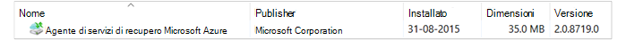

## Passaggi successivi:
• [Domande frequenti Backup azure](backup-azure-backup-faq.md)
