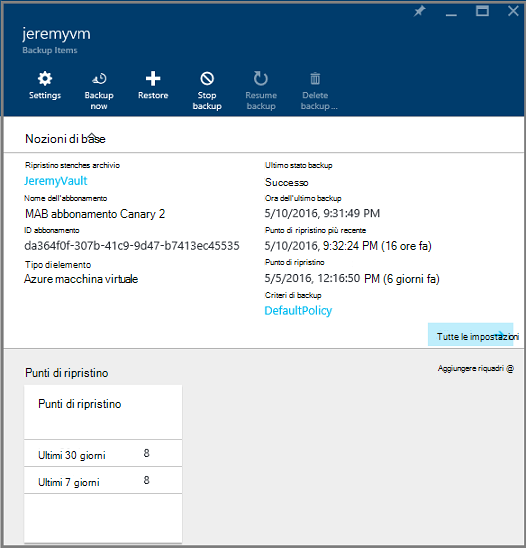
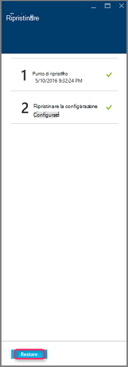

<properties
    pageTitle="Ripristinare macchine virtuali da un backup tramite il portale di Azure | Microsoft Azure"
    description="Ripristinare una macchina virtuale Azure dal punto di ripristino tramite il portale di Azure"
    services="backup"
    documentationCenter=""
    authors="markgalioto"
    manager="cfreeman"
    editor=""
    keywords="ripristinare un backup. come ripristinare; punto di ripristino."/>

<tags
    ms.service="backup"
    ms.workload="storage-backup-recovery"
    ms.tgt_pltfrm="na"
    ms.devlang="na"
    ms.topic="article"
    ms.date="08/10/2016"
    ms.author="trinadhk; jimpark;"/>

# Consente di ripristinare macchine virtuali di Azure portale

> [AZURE.SELECTOR]
- [Ripristinare macchine virtuali nel portale classica](backup-azure-restore-vms.md)
- [Ripristinare macchine virtuali nel portale di Azure](backup-azure-arm-restore-vms.md)

Proteggere i dati eseguendo istantanee dei dati a intervalli definiti. Questi snapshot sono noti come punti di ripristino e vengono archiviati negli archivi di servizi di recupero. Se o quando è necessario ripristinare o ricompilare una macchina virtuale, è possibile ripristinare la macchina virtuale da uno qualsiasi dei punti di ripristino salvata. Quando si ripristina un punto di ripristino, si restituiscono o Ripristina la macchina virtuale allo stato quando è stato eseguito il punto di ripristino. In questo articolo viene descritto come ripristinare una macchina virtuale.

> [AZURE.NOTE] Azure include due modelli di distribuzione per la creazione e utilizzo delle risorse: [Gestione risorse e classica](../resource-manager-deployment-model.md). In questo articolo fornisce informazioni e procedure per il ripristino delle macchine virtuali distribuite utilizzando il modello di Manager delle risorse.

## Ripristinare un punto di ripristino

1. Accedere al [portale di Azure](http://portal.azure.com/)

2. Nel menu Azure, fare clic su **Sfoglia** e nell'elenco dei servizi, digitare **I servizi di recupero**. Consente di modificare l'elenco dei servizi in quanto digitato. Quando viene visualizzato **archivi di servizi di recupero**, selezionarla.

    

    L'elenco degli archivi nella sottoscrizione.

    

3. Nell'elenco, selezionare archivio associato a macchine Virtuali da ripristinare. Quando si fa clic su archivio, viene aperto il dashboard.

    

4. Ora che si è nel dashboard di archivio. Per gli **Elementi di Backup** riquadro, fare clic su **macchine virtuali di Azure** per visualizzare le macchine virtuali associate l'archivio.

    

    E il **Backup elementi** verrà aperto e viene visualizzato l'elenco di Azure macchine virtuali.

    

5. Nell'elenco selezionare una macchina virtuale per aprire il dashboard. Dashboard di macchine Virtuali verrà visualizzata nell'area di monitoraggio, che contiene il riquadro di punti di ripristino.

    

6. Menu dashboard macchine Virtuali, fare clic su **Ripristina**

    

    Verrà visualizzata e il ripristino.

    

7. Scegliere e **ripristinare** il **punto di ripristino** per aprire e il **punto di selezionare ripristino** .

    

    Per impostazione predefinita, la finestra di dialogo Visualizza tutti i punti di ripristino degli ultimi 30 giorni. Usare il **filtro** per modificare l'intervallo di tempo dei punti di ripristino visualizzato. Per impostazione predefinita, vengono visualizzati i punti di ripristino di coerenza tutti. Modificare il filtro di **ripristinare tutti i punti** per selezionare una specifica coerenza dei punti di ripristino. Per ulteriori informazioni su ogni tipo di ripristino scegliere, vedere la descrizione della [coerenza dei dati](./backup-azure-vms-introduction.md#data-consistency).  
    - Scegliere **Ripristina punto coerenza** da questo elenco:
        - Arresto anomalo di punti di ripristino coerente,
        - Punti di ripristino coerente applicazione,
        - Punto di ripristino coerente di file
        - Tutti i punti di ripristino.  

8. Scegliere un punto di ripristino e fare clic su **OK**.

    

    E il **ripristino** viene che imposta il punto di ripristino.

    

9. In e il **ripristino** **ripristinare la configurazione** viene aperto automaticamente dopo aver impostato punto di ripristino.

    

## Scelta di una configurazione di ripristino macchine Virtuali

Dopo aver selezionato il punto di ripristino, scegliere una configurazione per il ripristino macchine Virtuali. Le opzioni disponibili per la configurazione della macchina virtuale ripristinata sono da usare: portale Azure o PowerShell.

> [AZURE.NOTE] Portale fornisce un'opzione di creazione rapida per macchine Virtuali ripristinato. Se si desidera personalizzare la configurazione di macchine Virtuali di macchine Virtuali di ripristinato la, usare PowerShell per ripristinare il backup di dischi e collegarli a scelta della configurazione di macchine Virtuali. Vedere [ripristino di una macchina virtuale con configurazioni di rete speciale](#restoring-vms-with-special-network-configurations).

1. Se non si è già presente, passare a e il **ripristino** . Verificare un **punto di ripristino** è stata selezionata e fare clic su **Ripristina configurazione** per aprire e il **configurazione di ripristino** .

    

2. Immettere e il **Ripristino configurazione** o selezionare i valori per i campi seguenti:
    - **Nome macchina virtuale** - specificare un nome per la macchina virtuale. Il nome deve essere univoco per il gruppo di risorse (per una macchina virtuale distribuita Manager delle risorse) o un servizio cloud (per una macchina virtuale classica). Se esiste già nella sottoscrizione non è possibile sostituire la macchina virtuale.
    - **Gruppo di risorse** - usare un gruppo di risorse esistente o crearne uno nuovo. Se si desidera ripristinare una macchina virtuale classica, utilizzare questo campo per specificare il nome di un nuovo servizio cloud. Se si crea un nuovo servizio cloud/gruppo risorse, il nome deve essere univoco globale. In genere, il nome del servizio cloud è associato a un URL pubblico, ad esempio: [cloudservice]. cloudapp.net. Se si tenta di utilizzare un nome per il servizio di gruppo/cloud risorse cloud già utilizzato, il servizio di gruppo/cloud risorse Azure assegna lo stesso nome macchina virtuale. Azure consente di visualizzare risorse gruppi/cloud services e macchine virtuali non associate a tutti i gruppi affinità. Per ulteriori informazioni, vedere [come eseguire la migrazione da gruppi di affinità a una rete locale (VNet)](../virtual-network/virtual-networks-migrate-to-regional-vnet.md).
    - **Virtuali** - selezionare la rete virtuale (VNET) quando si crea la macchina virtuale. Il campo fornisce tutti VNETs associato all'abbonamento. Gruppo risorse della macchina virtuale viene visualizzato tra parentesi.
    - **Subnet** - se il VNET subnet, la prima subnet è selezionata per impostazione predefinita. Se sono presenti subnet aggiuntive, selezionare subnet desiderata.
    - **Account di archiviazione** - questo menu elenca gli account di archiviazione nello stesso percorso archivio di servizi di recupero. Quando si sceglie un account di archiviazione, selezionare un account che condivide nella stessa posizione come archivio di servizi di recupero. Gli account di archiviazione che sono ridondante zona non sono supportati. Se esistono account lo spazio di archiviazione con la stessa posizione di archivio di servizi di recupero, è necessario crearne uno prima di iniziare l'operazione di ripristino. Tipo di replica dell'account di archiviazione è indicato tra parentesi.

    > [AZURE.NOTE] Se si desidera ripristinare una macchina virtuale distribuita Manager delle risorse, è necessario identificare una rete virtuale (VNET). Una rete virtuale (VNET) è facoltativa per una macchina virtuale classica.

3. Scegliere **OK** per completare la configurazione di ripristino e il **ripristino di configurazione** .

4. Scegliere **Ripristina** per avviare l'operazione di ripristino e il **ripristino** .

    

## Tenere traccia dell'operazione di ripristino

Quando si attiva l'operazione di ripristino, il servizio di Backup crea un processo per tenere traccia dell'operazione di ripristino. Il servizio di Backup anche creata e visualizzata temporaneamente la notifica nell'area di notifica del portale. Se non viene visualizzata la notifica, è sempre possibile fare clic sull'icona notifiche per visualizzare le notifiche.

Per visualizzare l'operazione durante l'elaborazione oppure per visualizzare quando è completata, aprire l'elenco dei processi di Backup.

1. Nel menu Azure, fare clic su **Sfoglia** e nell'elenco dei servizi, digitare **I servizi di recupero**. Consente di modificare l'elenco dei servizi in quanto digitato. Quando viene visualizzato **archivi di servizi di recupero**, selezionarla.

    

    L'elenco degli archivi nella sottoscrizione.

    

2. Nell'elenco, selezionare archivio associato a macchine Virtuali è stato ripristinato. Quando si fa clic su archivio, viene aperto il dashboard.

3. Nel dashboard archivio per i **Processi di Backup** riquadro, fare clic su **macchine virtuali di Azure** per visualizzare i processi associati l'archivio.

    

    E il **Processi di Backup** verrà visualizzato l'elenco dei processi.

    

## Ripristino delle macchine virtuali con configurazioni di rete speciali
È possibile eseguire il backup e ripristino macchine virtuali con le seguenti configurazioni di rete speciale. Tuttavia, queste configurazioni richiedono alcune considerazioni speciali mentre si passano attraverso il processo di ripristino.

- Macchine virtuali in bilanciamento del carico (interna ed esterna)
- Macchine virtuali con più indirizzi IP riservato
- Macchine virtuali con più schede di rete

>[AZURE.IMPORTANT] Quando si crea la configurazione di rete speciale per macchine virtuali, è necessario utilizzare PowerShell per creare macchine virtuali da dischi ripristinati.

Per ricreare completamente macchine virtuali dopo il ripristino su disco, procedere come segue:

1. Ripristinare i dischi da un archivio di servizi di recupero tramite [PowerShell](../backup-azure-vms-automation.md#restore-an-azure-vm)

2. Creare la configurazione di macchine Virtuali necessaria per bilanciamento del carico / IP riservati più NIC/multiplo utilizzando i cmdlet di PowerShell e usare la creazione di macchine Virtuali di bene accolta configurazione.
    - Creare macchine Virtuali nel servizio cloud con [bilanciamento del carico interno](https://azure.microsoft.com/documentation/articles/load-balancer-internal-getstarted/)
    - Creare macchine Virtuali di connettersi a [Internet affiancate di bilanciamento del carico] (https://azure.microsoft.com/en-us/documentation/articles/load-balancer-internet-getstarted/)
    - Creare macchine Virtuali con [più schede di rete](https://azure.microsoft.com/documentation/articles/virtual-networks-multiple-nics/)
    - Creare macchine Virtuali con [più indirizzi IP riservato](https://azure.microsoft.com/documentation/articles/virtual-networks-reserved-public-ip/)

## Passaggi successivi
Ora che è possibile ripristinare le macchine virtuali, vedere l'articolo sulla risoluzione dei problemi per informazioni sugli errori comuni con macchine virtuali. Inoltre, vedere l'articolo sulla gestione delle attività con le macchine virtuali.

- [Risoluzione degli errori](backup-azure-vms-troubleshoot.md#restore)
- [Gestire macchine virtuali](backup-azure-manage-vms.md)
