<properties
    pageTitle="Preparare l'ambiente per eseguire il backup distribuiti Manager delle risorse macchine virtuali | Microsoft Azure"
    description="Verificare che l'ambiente è pronto per il backup macchine virtuali di Azure"
    services="backup"
    documentationCenter=""
    authors="markgalioto"
    manager="cfreeman"
    editor=""
    keywords="backup; backup;"/>

<tags
    ms.service="backup"
    ms.workload="storage-backup-recovery"
    ms.tgt_pltfrm="na"
    ms.devlang="na"
    ms.topic="article"
    ms.date="08/21/2016"
    ms.author="trinadhk; jimpark; markgal;"/>


# <a name="prepare-your-environment-to-back-up-resource-manager-deployed-virtual-machines"></a>Preparare l'ambiente per eseguire il backup distribuiti Manager delle risorse macchine virtuali

> [AZURE.SELECTOR]
- [Modello di gestione delle risorse](backup-azure-arm-vms-prepare.md)
- [Modello classico](backup-azure-vms-prepare.md)

In questo articolo illustra i passaggi per preparare l'ambiente per il backup di una Manager delle risorse distribuito macchine (). I passaggi illustrati nelle procedure di usare il portale di Azure.  

Il servizio di Backup di Azure è disponibili due tipi di archivi (backup archivi e archivi di servizi di recupero) per la protezione nelle macchine virtuali. Un archivio di backup protegge macchine virtuali distribuite utilizzando il modello di distribuzione classica. Un archivio di servizi di recupero protegge **macchine virtuali sia distribuito classica o distribuiti Manager delle risorse** . È necessario utilizzare un archivio di servizi di recupero a proteggere una macchina virtuale distribuita Manager delle risorse.

>[AZURE.NOTE] Azure include due modelli di distribuzione per la creazione e utilizzo delle risorse: [Gestione risorse e classica](../resource-manager-deployment-model.md). Per informazioni sull'utilizzo di modello di distribuzione classica macchine virtuali, vedere [preparare l'ambiente per eseguire il backup macchine virtuali di Azure](backup-azure-vms-prepare.md) .

Prima di proteggere o il backup di una Manager delle risorse distribuito macchine (), assicurarsi che i prerequisiti esistono:

- Creare un archivio di servizi di recupero (o identificare un archivio di servizi di recupero esistente) *nella stessa posizione di una macchina virtuale*.
- Selezionare uno scenario, definire i criteri di backup e definire elementi per la protezione.
- Controllare l'installazione dell'agente di macchine Virtuali sulla macchina virtuale.
- Controllare la connettività di rete

Se si è sicuri di che queste condizioni già presenti nel proprio ambiente proseguire con il [backup dell'articolo macchine virtuali](backup-azure-vms.md). Se è necessario configurare o verificare, uno di questi prerequisiti, in questo articolo vengono descritti i passaggi necessari per preparare tale prerequisito.


## <a name="limitations-when-backing-up-and-restoring-a-vm"></a>Limitazioni quando backup e ripristino di una macchina virtuale

Prima di preparare l'ambiente, conoscono le limitazioni.

- Non è possibile eseguire il backup dei macchine virtuali con più di 16 dischi di dati.
- Non è possibile eseguire il backup dei macchine virtuali con un indirizzo IP riservato e nessun endpoint definito.
- Il backup di macchine virtuali Linux con estensione Docker non è supportato. 
- Dati di backup non includono le unità di rete installato associate a macchine Virtuali. 
- La sostituzione di una macchina virtuale esistente durante il ripristino non è supportata. Se si tenta di ripristinare la macchina virtuale quando è presente la macchina virtuale, l'operazione di ripristino.
- Area tra backup e ripristino non è supportata.
- È possibile eseguire il backup di macchine virtuali in tutte le aree pubbliche di Azure (vedere l' [elenco di controllo](https://azure.microsoft.com/regions/#services) delle aree supportate). Se attualmente non è supportato l'area che si sta cercando, non verrà visualizzato nell'elenco a discesa durante la creazione di archivio.
- È possibile eseguire il backup di macchine virtuali solo per le versioni di selezione del sistema operativo:
  - **Linux**: Backup Azure supporta [un elenco delle distribuzioni che approvato Azure](../virtual-machines/virtual-machines-linux-endorsed-distros.md) ad eccezione di base del sistema operativo Linux.  Altri porta-Your-proprietari-distribuzioni Linux anche potrebbero funzionare come agente di macchine Virtuali è disponibile nel computer virtuale e il supporto per Python esiste.
  - **Windows Server**: versioni antecedenti a Windows Server 2008 R2 non sono supportate.
- Ripristino di un controller di dominio macchine Virtuali (CD) che fa parte di una configurazione con più controller di dominio sono supportato solo tramite PowerShell. Per ulteriori informazioni su [come ripristinare un controller di dominio con più controller di dominio](backup-azure-restore-vms.md#restoring-domain-controller-vms).
- Il ripristino delle macchine virtuali contenenti le configurazioni di rete speciali seguenti è supportato solo tramite PowerShell. Al termine dell'operazione di ripristino macchine virtuali create con il flusso di lavoro di ripristino nell'interfaccia utente non avranno queste configurazioni di rete. Per ulteriori informazioni, vedere [Il ripristino delle macchine virtuali con configurazioni di rete speciale](backup-azure-restore-vms.md#restoring-vms-with-special-netwrok-configurations).
  - Macchine virtuali in configurazione di bilanciamento carico (interna ed esterna)
  - Macchine virtuali con più indirizzi IP riservati
  - Macchine virtuali con più schede di rete

## <a name="create-a-recovery-services-vault-for-a-vm"></a>Creare un archivio di servizi di recupero per una macchina virtuale

Un archivio di servizi di recupero è un'entità che contiene i punti di ripristino creato nel tempo e backup. Archivio di servizi di recupero contiene anche i criteri di backup associati virtuali protetti.

Per creare un archivio di servizi di recupero:

1. Accedere al [portale di Azure](https://portal.azure.com/).

2. Nel menu Hub fare clic su **Sfoglia** e nell'elenco delle risorse, digitare **I servizi di recupero**. Quando si inizia a digitare, l'elenco verrà applicato un filtro in base all'input. Fare clic su **archivio di servizi di recupero**.

     <br/>

    L'elenco degli archivi di servizi di recupero.

3. Nel menu **archivi di servizi di recupero** , fare clic su **Aggiungi**.

    

    Verrà visualizzata e l'archivio servizi di recupero che richiede di specificare un **nome**, **l'abbonamento**, **gruppo di risorse**e **posizione**.

    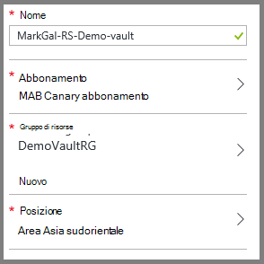

4. Per **nome**immettere un nome descrittivo per identificare l'archivio. Il nome deve essere univoco per la sottoscrizione Azure. Digitare un nome che contiene da 2 a 50 caratteri. Deve iniziare con una lettera e possono contenere solo lettere, numeri e trattini.

5. Fare clic su **sottoscrizione** per visualizzare l'elenco delle sottoscrizioni disponibile. Se non si è certi di quale abbonamento da usare, usare il valore predefinito (o suggeriti) abbonamento. Si verificherà scelte multiple solo se l'account aziendale è associata a più abbonamenti Azure.

6. Fare clic su **gruppo di risorse** per visualizzare l'elenco dei gruppi di risorse disponibile oppure fare clic su **Nuovo** per creare un nuovo gruppo di risorse. Per informazioni complete sui gruppi di risorse, vedere [Panoramica di gestione risorse di Azure](../azure-resource-manager/resource-group-overview.md)

7. Fare clic su **posizione** per selezionare la località geografica per l'archivio. L' archivio **deve** essere nella stessa regione le macchine virtuali che si desidera proteggere.

    >[AZURE.IMPORTANT] Se si conosce la posizione in cui si trova la macchina virtuale, chiudere la finestra di dialogo Creazione archivio e passare all'elenco di macchine virtuali nel portale. Se si dispone di macchine virtuali in più aree, sarà necessario creare un archivio di servizi di recupero in ogni area. Creare l'archivio in prima posizione prima di passare alla posizione successiva. Non è necessario specificare gli account di archiviazione per archiviare i dati di backup, ossia l'archivio di servizi di recupero e il servizio di Azure Backup lo gestisca automaticamente.

8. Fare clic su **Crea**. Può richiedere un po' di tempo per l'archivio di servizi di recupero da creare. Eseguire il monitoraggio delle notifiche sullo stato nell'area superiore destro nel portale. Dopo aver creato l'archivio, viene visualizzato nell'elenco dei servizi di recupero archivi.

    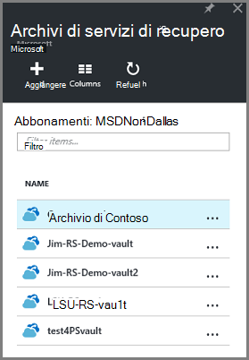

    Dopo aver creato l'archivio, informazioni su come impostare la replica di spazio di archiviazione.

## <a name="set-storage-replication"></a>Impostare la replica di spazio di archiviazione

L'opzione di replica di spazio di archiviazione consente di scegliere tra lo spazio di archiviazione ridondanti geografico e lo spazio di archiviazione ridondante in locale. Per impostazione predefinita, l'archivio dispone di spazio di archiviazione ridondanti geografico. Lasciare l'opzione impostata per lo spazio di archiviazione ridondanti geografico se si tratta di backup principale. Scegliere lo spazio di archiviazione in locale ridondante se si desidera un'opzione meno che non è abbastanza come permanente. Per saperne di più sui [geografico ridondanti](../storage/storage-redundancy.md#geo-redundant-storage) e opzioni relative all'archiviazione [localmente ridondanti](../storage/storage-redundancy.md#locally-redundant-storage) nella [Panoramica della replica di archiviazione Azure](../storage/storage-redundancy.md).

Per modificare l'impostazione di replica di spazio di archiviazione:

1. Selezionare l'insieme di credenziali per aprire il dashboard di archivio ed e l'impostazioni. Se non si apre e **l'Impostazioni** , fare clic su **tutte le impostazioni** del dashboard di archivio di.

2. Scegliere **Dell'infrastruttura di Backup**e **l'Impostazioni**  > **Configurazione di Backup** per aprire e il **Backup configurazione** . Scegliere l'opzione di replica di spazio di archiviazione per l'archivio e il **Backup configurazione** .

    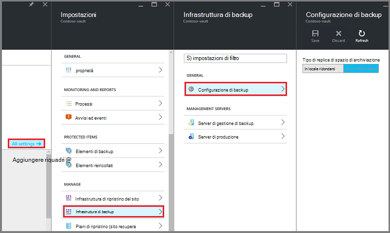

    Dopo aver selezionato l'opzione di spazio di archiviazione per l'archivio, si è pronti associare la macchina virtuale nell'archivio. Per iniziare l'associazione, si deve individuare e registrare le macchine virtuali Azure.


## <a name="select-a-backup-goal-set-policy-and-define-items-to-protect"></a>Selezionare un obiettivo backup, impostare i criteri e definire gli elementi per la protezione

Prima di registrare una macchina virtuale a un archivio, eseguire il processo di rilevamento per assicurarsi che le nuove macchine virtuali che sono stati aggiunti alla sottoscrizione identificate. Le query di processo Azure per l'elenco di macchine virtuali in abbonamento, insieme a ulteriori informazioni, ad esempio il nome del servizio cloud e l'area geografica. Nel portale di Azure scenario si riferisce a cosa si intende inserire l'archivio di servizi di recupero. Criteri sono la programmazione con quale frequenza e quando i punti di ripristino sono estratti. Criteri includono anche l'intervallo di criteri di conservazione per i punti di ripristino.

1. Se già aperto un archivio di servizi di recupero, procedere al passaggio 2. Se si dispone di un servizio di recupero archivio aperta, ma sono nel portale di Azure, nel menu Hub fare clic su **Sfoglia**.

  - Nell'elenco delle risorse, digitare **I servizi di recupero**.
  - Quando si inizia a digitare, l'elenco verrà applicato un filtro in base all'input. Quando viene visualizzato **archivi di servizi di recupero**, fare clic su esso.

     <br/>

    Viene visualizzato l'elenco degli archivi di servizi di recupero.
  - Nell'elenco di servizi di recupero archivi, selezionare un archivio.

    Verrà visualizzata nel dashboard di archivio selezionato.

    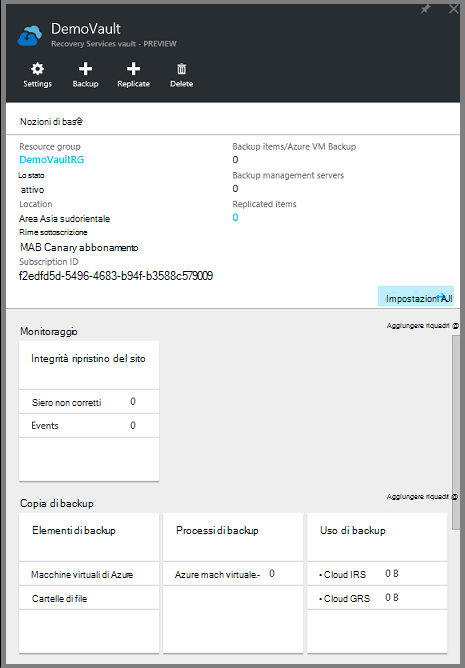

2. Dal menu archivio dashboard fare clic su **copia di Backup** per aprire e il Backup.

    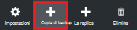

    Quando si apre e il, il servizio di Backup cerca eventuali nuove macchine virtuali nella sottoscrizione.

    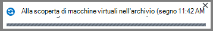

3. Scegliere l' **obiettivo di Backup** per aprire e l'obiettivo di Backup e il Backup.

    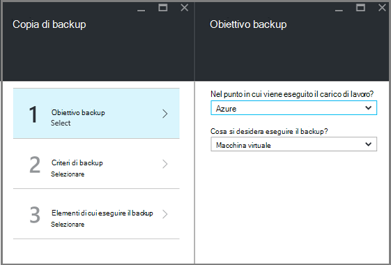

4. In e il Backup obiettivo impostato **nel punto in cui è il carico di lavoro in esecuzione** su Azure e **cosa si desidera eseguire il backup** a macchina virtuale, quindi fare clic su **OK**.

    Viene chiusa e l'obiettivo di Backup e viene aperta e il criterio di Backup.

    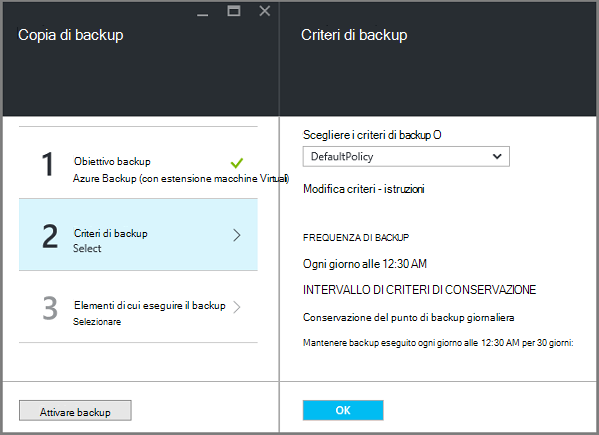

5. Scegliere i criteri di backup che si desidera applicare all'archivio e fare clic su **OK**e il criterio Backup.

    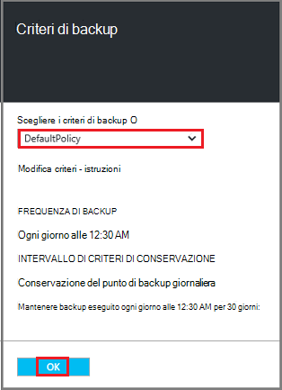

    I dettagli dei criteri predefiniti sono elencati i dettagli. Se si desidera creare un nuovo criterio, selezionare **Crea nuovo** dal menu a discesa. Menu a discesa vengono forniti anche un'opzione per impostare il tempo quando l'istantanea, alle 19: 00. Per istruzioni sulla definizione di un criterio di backup, vedere [definizione dei criteri di backup](backup-azure-vms-first-look-arm.md#defining-a-backup-policy). Dopo aver fatto clic su **OK**, criteri di backup sono associato l'archivio.

    Scegliere Avanti macchine virtuali da associare l'archivio.

6. Scegliere le macchine virtuali per associare il criterio specificato e fare clic su **Seleziona**.

    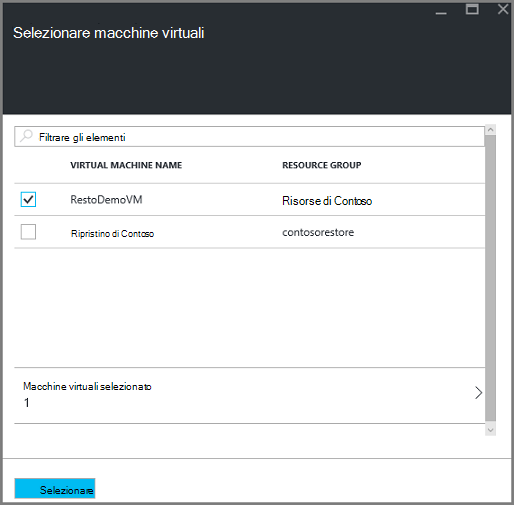

    Se la macchina virtuale desiderata non è disponibile, verificare che si trovi nella stessa posizione Azure archivio di servizi di recupero.

7. Dopo avere definito tutte le impostazioni per l'archivio in e il Backup, fare clic su **Abilita copia di Backup** nella parte inferiore della pagina. Consente di distribuire i criteri per l'archivio e macchine virtuali.

    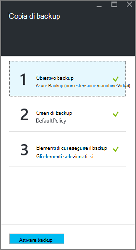

La fase successiva in preparazione installa l'agente di macchine Virtuali o accertarsi che l'agente di macchine Virtuali è installato.


## <a name="install-the-vm-agent-on-the-virtual-machine"></a>Installare l'agente di macchine Virtuali nella macchina virtuale

Agente di macchine Virtuali di Azure deve essere installato Azure virtual machine per l'estensione di Backup per l'uso. Se la macchina virtuale è stata creata dalla raccolta di Azure, l'agente di macchine Virtuali è già presenta nel computer virtuale. Queste informazioni sono forniti per le situazioni in cui si *non* utilizza una macchina virtuale creato dalla raccolta Azure - ad esempio che una macchina virtuale la migrazione da un data center locale. In questo caso, l'agente di macchine Virtuali deve essere installato per proteggere la macchina virtuale.

Informazioni sulle [Macchine Virtuali agente](https://go.microsoft.com/fwLink/?LinkID=390493&clcid=0x409) e [come installare l'agente di macchine Virtuali](../virtual-machines/virtual-machines-windows-classic-manage-extensions.md).

Se si verificano problemi backup la macchina virtuale Azure, verificare che l'agente di macchine Virtuali di Azure sia correttamente installato sul computer virtuale (vedere la tabella riportata di seguito). Se è stata creata una macchina virtuale personalizzata, [Assicurarsi che sia selezionata la casella di controllo **installare l'agente di macchine Virtuali** ](../virtual-machines/virtual-machines-windows-classic-agents-and-extensions.md) prima la macchina virtuale viene eseguito il provisioning.

La tabella seguente contiene informazioni aggiuntive sui macchine Virtuali agente di Windows e macchine virtuali Linux.

| **Operazione** | **Windows** | **Linux** |
| --- | --- | --- |
| Installazione dell'agente di macchine Virtuali | <li>Scaricare e installare l' [agente MSI](http://go.microsoft.com/fwlink/?LinkID=394789&clcid=0x409). Sono necessari privilegi di amministratore per completare l'installazione. <li>[Aggiornare la proprietà macchine Virtuali](http://blogs.msdn.com/b/mast/archive/2014/04/08/install-the-vm-agent-on-an-existing-azure-vm.aspx) per indicare che l'agente è installato. | <li> Installare l' ultima [agenti Linux](https://github.com/Azure/WALinuxAgent) da GitHub. Sono necessari privilegi di amministratore per completare l'installazione. <li> [Aggiornare la proprietà macchine Virtuali](http://blogs.msdn.com/b/mast/archive/2014/04/08/install-the-vm-agent-on-an-existing-azure-vm.aspx) per indicare che l'agente è installato. |
| Agente di macchine Virtuali di aggiornamento | Agente di macchine Virtuali l'aggiornamento è semplice come reinstallare i [file binari agente macchine Virtuali](http://go.microsoft.com/fwlink/?LinkID=394789&clcid=0x409). <br>Assicurarsi che nessuna operazione di backup venga eseguito durante l'aggiornamento dell'agente di macchine Virtuali. | Seguire le istruzioni [sull'aggiornamento dell'agente di macchine Virtuali Linux ](../virtual-machines-linux-update-agent.md). <br>Assicurarsi che nessuna operazione di backup venga eseguito durante l'aggiornamento dell'agente di macchine Virtuali. |
| Convalidare l'installazione dell'agente di macchine Virtuali | <li>Passare alla cartella *C:\WindowsAzure\Packages* nella macchina virtuale Azure. <li>È necessario trovare il file WaAppAgent.exe presenta.<li> Pulsante destro del mouse sul file, passare a **proprietà**e quindi selezionare la scheda **Dettagli** . Il campo versione del prodotto deve essere 2.6.1198.718 o versione successiva. | N/D |


### <a name="backup-extension"></a>Estensione di backup

Dopo aver installato l'agente di macchine Virtuali nella macchina virtuale, il servizio di Azure Backup installa l'estensione di backup in agente di macchine Virtuali. Servizio di Azure Backup in modo facile aggiornamenti e patch l'estensione di backup.

L'estensione backup viene installato per il servizio di Backup o meno la macchina virtuale è in esecuzione. Una macchina virtuale in esecuzione offre la massima probabilità di ottenere un punto di ripristino applicazione coerente. Tuttavia, il servizio di Backup di Azure continua eseguire il backup della macchina virtuale anche se è stato disattivato e non è stato installato l'estensione. Tale valore è noto come Offline macchine Virtuali. In questo caso, il punto di ripristino sarà *un arresto anomalo coerente*.


## <a name="network-connectivity"></a>Connettività di rete

Per gestire le istantanee macchine Virtuali, l'estensione di backup richiede connettività a Azure indirizzi IP. Senza la connettività Internet destra, HTTP della macchina virtuale le richieste di timeout e l'operazione di backup non riesce. Se la distribuzione è associate le restrizioni di accesso in posizione (tramite un rete gruppo di sicurezza (NSG), ad esempio), quindi scegliere una delle opzioni seguenti per fornire un percorso chiaro per il traffico di backup:

- [Intervalli di proprietà consentite IP Azure Data Center](http://www.microsoft.com/en-us/download/details.aspx?id=41653) , vedere l'articolo per istruzioni su come a proprietà consentite gli indirizzi IP.
- Distribuire un server proxy HTTP per instradare il traffico.

Per decidere quale opzione utilizzare, compromessi sono compresi tra la gestibilità, controllo granulare e costo.

|Opzione|Vantaggi|Svantaggi|
|------|----------|-------------|
|Intervalli IP whitelist| Senza costi aggiuntivi.<br><br>Per l'apertura di access in un NSG, utilizzare il cmdlet <i>Set-AzureNetworkSecurityRule</i> . | Complesse per gestire come l'interessata intervalli di indirizzi IP cambiano nel tempo.<br><br>Consente di accedere all'intero di Azure e non solo lo spazio di archiviazione.|
|Proxy HTTP| Controllo granulare nel proxy sugli URL di spazio di archiviazione consentito.<br>Punto di Internet accesso singolo per macchine virtuali.<br>Non è soggetta a modifiche all'indirizzo IP di Azure.| Costi aggiuntivi per l'esecuzione di una macchina virtuale con il software proxy.|

### <a name="whitelist-the-azure-datacenter-ip-ranges"></a>Intervalli di indirizzi IP di proprietà consentite Data Center del Azure

A proprietà consentite intervalli di indirizzi IP di Azure Data Center, vedere il [sito Web Azure](http://www.microsoft.com/en-us/download/details.aspx?id=41653) per informazioni dettagliate sugli intervalli di indirizzi IP e le istruzioni.

### <a name="using-an-http-proxy-for-vm-backups"></a>Utilizzando un proxy HTTP per i backup macchine Virtuali
Per eseguire il backup di una macchina virtuale, l'estensione di backup nella macchina virtuale invia i comandi di gestione delle istantanea allo spazio di archiviazione di Azure mediante un'API HTTPS. Instradare il traffico di backup estensione attraverso il proxy HTTP poiché è l'unico componente configurato per l'accesso a Internet.

>[AZURE.NOTE] Non esiste alcun suggerimento per il software proxy che deve essere utilizzato. Assicurarsi di selezionare un proxy è compatibile con la procedura di configurazione riportata di seguito.

L'immagine di esempio seguente illustra la procedura di tre configurazione necessario utilizzare un proxy HTTP:

- Macchine Virtuali di App indirizza tutto il traffico HTTP destinato pubblica Internet attraverso macchine Virtuali Proxy.
- Proxy macchine Virtuali consente il traffico in ingresso da macchine virtuali nella rete virtuale.
- Il gruppo di sicurezza rete (NSG) denominato Scoperto blocco deve un protezione regola consentendo Internet il traffico in uscita da macchine Virtuali Proxy.

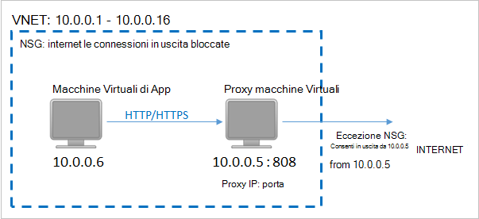

Per utilizzare un proxy HTTP per comunicare a Internet, procedere come segue:

#### <a name="step-1-configure-outgoing-network-connections"></a>Passaggio 1. Configurare le connessioni in uscita

###### <a name="for-windows-machines"></a>Per i computer Windows
Questa operazione verrà configurazione configurazione del server proxy per Account di sistema locale.

1. Scaricare [PsExec](https://technet.microsoft.com/sysinternals/bb897553)
2. Comando Esegui dal prompt dei comandi con privilegi elevati,

     ```
     psexec -i -s "c:\Program Files\Internet Explorer\iexplore.exe"
     ```
     Verrà aperta una finestra di internet explorer.
3. Selezionare Strumenti -> Opzioni Internet -> connessioni -> Impostazioni LAN.
4. Verificare le impostazioni proxy per account di sistema. Impostare Proxy IP e porte.
5. Chiudere Internet Explorer.

Consente di impostare una configurazione proxy per l'intero computer e verrà utilizzato per tutto il traffico HTTP/HTTPS in uscita.

Se è stato impostato un server proxy in un account utente corrente (non un Account di sistema locale), utilizzare il seguente script di applicarli a SYSTEMACCOUNT:

```
   $obj = Get-ItemProperty -Path Registry::”HKEY_CURRENT_USER\Software\Microsoft\Windows\CurrentVersion\Internet Settings\Connections"
   Set-ItemProperty -Path Registry::”HKEY_USERS\S-1-5-18\Software\Microsoft\Windows\CurrentVersion\Internet Settings\Connections" -Name DefaultConnectionSettings -Value $obj.DefaultConnectionSettings
   Set-ItemProperty -Path Registry::”HKEY_USERS\S-1-5-18\Software\Microsoft\Windows\CurrentVersion\Internet Settings\Connections" -Name SavedLegacySettings -Value $obj.SavedLegacySettings
   $obj = Get-ItemProperty -Path Registry::”HKEY_CURRENT_USER\Software\Microsoft\Windows\CurrentVersion\Internet Settings"
   Set-ItemProperty -Path Registry::”HKEY_USERS\S-1-5-18\Software\Microsoft\Windows\CurrentVersion\Internet Settings" -Name ProxyEnable -Value $obj.ProxyEnable
   Set-ItemProperty -Path Registry::”HKEY_USERS\S-1-5-18\Software\Microsoft\Windows\CurrentVersion\Internet Settings" -Name Proxyserver -Value $obj.Proxyserver
```

>[AZURE.NOTE] Se si osservano "(407) necessaria autenticazione Proxy" nel log server proxy, verificare che l'autenticazione sia impostata correttamente.

######<a name="for-linux-machines"></a>Per i computer Linux

Aggiungere la riga seguente per il ```/etc/environment``` file:

```
http_proxy=http://<proxy IP>:<proxy port>
```

Aggiungere le seguenti righe per il ```/etc/waagent.conf``` file:

```
HttpProxy.Host=<proxy IP>
HttpProxy.Port=<proxy port>
```

#### <a name="step-2-allow-incoming-connections-on-the-proxy-server"></a>Passaggio 2. Consentire le connessioni in ingresso nel server proxy:

1. Sul server proxy, aprire Windows Firewall. Il modo più semplice per accedere il firewall è cercare Windows Firewall con sicurezza avanzata.

    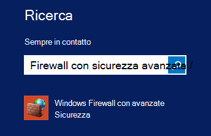

2. Nella finestra di dialogo Windows Firewall rapida **Regole in entrata** e fare clic su **Nuova regola...**.

    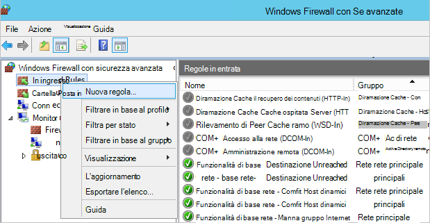

3. **In ingresso Creazione guidata nuova regola**, scegliere l'opzione **personalizzato** per il **Tipo di regola** e fare clic su **Avanti**.
4. Nella pagina per selezionare il **programma**, scegliere **Tutti i programmi** e fare clic su **Avanti**.

5. Nella pagina **porte e protocolli** immettere le informazioni seguenti e fare clic su **Avanti**:

    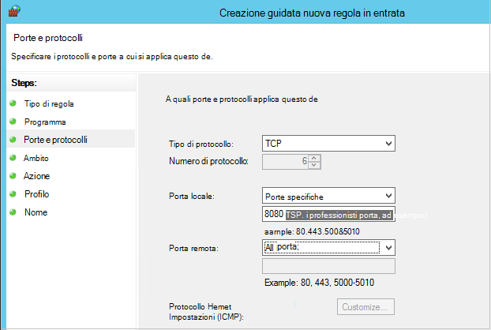

    - *tipo* di protocollo scegliere *TCP*
    - porta *locale* scegliere *Porte specifiche*, nella casella sottostante specificare il ```<Proxy Port>``` che è stata configurata.
    - Selezionare *Tutte le porte* per *porta remota*

    Per il resto della procedura guidata, fare clic su fino alla fine e specificare un nome per la regola.

#### <a name="step-3-add-an-exception-rule-to-the-nsg"></a>Passaggio 3. Aggiungere una regola di eccezione per la NSG:

In un prompt dei comandi PowerShell di Azure, immettere il comando seguente:

Il comando seguente aggiunge un'eccezione per la NSG. Questa eccezione consente il traffico TCP da qualsiasi porta sul 10.0.0.5 a qualsiasi indirizzo Internet sulla porta 80 (HTTP) o 443 (HTTPS). Se si richiede una porta specifica in pubblica Internet, assicurarsi di aggiungere tale porta per il ```-DestinationPortRange``` anche.

```
Get-AzureNetworkSecurityGroup -Name "NSG-lockdown" |
Set-AzureNetworkSecurityRule -Name "allow-proxy " -Action Allow -Protocol TCP -Type Outbound -Priority 200 -SourceAddressPrefix "10.0.0.5/32" -SourcePortRange "*" -DestinationAddressPrefix Internet -DestinationPortRange "80-443"
```


*Questa procedura Usa nomi specifici e i valori per questo esempio. Utilizzare i nomi e i valori per la distribuzione quando si immettono, oppure tagliare e incollare i dettagli del codice.*


Dopo aver scoperto che è disponibile la connettività di rete, si è pronti eseguire il backup di una macchina virtuale. Vedere [eseguire il backup macchine virtuali distribuito Manager delle risorse](backup-azure-arm-vms.md).

## <a name="questions"></a>Domande?
In caso di dubbi o qualsiasi funzione che si vuole vedere inclusi, [inviare un feedback](http://aka.ms/azurebackup_feedback).

## <a name="next-steps"></a>Passaggi successivi
Ora che è stato creato l'ambiente per il backup di una macchina virtuale, il passaggio logico successivo consiste nel creare una copia di backup. Per informazioni più dettagliate sugli backup delle macchine virtuali, l'articolo pianificazione.

- [Eseguire il backup macchine virtuali](backup-azure-vms.md)
- [Pianificare l'infrastruttura di backup macchine Virtuali](backup-azure-vms-introduction.md)
- [Gestire i backup macchina virtuale](backup-azure-manage-vms.md)
