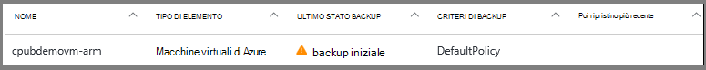
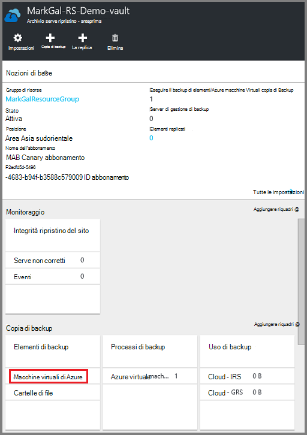
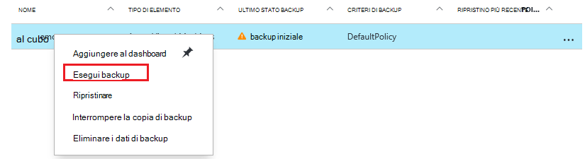
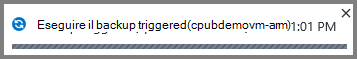

<properties
    pageTitle="Eseguire il backup di macchine virtuali di Azure in un archivio di servizi di recupero | Microsoft Azure"
    description="Alla scoperta di, eseguire la registrazione e drill-up Azure macchine virtuali in un archivio di servizi di recupero con queste procedure per il backup di Azure macchina virtuale."
    services="backup"
    documentationCenter=""
    authors="markgalioto"
    manager="cfreeman"
    editor=""
    keywords="backup macchina virtuale. eseguire il backup macchina virtuale; copia di backup e ripristino di emergenza; copia di backup macchine virtuali ARM"/>

<tags
    ms.service="backup"
    ms.workload="storage-backup-recovery"
    ms.tgt_pltfrm="na"
    ms.devlang="na"
    ms.topic="article"
    ms.date="07/29/2016"
    ms.author="trinadhk; jimpark; markgal;"/>

# Eseguire il backup macchine virtuali di Azure in un archivio di servizi di recupero

> [AZURE.SELECTOR]
- [Eseguire il backup macchine virtuali in servizi di recupero archivio](backup-azure-arm-vms.md)
- [Eseguire il backup macchine virtuali all'archivio di Backup](backup-azure-vms.md)

Questo articolo offre la procedura per il backup macchine virtuali di Azure (distribuito Manager delle risorse e distribuito classica) in un archivio di servizi di recupero. La maggior parte del lavoro per il backup macchine virtuali rileva la preparazione. Prima di poter eseguire il backup o proteggere con una macchina virtuale, è necessario completare i [Prerequisiti](backup-azure-arm-vms-prepare.md) per preparare l'ambiente per la protezione nelle macchine virtuali. Dopo aver completato i prerequisiti, è possibile avviare l'operazione come effettuare snapshot delle macchine Virtuali di backup.

>[AZURE.NOTE] Azure include due modelli di distribuzione per la creazione e utilizzo delle risorse: [Gestione risorse e classica](../resource-manager-deployment-model.md). È possibile proteggere macchine virtuali distribuito Manager delle risorse e macchine virtuali classica con archivi di servizi di recupero. Per informazioni dettagliate sull'utilizzo di modello di distribuzione classica macchine virtuali, vedere [eseguire il backup macchine virtuali di Azure](backup-azure-vms.md) .

Per ulteriori informazioni, vedere gli articoli nella [pianificazione dell'infrastruttura di backup macchine Virtuali di Azure](backup-azure-vms-introduction.md) e [Azure macchine virtuali](https://azure.microsoft.com/documentation/services/virtual-machines/).

## Avviare il processo di backup

Il criterio associato archivio servizi di recupero di backup definisce la frequenza e quando viene eseguito il backup. Per impostazione predefinita, il primo backup pianificato è il backup iniziale. Fino a quando non viene eseguito il backup iniziale, come **avviso (backup iniziale in sospeso)**viene visualizzato lo stato di Backup ultimo su e il **Processi di Backup** .

A meno che il backup iniziale è dovuto iniziare a breve termine, è consigliabile eseguire **il backup ora**. Verrà avviata la procedura seguente nel dashboard di archivio. Questa procedura viene utilizzato per eseguire il processo di backup iniziale dopo aver completato tutti i prerequisiti. Se è già stato eseguito il processo di backup iniziale, questa procedura non è disponibile. Criteri di backup associato determinano il processo di backup successivo.  

Per eseguire il processo di backup iniziale:

1. Nel dashboard di archivio sul riquadro di **Backup** , fare clic su **macchine virtuali di Azure**.  
    

    Verrà visualizzata e il **Backup elementi** .

2. Scegliere e il **Backup elementi** rapida archivio che si desidera eseguire il backup e fare clic su **Esegui Backup**.

    

    Il processo di Backup viene attivato.  

    

3. Per visualizzare il backup iniziale completamento, nel dashboard di archivio sul riquadro **Processi di Backup** , fare clic su **macchine virtuali di Azure**.

    

    Verrà visualizzata e il processi di Backup.

4. In e il **processi di Backup** , è possibile visualizzare lo stato di tutti i processi.

    

    >[AZURE.NOTE] Come parte dell'operazione di backup, il servizio di Azure Backup invia un comando all'articolo estensione backup in ciascuna macchina virtuale per svuotare tutte le operazioni scrittura e creare uno snapshot coerenza.

    Al termine del processo di backup, lo stato è *completato*.

## Risoluzione degli errori
Se si verificano problemi durante il backup la macchina virtuale, vedere l' [articolo sulla risoluzione dei problemi di macchine Virtuali](backup-azure-vms-troubleshoot.md) per assistenza.

## Passaggi successivi

Ora che è stato protetto le macchine Virtuali, controllare gli articoli seguenti per le attività di gestione aggiuntive è possibile eseguire con le macchine virtuali e come ripristinare macchine virtuali.

- [Gestire e monitorare le macchine virtuali](backup-azure-manage-vms.md)
- [Ripristinare macchine virtuali](backup-azure-arm-restore-vms.md)
