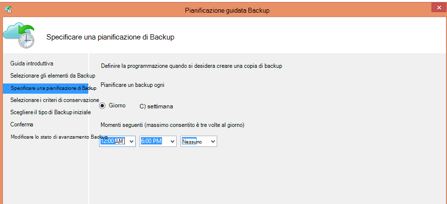
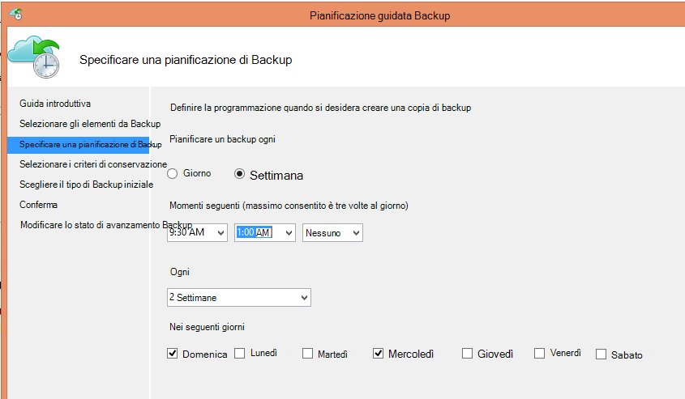
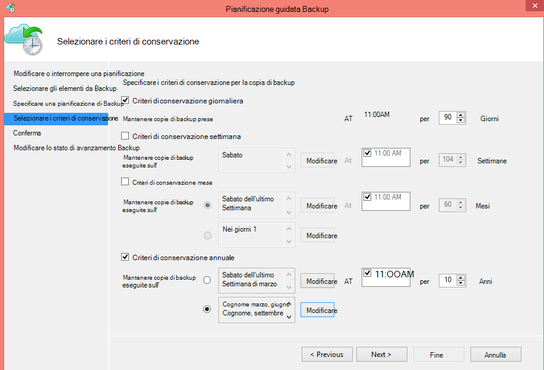
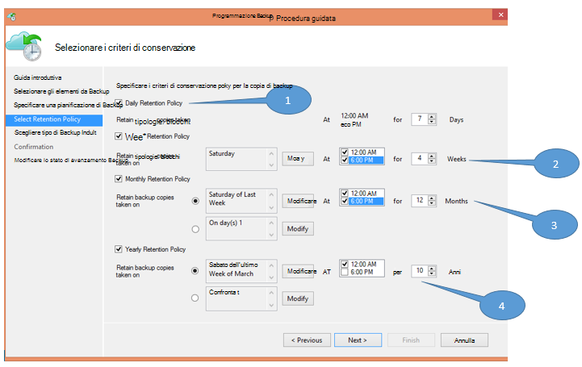
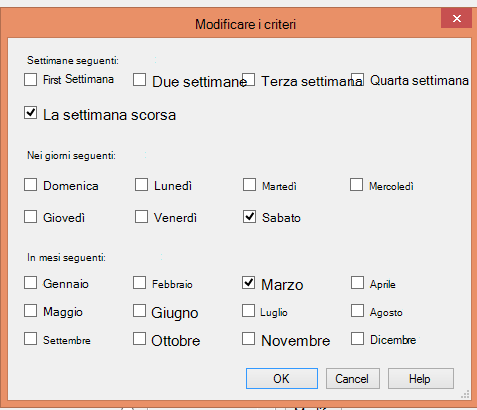

<properties
   pageTitle="Utilizzare il Backup di Azure per sostituire l'infrastruttura di nastro | Microsoft Azure"
   description="Scopri come Backup Azure fornisce semantica mi piace nastro che consente di eseguire il backup e ripristino dei dati di Azure"
   services="backup"
   documentationCenter=""
   authors="trinadhk"
   manager="vijayts"
   editor=""/>
<tags
   ms.service="backup"
   ms.devlang="na"
   ms.topic="article"
   ms.tgt_pltfrm="na"
   ms.workload="storage-backup-recovery"
   ms.date="09/27/2016"
   ms.author="jimpark;trinadhk;markgal"/>

# Utilizzare il Backup di Azure per sostituire l'infrastruttura di nastro

Azure eseguire il Backup e System Center Data Protection Manager consentono di:

- Eseguire il backup dei dati in pianificazioni che alle esigenze dell'organizzazione.
- Mantenere i dati di backup a lungo
- Verificare Azure necessita di una parte del loro conservazione a lungo termine (anziché nastro).

Questo articolo viene spiegato come abilitare i criteri di backup e la conservazione dei clienti. I clienti che utilizzano nastri per risolvere i loro lungo-termine-criteri di conservazione deve ora disponibile un'alternativa valida e potente con la disponibilità di questa caratteristica. La funzionalità è attivata la versione più recente del Backup Azure (disponibile [di seguito](http://aka.ms/azurebackup_agent)). Clienti System Center necessario aggiornare, almeno, Data Protection Manager 2012 R2 UR5 prima di utilizzare Data Protection Manager con il servizio di Backup di Azure.

## Che cos'è la pianificazione di Backup?
La pianificazione di backup indica la frequenza dell'operazione di backup. Ad esempio, le impostazioni nella schermata seguente indicano che backup ogni giorno alle 6 pm e mezzanotte.

I clienti possono inoltre pianificare un backup settimanale. Ad esempio, le impostazioni nella schermata seguente indicano che backup ogni domenica alternativa & mercoledì 9:30 AM e 1.00.

## Che cos'è il criterio di conservazione?
I criteri di conservazione specificano la durata per cui deve essere memorizzato il backup. Anziché solo specificare un criterio"flat" per tutti i punti di backup, i clienti possono specificare criteri diversi criteri di conservazione basati su quando viene eseguito il backup. Il punto di backup eseguito ogni giorno, che funge da un punto di ripristino operativa, ad esempio, viene mantenuto per 90 giorni. Per una durata viene mantenuto il punto di backup eseguito alla fine di ogni trimestre ai fini di controllo.

Il numero totale di "conservazione punti" specificate in questo criterio è 90 (giornalieri punti) + 40 (uno ogni trimestre per dieci anni) = 130.

## Esempio: organizzando entrambe

1. **Criteri di conservazione giornaliera**: backup quotidianamente archiviati per sette giorni.
2. **Criteri di conservazione settimanale**: backup quotidianamente mezzanotte e 6 PM sabato vengono conservate per quattro settimane
3. **Criteri di conservazione mensile**: backup mezzanotte e 6 pm dell'ultimo sabato di ogni mese vengono conservate per 12 mesi
4. **Criteri di conservazione annuale**: backup mezzanotte dell'ultimo sabato di ogni marzo vengono conservate per 10 anni

Il numero totale di "punti di conservazione" (punti da cui un cliente possibile ripristinare i dati) nel diagramma precedente viene calcolata nel modo seguente:

- due punti al giorno per sette giorni = 14 punti di ripristino
- due punti per ogni settimana per quattro settimane = 8 punti di ripristino
- due punti al mese per 12 mesi = 24 punti di ripristino
- un punto all'anno per il ripristino di 10 anni = 10 punti

Il numero totale di punti di ripristino è 56.

> [AZURE.NOTE] Copia di backup Azure non è disponibile una restrizione sul numero di punti di ripristino.

## Configurazione avanzata
Facendo clic su **Modifica** nella schermata precedente, i clienti hanno ulteriormente flessibilità nella specifica le pianificazioni di conservazione.

## Passaggi successivi
Per ulteriori informazioni sui Backup di Azure, vedere:

- [Introduzione a Backup Azure](backup-introduction-to-azure-backup.md)
- [Provare a Backup Azure](backup-try-azure-backup-in-10-mins.md)
