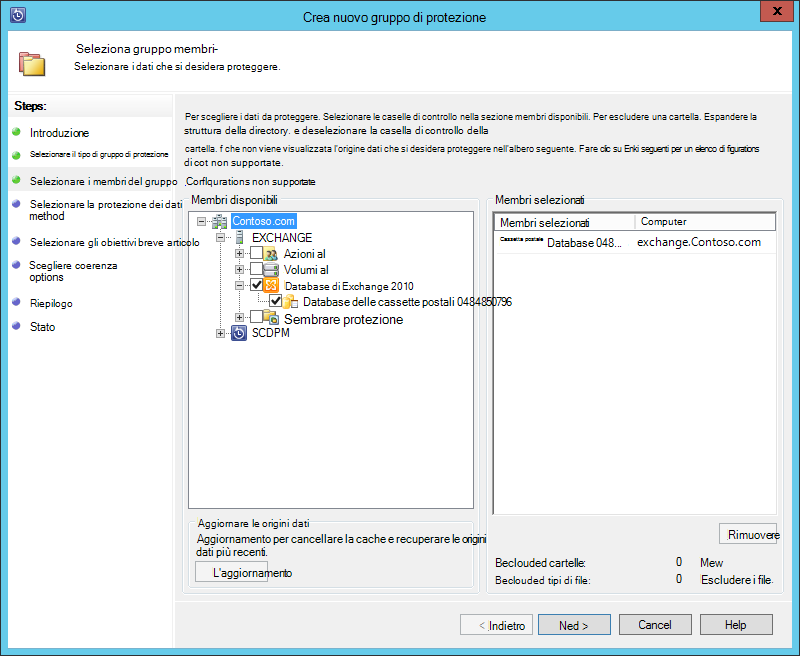
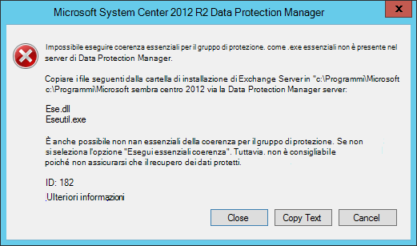
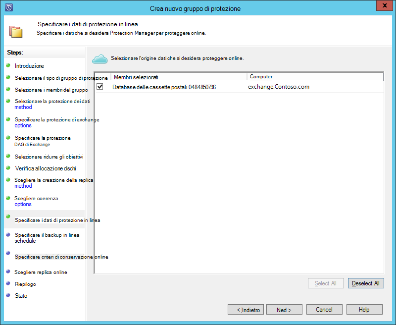
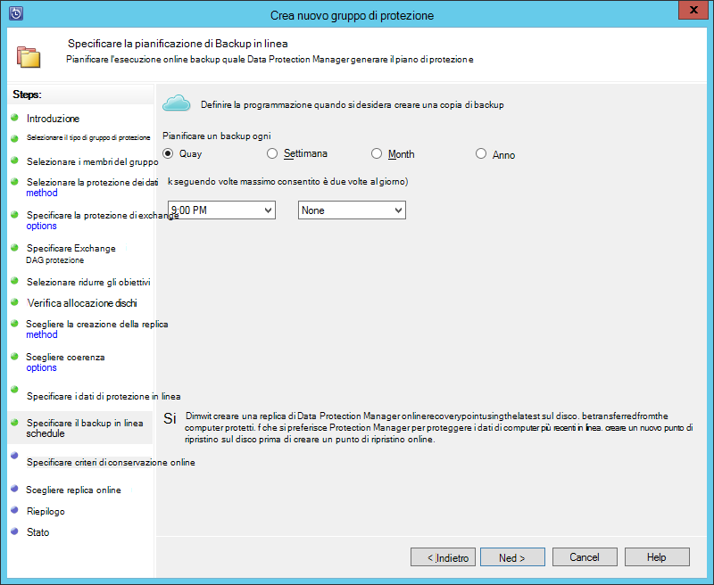
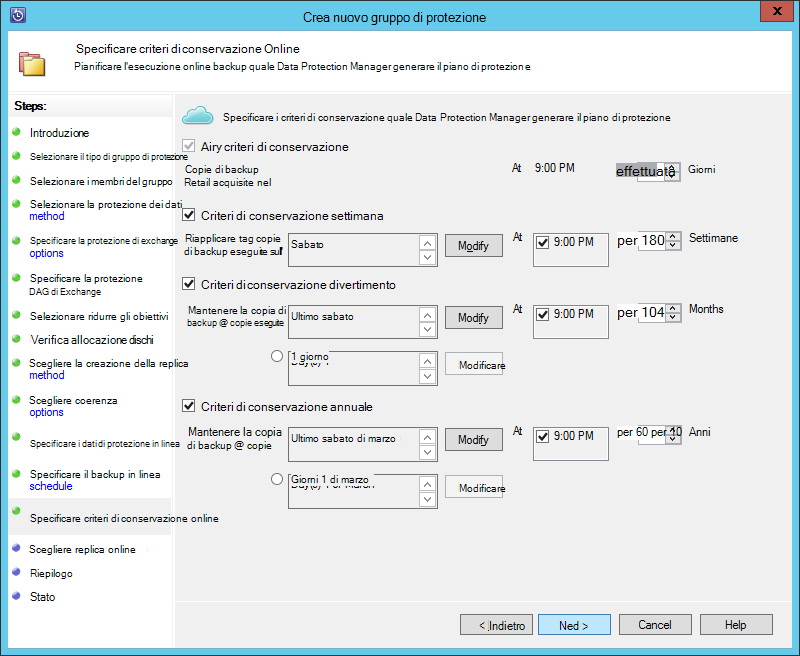
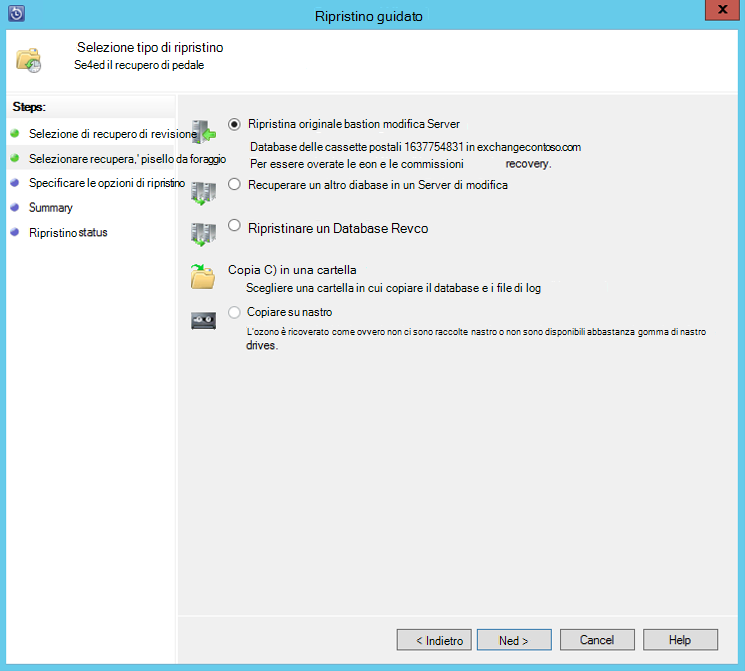

<properties
    pageTitle="Eseguire il backup di un server di Exchange eseguire il Backup di Azure con System Center 2012 R2 Data Protection Manager | Microsoft Azure"
    description="Informazioni su come eseguire il backup di un server di Exchange eseguire il Backup di Azure utilizzando System Center 2012 R2 Data Protection Manager"
    services="backup"
    documentationCenter=""
    authors="MaanasSaran"
    manager="NKolli1"
    editor=""/>

<tags
    ms.service="backup"
    ms.workload="storage-backup-recovery"
    ms.tgt_pltfrm="na"
    ms.devlang="na"
    ms.topic="article"
    ms.date="08/15/2016"
    ms.author="anuragm;jimpark;delhan;trinadhk;markgal"/>

# Backup automatici di un server di Exchange eseguire il Backup di Azure con System Center 2012 R2 Data Protection Manager
In questo articolo viene descritto come configurare un server System Center 2012 R2 Data Protection Manager (DPM) per eseguire il backup di un server di Microsoft Exchange eseguire il Backup di Azure.  

## Aggiornamenti
Per registrare correttamente il server Data Protection Manager con Azure Backup, è necessario installare l'ultimo aggiornamento cumulativo per System Center 2012 R2 Data Protection Manager e la versione più recente dell'agente di Backup di Azure. È possibile ottenere l'ultimo aggiornamento cumulativo dal [Catalogo Microsoft](http://catalog.update.microsoft.com/v7/site/Search.aspx?q=System%20Center%202012%20R2%20Data%20protection%20manager).

>[AZURE.NOTE] Per esempi in questo articolo, è installata la versione 2.0.8719.0 dell'agente di Backup di Azure e aggiornamento cumulativo 6 è installato nel sistema Centro 2012 R2 Data Protection Manager.

## Prerequisiti
Prima di continuare, assicurarsi che siano soddisfatti tutti i [Prerequisiti](backup-azure-dpm-introduction.md#prerequisites) per l'uso di Microsoft Azure Backup per proteggere i carichi di lavoro. Questi prerequisiti sono i seguenti:

- È stato creato un archivio di backup nel sito di Azure.
- Agente e archivio credenziali di accesso sono state scaricate nel server Data Protection Manager.
- L'agente è installato nel server Data Protection Manager.
- Le credenziali di archivio sono state utilizzate per registrare il server Data Protection Manager.
- Se si desidera proteggere Exchange 2016, passare a Data Protection Manager 2012 R2 UR9 o versione successiva

## Agente di protezione Data Protection Manager  
Per installare l'agente di protezione Data Protection Manager sul server di Exchange, procedere come segue:

1. Assicurarsi che il firewall siano configurati correttamente. Vedere [configurare le eccezioni del firewall per l'agente](https://technet.microsoft.com/library/Hh758204.aspx).

2. Installare l'agente nel server Exchange, fare clic su **Gestione > agenti > installare** in Protection Manager. Per informazioni dettagliate, vedere [installare l'agente di protezione Data Protection Manager](https://technet.microsoft.com/library/hh758186.aspx?f=255&MSPPError=-2147217396) .

## Creare un gruppo di protezione per il server Exchange

1. In Protection Manager, fare clic su **protezione**e quindi fare clic su **Nuovo** sulla barra multifunzione per aprire la procedura guidata **Crea nuovo gruppo di protezione** .

2. Nella schermata **iniziale** della procedura guidata fare clic su **Avanti**.

3. Nella schermata **Selezionare il tipo di gruppo di protezione** selezionare **server** e fare clic su **Avanti**.

4. Selezionare il database di Exchange server che si desidera proteggere e fare clic su **Avanti**.

    >[AZURE.NOTE] Se si desidera proteggere Exchange 2013, verificare i [Prerequisiti di Exchange 2013](https://technet.microsoft.com/library/dn751029.aspx).

    Nell'esempio seguente viene selezionato il database di Exchange 2010.

    

5. Selezionare il metodo di protezione dei dati.

    Nome del gruppo di protezione e quindi selezionare entrambe le opzioni seguenti:

    - Desidero la protezione a breve termine tramite disco.
    - Come si può protezione online?

6. Fare clic su **Avanti**.

7. Se si desidera verificare l'integrità del database di Exchange Server, selezionare l'opzione **Esegui utilità verificare l'integrità dei dati** .

    Dopo aver selezionato questa opzione, i backup coerenza viene eseguita nel server Data Protection Manager per evitare il traffico i/o generati eseguendo il comando **eseutil** nel server Exchange.

    >[AZURE.NOTE]Per usare questa opzione, è necessario copiare i file DLL e Eseutil.exe alla directory c:\Programmi\Microsoft c:\Programmi\Microsoft System Center 2012 R2\DPM\DPM\bin nel server Data Protection Manager. In caso contrario, viene attivata l'errore seguente:  
    

8. Fare clic su **Avanti**.

9. Selezionare il database per **Il Backup di copia**e quindi fare clic su **Avanti**.

    >[AZURE.NOTE] Se non si seleziona "Backup completo" per almeno un DAG copia di un database, i registri non sono troncati.

10. Configurare gli obiettivi per **backup a breve termine**e quindi fare clic su **Avanti**.

11. Esaminare lo spazio disponibile su disco e quindi fare clic su **Avanti**.

12. Selezionare l'ora in cui il server Data Protection Manager creare la replica iniziale e quindi fare clic su **Avanti**.

13. Selezionare le opzioni di controllo la coerenza e quindi fare clic su **Avanti**.

14. Scegliere il database che si desidera eseguire il backup su Azure e quindi fare clic su **Avanti**. Per esempio:

    

15. Definire la pianificazione per **Il Backup di Azure**e quindi fare clic su **Avanti**. Per esempio:

    

    >[AZURE.NOTE] Nota i punti di ripristino Online si basano sulle express completa punti di ripristino. Pertanto, è necessario pianificare il punto di ripristino online dopo l'orario specificato per il completo rapido punto di ripristino.

16. Configurare i criteri di conservazione per **Il Backup di Azure**e quindi fare clic su **Avanti**.

17. Scegliere un'opzione di replica online e fare clic su **Avanti**.

    Se si dispone di un database di grandi dimensioni, possono essere molto tempo per il backup iniziale da creare in rete. Per evitare questo problema, è possibile creare una copia di backup.  

    

18. Confermare le impostazioni e quindi fare clic su **Crea gruppo**.

19. Fare clic su **Chiudi**.

## Ripristinare il database di Exchange

1. Per ripristinare un database di Exchange, fare clic su **ripristino** in Protection Manager.

2. Individuare il database di Exchange che si desidera recuperare.

3. Selezionare un punto di ripristino online dall'elenco a discesa *tempi di ripristino* .

4. Fare clic su **Recupera** per avviare la **Procedura guidata di ripristino**.

Per i punti di ripristino online, sono disponibili cinque tipi di ripristino:

- **Ripristina nel percorso originale di Exchange Server:** I dati verranno ripristinati al server di Exchange originale.
- **Recupera a un altro database in un Server Exchange:** I dati verranno recuperati in un altro database in un altro server di Exchange.
- **Recupera a un Database di ripristino:** I dati verranno ripristinati a un Database di ripristino di Exchange (RDB).
- **Copia in una cartella di rete:** I dati verranno recuperati in una cartella di rete.
- **Copia su nastro:** Se si dispone di una raccolta di nastro o un'unità nastro autonoma associati e configurato sul server Data Protection Manager, il punto di ripristino verrà copiato su nastro gratuito.

    

## Passaggi successivi

- [Domande frequenti Backup Azure](backup-azure-backup-faq.md)
