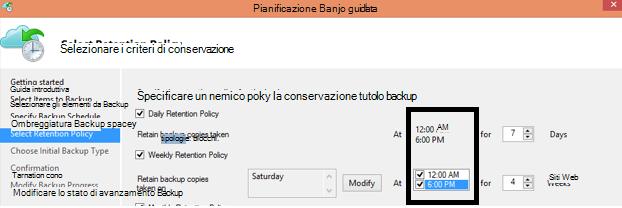

<properties
   pageTitle="Domande frequenti Backup Azure | Microsoft Azure"
   description="Risposte alle domande frequenti su servizio di backup, agente di backup, eseguire il backup e criteri di conservazione, ripristino, sicurezza e altre domande comuni sulla copia di backup e ripristino di emergenza."
   services="backup"
   documentationCenter=""
   authors="markgalioto"
   manager="jwhit"
   editor=""
   keywords="copia di backup e ripristino di emergenza; servizio di backup"/>

<tags
   ms.service="backup"
   ms.workload="storage-backup-recovery"
     ms.tgt_pltfrm="na"
     ms.devlang="na"
     ms.topic="get-started-article"
     ms.date="10/21/2016"
     ms.author="trinadhk; giridham; arunak; markgal; jimpark;"/>

# <a name="azure-backup-service--faq"></a>Servizio di Backup Azure-domande frequenti


In questo articolo è un elenco di domande frequenti e le relative risposte minime sul servizio di Backup di Azure. La community una risposta da inviare rapidamente, e se viene richiesto spesso una domanda, si aggiunge a questo articolo. Le risposte alle domande in genere forniscono riferimento o informazioni di supporto. È possibile porre domande sui Backup di Azure nella sezione Disqus di questo articolo o un articolo correlato. È anche possibile pubblicare domande relative al servizio di Backup di Azure nel [forum di discussione](https://social.msdn.microsoft.com/forums/azure/home?forum=windowsazureonlinebackup).


## <a name="what-is-the-list-of-supported-operating-systems-from-which-i-can-back-up-to-azure-using-azure-backup-br"></a>Che cos'è l'elenco dei sistemi operativi supportati da cui è possibile eseguire il backup di Azure utilizzo del Backup Azure? <br/>
Backup Azure supporta i seguenti sistemi operativi per il backup della cartella di file, mediante un Server di Backup Azure e SCDPM backup delle applicazioni.

| Sistema operativo        | Piattaforma           | SKU  |
| :------------- |-------------| :-----|
| Windows 8 e SP più recente      | a 64 bit | Aziendale, Pro |
| Windows 7 e SP più recente      | a 64 bit | Ultimate, Enterprise, Professional, Home Premium, Home Basic, Starter |
| Windows 8.1 e SP più recente | a 64 bit      |    Aziendale, Pro |
| Windows 10      | a 64 bit | Enterprise, Pro, Home |
|Windows Server 2012 R2 e SP più recente| a 64 bit| Standard, Data Center, Foundation|
|Windows Server 2012 e SP più recente|    a 64 bit| Data Center, Foundation, Standard|
|Windows lo spazio di archiviazione Server 2012 R2 e SP più recente  |a 64 bit|    Standard, gruppo di lavoro|
|Spazio di archiviazione di Windows Server 2012 e SP più recente |a 64 bit |Standard, gruppo di lavoro
|Windows Server 2012 R2 e SP più recente  |a 64 bit|    Essenziali|
|Windows Server 2008 R2 SP1 |a 64 bit|    Standard, Enterprise, Data Center, Foundation|
|Windows Server 2008 SP2    |a 64 bit|    Standard, Enterprise, Data Center, Foundation|

Per il backup di macchine Virtuali di Azure,

- **Linux**: Backup Azure supporta [un elenco delle distribuzioni che approvato Azure](../virtual-machines/virtual-machines-linux-endorsed-distros.md) ad eccezione di base del sistema operativo Linux.  Altri porta-Your-proprietari-distribuzioni Linux anche potrebbero funzionare come agente di macchine Virtuali è disponibile nel computer virtuale e il supporto per Python esiste.
- **Windows Server**: versioni antecedenti a Windows Server 2008 R2 non sono supportate.

## <a name="where-can-i-download-the-latest-azure-backup-agent-br"></a>Dove è possibile scaricare l'agente di Azure Backup più recente? <br/>
È possibile scaricare l'agente più recente per il backup di Windows Server, System Center DPM o client di Windows, da [qui](http://aka.ms/azurebackup_agent). Se si desidera eseguire il backup una macchina virtuale, utilizzare l'agente di macchine Virtuali (che installa automaticamente l'estensione appropriata). Agente di macchine Virtuali è già presenta in macchine virtuali create nella raccolta Azure.

## <a name="which-version-of-scdpm-server-is-supported-br"></a>La versione del server SCDPM è supportata? <br/>
È consigliabile installare [l'ultima](http://aka.ms/azurebackup_agent) agente di Backup di Azure nell'ultimo aggiornamento cumulativo di SCDPM (UR11 prima del 2016 agosto)

## <a name="when-configuring-the-azure-backup-agent-i-am-prompted-to-enter-the-vault-credentials-do-vault-credentials-expire"></a>Quando si configura l'agente di Backup di Azure, viene richiesto di immettere le credenziali di archivio. Archivio credenziali scadono?
Sì, le credenziali di archivio scadono dopo 48 ore. Se il file scade, accedere al portale di Azure e scaricare i file di archivio credenziali dall'archivio.

## <a name="is-there-any-limit-on-the-number-of-vaults-that-can-be-created-in-each-azure-subscription-br"></a>È possibile eventuali limiti al numero di archivi che possono essere creati in ciascuna sottoscrizione Azure? <br/>
Sì. In settembre 2016, è possibile creare 25 archivi di backup per abbonamento. È possibile creare fino a 25 archivi di servizi di recupero per ogni regione supportati di Azure backup per abbonamento. Se è necessario più archivi, creare una nuova sottoscrizione.

## <a name="are-there-any-limits-on-the-number-of-serversmachines-that-can-be-registered-against-each-vault-br"></a>Esistono eventuali limiti al numero di server/computer che possono essere registrati rispetto a ogni archivio? <br/>
Sì, è possibile registrare fino a 50 macchine per archivio. Per le macchine virtuali di Azure IaaS, limite è 200 macchine virtuali per singolo archivio. Se è necessario eseguire la registrazione più macchine, creare un nuovo archivio.

## <a name="how-do-i-register-my-server-to-another-datacenterbr"></a>Come è possibile registrare il server a un'altra Data Center?<br/>
Dati di backup viene inviati al Data Center dell'archivio in cui è stata registrata. Il modo più semplice per modificare la data center consiste nel disinstallare l'agente e reinstallare l'agente e registrare un nuovo archivio che appartiene al Data Center desiderato.

## <a name="what-happens-if-i-rename-a-windows-server-that-is-backing-up-data-to-azurebr"></a>Cosa succede se si rinomina un server di Windows che backup dei dati di Azure?<br/>
Quando si rinomina un server, vengono interrotti tutti i backup attualmente configurati.
È necessario registrare il nuovo nome del server di archivio di Backup. Quando si crea una nuova registrazione, l'operazione di backup prima è un backup completo e non un backup incrementale. Se è necessario ripristinare i dati che è stato il backup in precedenza per l'archivio con il nome del server precedente, è possibile recuperare i dati utilizzando l'opzione di [**un altro server**](backup-azure-restore-windows-server.md#recover-to-an-alternate-machine) della procedura guidata di **Recupero dati** .

## <a name="what-types-of-drives-can-i-backup-files-and-folders-from-br"></a>Quali tipi di unità è backup file e cartelle da? <br/>
Le seguenti unità/volumi non riesce ad accedere backup:

- Supporto rimovibile: L'unità deve creare report usato fisse da un'origine di elemento di backup.
- Volumi di sola lettura: il volume deve essere modificabile per il volume ombreggiatura copia servizio alla funzione.
- Non in linea volumi: Il volume deve essere online per VSS alla funzione.
- Condivisione di rete: il volume deve essere locale al server per eseguire il backup con backup in linea.
- BitLocker volumi protetti: il volume deve essere sbloccato prima di eseguire il backup è.
- Identificazione del sistema di file: NTFS è l'unico file system supportata per questa versione del servizio di backup in linea.

## <a name="what-file-and-folder-types-can-i-back-up-from-my-serverbr"></a>Quali tipi di file e cartelle è possibile eseguire il backup dal server?<br/>
Sono supportati i tipi seguenti:

- Crittografato
- Compresso
- Caricato in memoria bassa
- Compresso + caricato in memoria bassa
- Collegamenti fissi: Non è supportato, ignorato
- Punto di analisi: Non è supportato, ignorato
- Crittografati + compressi: Non è supportato, ignorato
- Crittografato + caricato in memoria bassa: Non è supportato, ignorato
- Flusso compresso: Non è supportato, ignorato
- Flusso caricato in memoria bassa: Non è supportato, ignorato

## <a name="whats-the-minimum-size-requirement-for-the-cache-folder-br"></a>Che cos'è il requisito di dimensione minima per la cartella della cache? <br/>
Le dimensioni della cartella della cache determinano la quantità di dati che esegue il backup. La cartella della cache dovrebbe essere 5% di spazio necessario per la memorizzazione dei dati.

## <a name="if-my-organization-has-one-vault-how-can-i-isolate-one-servers-data-from-another-server-when-restoring-databr"></a>Se la propria organizzazione ha un archivio, come è isolare dati del server da un altro server quando il ripristino dei dati?<br/>
Tutti i server registrati per lo stesso archivio possano recuperare i dati da altri server *che utilizzano la stessa passphrase*il backup. Se si dispone di server con dati backup che si desidera isolare da altri server all'interno dell'organizzazione, è possibile utilizzare una frase designata per i server. Server di risorse umane, ad esempio, possibile utilizzare una passphrase di crittografia, contabilità server un altro spazio di archiviazione server e una terza.

## <a name="can-i-migrate-my-backup-data-or-vault-between-subscriptions-br"></a>È possibile "migrare" i dati di backup o archivio tra abbonamenti? <br/>
No. L'archivio viene creato un livello di abbonamento e non è possibile riassegnare a un'altra sottoscrizione dopo averla creata.

## <a name="does-the-azure-backup-agent-work-on-a-server-that-uses-windows-server-2012-deduplication-br"></a>L'agente di Backup Azure funziona su un server che utilizza Windows Server 2012 deduplication? <br/>
Sì. Il servizio agente converte i dati deduplicated ai dati normale quando prepara l'operazione di backup. Ottimizza quindi i dati per il backup, vengono crittografati i dati e quindi invia dati crittografati al servizio di backup in linea.

## <a name="if-i-cancel-a-backup-job-once-it-has-started-is-the-transferred-backup-data-deleted-br"></a>Se si annulla un processo di backup dopo l'avvio, viene eliminati i dati di backup trasferiti? <br/>
No. Archivio di backup sono archiviati i dati di backup trasferiti fino al momento dell'annullamento. Copia di Backup Azure utilizza un meccanismo di verifica occasionalmente aggiungere punti di controllo ai dati di backup durante il backup. Perché sono presenti punti di controllo nei dati di backup, il processo di backup successivo consente di verificare l'integrità dei file. Backup successivo attivato sarebbe incrementale sopra i dati che erano stato eseguito il backup in precedenza. Un backup incrementale offre migliore utilizzo della larghezza di banda, in modo che non è necessario trasferire ripetutamente gli stessi dati.

In caso di backup di macchine Virtuali di Azure, dopo il processo viene annullato, dati trasferiti viene ignorati e copia di backup aggiornata trasferisce dati incrementali dal processo di backup completato in precedenza.

## <a name="why-am-i-seeing-the-warning-azure-backups-have-not-been-configured-for-this-server-even-though-i-had-scheduled-regular-backups-previously-br"></a>Perché viene visualizzato l'avviso "Backup Azure non sono stati configurati per il server" anche se è ho pianificato backup regolari in precedenza? <br/>
Questo avviso si verifica quando le impostazioni di pianificazione di backup archiviate nel server locale non corrispondono alle impostazioni salvate nell'archivio di backup. Quando il server o le impostazioni sono state ripristinate stato valido, le pianificazioni di backup possono perdere la sincronizzazione. Se si riceve questo avviso, [riconfigurare i criteri di backup](backup-azure-manage-windows-server.md) e quindi **Eseguire Effettua backup** per sincronizzare di nuovo il server locale con Azure.

## <a name="what-firewall-rules-should-be-configured-for-azure-backup-br"></a>Quali firewall regole devono essere configurate per il Backup di Azure? <br/>
Per protezione trasparente dei dati in locale-per Azure e carico di lavoro di Azure, è consigliabile consentire del firewall comunicare con gli URL seguenti:

- www.msftncsi.com
- \*. Microsoft.com
- \*. WindowsAzure.com
- \*. microsoftonline.com
- \*. windows.net

##<a name="can-i-install-the-azure-backup-agent-on-an-azure-vm-already-backed-by-the-azure-backup-service-using-the-vm-extension-br"></a>È possibile installare l'agente di Backup di Azure in una macchina virtuale Azure già stato eseguito il dal servizio di Backup di Azure utilizzando l'estensione macchine Virtuali? <br/>
Assolutamente. Copia di Backup Azure fornisce backup a livello di macchine Virtuali per macchine virtuali di Azure utilizzando l'estensione macchine Virtuali. È possibile installare l'agente di Azure Backup in un sistema operativo Windows Guest per proteggere i file e cartelle in tale sistema operativo guest.

## <a name="can-i-install-the-azure-backup-agent-on-an-azure-vm-to-back-up-files-and-folders-present-on-temporary-storage-provided-by-the-azure-vm-br"></a>È possibile installare l'agente di Backup di Azure in una macchina virtuale Azure eseguire il backup di file e cartelle presente allo spazio di memorizzazione temporaneo fornito da macchina virtuale Azure? <br/>
È possibile installare l'agente di Backup di Azure nel sistema operativo Windows Guest e backup automatici di file e cartelle nell'archivio temporaneo. Tuttavia, si noti che i backup non quando si seleziona la cancellazione dei dati di memorizzazione temporaneo. Inoltre, se i dati di memorizzazione temporaneo sono stati eliminati, è possibile ripristinare solo allo spazio di archiviazione non volatili.

## <a name="i-have-installed-azure-backup-agent-to-protect-my-files-and-folders-can-i-now-install-scdpm-to-work-with-azure-backup-agent-to-protect-on-premises-applicationvm-workloads-to-azure-br"></a>È stato installato agente di Backup di Azure per proteggere i file e cartelle. È possibile ora installare SCDPM per lavorare con l'agente di Backup di Azure per proteggere i carichi di lavoro di applicazione/macchine Virtuali locale in Azure? <br/>
Per utilizzare il Backup di Azure con SCDPM, è consigliabile installare SCDPM prima di tutto e quindi solo per installare l'agente di Backup di Azure. Questo garantisce integrazione dell'agente di Backup di Azure con SCDPM e consente di proteggere i file e le cartelle, applicazione carichi di lavoro e macchine virtuali di Azure, direttamente dalla console di gestione di SCDPM. L'installazione di SCDPM dopo l'installazione di Azure Backup agente ai fini indicati in precedenza non consigliato o supportato.

## <a name="what-is-the-length-of-file-path-that-can-be-specified-as-part-of-azure-backup-policy-using-azure-backup-agent-br"></a>Che cos'è la lunghezza del percorso di file che può essere specificato come parte dei criteri di Backup di Azure tramite l'agente di Backup di Azure? <br/>  
Agente di Backup Azure si basa su NTFS. [Specifica di lunghezza percorso file è limitata da API di Windows](https://msdn.microsoft.com/library/aa365247.aspx#fully_qualified_vs._relative_paths). In caso di backup dei file con lunghezza massima maggiore di quelli specificati dall'API di Windows, clienti possono scegliere di eseguire il backup della cartella padre o l'unità disco del file di backup.  

## <a name="what-characters-are-allowed-in-file-path-of-azure-backup-policy-using-azure-backup-agent-br"></a>Quali caratteri consentiti nel percorso del file dei criteri di Backup di Azure tramite l'agente di Backup di Azure? <br>  
 Agente di Backup Azure si basa su NTFS. In questo modo [NTFS supportata caratteri](https://msdn.microsoft.com/library/aa365247.aspx#naming_conventions) all'interno della specifica del file.  

## <a name="can-i-use-azure-backup-server-to-create-a-bare-metal-recovery-bmr-backup-for-a-physical-server-br"></a>È possibile utilizzare Server Backup Azure per creare un backup Bare metallo ripristino (BMR) per un server fisico? <br/>
Sì.

## <a name="can-i-configure-the-backup-service-to-send-mail-if-a-backup-job-fails-br"></a>È possibile configurare il servizio di Backup per inviare posta elettronica se un processo di backup non riesce? <br/>
Sì, il servizio di Backup include numerosi avvisi basate su eventi che possono essere usati con uno script di PowerShell. Per una descrizione completa, vedere [le notifiche di avviso](backup-azure-manage-vms.md#alert-notifications)

## <a name="is-there-a-limit-on-the-size-of-each-data-source-being-backed-up-br"></a>È previsto un limite alle dimensioni di ogni origine dati viene eseguito il backup? <br/>
Mentre a livello di archivio non c'è alcun limite per la quantità di dati è possibile eseguire il backup, Azure Backup stabilire una restrizione (per tutti gli usi pratici questi limiti sono molto elevati) alle dimensioni massime dell'origine dati. Al mese di agosto 2015, l'origine dati di dimensioni massime per i sistemi operativi supportati è:

|S.No | Sistema operativo |  Dimensione massima di origine dati |
| :-------------: |:-------------| :-----|
|1| Windows Server 2012 o versione successiva| GB 54400|
|2| Windows 8 o versione successiva| GB 54400|
|3| Windows Server 2008, Windows Server 2008 R2 | GB 1700|
|4| Windows 7 | GB 1700|

Nella tabella seguente viene illustrato come viene determinato ogni dimensione di origine dati.

|   Origine dati  |   Dettagli |
| :-------------: |:-------------|
|Volume |La quantità di dati da backup da singolo volume di un computer server o client|
|Macchina virtuale Hyper-V | Somma dei dati di tutti i dischi rigidi virtuali della macchina virtuale viene eseguito il backup|
|Database di Microsoft SQL Server | Dimensione del singolo SQL database viene eseguito il backup |
|Microsoft SharePoint |Somma dei database del contenuto e configurazione all'interno di una farm di SharePoint viene eseguito il backup|
|Microsoft Exchange |Somma di tutti i database di Exchange in un server di Exchange viene eseguito il backup|
|Stato BMR/sistema |Ogni singola copia BMR o stato del sistema del computer viene eseguito il backup|

## <a name="are-there-limits-on-the-number-of-times-a-backup-job-can-be-scheduled-per-daybr"></a>Esistono limiti al numero di volte in cui che un processo di backup può essere pianificato al giorno?<br/>
Sì, è possibile eseguire processi di backup in Windows Server o client Windows fino a tre volte / giorno. È possibile eseguire processi di backup su System Center DPM due volte al giorno. È possibile eseguire un processo di backup per macchine virtuali IaaS una volta al giorno.

## <a name="is-there-a-difference-between-the-scheduling-policy-for-dpm-and-windows-server-ie-on-windows-server-without-dpm-br"></a>Esiste una differenza tra i criteri di programmazione per Data Protection Manager e Windows Server (ad esempio Windows Server senza Data Protection Manager)? <br/>
Sì. Usa Data Protection Manager, è possibile specificare le pianificazioni giornaliere, settimanale, mensile e annuale. Windows Server (senza Data Protection Manager) consente di specificare solo le pianificazioni giornaliere e settimanale.

## <a name="is-there-a-difference-between-the-retention-policy-for-dpm-and-windows-serverclient-ie-on-windows-server-without-dpmbr"></a>Esiste una differenza tra i criteri di conservazione per Data Protection Manager e Windows Server/client (ad esempio Windows Server senza Data Protection Manager)?<br/>
No, entrambi Data Protection Manager e client/Server Windows hanno ogni giorno, i criteri di conservazione settimanale, mensile e annuale.

## <a name="can-i-configure-my-retention-policies-selectively--ie-configure-weekly-and-daily-but-not-yearly-and-monthlybr"></a>È possibile configurare la conservazione dei criteri di configurare in modo selettivo, vale a dire settimanale e giornaliera, ma non annuale e mensile?<br/>
Sì, la struttura di criteri di conservazione Backup Azure consente di disporre della massima flessibilità nella definizione i criteri di conservazione in base alle proprie esigenze.

## <a name="can-i-schedule-a-backup-at-6pm-and-specify-retention-policies-at-a-different-timebr"></a>È possibile "pianificare un backup" 6 ore e specificare "criteri di conservazione" in un momento diverso?<br/>
No. Criteri di conservazione possono essere applicati solo nei punti di backup. Nell'immagine seguente viene specificato i criteri di conservazione per i backup eseguiti in 12 am e pm 6. <br/>


<br/>

## <a name="is-an-incremental-copy-transferred-for-the-retention-policies-scheduled-br"></a>Una copia incrementale trasferita per i criteri di conservazione pianificati? <br/>
No, copia incrementale viene inviata in base alla data indicata nella pagina pianificazione backup. I punti che possono essere mantenuti sono determinati in base ai criteri di conservazione.

## <a name="if-a-backup-is-retained-for-a-long-duration-does-it-take-more-time-to-recover-an-older-data-point-br"></a>Se viene conservata una copia di backup per un periodo di tempo, è necessario più tempo per recuperare un punto dati nei formati precedenti? <br/>
 No: il tempo necessario per recuperare la meno recente o il punto di versioni più recente è lo stesso. Ogni punto di ripristino si comporta come un punto completo.

## <a name="if-each-recovery-point-is-like-a-full-point-does-it-impact-the-total-billable-backup-storagebr"></a>Se ogni punto di ripristino è ad esempio un punto completo, un impatto sulle fatturabile spazio di archiviazione backup totale?<br/>
Prodotti punto conservazione a lungo termine tipici archiviare dati di backup come punti completi. I punti completi sono lo spazio di archiviazione *inefficace* ma più semplice e rapido per il ripristino. Copie incrementali sono lo spazio di archiviazione *efficiente* , ma è necessario ripristinare una serie di dati, che influisce sui tempi di ripristino. Architettura di archiviazione di Backup Azure fornisce combinazione ottimale da in modo ottimale memorizzazione dei dati per le operazioni di ripristino rapidi e sostenere i costi di bassa dello spazio di archiviazione. Questo approccio di spazio di archiviazione dati garantisce ingresso e in uscita della larghezza di banda viene utilizzato in modo efficiente. La quantità di spazio di archiviazione di dati e il tempo necessario per recuperare i dati, viene mantenuta al minimo. Informazioni su altre informazioni su come salvare [incrementali](https://azure.microsoft.com/blog/microsoft-azure-backup-save-on-long-term-storage/) sono efficienti.

## <a name="is-there-a-limit-on-the-number-of-recovery-points-that-can-be-createdbr"></a>È previsto un limite al numero di punti di ripristino che è possibile creare?<br/>
No. È stato eliminato limiti punti di ripristino. È possibile creare il numero di punti di ripristino come desiderato.

## <a name="why-is-the-amount-of-data-transferred-in-backup-not-equal-to-the-amount-of-data-i-backed-upbr"></a>Perché la quantità di dati viene trasferita nel backup non è uguale alla quantità di dati che è stato eseguito il backup?<br/>
 Tutti i dati che viene eseguito il backup da Azure Backup Agent o SCDPM o Server di Backup di Azure, è compresso e crittografato prima trasferiti. Dopo aver creato la compressione e la crittografia viene applicata, i dati nell'archivio di backup consiste 30-40% più piccoli.

## <a name="is-there-a-way-to-adjust-the-amount-of-bandwidth-used-by-the-backup-servicebr"></a>Esiste un modo per regolare la larghezza di banda utilizzato dal servizio di Backup?<br/>
 Sì, è possibile utilizzare l'opzione di **Modificare le proprietà** in agente di Backup per regolare la larghezza di banda. Modificare la quantità di larghezza di banda e gli orari quando si utilizza la larghezza di banda. Per ulteriori informazioni, vedere [Limitazione della rete](../backup-configure-vault.md#enable-network-throttling).

## <a name="my-internet-bandwidth-is-limited-for-the-amount-of-data-i-need-to-back-up-is-there-a-way-i-can-move-data-to-a-certain-location-with-a-large-network-pipe-and-push-that-data-into-azure-br"></a>La larghezza di banda internet è limitata per la quantità di dati che è necessario eseguire il backup. Esiste un modo è possibile spostare dati di una determinata posizione con una rete estesa tubazioni e inserire i dati nell'Azure? <br/>
È possibile eseguire il backup dei dati in Azure tramite il processo di backup online standard oppure è possibile utilizzare il servizio di Azure Importa/Esporta per trasferire i dati per l'archiviazione in Azure blob. Non sono disponibili altre soluzioni di affrontare data backup archiviazione Azure. Per informazioni su come utilizzare il servizio di importazione/esportazione Azure con Azure Backup, vedere l'articolo [Offline Backup flusso di lavoro](backup-azure-backup-import-export.md) .

## <a name="how-many-recoveries-can-i-perform-on-the-data-that-is-backed-up-to-azurebr"></a>Quanti ripristini è possibile eseguire sui dati che viene eseguito il backup di Azure<br/>
Non esiste alcun limite al numero di ripristini da Azure Backup.

## <a name="do-i-have-to-pay-for-the-egress-traffic-from-azure-data-center-during-recoveriesbr"></a>È necessario pagare il traffico in uscita dall'interfaccia di Azure dati durante il ripristino?<br/>
 No. Il ripristino è gratuito e non addebitate per il traffico in uscita.

## <a name="is-the-data-sent-to-azure-encrypted-br"></a>I dati vengono inviati a Azure crittografato? <br/>
Sì. I dati vengono crittografati nel computer client/server/SCDPM locale tramite AES256 e i dati vengono inviati tramite un collegamento HTTPS protetto.

## <a name="is-the-backup-data-on-azure-encrypted-as-wellbr"></a>Contiene i dati di backup Azure anche crittografati?<br/>
 Sì. I dati inviati al Azure rimangano crittografati (al resto). Microsoft non decrittografa i dati di backup in qualsiasi momento. Per il backup di macchine Virtuali di Azure, Azure Backup si basa sulla crittografia della macchina virtuale ad esempio, se la macchina virtuale è crittografata tramite la crittografia del Azure o altri tecnologia di crittografia, Azure Backup utilizza la crittografia per proteggere i dati.

## <a name="what-is-the-minimum-length-of-encryption-key-used-to-encrypt-backup-data-br"></a>Che cos'è la lunghezza minima della chiave di crittografia utilizzato per crittografare i dati di backup? <br/>
 La chiave di crittografia deve essere almeno 16 caratteri.

## <a name="what-happens-if-i-misplace-the-encryption-key-can-i-recover-the-data-or-can-microsoft-recover-the-data-br"></a>Cosa succede se sono disponibili la chiave di crittografia? È possibile recuperare i dati (o) consente di Microsoft recuperare i dati? <br/>
La chiave utilizzata per crittografare i dati di backup è presenta solo nella sede del cliente. Microsoft non conserva una copia in Azure e non ha qualsiasi accesso alla chiave. Se il cliente misplaces la chiave, Microsoft non è possibile recuperare i dati di backup.

## <a name="how-do-i-change-the-cache-location-specified-for-the-azure-backup-agentbr"></a>Come è possibile modificare il percorso della cache specificato per l'agente di Backup di Azure?<br/>
 Elaborata in sequenza l'elenco puntato seguente per modificare il percorso della cache.
- Interrompere il motore di Backup eseguendo il seguente comando in un prompt dei comandi con privilegi elevato:

  ```PS C:\> Net stop obengine```

- Non si spostano i file. Se, tuttavia, copiare la cartella di spazio di cache in un'unità diversa con spazio sufficiente. Dopo aver verificato che i backup lavora con la nuova area di cache, è possibile rimuovere spazio cache originale.

- Aggiornare le voci del Registro di sistema seguenti con il percorso per la nuova cartella di spazio di cache.<br/>

|Percorso del Registro di sistema | Chiave del Registro di sistema | Valore |
| ------ | ------- | ------|
| `HKEY_LOCAL_MACHINE\SOFTWARE\Microsoft\Windows Azure Backup\Config` | ScratchLocation | *Nuovo percorso della cartella della cache* |
| `HKEY_LOCAL_MACHINE\SOFTWARE\Microsoft\Windows Azure Backup\Config\CloudBackupProvider` | ScratchLocation | *Nuovo percorso della cartella della cache* |

- Riavviare il motore di Backup eseguendo il seguente comando in un prompt dei comandi con privilegi elevato:

  ```PS C:\> Net start obengine```

  Dopo la creazione di backup è stata completata nel nuovo percorso della cache, è possibile rimuovere la cartella della cache originale.

## <a name="where-can-i-put-the-cache-folder-for-the-azure-backup-agent-to-work-as-expectedbr"></a>Nel punto in cui si desidera inserire la cartella della cache per l'agente di Backup Azure a funzionare come previsto?<br/>
Posizioni seguenti per la cartella della cache non è consigliabile:

- Condivisione di rete supporti rimovibili: la cartella della cache deve trovarsi nel server che richiedono backup utilizzando backup in linea. Percorsi di rete o rimovibile, ad esempio le unità USB non sono supportate.
- Volumi non in linea: La cartella della cache deve essere online per backup previsto con l'agente di Backup Azure.

## <a name="are-there-any-attributes-of-the-cache-folder-that-are-not-supportedbr"></a>Sono disponibili gli attributi della cartella della cache che non sono supportati?<br/>
 Gli attributi seguenti o le relative combinazioni non sono supportati per la cartella della cache:

- Crittografato
- Deselezionare duplicato
- Compresso
- Caricato in memoria bassa
- Punto di analisi

È consigliabile che la cartella della cache né i metadati disco rigido virtuale con gli attributi sopra per il funzionamento previsto dell'agente di Backup di Azure.
