<properties
   pageTitle="Azure Backup - backup non in linea o iniziale inizializzare mediante il servizio di importazione/esportazione Azure | Microsoft Azure"
   description="Informazioni su come Backup Azure consente di inviare i dati connessi alla rete mediante il servizio di Azure Importa/Esporta. Questo articolo viene spiegato seeding offline dei dati di backup iniziali tramite il servizio di Azure Importa Esporta."
   services="backup"
   documentationCenter=""
   authors="saurabhsensharma"
   manager="shivamg"
   editor=""/>
<tags
   ms.service="backup"
   ms.devlang="na"
   ms.topic="article"
   ms.tgt_pltfrm="na"
   ms.workload="storage-backup-recovery"
   ms.date="08/16/2016"
   ms.author="jimpark;saurabhsensharma;nkolli;trinadhk"/>

# Flusso di lavoro di backup non in linea in Azure Backup
Copia di Backup Azure è diverse efficienza predefinito che risparmiare sui costi di rete e di archiviazione aggiuntivo durante i backup completi iniziali dei dati di Azure. Backup completi iniziale in genere trasferire grandi quantità di dati e richiedono più larghezza di banda di rete rispetto alla successivo backup che trasferire solo il delta/incrementali. Copia di Backup Azure comprime backup iniziale. Il processo di seeding offline Backup Azure consente dischi per caricare compressi iniziali dati di backup non in linea in Azure.  

Il processo di Backup di Azure offline seeding è strettamente integrato con il [servizio di importazione/esportazione Azure](../storage/storage-import-export-service.md) che consente di trasferire i dati di Azure utilizzando dischi. Se si dispone di terabyte (TB) iniziali dei dati di backup che deve essere trasferiti tramite una rete ad alta latenza e larghezza di banda ridotta, è possibile utilizzare il flusso di lavoro non in linea seeding per spedire la copia di backup iniziale in uno o più dischi rigidi per un Data Center di Azure. In questo articolo viene fornita una panoramica dei passaggi che completano il flusso di lavoro.

## Panoramica

Con la funzionalità offline seeding di Backup di Azure e Azure importazione/esportazione è semplice da caricare dati offline Azure tramite dischi. Invece di trasferire la copia completa iniziale in rete, i dati di backup scrivere un *percorso di gestione temporanea*. Una volta completata la copia nella posizione di gestione temporanea utilizzando lo strumento di Azure importazione/esportazione, questi dati sono scritto a uno o più unità SATA, a seconda della quantità di dati. Queste unità non hanno un limite vengono spedite al Data Center di Azure più vicino.

[Aggiornamento di agosto 2016 di Azure Backup (e versioni successive)](http://go.microsoft.com/fwlink/?LinkID=229525) include lo *strumento di preparazione del disco di Azure*, denominata AzureOfflineBackupDiskPrep, che:

   - Consente di preparare le unità per l'importazione di Azure utilizzando lo strumento di Azure Importa/Esporta.
   - Nel [portale classica Azure](https://manage.windowsazure.com) anziché creare la stessa manualmente con le versioni precedenti di Backup di Azure viene creato automaticamente un processo di importazione di Azure per il servizio di Azure Importa/Esporta.

Al termine del caricamento di dati di backup in Azure, Azure Backup consente di copiare i dati di backup archivio di backup e gli incrementali vengono programmate.

  > [AZURE.NOTE] Per usare lo strumento di preparazione disco Azure, assicurarsi che è stato installato l'aggiornamento di agosto 2016 di Azure Backup (o versioni successive) ed eseguire tutti i passaggi del flusso di lavoro con il. Se si utilizza una versione precedente di Backup di Azure, è possibile preparare l'unità SATA utilizzando lo strumento di Azure Importa/Esporta come descritto nelle sezioni successive di questo articolo.

## Prerequisiti

- [Acquisire familiarità con il flusso di lavoro di Azure Importa/Esporta](../storage/storage-import-export-service.md).
- Prima di avviare il flusso di lavoro, verificare quanto segue:
    - È stato creato un archivio di Backup di Azure.
    - Archivio credenziali sono state scaricate.
    - L'agente di Azure Backup è stato installato nel client di Windows Server e Windows o server System Center Data Protection Manager e il computer è registrato con l'archivio di Backup di Azure.
- [Scaricare le impostazioni del file Azure pubblica](https://manage.windowsazure.com/publishsettings) nel computer da cui si prevede di eseguire il backup dei dati.
- Preparare un percorso di gestione temporaneo, che può essere una condivisione di rete o altre unità del computer. Il percorso di gestione temporaneo è lo spazio di archiviazione temporaneo e viene utilizzato temporaneamente durante il flusso di lavoro. Assicurarsi che il percorso di gestione temporaneo disponga di spazio sufficiente per contenere la copia iniziale. Ad esempio, se si tenta di eseguire il backup di un file di 500 GB server, assicurarsi che l'area di gestione temporanea è almeno 500 GB. (A causa di compressione viene utilizzato un importo inferiore).
- Verificare che si sta usando un'unità supportata. Unità disco rigido SATA II/III solo 3,5 sono supportate per l'utilizzo con il servizio di importazione/esportazione. Dischi rigidi superiori a 8 TB non sono supportati. È possibile allegare un disco SATA II/III esternamente alla maggior parte dei computer utilizzando una scheda SATA II/III USB. Consultare la documentazione di Azure Importa/Esporta per il set più recente di unità che supporta il servizio.
- Abilitare BitLocker nel computer in cui è connesso il writer di unità SATA.
- [Scaricare lo strumento di Azure Importa/Esporta](http://go.microsoft.com/fwlink/?LinkID=301900&clcid=0x409) sul computer in cui il SATA unità writer è connesso. Questo passaggio non è necessario se si ha scaricato e installato l'aggiornamento di agosto 2016 di Azure Backup (o versioni successive).

## Flusso di lavoro
Le informazioni contenute in questa sezione consentono di completare il flusso di lavoro di backup non in linea in modo che i dati possono essere recapitati a un Data Center Azure e caricamento di archiviazione Azure. Nel caso di problemi con il servizio di importazione o qualsiasi aspetto del processo, vedere la documentazione di [Panoramica del servizio di importazione](../storage/storage-import-export-service.md) citata in precedenza.

### Avviare il backup non in linea

1. Quando si pianifica una copia di backup, viene visualizzata la schermata seguente (in Windows Server, client di Windows o System Center Data Protection Manager).

    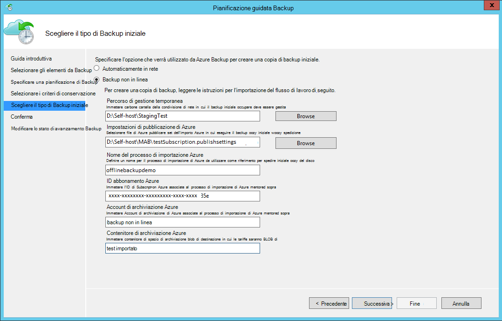

    Ecco la schermata corrispondente in System Center Data Protection Manager:  
    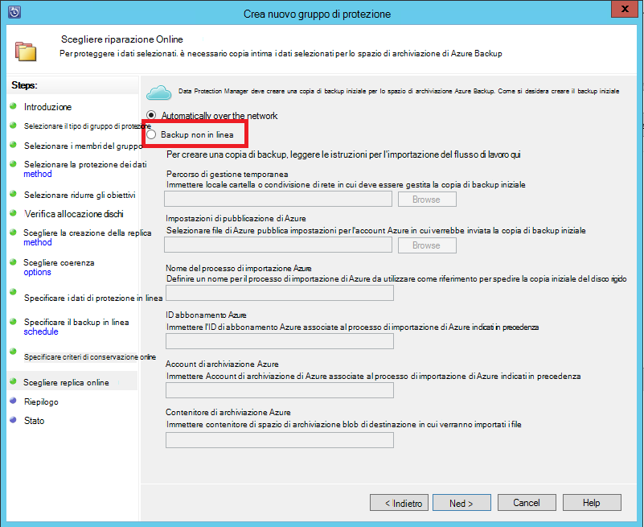

    La descrizione di input è il seguente:

    - **Percorso di gestione temporanea**: la posizione di memorizzazione temporaneo in cui è scritto la copia di backup iniziale. È possibile in un computer locale o una condivisione di rete. Se il computer di copia e origine sono diversi, si consiglia di specificare il percorso completo del percorso di gestione temporaneo.
    - **Nome del processo di importazione Azure**: il nome univoco da cui importare Azure Backup Azure e servizio traccia il trasferimento di dati inviati su dischi in Azure.
    - **Impostazioni di pubblicazione Azure**: file XML che contiene informazioni sul proprio profilo di sottoscrizione. Sono inoltre disponibili sicura delle credenziali associate all'abbonamento. È possibile [scaricare il file](https://manage.windowsazure.com/publishsettings). Specificare il percorso del file di impostazioni di pubblicazione.
    - **ID abbonamento Azure**: Azure l'ID di abbonamento per l'abbonamento in cui si prevede di avviare il processo di importazione di Azure. Se si hanno più abbonamenti Azure, usare l'ID dell'abbonamento a cui si desidera associare il processo di importazione.
    - **Account di archiviazione di Azure**: l'account di archiviazione tipi classiche nella sottoscrizione Azure fornita che sarà associata il processo di importazione di Azure.
    - **Contenitore di spazio di archiviazione di Azure**: il nome del blob di spazio di archiviazione destinazione nella finestra account di archiviazione Azure in cui si importano dati del processo.

    > [AZURE.NOTE] Se si ha registrato il server in un archivio di servizi di ripristino di Windows Azure dal [portale di Azure](https://portal.azure.com) per i backup e non si trovano su un abbonamento Cloud soluzione Provider (CSP), è comunque creare un account di archiviazione di tipo classico dal portale di Azure e usarlo per il flusso di lavoro di backup non in linea.

    Salvare tutte queste informazioni perché è necessario immetterla di nuovo nella procedura seguente. Solo il *percorso di gestione temporanea* è necessaria se è stata utilizzata l'utilità Azure disco preparazione per preparare i dischi.    

2. Completare il flusso di lavoro e quindi selezionare **Esegui backup** nella console di Azure Backup per avviare la copia di backup non in linea. Il backup iniziale è scritto in quest ' area come parte di questo passaggio.

    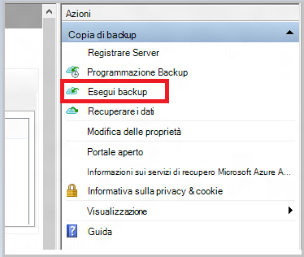

    Per completare il flusso di lavoro corrispondente in System Center Data Protection Manager, destro del mouse sul **Gruppo di protezione**e quindi scegliere l'opzione **Crea punto di ripristino** . È quindi scegliere l'opzione **Online Protection** .

    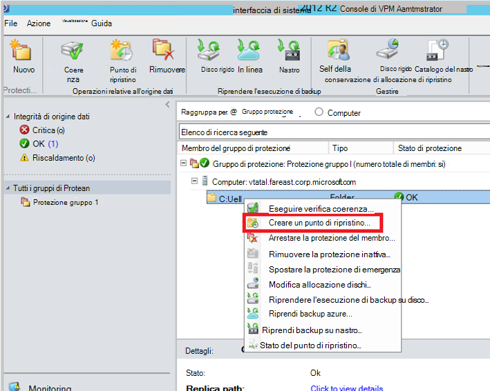

    Al termine dell'operazione, il percorso di gestione temporaneo è pronto per essere utilizzato per la preparazione disco.

    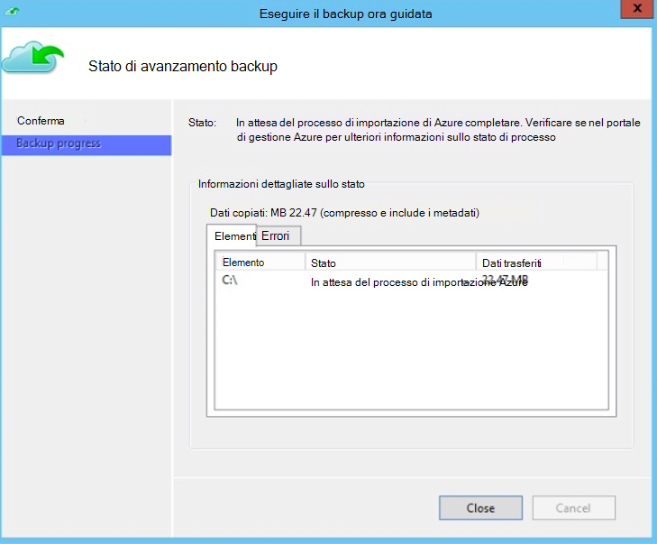

### Preparare un'unità SATA e creare un processo di importazione di Azure utilizzando lo strumento di preparazione disco Azure
Lo strumento di preparazione disco Azure è disponibile nella directory di installazione dell'agente di servizi di recupero (aggiornamento di agosto 2016 e versioni successive) nel percorso seguente.

   *\Microsoft* *Azure* *Ripristino* *Servizi* * Agent\Utils\*

1. Passare alla directory e copiare la directory **AzureOfflineBackupDiskPrep** in un computer copia in cui sono state installate le unità per essere preparati. Assicurarsi che le operazioni seguenti per quanto riguarda il computer copia:

      - Il computer copia può accedere il percorso di gestione temporaneo per il flusso di lavoro non in linea seeding con lo stesso percorso di rete fornito del flusso di lavoro **avviare backup non in linea** .

      - Attivazione di BitLocker nel computer.

      - Il computer è possibile accedere al portale Azure.

      Se necessario, il computer copia può essere lo stesso computer di origine.

2. Aprire un prompt dei comandi con privilegi elevato nel computer copia con il servizio directory strumento Preparazione disco Azure come directory corrente ed eseguire il comando seguente:

      S: *.\AzureOfflineBackupDiskPrep.exe* <*Percorso di gestione temporanea*> [p: <*percorso PublishSettingsFile*>]

| Parametro | Descrizione
|-------------|-------------|
|s: <*Percorso di gestione temporanea*> | Obbligatorio quando i dati immessi viene utilizzato per fornire il percorso di gestione temporanea che è stata immessa il flusso di lavoro **avviare backup non in linea** . |
|p: <*percorso PublishSettingsFile*> | Input facoltativo utilizzato per specificare il percorso del file di **Azure pubblica Impostazioni** che è stata immessa il flusso di lavoro **avviare backup non in linea** . |

> [AZURE.NOTE] Il &lt;percorso PublishSettingFile&gt; valore è obbligatorio quando il computer di copia e origine sono diversi.

Quando si esegue il comando, lo strumento richiede la selezione del processo di importazione di Azure che corrisponde alle unità che devono essere preparati. Se solo un processo di importazione singolo è associato il percorso di gestione temporaneo fornito, viene visualizzata una schermata simile a quello che segue.

   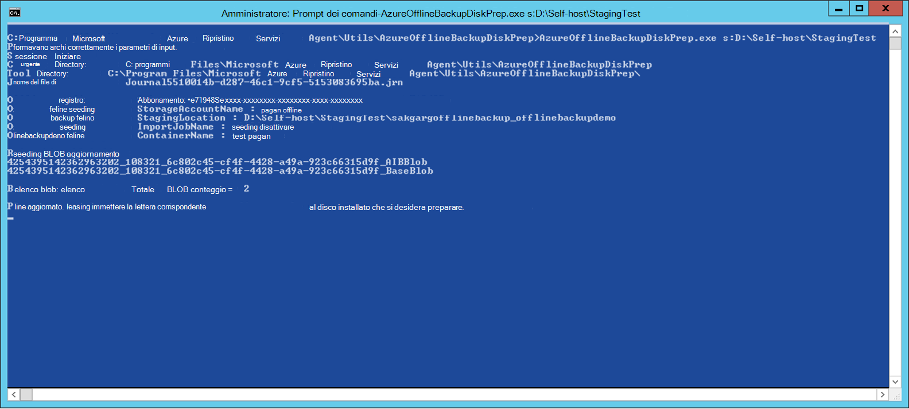  
3. Immettere la lettera senza punti finali per il disco installato che si desidera preparare per il trasferimento di Azure. Una conferma per la formattazione dell'unità quando richiesto.

Lo strumento quindi inizia preparare il disco con i dati di backup. Potrebbe essere necessario allegare quando richiesto dallo strumento nel caso in cui il disco fornito non dispone di spazio sufficiente per i dati di backup.  

Alla fine di indicare la corretta esecuzione dello strumento, uno o più dischi fornita sono pronti per spedizione in Azure. Inoltre, viene creato un processo di importazione con il nome specificato durante il flusso di lavoro **avviare backup non in linea** nel portale di classica Azure. Infine, verrà visualizzato l'indirizzo di spedizione al Data Center Azure in cui è necessario essere spediti dischi e il collegamento per individuare il processo di importazione nel portale di classica Azure.

    
4. Spedire dischi all'indirizzo lo strumento fornito e mantenere il numero di registrazione per riferimento futuro. 
5. Quando fare clic sul collegamento che lo strumento visualizzato, viene visualizzato l'account di archiviazione Azure specificata del flusso di lavoro **avviare backup non in linea** . Qui è possibile visualizzare il processo di importazione appena creato nella scheda **Importa/ESPORTA** dell'account di archiviazione.

   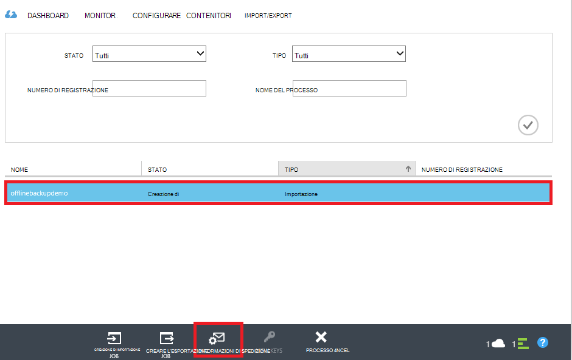 
6. Fare clic su **Informazioni di spedizione** nella parte inferiore della pagina per aggiornare i dettagli dei contatti, come illustrato nell'immagine seguente. Microsoft utilizza queste informazioni per spedire i dischi al mittente al termine del processo di importazione.

   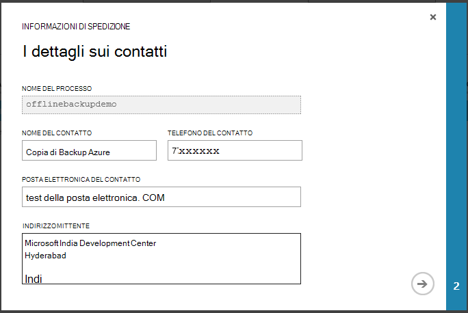 
7. Immettere i dettagli di spedizione nella schermata successiva. Fornire i dettagli di **Vettore** e **Numero di registrazione** che corrispondono ai dischi che sono stati spediti al Data Center Azure.

   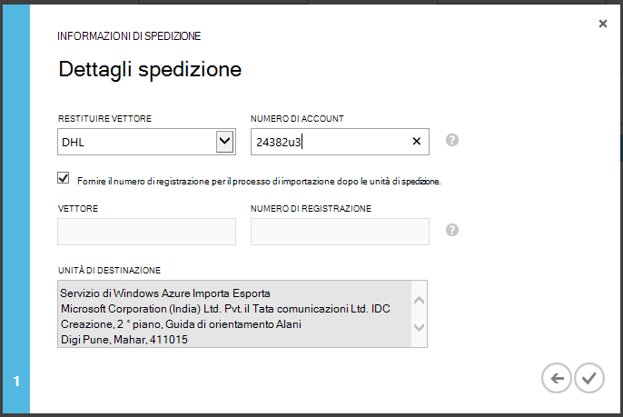 

### Completare il flusso di lavoro
Al termine del processo di importazione, dati di backup iniziali sono disponibili nel proprio account di archiviazione. L'agente di servizi di recupero quindi copia il contenuto dei dati da questo account all'archivio di Backup o ripristino servizi archivio, applicabili. In backup pianificata successiva, l'agente di Azure Backup esegue il backup incrementale attraverso la copia di backup iniziale.

> [AZURE.NOTE] Nelle sezioni seguenti vengono applicano agli utenti di versioni precedenti di Azure Backup che non hanno accesso allo strumento Preparazione disco Azure.

### Preparare un'unità SATA

1. Scaricare lo [Strumento di importazione/esportazione di Microsoft Azure](http://go.microsoft.com/fwlink/?linkid=301900&clcid=0x409) al computer copia. Assicurarsi che il percorso di gestione temporaneo sia accessibile dal computer in cui si prevede di eseguire l'insieme di comandi successiva. Se necessario, il computer copia può essere lo stesso computer di origine.

2. Decomprimere il file WAImportExport.zip. Eseguire lo strumento WAImportExport Formatta l'unità SATA, scrittura i dati di backup l'unità SATA e Crittografa. Prima di eseguire il comando seguente, verificare che BitLocker sia abilitata nel computer.  

    *.\WAImportExport.exe PrepImport /j: <* JournalFile*> .jrn /id: <*ID sessione*> /sk: <*StorageAccountKey*> /BlobType:**PageBlob* * /t: <*TargetDriveLetter*>/formattare / crittografare /srcdir: <*percorso di gestione temporanea*> /dstdir: <*DestinationBlobVirtualDirectory*>/*

    > [AZURE.NOTE] Se è stato installato l'aggiornamento di agosto 2016 di Azure Backup (o versioni successive), assicurarsi che il percorso di gestione temporaneo immesso è uguale a quella nella finestra **Esegui backup** e contiene file AIB e Blob di Base.

| Parametro | Descrizione
|-------------|-------------|
| /j: <*JournalFile*>| Il percorso del file del diario. Ogni unità deve avere esattamente un file di registro. Il file del diario non deve essere sull'unità di destinazione. L'estensione di file del diario è .jrn e viene creata come parte di esecuzione del comando.|
|/ID: <*ID sessione*> | L'ID di sessione identifica una sessione di copia. Viene utilizzato per assicurare il ripristino preciso di una sessione di copia interrotta. File che sono stati copiati in una sessione di copia sono archiviati in una directory denominata dopo l'ID di sessione nell'unità di destinazione.|
| /SK: <*StorageAccountKey*> | Chiave account per l'account di archiviazione in cui verrà importati i dati. Il tasto deve essere lo stesso immesse durante la creazione di gruppi di backup dei criteri/protezione.|
| / BlobType | Il tipo di blob. Questo flusso di lavoro ha avuto esito positivo solo se non viene specificato **PageBlob** . Questa operazione non è l'opzione predefinita e deve essere indicata in questo comando. |
|/t: <*TargetDriveLetter*> | La lettera senza punti finali del disco rigido di destinazione per la sessione corrente di copia.|
|/Format | L'opzione per formattare l'unità. Specificare questo parametro quando è l'unità da formattare. in caso contrario, eliminarlo. Prima che lo strumento Formatta l'unità, verrà chiesto di confermare dalla console. Per eliminare la conferma, specificare il parametro /silentmode.|
|/ crittografare | L'opzione per crittografare le unità. Specificare questo parametro quando l'unità non è ancora crittografato con BitLocker e deve essere crittografato utilizzando lo strumento. Se l'unità è già stato crittografato con BitLocker, omettere questo parametro, specificare il parametro /bk e fornire la chiave BitLocker esistente. Se si specifica il parametro /format, è necessario specificare anche la / crittografare parametro. |
|/srcdir: <*SourceDirectory*> | Directory di origine contenente i file da copiare l'unità di destinazione. Assicurarsi che il nome della directory specificato abbia un percorso completo anziché relativo.|
|/dstdir: <*DestinationBlobVirtualDirectory*> | Il percorso della directory di destinazione virtuale nell'account di archiviazione Azure. Assicurarsi di usare i nomi dei contenitori valido quando si specifica la directory virtuali di destinazione o BLOB. Tenere presente che i nomi dei contenitori deve essere minuscole.  Questo nome contenitore deve essere quello che è stata immessa durante la creazione di gruppi di backup dei criteri/protezione.|

  > [AZURE.NOTE] Nella cartella WAImportExport che acquisisce informazioni intere del flusso di lavoro viene creato un file di diario. Quando si crea un processo di importazione nel portale di Azure, è necessario il file.

  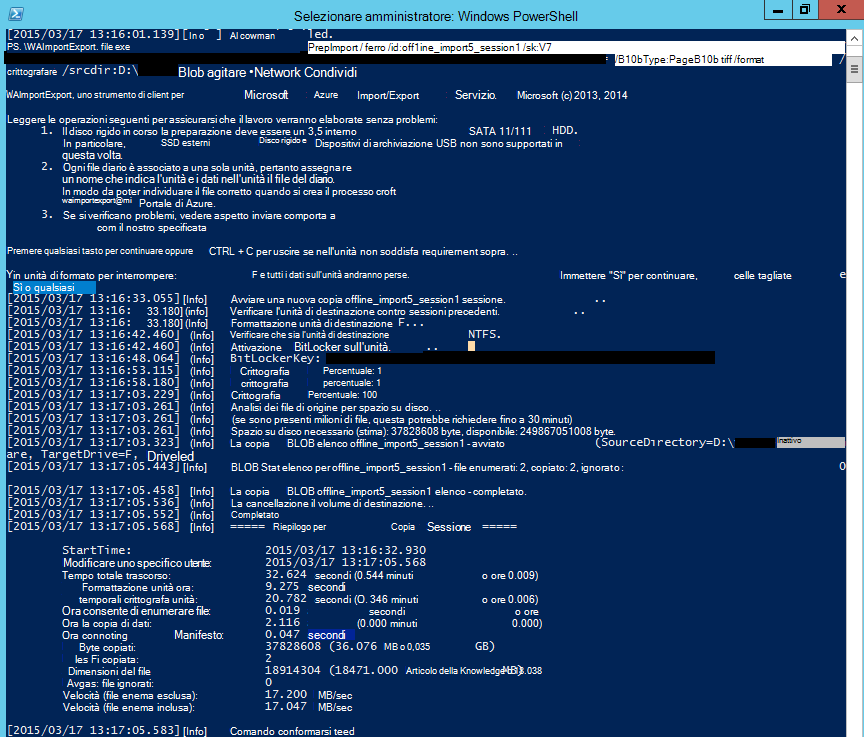

### Creare un processo di importazione nel portale di Azure
1. Passare al proprio account di archiviazione in [Azure portale classica](https://manage.windowsazure.com/), fare clic su **Importa/Esporta**e quindi **Creare processo di importazione** nel riquadro attività.

    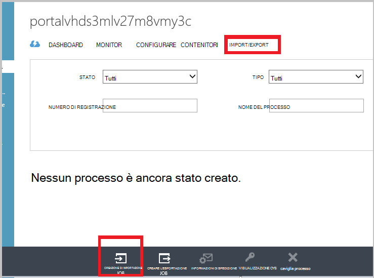

2. Nel passaggio 1 della procedura guidata, indicare che è stato preparato nell'unità e di avere il file di registro unità disponibile.
3. Nel passaggio 2 della procedura guidata, fornire informazioni di contatto per la persona responsabile per il processo di importazione.
4. Nel passaggio 3, caricare i file del diario unità che è stato acquistato nella sezione precedente.
5. Nel passaggio 4, immettere un nome descrittivo per il processo di importazione immesso durante la creazione di gruppi di backup dei criteri/protezione. Il nome immesso può contenere solo lettere, numeri, trattini e caratteri di sottolineatura, deve iniziare con una lettera e non possono contenere spazi. Il nome che si è scelto viene utilizzato per tenere traccia dei processi mentre sono in corso e dopo il completamento.
6. Selezionare l'area del Data Center dall'elenco. L'area geografica di Data Center indica il Data Center e l'indirizzo al quale è necessario fornire il pacchetto.

    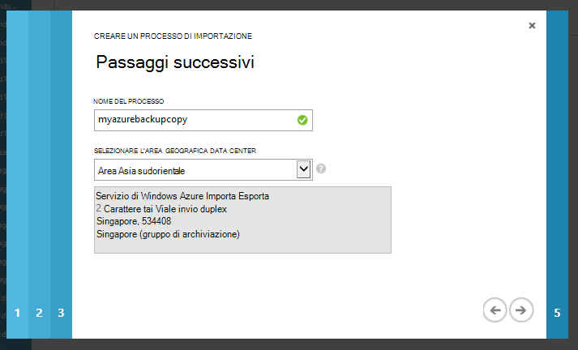

7. Nel passaggio 5, selezionare l'operatore mittente dall'elenco e immettere il numero di account vettore. Microsoft utilizza l'account da spedire le unità al mittente al termine del processo di importazione.

8. Spedire il disco e immettere il numero di elementi di verifica per tenere traccia dello stato della spedizione. Dopo il disco arriva nel centro dati, viene copiata nell'account di archiviazione e lo stato viene aggiornato.

    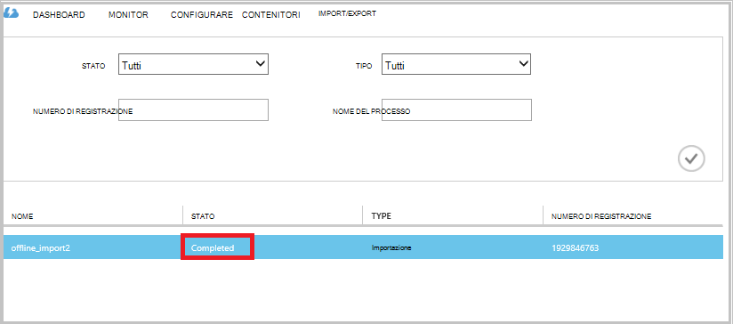

### Completare il flusso di lavoro
Dopo i dati di backup iniziali sono disponibili nel proprio account di archiviazione, l'agente di servizi di recupero di Microsoft Windows Azure consente di copiare il contenuto dei dati da questo account archivio di Backup o ripristino servizi archivio, applicabili. Nella programmazione backup alla successiva, l'agente di Azure Backup esegue il backup incrementale attraverso la copia di backup iniziale.

## Passaggi successivi
- Per eventuali domande del flusso di lavoro di Azure importazione/esportazione, fare riferimento a [usare il servizio di Microsoft Azure Importa/Esporta per trasferire i dati a archiviazione Blob](../storage/storage-import-export-service.md).
- Fare riferimento alla sezione backup non in linea di Azure Backup [domande frequenti](backup-azure-backup-faq.md) per eventuali domande sul flusso di lavoro.
