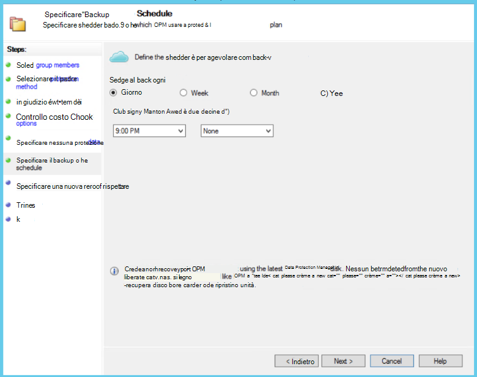
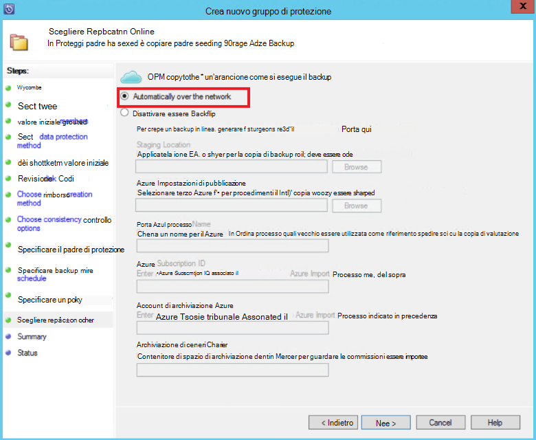

<properties
    pageTitle="Protezione dei server Data Protection Manager/Azure Backup di una farm di SharePoint in Azure | Microsoft Azure"
    description="In questo articolo viene fornita una panoramica della protezione server Data Protection Manager/Azure Backup di una farm di SharePoint in Azure"
    services="backup"
    documentationCenter=""
    authors="adigan"
    manager="Nkolli1"
    editor=""/>

<tags
    ms.service="backup"
    ms.workload="storage-backup-recovery"
    ms.tgt_pltfrm="na"
    ms.devlang="na"
    ms.topic="article"
    ms.date="09/29/2016"
    ms.author="adigan;giridham;jimpark;trinadhk;markgal"/>

# Eseguire il backup di una farm di SharePoint in Azure
Il backup una farm di SharePoint a Microsoft Azure in cui sia in System Center dati protezione Manager () in modo che il backup altre origini dati. Backup Azure offre flessibilità nella programmazione backup per creare ogni giorno, eseguire il backup settimana, mensile o annuo punta e fornisce le opzioni di criteri di conservazione per vari punti di backup. Data Protection Manager consente di memorizzare copie disco locale per gli obiettivi tempi di ripristino rapidi (RTO) e per archiviare le copie in Azure per la conservazione economica a lungo termine.

## SharePoint le versioni supportate e scenari di protezione legati
Backup Azure per Data Protection Manager supporta gli scenari seguenti:

| Carico di lavoro | Versione | Distribuzione di SharePoint | Tipo di distribuzione di Data Protection Manager | Data Protection Manager - System Center 2012 R2 | Protezione e ripristino |
| -------- | ------- | --------------------- | ------------------- | --------------------------- | ----------------------- |
| SharePoint | SharePoint 2013, SharePoint 2010, SharePoint 2007, SharePoint 3.0 | SharePoint distribuito come server fisico o macchina virtuale Hyper-V/VMware   --------------   AlwaysOn SQL | Server o locale Hyper-V virtuali computer fisico | Backup è supportato in Azure dall'aggiornamento cumulativo 5 | Proteggere le opzioni di ripristino della Farm di SharePoint: farm ripristino, database e file o la voce elenco dai punti di ripristino disco.  Ripristino di farm e database in punti di ripristino Azure. |

## Prima di iniziare
Esistono alcune operazioni che è necessario confermare prima eseguire il backup di una farm di SharePoint in Azure.

### Prerequisiti
Prima di procedere, verificare che siano stati soddisfatti tutti i [Prerequisiti per l'utilizzo di Microsoft Azure Backup](backup-azure-dpm-introduction.md#prerequisites) per proteggere i carichi di lavoro. Sono elencate alcune attività per i prerequisiti: creare un archivio di backup, scaricare archivio credenziali, installare l'agente di Backup Azure e registrare Server Backup Data Protection Manager/Azure con l'archivio.

### Agente protezione dati
L'agente protezione dati deve essere installato nel server che esegue SharePoint Server che esegue SQL Server e tutti gli altri server che fanno parte della farm di SharePoint. Per ulteriori informazioni su come configurare l'agente protezione, vedere [Configurazione agente di protezione](https://technet.microsoft.com/library/hh758034(v=sc.12).aspx).  L'unica eccezione è installare l'agente solo un server singolo web front-end (WFE). Necessità agente di un server WFE solo a fungere da punto di ingresso per la protezione.

### Farm di SharePoint
Per ogni 10 milioni di elementi nella farm, deve essere almeno 2 GB di spazio sul volume in cui si trova la cartella Data Protection Manager. Questo spazio è necessario per la generazione del catalogo. Per Data Protection Manager recuperare elementi specifici (raccolte siti, siti, elenchi, raccolte documenti, cartelle, singoli documenti e voci di elenco), generazione di un catalogo crea un elenco di URL che sono contenuti in ogni database del contenuto. È possibile visualizzare l'elenco degli URL nel riquadro elemento ripristinabile nell'area attività **ripristino** della Console Protection.

### SQL Server
Data Protection Manager viene eseguito come un account di sistema locale. Per eseguire il backup database di SQL Server, necessità privilegi dell'account per il server che esegue SQL Server. Impostare il sistema operativo NT *sysadmin* nel server che esegue SQL Server prima di eseguire il.

Se la farm di SharePoint include i database di SQL Server configurati con gli alias di SQL Server, installare i componenti di client di SQL Server nel server Web front-end che verranno protetti.

### SharePoint Server
Mentre le prestazioni dipendono da diversi fattori, ad esempio le dimensioni della farm di SharePoint, come guida generale un server di Data Protection Manager consente di proteggere una farm di SharePoint 25 TB.

### Aggiornamento cumulativo 5 di Data Protection Manager
Per iniziare la protezione di una farm di SharePoint in Azure, è necessario installare Data Protection Manager aggiornamento cumulativo 5 o versioni successiva. Aggiornamento cumulativo 5 consente di proteggere una farm di SharePoint in Azure se la farm viene configurata tramite SQL AlwaysOn.
Per ulteriori informazioni, vedere il blog del post che introduce [Data Protection Manager aggiornamento cumulativo 5]( http://blogs.technet.com/b/dpm/archive/2015/02/11/update-rollup-5-for-system-center-2012-r2-data-protection-manager-is-now-available.aspx)

### Operazioni non supportate
- Data Protection Manager che consente di proteggere una farm di SharePoint non proteggere gli indici di ricerca o i database dell'applicazione del servizio. È necessario configurare la protezione di questi database separatamente.
- Data Protection Manager non fornisce copia di backup del database di SQL Server SharePoint ospitati su server (SOFS) scalabilità condivisioni.

## Configurare la protezione di SharePoint
Prima di poter utilizzare Data Protection Manager per la protezione di SharePoint, è necessario configurare il servizio di SharePoint VSS Writer (servizio WSS Writer) utilizzando **ConfigureSharePoint.exe**.

È possibile trovare **ConfigureSharePoint.exe** nella cartella \bin [percorso di installazione di Data Protection Manager] sul server web front-end. Questo strumento offre l'agente di protezione con le credenziali per la farm di SharePoint. Eseguito in un unico server WFE. Se si dispone di più server WFE, selezionare Apri occorrenza quando si configura un gruppo di protezione.

### Per configurare il servizio SharePoint VSS Writer
1. Il server WFE al prompt dei comandi, passare a \bin\ [percorso di installazione di Data Protection Manager]
2. Immettere ConfigureSharePoint - EnableSharePointProtection.
3. Immettere le credenziali di amministratore della farm. Questo account deve essere membro del gruppo Administrators locale nel server WFE. Se non è l'amministratore della farm locale amministratore concedere le autorizzazioni seguenti nel server WFE:
  - Concedere il controllo completo del gruppo WSS_Admin_WPG nella cartella Data Protection Manager (% programma Files%\Microsoft Data Protection Manager\DPM).
  - Concedere l'accesso in lettura gruppo WSS_Admin_WPG la chiave del Registro di sistema di Data Protection Manager (HKEY_LOCAL_MACHINE\SOFTWARE\Microsoft\Microsoft Data Protection Manager).

>[AZURE.NOTE] È necessario eseguire di nuovo ConfigureSharePoint.exe ogni volta che viene apportata una modifica nelle credenziali di amministratore della farm di SharePoint.

## Eseguire il backup di una farm di SharePoint in cui sia in
Dopo aver configurato Data Protection Manager e la farm di SharePoint come descritto in precedenza, è possibile protetto SharePoint da Data Protection Manager.

### Proteggere una farm di SharePoint
1. Nella scheda **protezione** di Protection Manager fare clic su **Nuovo**.
    

2. Nella pagina **Seleziona tipo di gruppo di protezione** della procedura guidata **Crea nuovo gruppo di protezione** , selezionare **server**e quindi fare clic su **Avanti**.

    

3. Nella schermata **Selezionare i membri del gruppo** , selezionare la casella di controllo per il server di SharePoint che si desidera proteggere e fare clic su **Avanti**.

    

    >[AZURE.NOTE] Con l'agente di protezione dati installato, è possibile visualizzare il server della procedura guidata. Data Protection Manager mostra anche la struttura. Perché è stato eseguito ConfigureSharePoint.exe, Data Protection Manager comunica con il servizio SharePoint VSS Writer e i relativi database di SQL Server corrispondenti e riconosce la struttura di farm di SharePoint, database del contenuto associati e tutti gli elementi corrispondenti.

4. Nella pagina **Selezione metodo protezione dati** immettere il nome del **Gruppo di protezione**e selezionare Preferiti *metodi di protezione*. Fare clic su **Avanti**.

    

    >[AZURE.NOTE] Il metodo di protezione disco consente di obiettivi ripristino ora breve. Azure è una destinazione di protezione economico a lungo termine compared su nastro. Per ulteriori informazioni, vedere [Usare Azure Backup per sostituire l'infrastruttura di nastro](https://azure.microsoft.com/documentation/articles/backup-azure-backup-cloud-as-tape/)

5. Nella pagina **Specificare obiettivi a breve termine** , selezionare l' **intervallo di criteri di conservazione** preferito e identificare quando si desidera che venga eseguita l'esecuzione di backup.

    

    >[AZURE.NOTE] Perché ripristino è spesso necessario per i dati che sono inferiore a cinque giorni, abbiamo selezionato un intervallo di criteri di conservazione di cinque giorni su disco e garantire che il backup accade durante le ore non di produzione, perché questo esempio.

6. Esaminare lo spazio su disco del pool di archiviazione allocata per il gruppo di protezione e quindi scegliere **Avanti**.

7. Per ogni gruppo di protezione, viene allocata spazio su disco per archiviare e gestire repliche. A questo punto, Data Protection Manager deve creare una copia dei dati selezionati. Come selezionare e quando si desidera replica creata e quindi fare clic su **Avanti**.

    

    >[AZURE.NOTE] Per assicurarsi che il traffico di rete non sia effettuato, selezionare un tempo all'esterno di ore di produzione.

8. L'integrità dei dati vengono eseguendo coerenza sulla replica. Sono disponibili due opzioni disponibili. È possibile definire una pianificazione per eseguire le verifiche coerenza o Data Protection Manager eseguire coerenza automaticamente nella replica di ogni volta che diventa incoerente. Selezionare l'opzione desiderata e quindi fare clic su **Avanti**.

    

9. Nella pagina **Specificare Online la protezione dei dati** , selezionare la farm di SharePoint che si desidera proteggere e quindi fare clic su **Avanti**.

    

10. Nella pagina **Imposta pianificazione di Backup in linea** selezionare la programmazione preferita e quindi fare clic su **Avanti**.

    

    >[AZURE.NOTE] Data Protection Manager fornisce un massimo di due backup giornaliero in Azure momenti diversi. Copia di Backup Azure è anche possibile controllare la larghezza di banda WAN che può essere utilizzato per i backup punta e le ore utilizzando [La limitazione di Azure Backup rete](https://azure.microsoft.com/en-in/documentation/articles/backup-configure-vault/#enable-network-throttling).

11. In base alla pianificazione del backup che è stata selezionata, nella pagina **Impostazione di criteri di conservazione in linea** selezionare i criteri di conservazione per i punti di backup giornalieri, settimanali, mensili e annuali.

    

    >[AZURE.NOTE] Data Protection Manager utilizza una combinazione di conservazione nonno-padre-figlio in cui è possibile scegliere i criteri di conservazione diversi per diversi punti di backup.

12. Analogamente a disco, una replica di punto di Guida di riferimento iniziale deve essere creati in Azure. Selezionare l'opzione desiderata per creare una copia di backup iniziale in Azure e quindi fare clic su **Avanti**.

    

13. Esaminare le impostazioni nella pagina **Riepilogo** selezionate e quindi fare clic su **Crea gruppo**. Si verrà visualizzato un messaggio di conferma dopo aver creato il gruppo di protezione.

    

## Ripristinare un elemento di SharePoint dal disco in cui sia in
Nell'esempio seguente l' *elemento di ripristino di SharePoint* è stato eliminato inavvertitamente e deve essere ripristinato.

1. Aprire la **Console di amministrazione Data Protection Manager**. Tutte le farm di SharePoint che sono protetti da Data Protection Manager vengono visualizzate nella scheda **protezione** .

    

2. Per iniziare a ripristinare l'elemento, selezionare la scheda **ripristino** .

    

3. È possibile cercare la *voce di ripristino di SharePoint* SharePoint mediante una ricerca in base jolly all'interno di un intervallo di punti di ripristino.

    

4. Selezionare il punto di ripristino appropriato nei risultati della ricerca, pulsante destro del mouse sull'elemento e quindi selezionare **Recupera**.

5. È anche possibile sfogliare vari punti di ripristino e selezionare un database o un elemento per recuperare. Selezionare **Data > tempi di ripristino**e quindi selezionare la cartella **Database > farm di SharePoint > punto di ripristino > elemento**.

    

6. Pulsante destro del mouse sull'elemento e quindi selezionare **Recupera** per aprire la **Procedura guidata di ripristino**. Fare clic su **Avanti**.

    

7. Selezionare il tipo di ripristino che si desidera eseguire e quindi fare clic su **Avanti**.

    

    >[AZURE.NOTE] La selezione di **Ripristina originale** nell'esempio consente di recuperare l'elemento al sito di SharePoint originale.

8. Selezionare il **Processo di ripristino** che si desidera utilizzare.
    - Se la farm di SharePoint non è stato modificato ed è uguale al punto di ripristino da ripristinare, selezionare **Recupera senza utilizzare una farm di ripristino** .
    - Selezionare **Recupera utilizzo di una farm di ripristino** se la farm di SharePoint è stato modificato dopo il punto di ripristino è stato creato.

    

9. Specificare un percorso di istanza di SQL Server gestione temporaneo per recuperare temporaneamente il database e specificare una condivisione file di gestione temporanea nel server Data Protection Manager e il server che esegue SharePoint per ripristinare l'elemento.

    

    Data Protection Manager allegherà il database del contenuto in cui si trova l'elemento di SharePoint all'istanza di SQL Server temporaneo. Da database del contenuto server Data Protection Manager recupera l'elemento e la inserisce nel percorso di file di gestione temporanea nel server Data Protection Manager. L'elemento recuperato diventa di gestione temporanea ubicazione dei server Data Protection Manager deve essere esportato nella posizione di gestione temporanea nelle farm di SharePoint.

    

10. Selezionare le **Opzioni di ripristino specifica**e applicare le impostazioni di sicurezza per la farm di SharePoint o applicare le impostazioni di protezione del punto di ripristino. Fare clic su **Avanti**.

    

    >[AZURE.NOTE] È possibile scegliere di limitare l'utilizzo della larghezza di banda di rete. In questo modo impatto al server di produzione durante le ore di produzione.

11. Esaminare le informazioni di riepilogo e quindi fare clic su **Recupera** per iniziare il ripristino del file.

    

12. Selezionare la scheda **monitoraggio** nella **Console Protection** per visualizzare lo **stato** del ripristino.

    

    >[AZURE.NOTE] Il file viene ripristinato. È possibile aggiornare il sito di SharePoint per verificare se il file ripristinato.

## Ripristinare un database di SharePoint da Azure in cui sia in

1. Per ripristinare un database del contenuto di SharePoint, è possibile cercare in vari punti di ripristino (come illustrato in precedenza) e selezionare il punto di ripristino che si desidera ripristinare.

    

2. Fare doppio clic sul punto di ripristino di SharePoint per visualizzare le informazioni del catalogo di SharePoint disponibili.

    > [AZURE.NOTE] Poiché la farm di SharePoint è protetta per la conservazione a lungo termine in Azure, non catalogo (metadati) sono disponibili informazioni sul server Data Protection Manager. Di conseguenza, ogni volta che un database del contenuto di SharePoint in un momento deve essere recuperato, è necessario il catalogo la farm di SharePoint.

3. Fare clic su **nuovo catalogo**.

    

    Verrà visualizzata la finestra di stato **Ricatalogare Cloud** .

    

    Al termine catalogazione, lo stato viene modificato in *Success*. Fare clic su **Chiudi**.

    

4. Fare clic sull'oggetto SharePoint visualizzata nella scheda Data Protection Manager **ripristino** per ottenere la struttura di database del contenuto. Pulsante destro del mouse sull'elemento e quindi fare clic su **Ripristina**.

    

5. A questo punto, seguire la [procedura di ripristino in precedenza in questo articolo](#restore-a-sharepoint-item-from-disk-using-dpm) per ripristinare un database del contenuto di SharePoint da disco.

## Domande frequenti
D: che le versioni di Data Protection Manager supportano SQL Server 2014 e SQL 2012 (SP2)? 
R: Data Protection Manager 2012 R2 con aggiornamento cumulativo 4 supporta entrambe.

D: è possibile recuperare un elemento di SharePoint nella posizione originale se SharePoint viene configurato tramite SQL AlwaysOn (con protezione su disco)? 
R: Sì, è possibile ripristinare l'elemento al sito di SharePoint originale.

D: è possibile ripristinare un database di SharePoint nella posizione originale se SharePoint viene configurato tramite SQL AlwaysOn? 
R: perché i database di SharePoint sono configurati in SQL AlwaysOn, non possono essere modificati solo se il gruppo di disponibilità viene rimosso. Di conseguenza, Data Protection Manager non è possibile ripristinare un database nella posizione originale. È possibile ripristinare un database di SQL Server a un'altra istanza di SQL Server.

## Passaggi successivi
- Ulteriori informazioni sulla protezione Data Protection Manager di SharePoint, vedere [Serie di Video, Data Protection Manager protezione di SharePoint](http://channel9.msdn.com/Series/Azure-Backup/Microsoft-SCDPM-Protection-of-SharePoint-1-of-2-How-to-create-a-SharePoint-Protection-Group)
- Note sulla [versione per System Center 2012 - Data Protection Manager](https://technet.microsoft.com/library/jj860415.aspx)
- Note sulla [versione per Data Protection Manager in System Center 2012 SP1](https://technet.microsoft.com/library/jj860394.aspx)
