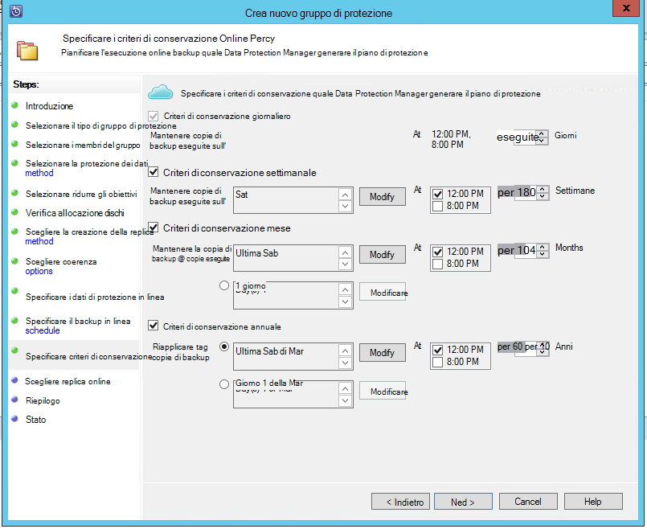
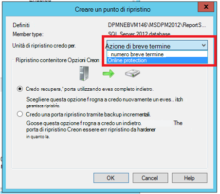

<properties
    pageTitle="Backup Azure per carichi di lavoro di SQL Server utilizzando Data Protection Manager | Microsoft Azure"
    description="Introduzione al backup dei database SQL Server tramite il servizio di Backup di Azure"
    services="backup"
    documentationCenter=""
    authors="adigan"
    manager="Nkolli1"
    editor=""/>

<tags
    ms.service="backup"
    ms.workload="storage-backup-recovery"
    ms.tgt_pltfrm="na"
    ms.devlang="na"
    ms.topic="article"
    ms.date="09/27/2016"
    ms.author="adigan;giridham; jimpark;markgal;trinadhk"/>

# Backup Azure per carichi di lavoro di SQL Server utilizzando Data Protection Manager

In questo articolo illustra i passaggi di configurazione per il backup del database di SQL Server con Azure Backup.

Per eseguire il backup database di SQL Server in Azure, è necessario un account Azure. Se non si dispone di un account, è possibile creare un account di valutazione gratuito in solo alcuni minuti. Per informazioni dettagliate, vedere [Versione di valutazione gratuita di Azure](https://azure.microsoft.com/pricing/free-trial/).

La gestione di backup del database di SQL Server Azure e il ripristino da Azure prevede tre passaggi:

1. Creare un criterio di backup per proteggere i database di SQL Server in Azure.
2. Creare copie di backup su richiesta in Azure.
3. Ripristinare il database da Azure.

## Prima di iniziare
Prima di iniziare, verificare che siano soddisfatti tutti i [Prerequisiti](../backup-azure-dpm-introduction.md#prerequisites) per l'uso di Microsoft Azure Backup per proteggere i carichi di lavoro. I prerequisiti coprono attività quali: creazione di un archivio di backup, scaricare archivio credenziali, installare l'agente di Backup di Azure e la registrazione del server con l'archivio.

## Creazione di un criterio di backup per proteggere i database di SQL Server in Azure

1. In server Data Protection Manager, fare clic su area di lavoro di **protezione** .

2. Sulla barra multifunzione, fare clic su **Nuovo** per creare un nuovo gruppo di protezione.

    

3. Data Protection Manager viene visualizzata la schermata iniziale con le linee guida sulla creazione di un **Gruppo di protezione**. Fare clic su **Avanti**.

4. Selezionare **un server**.

    

5. Espandere il computer di SQL Server in cui sono presenti i database di backup. Data Protection Manager Mostra varie origini dati che è possano eseguire il backup di tale server. Espandere **Tutte le condivisioni SQL** e selezionare i database (in questo caso è selezionata l'opzione ReportServer$ MSDPM2012 e ReportServer$ MSDPM2012TempDB) per eseguire il backup. Fare clic su **Avanti**.

    

6. Specificare un nome per il gruppo di protezione e selezionare la casella di controllo **desiderato online Protection** .

    

7. Nella schermata **Specificare obiettivi a breve termine** includono gli ingressi necessari per creare punti di backup su disco.

    Qui è possibile vedere che **mantenimento dei dati** è impostato su *5 giorni*, **frequenza di sincronizzazione** è impostato su una sola volta ogni *15 minuti* ovvero la frequenza con cui viene eseguito backup. **Esprimere Backup completo** è impostato su *8:00 formato*.

    

    >[AZURE.NOTE] 8:00 PM (in base all'input schermo) ogni giorno viene creato un punto di backup per trasferire i dati che sono stati modificati da punto di backup del giorno precedente 8:00 PM. Questo processo è denominato **Express Backup completo**. Mentre la transazione registri vengono sincronizzati ogni 15 minuti, se è necessario ripristinare il database 9:00 PM-riproducendo i registri degli ultimi viene creato il punto di esprimere il punto di backup completo (8 pm in questo caso).

8. Fare clic su **Avanti**

    Data Protection Manager mostra lo spazio di archiviazione complessivo e i potenziali spazio su disco.

    

    Per impostazione predefinita, Data Protection Manager crea un volume per ogni origine dati (database di SQL Server) che viene utilizzato per la copia di backup iniziale. Questo approccio, il disco Manager LOGICI limiti di protezione Data Protection Manager a origini 300 dati (database di SQL Server). Per risolvere questa limitazione, selezionare i **dati nel Pool di archiviazione Data Protection Manager nella stessa posizione**, opzione. Se si utilizza questa opzione, Data Protection Manager viene utilizzato un singolo volume per più origini dati, che consente di Data Protection Manager proteggere i database SQL fino a 2.000.

    Se è selezionata l'opzione **Ingrandisci automaticamente i volumi** , Data Protection Manager possibile considerare l'aumento di backup esigenze di dati di produzione. Se non è selezionata l'opzione **Ingrandisci automaticamente i volumi** , Data Protection Manager limiti di archiviazione backup utilizzato per le origini dati nel gruppo di protezione.

9. Gli amministratori hanno la scelta di trasferire il backup iniziale manualmente (fuori rete) per evitare la congestione della larghezza di banda o in rete. È inoltre possibile configurare l'ora in cui può verificarsi il trasferimento iniziale. Fare clic su **Avanti**.

    

    La copia di backup iniziale richiede trasferimento dell'origine dati intero (database di SQL Server) dal server di produzione (computer SQL Server) per il server Data Protection Manager. Questi dati potrebbero essere grandi e trasferire i dati in rete potrebbe essere superiore della larghezza di banda. Per questo motivo, gli amministratori possono scegliere trasferire il backup iniziale: **manualmente** (con supporti rimovibili) per evitare congestione della larghezza di banda o **automaticamente in rete** (in un momento specificato).

    Al termine del backup iniziale, il resto dei backup sono incrementali sulla copia di backup iniziale. Incrementali comandi sono particolarmente utili per piccole e facilmente vengono trasferite in rete.

10. Scegliere quando si desidera che la coerenza per eseguire e fare clic su **Avanti**.

    

    Può essere eseguito coerenza controllo per verificare l'integrità del punto di backup. Calcola il checksum del file di backup nel server di produzione (computer SQL Server in questo scenario) e i dati di backup del file in Data Protection Manager. In caso di conflitti, si presuppone che il file di backup in Data Protection Manager sia danneggiato. Data Protection Manager risolvono i dati di backup inviando blocchi corrispondente alla mancata corrispondenza checksum. Durante la verifica coerenza è un'operazione di prestazioni, gli amministratori hanno la possibilità di pianificazione la coerenza o esecuzione automatica.

11. Per specificare la protezione online delle origini dati, selezionare i database protetto in Azure e fare clic su **Avanti**.

    

12. Gli amministratori possono scegliere pianificazioni di backup e i criteri di conservazione di soddisfare i criteri dell'organizzazione.

    

    In questo esempio, backup una volta al giorno 12:00 PM e PM 8 (parte inferiore dello schermo)

    >[AZURE.NOTE] È buona norma disporre di alcuni punti di ripristino a breve termine su disco, per il ripristino rapido. Questi punti di ripristino vengono utilizzati per "ripristino operativo". Azure funge da una sede efficace con contratti di servizio superiore e garantita la disponibilità.

    **Procedura consigliata**: verificare che il backup di Azure vengono programmato dopo il completamento di backup disco locale utilizzando Data Protection Manager. In questo modo il backup di disco più recente da copiare in Azure.

13. Scegliere la pianificazione dei criteri di conservazione. I dettagli sul funzionamento dei criteri di conservazione vengono forniti alla [Usare Azure Backup per sostituire l'articolo infrastruttura nastro](backup-azure-backup-cloud-as-tape.md).

    

    In questo esempio:

    - Backup provengono una volta al giorno 12:00 PM e PM 8 (parte inferiore dello schermo) e vengono conservati per 180 giorni.
    - Il backup sabato 12:00 PM viene mantenuto per 104 settimane
    - Il backup ultimo sabato 12:00 PM viene mantenuto per 60 mesi
    - Il backup ultimo sabato di marzo alle 12:00 viene mantenuto per 10 anni

14. Fare clic su **Avanti** e selezionare l'opzione appropriata per il trasferimento la copia di backup iniziale in Azure. È possibile scegliere **automaticamente in rete** o **Offline Backup**.

    - **Automaticamente in rete** trasferisce i dati di backup in Azure in base alla pianificazione scelta per il backup.
    - Come funziona il **Backup non in linea** spiegazioni al [flusso di lavoro di Backup non in linea in Azure Backup](backup-azure-backup-import-export.md).

    Scegliere il meccanismo di trasferimento pertinenti per inviare la copia di backup iniziale Azure e fare clic su **Avanti**.

15. Dopo avere esaminato i dettagli dei criteri nella schermata di **Riepilogo** , fare clic sul pulsante **Crea gruppo** per completare il flusso di lavoro. È possibile fare clic sul pulsante **Chiudi** e monitorare l'avanzamento del processo nell'area di lavoro di monitoraggio.

    

## Backup su richiesta di un database di SQL Server
Durante la procedura precedente creazione di un criterio di backup, viene creato un punto di ripristino"" solo quando si verifica il primo backup. Invece di attendere l'utilità di pianificazione di, la procedura seguente trigger la creazione di un ripristino posizionare manualmente.

1. Attendere finché non **OK** viene visualizzato lo stato di gruppo di protezione per il database prima di creare il punto di ripristino.

    

2. Pulsante destro del mouse sul database e selezionare **Crea punto di ripristino**.

    

3. Scegliere **Online Protection** nel menu a discesa e fare clic su **OK**. Verrà avviata la creazione di un punto di ripristino in Azure.

    

4. È possibile visualizzare lo stato di avanzamento del processo nell'area di lavoro **monitoraggio** nel punto in cui è disponibile un in corso processo simile a quello illustrato nella figura riportata di seguito.

    

## Ripristinare un database di SQL Server da Azure
La procedura seguente è necessario ripristinare un'entità protetta (database di SQL Server) comuni.

1. Aprire il server di Data Protection Manager Management Console. Passare al **ripristino** dell'area di lavoro in cui è possibile visualizzare i server di backup da Data Protection Manager. Individuare il database (in questo caso ReportServer$ MSDPM2012). Selezionare un tempo di **ripristino da** che termina con **Online**.

    

2. Pulsante destro del mouse sul nome del database e fare clic su **Ripristina**.

    

3. Data Protection Manager vengono visualizzati i dettagli del punto di ripristino. Fare clic su **Avanti**. Per sovrascrivere il database, selezionare il tipo di ripristino **Ripristina originale istanza di SQL Server**. Fare clic su **Avanti**.

    

    In questo esempio, Data Protection Manager consente il ripristino del database a un'altra istanza di SQL Server o in una cartella di rete autonomo.

4. Nella schermata **Opzioni di ripristino specificare** , è possibile selezionare le opzioni di ripristino come limitazione larghezza di banda utilizzata da ripristino. Fare clic su **Avanti**.

5. Nella schermata di **Riepilogo** , vedere tutte le configurazioni di ripristino fornite finora. Fare clic su **Ripristina**.

    Viene visualizzato lo stato di ripristino del database da ripristinare. È possibile fare clic su **Chiudi** per chiudere la procedura guidata e visualizzare lo stato di avanzamento nell'area di lavoro **monitoraggio** .

    

    Al termine dell'operazione di ripristino, il database ripristinato è applicazione coerente.

### Passaggi successivi:

• [Domande frequenti Backup azure](backup-azure-backup-faq.md)
