<properties
   pageTitle="Eliminare un archivio di Backup di Azure | Microsoft Azure"
   description="Come eliminare un archivio di Backup di Azure. Risoluzione dei problemi perché non è possibile eliminare un archivio di backup. "
   services="service-name"
   documentationCenter="dev-center-name"
   authors="markgalioto"
   manager="cfreeman"
   editor=""/>

<tags
   ms.service="backup"
   ms.devlang="na"
   ms.topic="article"
   ms.tgt_pltfrm="na"
   ms.workload="storage-backup-recovery"
   ms.date="08/29/2016"
   ms.author="markgal;trinadhk"/>

# Eliminare un archivio di Backup di Azure

Il servizio di Backup di Azure è disponibili due tipi di archivi - archivio di Backup e archivio di servizi di recupero. Archivio di Backup è stato acquistato un prima. Quindi l'archivio di servizi di recupero avvento alle espanso distribuzioni di Manager delle risorse di supporto. A causa di funzionalità espansa e le dipendenze di informazioni che devono essere archiviate nell'archivio di eliminazione di un archivio di servizi di recupero può sembrare difficile superiore a quello di essere.

|**Tipo di distribuzione**|**Portale**|**Nome archivio**|
|--------------|----------|---------|
|Classica|Classica|Archivio di backup|
|Manager delle risorse|Azure|Servizi di recupero archivio|

> [AZURE.NOTE] Archivi di backup non consente di proteggere le soluzioni distribuito Manager delle risorse. Tuttavia, è possibile utilizzare un archivio di servizi di recupero per proteggere i server in genere distribuito e macchine virtuali.  

In questo articolo è usare il termine archivio, per fare riferimento alla maschera generica dell'archivio di Backup o ripristino servizi archivio. Serve il nome formale, un archivio di Backup o un archivio di servizi di recupero, quando è necessario distinguere tra gli archivi.

## Eliminazione di un archivio di servizi di recupero

Eliminazione di un archivio di servizi di recupero è un processo che richiede più passaggi - *fornito che l'archivio non contiene tutte le risorse*. Prima di poter eliminare un archivio di servizi di recupero, è necessario rimuovere o eliminare tutte le risorse nell'archivio di. Se si tenta di eliminare un archivio che contiene le risorse, viene visualizzato un messaggio di errore come nella figura seguente.

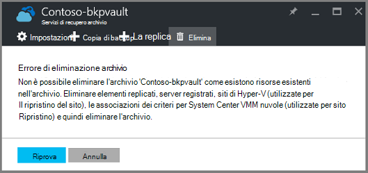  

Fino a quando non è stata deselezionata le risorse dall'archivio di, fare clic su **Riprova** restituisce lo stesso errore. Se è bloccato su questo messaggio di errore, fare clic su **Annulla** e seguire la procedura seguente per eliminare le risorse nell'archivio di servizi di recupero.

### La rimozione di elementi da un archivio di protezione di una macchina virtuale

Se è già aperto l'archivio di servizi di recupero, andare al secondo passaggio.

1.  Aprire il portale di Azure e nel dashboard archivio che si desidera eliminare.

    Se non si dispone di archivio di servizi di recupero aggiunta al Dashboard, nel menu Hub fare clic su **Altri servizi** e nell'elenco delle risorse, digitare **I servizi di recupero**. Quando si inizia a digitare, i filtri di elenco in base all'input. Fare clic su **servizi di recupero archivi**.

    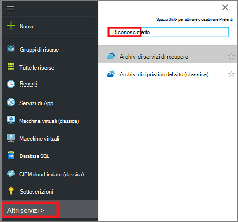  

    L'elenco degli archivi di servizi di recupero. Nell'elenco, selezionare l'archivio che si desidera eliminare.

    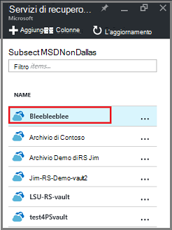

2. Nella visualizzazione archivio, esaminare il riquadro **Nozioni di base** . Per eliminare un archivio, non può essere qualsiasi elementi protetti. Se viene visualizzato un numero diverso da zero, in **Elementi di Backup** o **il server di gestione di Backup**, è necessario rimuovere tali elementi prima di poter eliminare l'archivio.

    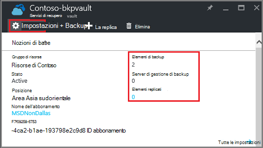

    Macchine virtuali e i file e le cartelle sono considerate elementi di Backup e sono elencate nell'area **Elementi di Backup** del riquadro delle nozioni di base. Un server Data Protection Manager viene elencato nell'area **Server di gestione di Backup** del riquadro delle nozioni di base. **Replicato gli elementi** relativi al servizio il ripristino del sito di Azure.

3. Per iniziare la rimozione di elementi protetti dall'archivio di, individuare gli elementi nell'archivio. Nel dashboard archivio fare clic su **Impostazioni**e quindi fare clic su **elementi di Backup** per aprire tale blade.

    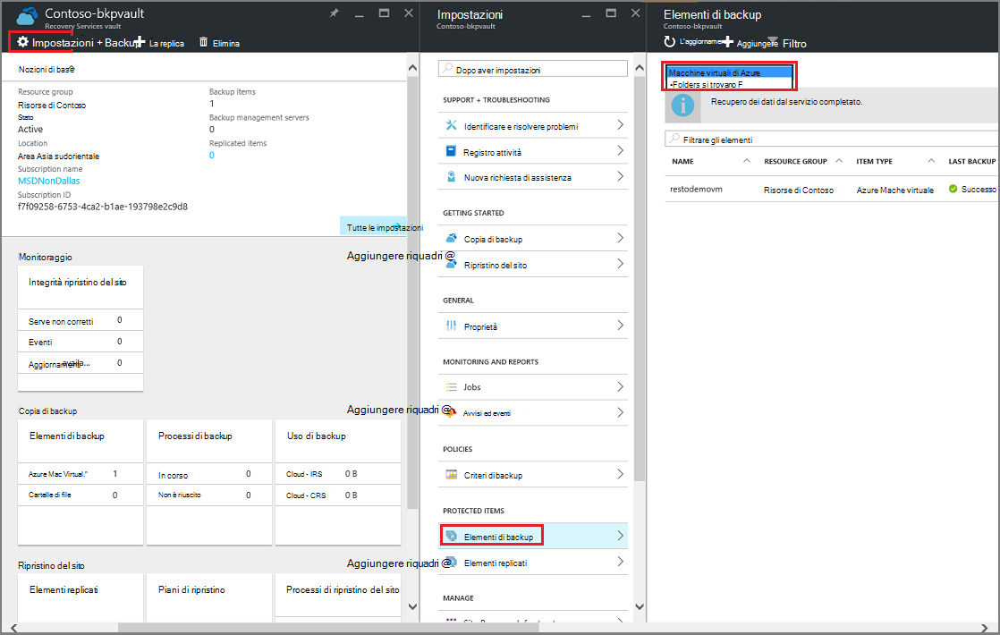

    E il **Backup elementi** previsti elenchi distinti, in base al tipo di elemento: macchine virtuali di Azure o cartelle di File (vedere l'immagine). L'elenco di tipo di elemento predefinito mostrato è macchine virtuali di Azure. Per visualizzare l'elenco degli elementi di cartelle di File nell'archivio di, selezionare **Le cartelle di File** dal menu a discesa.

4. Prima di poter eliminare un elemento dall'archivio di protezione di una macchina virtuale, interrompere il processo di backup dell'elemento ed eliminare i dati dei punti di ripristino. Per ogni elemento nell'archivio, procedere come segue:

    un. Scegliere e il **Backup di elementi** , pulsante destro del mouse sull'elemento e dal menu di scelta rapida, selezionare **Interrompi backup**.

    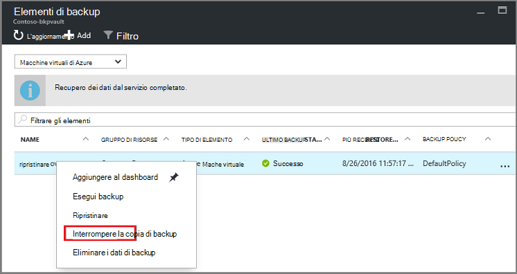

    Verrà visualizzata e l'interrompere la copia di Backup.

    b. **Scegliere un'opzione** dal menu e **l'Interrompere Backup** , selezionare **Eliminare dati di Backup** > digitare il nome dell'elemento > e fare clic su **Interrompi backup**.

      Digitare il nome dell'elemento per verificare che si desidera eliminarlo. Pulsante **Interrompi Backup** non attiverà prima di averne verificato l'elemento da interrompere. Se viene visualizzata la finestra di dialogo digitare il nome della voce di backup, è stata selezionata l'opzione **Mantieni dati Backup** .

    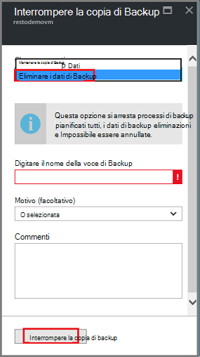

      Facoltativamente, è possibile specificare un motivo il motivo per cui si siano eliminando i dati e aggiungere commenti. Dopo aver fatto clic **Interrompere la copia di Backup**, consentire il processo di eliminazione completare prima di eliminare l'archivio. Per verificare che il processo è stata completata, controllare i messaggi di Azure .  
   Una volta completato il processo, si riceverà un messaggio che indica il processo di backup interrotta e i dati di backup è stati eliminati per tale elemento.

    c. Dopo l'eliminazione di un elemento nell'elenco, nel menu di **Elementi di Backup** , fare clic su **Aggiorna** per visualizzare per gli altri elementi nell'archivio.

      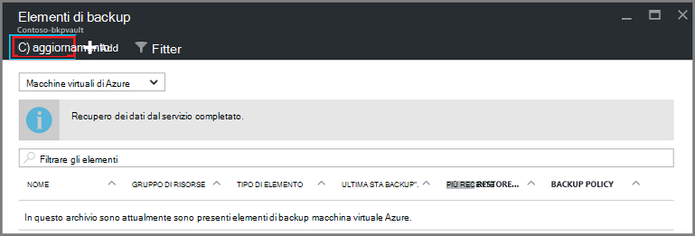

      Quando ci sono elementi nell'elenco, scorrere fino al riquadro **Essentials** e archivio il Backup. Non devono essere eventuali **elementi di Backup**, **server di gestione di Backup**o **replicato elementi** elencati. Se gli elementi viene ancora visualizzato nell'archivio di, tornare al passaggio tre precedente e selezionare un elenco di tipo di elemento diverso.  

5. Quando non sono disponibili altri elementi sulla barra degli strumenti di archivio, fare clic su **Elimina**.

    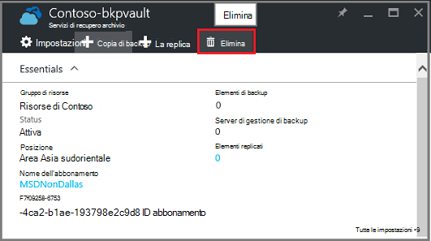

6. Quando viene chiesto di confermare che si desidera eliminare l'archivio, fare clic su **Sì**.

    L'archivio verrà eliminato e il portale restituisce al menu **Nuovo** servizio.

## Cosa fare se interrotto il processo di backup ma conservate i dati?

Se interrotto il processo di backup ma accidentalmente *mantenuti* i dati, è necessario eliminare i dati di backup prima di poter eliminare l'archivio. Per eliminare i dati di backup:

1. Scegliere e il **Backup di elementi** , pulsante destro del mouse sull'elemento e menu di scelta rapida fare clic su **Elimina i dati di backup**.

    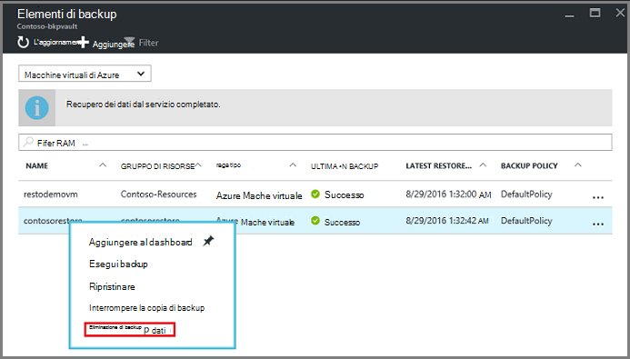

    Verrà visualizzata e **l'Eliminare dati di Backup** .

2. Scegliere e **l'Eliminare dati di Backup** , digitare il nome dell'elemento e fare clic su **Elimina**.

    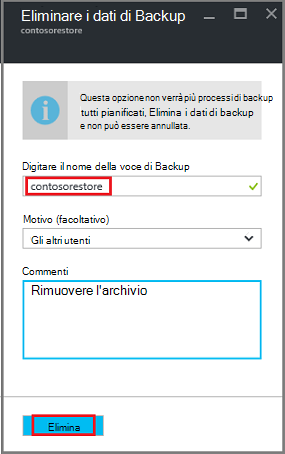

    Dopo avere eliminato i dati, andare al passaggio 4c sopra e continuare con il processo.

## Eliminare un archivio utilizzato per proteggere un server Data Protection Manager

Prima di poter eliminare un archivio utilizzato per proteggere un server Data Protection Manager, è necessario deselezionare i punti di ripristino che sono stati creati e quindi annullare la registrazione server dall'archivio di.

Per eliminare i dati associati a un gruppo di protezione:

1. In Protection Manager, fare clic su **protezione**, selezionare un gruppo di protezione, selezionare il membro del gruppo di protezione e nella barra multifunzione fare clic su **Rimuovi**. Selezionare il membro per il pulsante **Rimuovi** da visualizzare nella barra multifunzione. Nell'esempio, il membro è **dummyvm9**. Se sono presenti più membri del gruppo di protezione, tenere premuto il tasto Ctrl per selezionare più membri.

    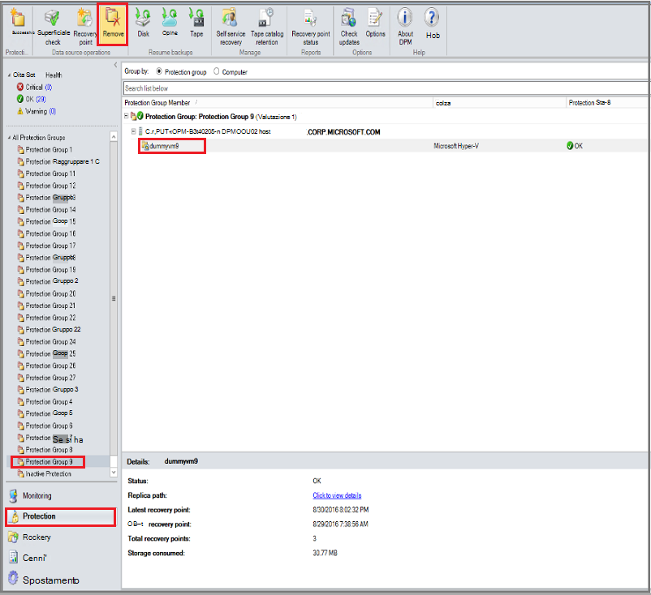

    Verrà visualizzata la finestra di dialogo **Rimuovi protezione** .

2. Nella finestra di dialogo **Rimuovi protezione** , selezionare **Elimina dati protetti**e fare clic su **Rimuovi protezione**.

    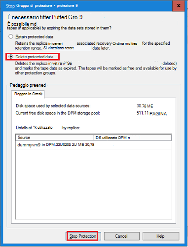

    Non si vuole conservare dati protetti perché è necessario eliminare l'archivio per eliminarla. A seconda di ripristino quanti punti e la quantità di dati si trova nel gruppo di protezione, può richiedere alcuni secondi per alcuni minuti per eliminare i dati. Finestra di dialogo **Rimuovi protezione** Mostra lo stato completato il processo.

    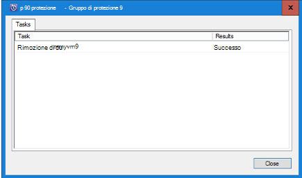

3. Continuare la procedura per tutti i membri in tutti i gruppi di protezione.

    È necessario rimuovere dati tutti protetti e i gruppi di protezione.

4. Dopo l'eliminazione di tutti i membri del gruppo di protezione, passare al portale di Azure. Aprire il dashboard di archivio e verificare che non esistono **Elementi di Backup**, **server di gestione di Backup**o **elementi replicato**. Sulla barra degli strumenti archivio, fare clic su **Elimina**.

    

    Se sono registrati per l'archivio di server di gestione di Backup, non sarà possibile eliminare l'archivio anche se non contiene dati nell'archivio di. Se si ha eliminato il server di gestione di Backup associato l'archivio, ma sono ancora presenti server visualizzati nel riquadro **Nozioni di base** , vedere [individuare i server di gestione di Backup registrati per l'archivio](backup-azure-delete-vault.md#find-the-backup-management-servers-registered-to-the-vault).

5. Quando viene chiesto di confermare che si desidera eliminare l'archivio, fare clic su **Sì**.

    L'archivio verrà eliminato e il portale restituisce al menu **Nuovo** servizio.

## Eliminare un archivio utilizzato per proteggere un server di produzione

Prima di poter eliminare un archivio utilizzato per proteggere un server di produzione, è necessario eliminare o annullare la registrazione server dall'archivio di.

Per eliminare il server di produzione associato l'archivio:

1. Nel portale di Azure, aprire il dashboard di archivio e fare clic su **Impostazioni** > **Dell'infrastruttura di Backup** > **Server di produzione**.

    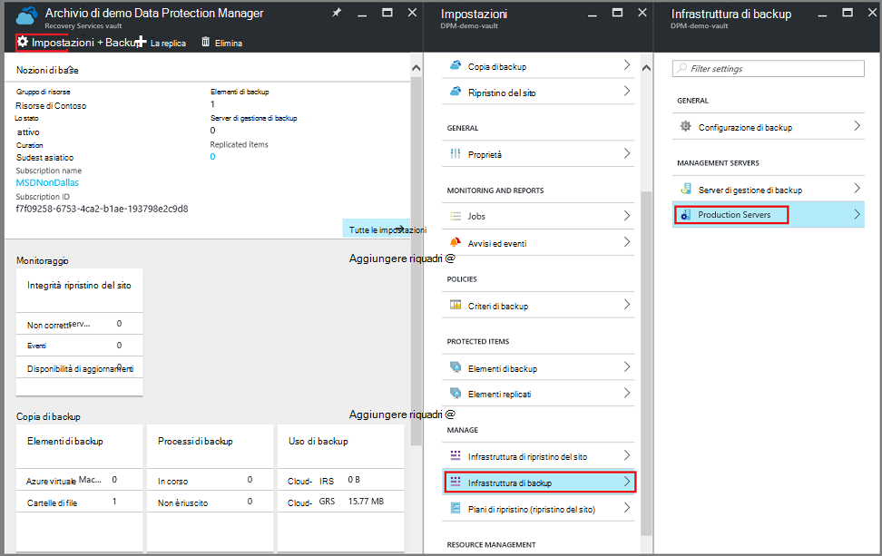

    E il **Server di produzione** verrà aperto ed elenca tutti i server di produzione l'archivio.

    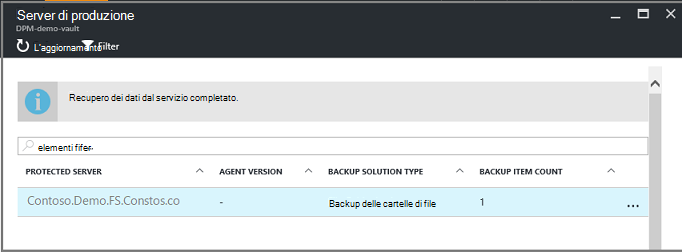

2. Scegliere e il **Server di produzione** , pulsante destro del mouse sul server e fare clic su **Elimina**.

    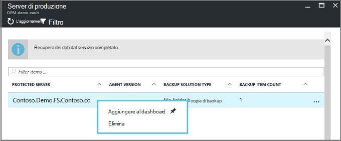

    Verrà visualizzata e **l'eliminare** .

    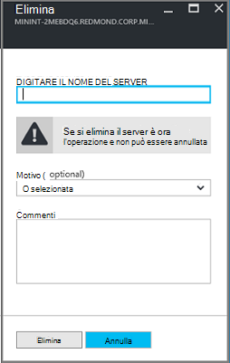

3. In e **eliminare** il confermare il nome del server da eliminare e fare clic su **Elimina**. Correttamente, è necessario immettere il nome del server per attivare il pulsante **Elimina** .

    Dopo aver eliminato l'archivio, si riceverà un messaggio che indica che l'archivio è stato eliminato. Dopo l'eliminazione di tutti i server nell'archivio di, passare al riquadro Essentials nel dashboard di archivio.

4. Il dashboard di archivio assicurarsi che non esistono **Elementi di Backup**, **server di gestione di Backup**o **elementi replicato**. Sulla barra degli strumenti archivio, fare clic su **Elimina**.

5. Quando viene chiesto di confermare che si desidera eliminare l'archivio, fare clic su **Sì**.

    L'archivio verrà eliminato e il portale restituisce al menu **Nuovo** servizio.

## Eliminare un archivio di Backup

Le istruzioni seguenti sono per l'eliminazione di un archivio di Backup nel portale di classica. Un archivio di Backup e ripristino servizi archivio sono gli stessi: prima di poter eliminare l'insieme di credenziali, eliminare gli elementi e i dati mantenuti.

1. Aprire il portale classica.

2. Nell'elenco degli archivi di backup, selezionare l'archivio che si desidera eliminare.

    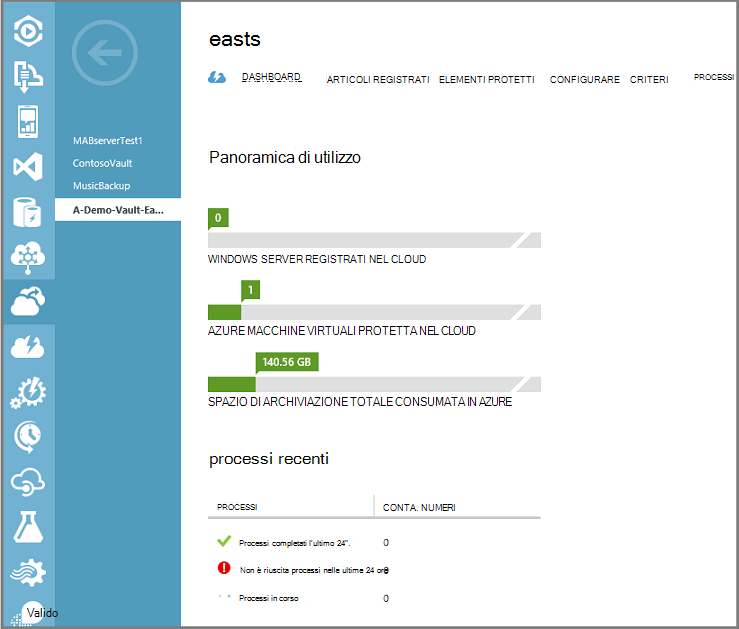

    Verrà visualizzata nel dashboard di archivio. Esaminare il numero di Windows Server e/o Azure macchine virtuali associato l'archivio. Inoltre, esaminare spazio di archiviazione totale consumata in Azure. È necessario interrompere eventuali processi di backup ed eliminare i dati esistenti prima di eliminare l'archivio.

3. Fare clic sulla scheda **Elementi protetti** e quindi fare clic su **Rimuovi protezione**

    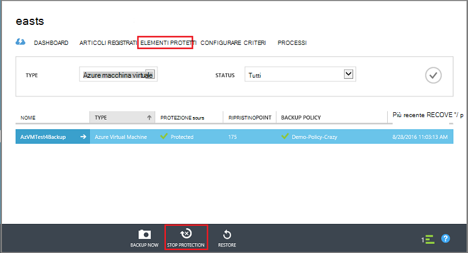

    Verrà visualizzata la finestra di dialogo **arrestare la protezione del 'l'archivio'** .

4. Nella finestra di dialogo **arrestare la protezione del 'l'archivio'** , selezionare **Elimina associato i dati di backup** e fare clic su .  
   Facoltativamente, è possibile scegliere un motivo per l'arresto della protezione e fornire un commento.

    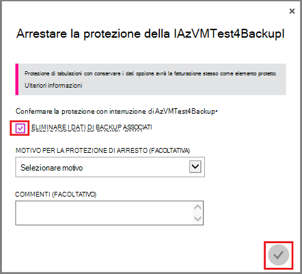

    Dopo l'eliminazione di elementi nell'archivio di archivio di sarà vuoto.

    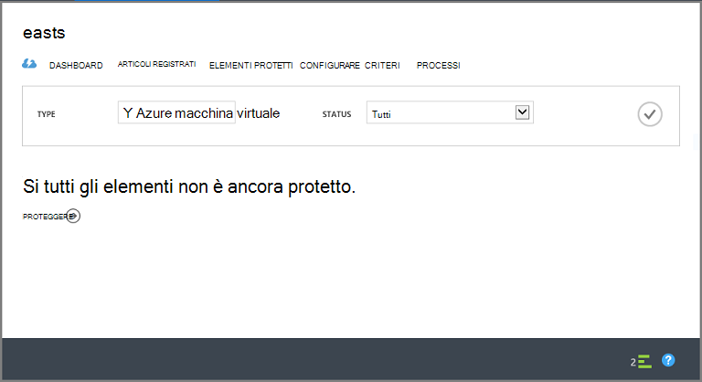

5. Nell'elenco delle schede, fare clic su **Elementi registrati**. Per ogni elemento registrato nell'archivio di, selezionare l'elemento e fare clic su **Annulla registrazione**.

    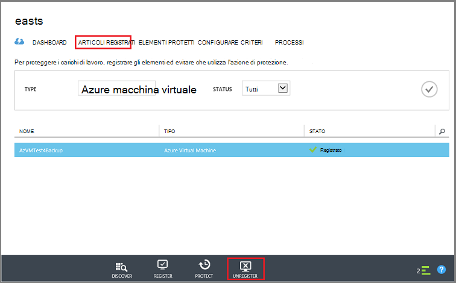

6. Nell'elenco delle schede, fare clic su **Dashboard** per aprire la scheda. Verificare che non esistono server registrati o Azure macchine virtuali protette nel cloud. Inoltre, verificare di che non contiene dati in un archivio. Fare clic su **Elimina** per eliminare l'archivio.

    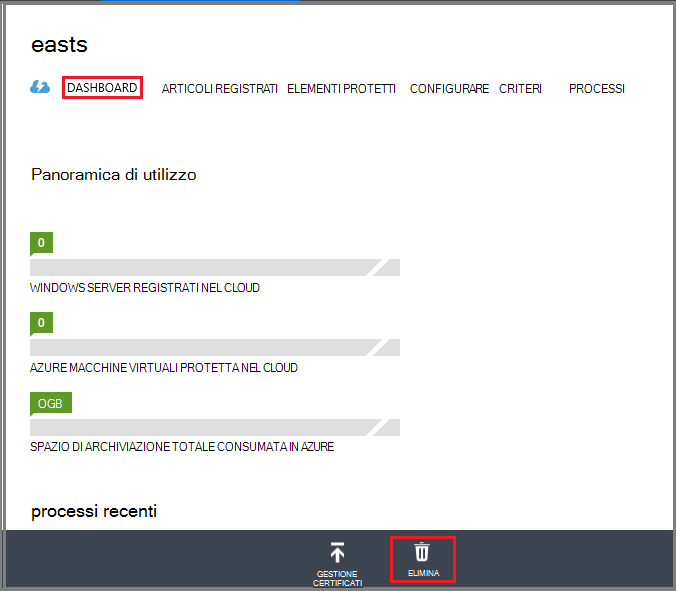

    Verrà visualizzata la schermata di conferma Elimina Backup archivio. Selezionare un'opzione perché desidera eliminare l'archivio e fare clic su .  

    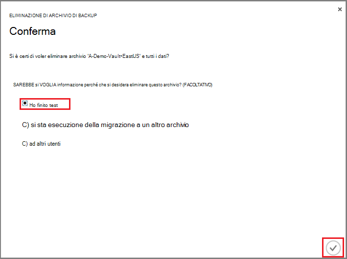

    L'archivio viene eliminato e tornare al dashboard di portale classico.

### Trovare i server di gestione di Backup registrati per l'archivio

Se si dispone di più server registrati in un archivio, può essere difficile da ricordare. Per visualizzare il server registrati per l'archivio, eliminarle:

1. Aprire il dashboard di archivio.

2. Nel riquadro di **Essentials** , fare clic su **Impostazioni** per aprire tale blade.

    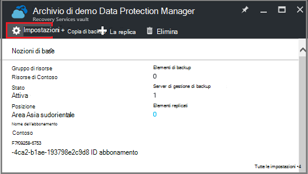

3. In **blade impostazioni**, fare clic su **Infrastruttura di Backup**.

4. Scegliere **Il server di gestione di Backup**e il **Backup dell'infrastruttura** . Verrà visualizzata e il server di gestione di Backup.

    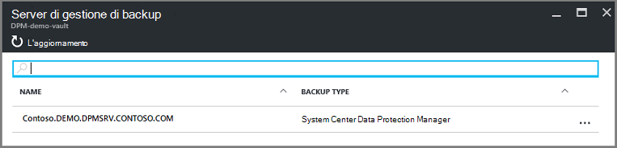

5. Per eliminare un server dall'elenco, pulsante destro del mouse sul nome del server e quindi fare clic su **Elimina**.
    Verrà visualizzata e **l'eliminare** .

6. Nella e **eliminare** specificare il nome del server. Se si tratta di un nome lungo, è possibile copiare e incollare dall'elenco dei server di gestione di Backup. Fare clic su **Elimina**.  
