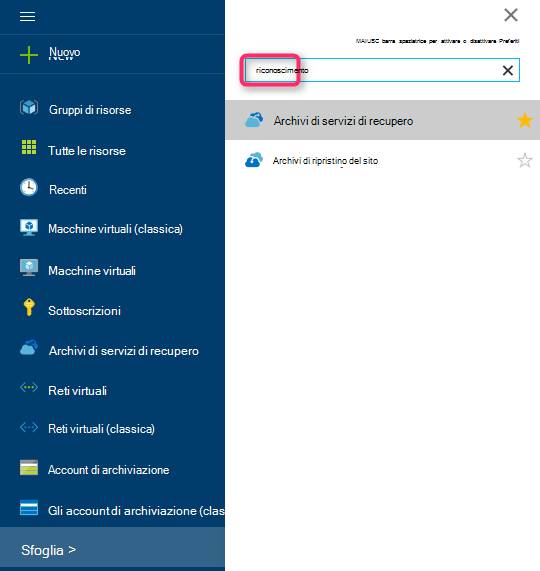

<properties
    pageTitle="Introduzione a backup Data Protection Manager Azure | Microsoft Azure"
    description="Introduzione al backup dei server Data Protection Manager mediante il servizio di Backup di Azure"
    services="backup"
    documentationCenter=""
    authors="Nkolli1"
    manager="shreeshd"
    editor=""
    keywords="System Center Data Protection Manager, gestione di protezione di dati, Data Protection Manager backup"/>

<tags
    ms.service="backup"
    ms.workload="storage-backup-recovery"
    ms.tgt_pltfrm="na"
    ms.devlang="na"
    ms.topic="article"
    ms.date="08/08/2016"
    ms.author="trinadhk;giridham;jimpark;markgal;adigan"/>

# Preparazione del backup carichi di lavoro in Azure con Data Protection Manager

> [AZURE.SELECTOR]
- [Server di Backup Azure](backup-azure-microsoft-azure-backup.md)
- [SCDPM](backup-azure-dpm-introduction.md)
- [Server di Backup Azure (classica)](backup-azure-microsoft-azure-backup-classic.md)
- [SCDPM (classico)](backup-azure-dpm-introduction-classic.md)

In questo articolo viene fornita un'introduzione all'utilizzo di Microsoft Azure Backup per proteggere i server System Center Data Protection Manager (DPM) e i carichi di lavoro. Da leggerlo, è possibile descrivere:

- Come funziona il backup di server Azure Data Protection Manager
- I prerequisiti per ottenere un'esperienza uniforme backup
- Errori tipici e su come gestirli
- Scenari supportati

> [AZURE.NOTE] Azure include due modelli di distribuzione per la creazione e utilizzo delle risorse: [Gestione risorse e classica](../resource-manager-deployment-model.md). In questo articolo fornisce informazioni e procedure per il ripristino delle macchine virtuali distribuite utilizzando il modello di Manager delle risorse.

System Center Data Protection Manager backup dei dati di file e delle applicazioni. Dati sottoposti a backup a Data Protection Manager possono essere memorizzati su nastro su disco, o il backup di Azure con Microsoft Azure Backup. Data Protection Manager interagisce con Azure Backup come indicato di seguito:

- **Data Protection Manager distribuito come macchina virtuale fisica server o locale** , ovvero se distribuzione come un server fisico o una macchina virtuale di Hyper-V in locale è possibile eseguire il backup dei dati in un archivio di servizi di recupero oltre al disco e nastro backup.
- **Data Protection Manager distribuito come una macchina virtuale Azure** , ovvero da System Center 2012 R2 con 3 di aggiornamento, è possibile distribuire Data Protection Manager come una macchina virtuale Azure. Se distribuzione come una macchina virtuale Azure, che è possibile eseguire il backup dei dati in Azure dischi collegato al computer virtuale Azure Data Protection Manager o è possibile trasferire lo spazio di archiviazione dati eseguendo il backup fino a un archivio di servizi di recupero.

## Perché eseguire il backup da Data Protection Manager in Azure?

Vantaggi dell'utilizzo di Backup di Azure per il backup dei server Data Protection Manager includono:

- Per la distribuzione di Data Protection Manager locale, è possibile utilizzare Azure un'alternativa alla distribuzione a lungo termine su nastro.
- Per distribuzioni di Data Protection Manager in Azure, Azure Backup consente di scaricare lo spazio di archiviazione dal disco di Azure, che consente di scalare archiviazione dei dati nei formati precedenti in servizi di recupero archivio e nuovi dati nel disco.

## Prerequisiti
Preparare il Backup di Azure per eseguire il backup dei dati di Data Protection Manager come indicato di seguito:

1. **Creare un archivio di servizi di recupero** , creare un archivio nel portale di Azure.
2. **Le credenziali dell'archivio di download** : Download delle credenziali che consente di registrare il server di Data Protection Manager all'archivio di servizi di recupero.
3. **Installare l'agente di Backup di Azure** , ovvero da Azure Backup, installare l'agente in ogni server Data Protection Manager.
4. **Registrare il server** , registrare il server di Data Protection Manager all'archivio di servizi di recupero.

### 1. creare un archivio di servizi di recupero
Per creare un archivio di servizi di recupero:

1. Accedere al [portale di Azure](https://portal.azure.com/).

2. Nel menu Hub fare clic su **Sfoglia** e nell'elenco delle risorse, digitare **I servizi di recupero**. Quando si inizia a digitare, l'elenco verrà applicato un filtro in base all'input. Fare clic su **archivio di servizi di recupero**.

    

    L'elenco degli archivi di servizi di recupero.

3. Nel menu **archivi di servizi di recupero** , fare clic su **Aggiungi**.

    

    Verrà visualizzata e l'archivio servizi di recupero che richiede di specificare un **nome**, **l'abbonamento**, **gruppo di risorse**e **posizione**.

    

4. Per **nome**immettere un nome descrittivo per identificare l'archivio. Il nome deve essere univoco per la sottoscrizione Azure. Digitare un nome che contiene da 2 a 50 caratteri. Deve iniziare con una lettera e possono contenere solo lettere, numeri e trattini.

5. Fare clic su **sottoscrizione** per visualizzare l'elenco delle sottoscrizioni disponibile. Se non si è certi di quale abbonamento da usare, usare il valore predefinito (o suggeriti) abbonamento. Si verificherà scelte multiple solo se l'account aziendale è associata a più abbonamenti Azure.

6. Fare clic su **gruppo di risorse** per visualizzare l'elenco dei gruppi di risorse disponibile oppure fare clic su **Nuovo** per creare un nuovo gruppo di risorse. Per informazioni complete sui gruppi di risorse, vedere [Panoramica di gestione risorse di Azure](../azure-resource-manager/resource-group-overview.md)

7. Fare clic su **posizione** per selezionare la località geografica per l'archivio.

8. Fare clic su **Crea**. Può richiedere un po' di tempo per l'archivio di servizi di recupero da creare. Eseguire il monitoraggio delle notifiche sullo stato nell'area superiore destro nel portale.
Dopo aver creato l'archivio, viene aperta nel portale.

### Impostare la replica di spazio di archiviazione

L'opzione di replica di spazio di archiviazione consente di scegliere tra lo spazio di archiviazione ridondanti geografico e lo spazio di archiviazione ridondante in locale. Per impostazione predefinita, l'archivio dispone di spazio di archiviazione ridondanti geografico. Lasciare l'opzione impostata per lo spazio di archiviazione ridondanti geografico se si tratta di backup principale. Scegliere lo spazio di archiviazione in locale ridondante se si desidera un'opzione meno che non è abbastanza come permanente. Per saperne di più sui [geografico ridondanti](../storage/storage-redundancy.md#geo-redundant-storage) e opzioni relative all'archiviazione [localmente ridondanti](../storage/storage-redundancy.md#locally-redundant-storage) nella [Panoramica della replica di archiviazione Azure](../storage/storage-redundancy.md).

Per modificare l'impostazione di replica di spazio di archiviazione:

1. Selezionare l'insieme di credenziali per aprire il dashboard di archivio ed e l'impostazioni. Se non si apre e **l'Impostazioni** , fare clic su **tutte le impostazioni** del dashboard di archivio di.

2. Scegliere **Dell'infrastruttura di Backup**e **l'Impostazioni**  > **Configurazione di Backup** per aprire e il **Backup configurazione** . Scegliere l'opzione di replica di spazio di archiviazione per l'archivio e il **Backup configurazione** .

    

    Dopo aver selezionato l'opzione di spazio di archiviazione per l'archivio, si è pronti associare la macchina virtuale nell'archivio. Per iniziare l'associazione, si deve individuare e registrare le macchine virtuali Azure.

### 2. scaricare archivio credenziali

Il file di archivio credenziali è un certificato generato dal portale per ogni archivio di backup. Il portale quindi carica la chiave pubblica in Access Control Service (ACS). La chiave privata del certificato è disponibile per l'utente come parte del flusso di lavoro fornito come input per il flusso di lavoro di registrazione di computer. Consente di autenticare il computer per inviare i dati di backup in un archivio identificato nel servizio di Azure Backup.

Le credenziali di archivio viene utilizzata solo durante il flusso di lavoro di registrazione. È responsabilità dell'utente per garantire che il file di archivio credenziali non è stata compromessa. Se si trova nelle mani di qualsiasi utente non autorizzato, il file di archivio credenziali può essere utilizzato per registrare altri computer contro lo stesso archivio. Tuttavia, come i dati di backup sono crittografati tramite una frase che appartiene al cliente, dati di backup esistenti non possono essere compromesso. Per ovviare a questo problema, archivio credenziali sono impostate su una scadenza 48hrs. È possibile scaricare le credenziali di archivio di servizi di recupero qualsiasi numero di volte, ma solo il più recente archivio credenziali file applicabile durante il flusso di lavoro di registrazione.

Il file di archivio credenziali viene scaricato tramite un canale sicuro dal portale di Azure. Il servizio di Backup di Azure non riconosce la chiave privata del certificato e la chiave privata non viene mantenuta nel portale o il servizio. Utilizzare la procedura seguente per scaricare il file di archivio credenziali in un computer locale.

1. Accedere al [portale di Azure](https://portal.azure.com/).

2. Aprire archivio di servizi di recupero a cui a cui si desidera registrare Data Protection Manager computer.

3. Blade impostazioni aperta per impostazione predefinita. Se è chiuso, fare clic su **Impostazioni** nel dashboard di archivio per aprire e l'impostazioni. In blade impostazioni, fare clic su **proprietà**.

    

4. Nella pagina delle proprietà fare clic su **Download** con **Le credenziali di Backup**. Il portale genera il file archivio credenziali, che è disponibile per il download.

    

Il portale genererà credenziali archivio utilizzando una combinazione di nome dell'archivio e la data corrente. Fare clic su **Salva** per scaricare le credenziali di archivio per cartella dei download dell'account locale oppure scegliere Salva con nome dal menu Salva per specificare un percorso per le credenziali di archivio. Sarà necessaria fino a un minuto per il file da generare.

### Nota
- Assicurarsi che l'archivio credenziali viene salvato in un percorso accessibile dal proprio computer. Se è archiviato in un condivisione file/SMB, controllare le autorizzazioni di accesso.
- Il file di archivio credenziali viene utilizzato solo durante il flusso di lavoro di registrazione.
- Il file di archivio credenziali scadenza 48hrs e può essere scaricato dal portale.

### 3. installa agente di Backup

Dopo aver creato l'archivio di Backup di Azure, un agente deve essere installato su tutti i computer di Windows (Windows Server, client di Windows, System Center Data Protection Manager server o computer Server Backup Azure) che consente di eseguire il backup dei dati e alle applicazioni di Azure.

1. Aprire archivio di servizi di recupero a cui a cui si desidera registrare Data Protection Manager computer.

2. Blade impostazioni aperta per impostazione predefinita. Se è chiuso, fare clic su **Impostazioni** per aprire e l'impostazioni. In blade impostazioni, fare clic su **proprietà**.

    

3. Nella pagina Impostazioni fare clic su **Scarica** in **Azure Backup Agent**.

    

   Dopo aver scaricato l'agente, fare doppio clic su MARSAgentInstaller.exe per avviare l'installazione dell'agente di Backup di Azure. Scegliere la cartella di installazione e necessari per l'agente di nuova cartella. Il percorso della cache specificato deve essere disponibile spazio almeno 5% dei dati di backup.

4.  Se si usa un server proxy per la connessione a internet, nella schermata di **configurazione del Proxy** , immettere i dettagli di server proxy. Se si utilizza un proxy autenticato, immettere i dettagli di nome e una password utente in questa schermata.

5.  L'agente di Backup di Azure consente di installare Windows PowerShell e .NET Framework 4.5 (se non è disponibile già) per completare l'installazione.

6.  Dopo aver installato l'agente, **chiudere** la finestra.

    

7. Per **registrare il Server Data Protection Manager** per l'archivio, nella scheda **Gestione** , fare clic su **Online**. Selezionare quindi **eseguire la registrazione**. Si aprirà la configurazione guidata di eseguire la registrazione.

8. Se si usa un server proxy per la connessione a internet, nella schermata di **configurazione del Proxy** , immettere i dettagli di server proxy. Se si utilizza un proxy autenticato, immettere i dettagli di nome e una password utente in questa schermata.

    

9. Nella schermata archivio credenziali, individuare e selezionare il file di archivio credenziali che in precedenza è stato scaricato.

    

    Il file di archivio credenziali è valido solo per 48 ore (dopo essere stato scaricato dal portale). Se si verifica un errore in questa schermata (ad esempio "archivio credenziali file fornito è scaduto"), accedere al portale di Azure e download di file nuovamente le credenziali di archivio.

    Assicurarsi che il file di archivio credenziali sia disponibile in un percorso accessibile tramite l'applicazione di installazione. Se si verificano problemi correlati di accesso, copiare il file di archivio credenziali in un percorso temporaneo nel computer in uso e ripetere l'operazione.

    Se si verifica un errore di credenziali archivio non valido (ad esempio, "non valido archivio credenziali condizione") il file è danneggiato o non sono associati le credenziali più recenti con il servizio di recupero. Ripetere l'operazione dopo il download di un nuovo file di archivio credenziali dal portale. Questo errore solitamente si verifica se l'utente fa clic sull'opzione di **Download delle credenziali di archivio** nel portale di Azure, in rapida sequenza. In questo caso, solo secondo archivio credenziali file è valido.

10. Per controllare l'utilizzo della larghezza di banda di rete durante l'ufficio e ore non lavorativo, nella schermata di **Impostazione limitazione** , è possibile impostare i limiti di utilizzo della larghezza di banda e definire il lavoro e non-lavoro ore.

    

11. Nella schermata di **Impostazione di una cartella ripristino** , cercare la cartella in cui verranno inseriti temporaneamente i file scaricati da Azure.

    

12. Nella schermata di **impostazione di crittografia** , è possibile generare una frase o fornire una frase (minimo di 16 caratteri). È necessario ricordare di salvare la passphrase in un percorso sicuro.

    

    > [AZURE.WARNING] Se la passphrase viene persa o dimenticata; Microsoft non consente di ripristinare i dati di backup. L'utente finale proprietario passphrase crittografia Microsoft non sono visibili in passphrase utilizzata dall'utente finale. Salvare il file in un percorso sicuro come richiesto durante un'operazione di ripristino.

13. Quando si fa clic sul pulsante di **registrazione** , il computer è registrato correttamente all'archivio e ora si è pronti iniziare a backup Microsoft Azure.

14. Quando si utilizza Data Protection Manager, è possibile modificare le impostazioni specificate durante il flusso di lavoro di registrazione facendo clic sull'opzione **Configura** selezionando **Online** nella scheda **Gestione** .

## Requisiti (e limitazioni)

- Data Protection Manager può essere eseguito come un server fisico o una macchina virtuale Hyper-V installati System Center 2012 SP1 o System Center 2012 R2. È possibile eseguire anche come una macchina virtuale Azure in esecuzione su System Center 2012 R2 con almeno Data Protection Manager 2012 R2 aggiornamento cumulativo 3 o una macchina virtuale di Windows in esecuzione in System Center 2012 R2 con almeno VMWare aggiornamento cumulativo 5.
- Se si esegue Data Protection Manager con System Center 2012 SP1 è necessario installare le trasmissioni aggiornamento su 2 per System Center Data Protection Manager SP1. Questa operazione è necessaria prima di installare l'agente di Backup di Azure.
- Il server Data Protection Manager deve disporre di Windows PowerShell e .net Framework 4.5 installato.
- Data Protection Manager è possibile eseguire il backup la maggior parte dei carichi di lavoro eseguire il Backup di Azure. Per un elenco completo delle quali sono supportati vedere il Backup di Azure supporta elementi riportata di seguito.
- Dati archiviati in Azure Backup non possono essere recuperati con l'opzione "copia su nastro".
- È necessario un account Azure con la funzionalità di Backup di Azure attivata. Se non si dispone di un account, è possibile creare un account di valutazione gratuito in pochi minuti. Informazioni sui [Backup di Azure prezzi](https://azure.microsoft.com/pricing/details/backup/).
- Utilizzo del Backup Azure richiede l'agente di Backup Azure installato nei server che si desidera eseguire il backup. Ogni server deve avere almeno 5% delle dimensioni dei dati che viene eseguito il backup, disponibile come spazio di archiviazione gratuito locale. Ad esempio, il backup dei 100 GB di dati richiede un minimo di 5 GB di spazio disponibile nella posizione iniziale.
- Dati vengono archiviati in archiviazione archivio Azure. Illimitato per la quantità di dati che è possibile eseguire il backup di una copia di Backup di Azure archivio, ma le dimensioni di un'origine dati (ad esempio una macchina virtuale o database) non devono superare 54400 GB.

Questi tipi di file supportati per eseguire il backup di Azure:

- Crittografati (solo backup completi)
- Compressi (backup incrementali supportato)
- Sparse (backup incrementali supportato)
- Compresso e caricato in memoria bassa (considerato Sparse)

E questi non sono supportati:

- Server di maiuscole e minuscole file System non sono supportati.
- Collegamenti fissi (ignorato)
- Punti (ignorato) di analisi
- Crittografati e compressi (ignorato)
- Crittografati e caricato in memoria bassa (ignorata)
- Flusso compresso
- Flusso caricato in memoria bassa

>[AZURE.NOTE] Da in System Center 2012 DPM con SP1 in poi è possibile eseguire il backup dei carichi di lavoro protetti da Data Protection Manager di Azure con Microsoft Azure Backup.
