<properties
    pageTitle="Gestire e monitorare l'esecuzione di backup Azure macchina virtuale | Microsoft Azure"
    description="Informazioni su come gestire e monitorare un backup Azure macchina virtuale"
    services="backup"
    documentationCenter=""
    authors="trinadhk"
    manager="shreeshd"
    editor=""/>

<tags
    ms.service="backup"
    ms.workload="storage-backup-recovery"
    ms.tgt_pltfrm="na"
    ms.devlang="na"
    ms.topic="article"
    ms.date="08/31/2016"
    ms.author="trinadhk; jimpark; markgal;"/>

# <a name="manage-and-monitor-azure-virtual-machine-backups"></a>Gestire e monitorare l'esecuzione di backup Azure macchina virtuale

> [AZURE.SELECTOR]
- [Gestire i backup macchine Virtuali di Azure](backup-azure-manage-vms.md)
- [Gestire i backup macchine Virtuali classica](backup-azure-manage-vms-classic.md)

In questo articolo fornisce informazioni sulle comuni attività di gestione e monitoraggio per macchine virtuali modello classico protetta da Azure.  

>[AZURE.NOTE] Azure include due modelli di distribuzione per la creazione e utilizzo delle risorse: [Gestione risorse e classica](../resource-manager-deployment-model.md). Per informazioni sull'utilizzo di modello di distribuzione classica macchine virtuali, vedere [preparare l'ambiente per eseguire il backup macchine virtuali di Azure](backup-azure-vms-prepare.md) .

## <a name="manage-protected-virtual-machines"></a>Gestire macchine virtuali protette

Per gestire macchine virtuali protette:

1. Per visualizzare e gestire le impostazioni di backup per una macchina virtuale fare clic sulla scheda **Elementi protetti** .

2. Fare clic sul nome di un elemento protetto per visualizzare la scheda **Dettagli del Backup** , che vengono visualizzate informazioni sull'ultimo backup.

    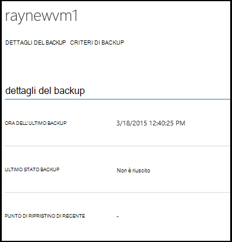

3. Per visualizzare e gestire i criteri di backup impostazioni per una macchina virtuale fare clic sulla scheda **criteri** .

    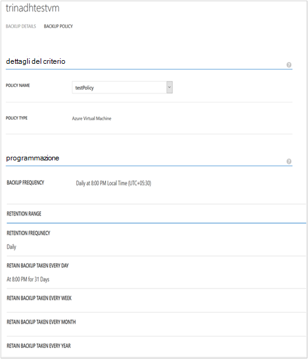

    La scheda **Criteri di Backup** Mostra il criterio esistente. È possibile modificare in base alle esigenze. Se è necessario creare un nuovo criterio fare clic su **Crea** nella pagina **criteri** . Notare che se si desidera rimuovere i criteri non devono avere le macchine virtuali è associate.

    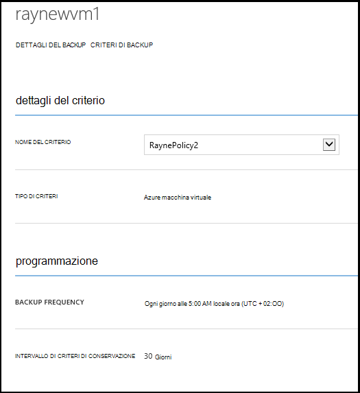

4. È possibile ottenere ulteriori informazioni sulle azioni o lo stato per una macchina virtuale nella pagina **processi** . Fare clic su un processo nell'elenco per ottenere ulteriori dettagli o filtrare processi per una macchina virtuale specifica.

    

## <a name="on-demand-backup-of-a-virtual-machine"></a>Backup su richiesta di una macchina virtuale
Dopo aver configurato per la protezione, è possibile eseguire backup di una macchina virtuale una richiesta. Se non è in attesa di backup iniziale per la macchina virtuale backup su richiesta verrà creata una copia completa della macchina virtuale in Azure archivio di backup. Se viene completata prima copia di backup, verranno backup su richiesta solo invia le modifiche apportate dal backup precedente backup Azure archivio vale a dire è sempre incrementale.

>[AZURE.NOTE] Intervallo di criteri di conservazione di una copia di backup su richiesta è impostato su criteri di conservazione valore specificato per la conservazione giornaliera in Criteri di backup corrispondente alla macchina virtuale.  

Eseguire il backup di una macchina virtuale una richiesta:

1. Passare alla pagina di **Elementi protetti** e selezionare **macchina virtuale Azure** come **tipo** (se non è già selezionata) e fare clic sul pulsante **Seleziona** .

    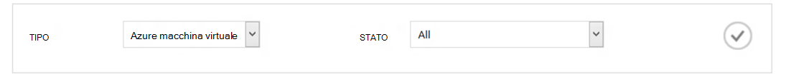

2. Selezionare la macchina virtuale in cui si desidera eseguire una richiesta backup e fare clic sul pulsante **Esegui backup** nella parte inferiore della pagina.

    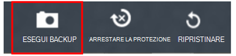

    Verrà creato un processo di backup nel computer virtuale selezionato. Intervallo di criteri di conservazione del punto di ripristino creato tramite questo processo sarà uguale a quella specificato nel criterio associato alla macchina virtuale.

    

    >[AZURE.NOTE] Per visualizzare il criterio associato a una macchina virtuale, drill-down macchina virtuale nella pagina di **Elementi protetti** e passare alla scheda Criteri di backup.

3. Una volta creato il processo, è possibile fare clic sul pulsante **Visualizza processo** nella barra di tipo avviso popup per visualizzare la corrispondente nella pagina dei processi.

    

4. Dopo il completamento del processo, verrà creato un punto di ripristino che consente di ripristinare la macchina virtuale. Questa operazione anche incrementare il valore di colonna punto ripristino 1 nella pagina **Elementi protetti** .

## <a name="stop-protecting-virtual-machines"></a>Arrestare la protezione macchine virtuali
È possibile scegliere di interrompere i futuri backup di una macchina virtuale con le opzioni seguenti:

- Mantenere i dati di backup associati macchina virtuale nell'archivio di Backup di Azure
- Eliminare i dati di backup associati macchina virtuale

Se si è scelto di mantenere i dati di backup associati macchina virtuale, è possibile utilizzare i dati di backup per ripristinare la macchina virtuale. Per informazioni dettagliate per tali macchine virtuali i prezzi, fare clic [qui](https://azure.microsoft.com/pricing/details/backup/).

Per interrompere la protezione per una macchina virtuale:

1. Passare alla pagina di **Elementi protetti** e selezionare **Azure macchina virtuale** come tipo di filtro (se non è già selezionata) e fare clic sul pulsante **Seleziona** .

    

2. Selezionare l'immagine e fare clic su **Rimuovi protezione** nella parte inferiore della pagina.

    

3. Per impostazione predefinita, Azure Backup non eliminare i dati di backup associati alla macchina virtuale.

    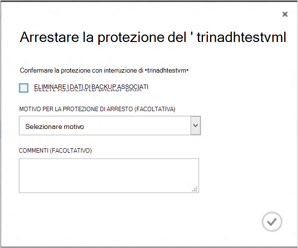

    Se si desidera eliminare i dati di backup, selezionare la casella di controllo.

    

    Selezionare un motivo per interrompere il backup. Mentre si è facoltativa, fornire un motivo aiuta a Backup Azure per gestire i commenti e definirne la priorità scenari cliente.

4. Fare clic su **Invia** per inviare il processo di **arrestare la protezione** . Fare clic sul **Processo di visualizzazione** per visualizzare il processo nella pagina **dei processi** corrispondente.

    

    Se non si è selezionata l'opzione **Elimina i dati di backup associati** durante la creazione guidata **Rimuovi protezione** e quindi il completamento del processo di post, arrestare **La protezione con**lo stato di protezione. I dati rimangono con Azure Backup finché non viene eliminato esplicitamente. È sempre possibile eliminare i dati selezionando la macchina virtuale nella pagina di **Elementi protetti** e facendo clic su **Elimina**.

    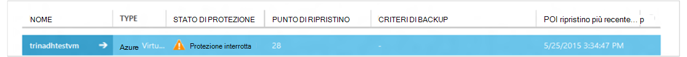

    Se è stata selezionata l'opzione di **eliminazione di dati di backup associati** , la macchina virtuale non faccia parte della pagina di **Elementi protetti** .

## <a name="re-protect-virtual-machine"></a>Proteggere con una nuova macchina virtuale
Se non si è selezionata l'opzione **Elimina associati dati di backup** in **Rimuovi protezione**, è possibile proteggere nuovamente la macchina virtuale eseguendo la procedura descritta simile a backup macchine virtuali registrate. Dopo aver protetto, questa macchina virtuale avrà mantenuti prima di arresto protezione dati di backup e punti di ripristino creati dopo proteggere nuovamente.

Dopo aver nuovamente proteggere, lo stato di protezione del computer virtuale verrà modificato in **protetta** se sono presenti i punti di ripristino prima **Rimuovi protezione**.

  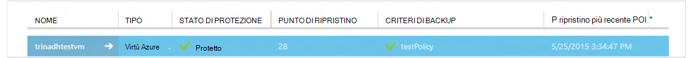

>[AZURE.NOTE] Quando si protegge nuovamente la macchina virtuale, è possibile scegliere criteri diversi rispetto ai criteri con cui è stato protetto da inizialmente macchina virtuale.

## <a name="unregister-virtual-machines"></a>Annullare la registrazione macchine virtuali

Se si desidera rimuovere la macchina virtuale dall'archivio di backup:

1. Fare clic sul pulsante di **annullamento della registrazione** nella parte inferiore della pagina.

    

    Nella parte inferiore della schermata di richiesta di conferma viene visualizzata una notifica di tipo avviso popup. Fare clic su **Sì** per continuare.

    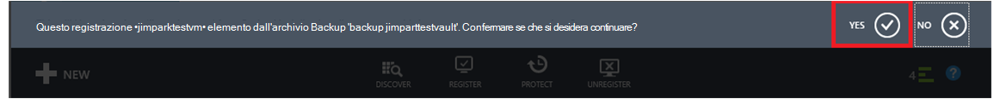

## <a name="delete-backup-data"></a>Eliminare i dati di Backup
È possibile eliminare i dati di backup associati a una macchina virtuale, così:

- Durante il processo di protezione interruzione
- Dopo una protezione Interrompi processo in un computer virtuale

Per eliminare i dati di backup in un computer virtuale che è in stato di *Protezione arrestato* registrare il corretto completamento di un processo di **Backup interrompere** :

1. Passare alla pagina di **Elementi protetti** e selezionare **macchina virtuale Azure** come *tipo* e fare clic sul pulsante **Seleziona** .

    

2. Selezionare la macchina virtuale. La macchina virtuale sarà nello stato di **Protezione interrotta** .

    

3. Fare clic sul pulsante **Elimina** nella parte inferiore della pagina.

    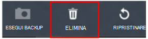

4. Nella creazione guidata **eliminare i dati di backup** , selezionare il motivo per l'eliminazione di dati di backup (scelta consigliati) e fare clic su **Invia**.

    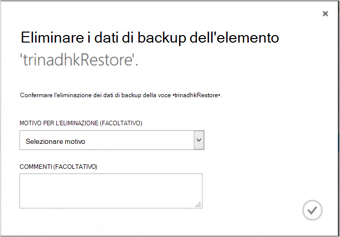

5. Verrà creato un processo per eliminare i dati di backup della macchina virtuale selezionata. Fare clic su **Visualizza processo** per visualizzare un processo corrispondente nella pagina dei processi.

    

    Una volta completato il processo, sulla voce corrispondente alla macchina virtuale verrà rimosso dalla pagina di **elementi protetta** .

## <a name="dashboard"></a>Dashboard
Nella pagina **Dashboard** è possibile esaminare informazioni macchine virtuali di Azure, loro lo spazio di archiviazione e processi associati nelle ultime 24 ore. È possibile visualizzare lo stato di backup e gli eventuali errori di backup associati.

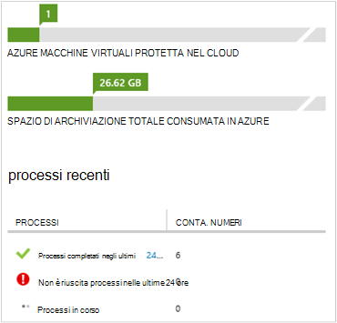

>[AZURE.NOTE] I valori nel dashboard vengono aggiornati ogni 24 ore.

## <a name="auditing-operations"></a>Operazioni di controllo
Copia di backup Azure consente di analisi dei "operazione log" operazioni di backup attivate tramite il cliente rendendo più semplice vedere esattamente sono state eseguite le operazioni di gestione di backup archivio. Operazioni registri abilitare post-mortem interessanti e controllare il supporto per le operazioni di backup.

Nel log di operazione vengono registrate le operazioni seguenti:

- Eseguire la registrazione
- Annullare la registrazione
- Configurare la protezione
- Copia di backup (entrambe pianificate oltre al tipo di backup su richiesta tramite BackupNow)
- Ripristinare
- Arrestare la protezione
- Eliminare i dati di backup
- Aggiungere criteri
- Eliminare criterio
- Criterio di aggiornamento
- Annulla processo

Per visualizzare i registri di operazione corrispondente a un archivio di backup:

1. Passare a **Gestione servizi** nel portale di Azure e quindi fare clic sulla scheda **Registri operazioni** .

    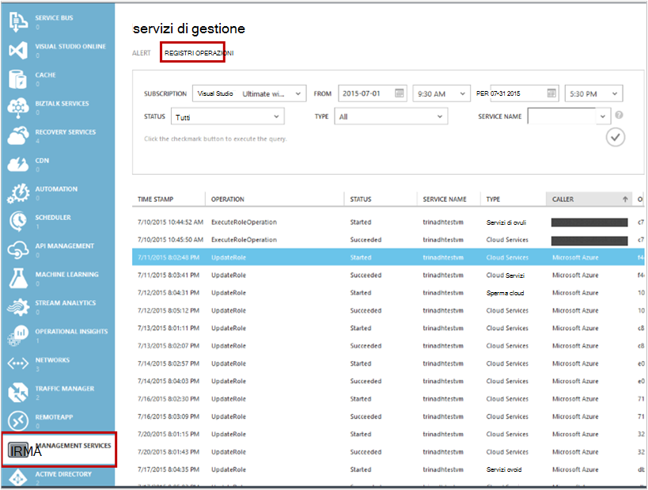

2. I filtri, selezionare **Backup** come *tipo* e specificare il nome di archivio di backup nel *nome del servizio* e fare clic su **Invia**.

    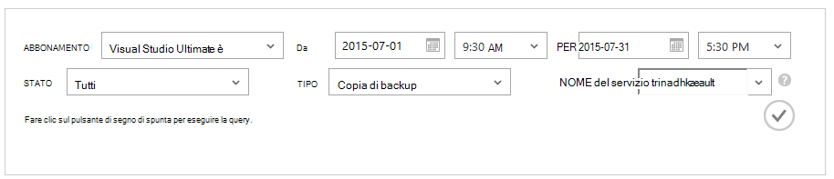

3. Nei registri operazioni selezionare qualsiasi operazione e fare clic su **Dettagli** per visualizzare i dettagli corrispondente a un'operazione.

    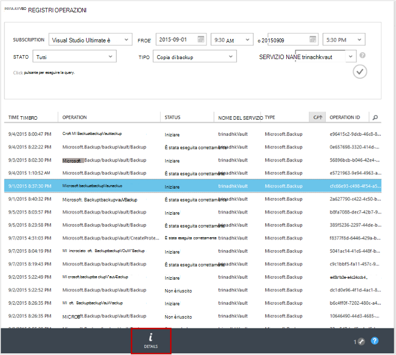

    La **procedura guidata dettagli** contiene informazioni sull'operazione di attivazione di processo Id, delle risorse in cui viene attivata questa operazione e ora di inizio dell'operazione.

    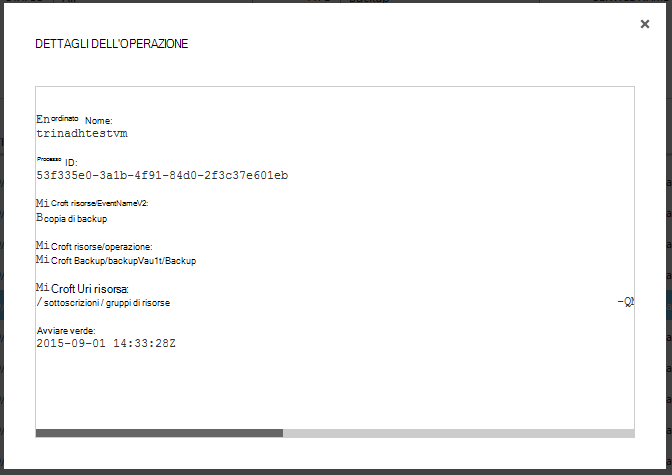

## <a name="alert-notifications"></a>Notifiche di avviso
È possibile ottenere notifiche di avviso personalizzate per i processi nel portale. Questa operazione viene eseguita mediante la definizione di regole di avviso in base a PowerShell gli eventi registri operativi. È consigliabile usare *PowerShell versione 1.3.0 o versione successiva*.

Per definire una notifica personalizzata per un avviso per gli errori di backup, un comando di esempio si presenterà:

```
PS C:\> $actionEmail = New-AzureRmAlertRuleEmail -CustomEmail contoso@microsoft.com
PS C:\> Add-AzureRmLogAlertRule -Name backupFailedAlert -Location "East US" -ResourceGroup RecoveryServices-DP2RCXUGWS3MLJF4LKPI3A3OMJ2DI4SRJK6HIJH22HFIHZVVELRQ-East-US -OperationName Microsoft.Backup/backupVault/Backup -Status Failed -TargetResourceId /subscriptions/86eeac34-eth9a-4de3-84db-7a27d121967e/resourceGroups/RecoveryServices-DP2RCXUGWS3MLJF4LKPI3A3OMJ2DI4SRJK6HIJH22HFIHZVVELRQ-East-US/providers/microsoft.backupbvtd2/BackupVault/trinadhVault -Actions $actionEmail
```

**ResourceId**: È possibile ottenere da popup registri operazioni come descritto sopra la sezione. ResourceUri nella finestra popup dettagli di un'operazione è ResourceId da fornire per questo cmdlet.

**Invece**: trattarsi del formato "Microsoft.Backup/backupvault/<EventName>" in cui EventName corrisponde a uno dei registri, annullamento della registrazione, ConfigureProtection, eseguirne il Backup, ripristino StopProtection, DeleteBackupData, CreateProtectionPolicy, DeleteProtectionPolicy, UpdateProtectionPolicy

**Stato**: valori sono iniziato, supportati e riuscita.

**ResourceGroup**: ResourceGroup della risorsa in cui viene attivata l'operazione. È possibile ottenere dal valore ResourceId. Valore tra campi */resourceGroups/* e */providers/* nel valore ResourceId è un valore per ResourceGroup.

**Nome**: nome della regola di avviso.

**CustomEmail**: specificare l'indirizzo di posta elettronica personalizzato a cui si desidera inviare la notifica degli avvisi

**SendToServiceOwners**: questa opzione Invia notifica degli avvisi per tutti gli amministratori e coamministratori della sottoscrizione. Può essere utilizzato in cmdlet **New-AzureRmAlertRuleEmail**

### <a name="limitations-on-alerts"></a>Limitazioni per gli avvisi
Gli avvisi basati sulla evento sono sottoposti a limitazioni seguenti:

1. Avvisi sono attivati per tutte le macchine virtuali nell'archivio di backup. Non è possibile personalizzare in modo da ricevere avvisi per un gruppo specifico di macchine virtuali in un archivio di backup.
2. Questa caratteristica è in anteprima. [Ulteriori informazioni](../monitoring-and-diagnostics/insights-powershell-samples.md#create-alert-rules)
3. Si riceveranno gli avvisi di "alerts-noreply@mail.windowsazure.com". Attualmente non è possibile modificare il mittente di posta elettronica.

## <a name="next-steps"></a>Passaggi successivi

- [Ripristinare macchine virtuali di Azure](backup-azure-restore-vms.md)
