<properties
    pageTitle="Gestire i backup distribuito Manager delle risorse macchina virtuale | Microsoft Azure"
    description="Informazioni su come gestire e monitorare l'esecuzione di backup distribuito Manager delle risorse macchina virtuale"
    services="backup"
    documentationCenter=""
    authors="trinadhk"
    manager="shreeshd"
    editor=""/>

<tags
    ms.service="backup"
    ms.workload="storage-backup-recovery"
    ms.tgt_pltfrm="na"
    ms.devlang="na"
    ms.topic="article"
    ms.date="08/11/2016"
    ms.author="jimpark; markgal; trinadhk"/>

# Gestire i backup Azure macchina virtuale

> [AZURE.SELECTOR]
- [Gestire i backup macchine Virtuali di Azure](backup-azure-manage-vms.md)
- [Gestire i backup macchine Virtuali classica](backup-azure-manage-vms-classic.md)

In questo articolo vengono fornite informazioni sulla gestione dei backup macchine Virtuali e vengono illustrate le informazioni di backup avvisi disponibili nel portale dashboard. Le indicazioni in questo articolo si applica all'uso di macchine virtuali con archivi di servizi di recupero. In questo articolo non viene illustrata la creazione di macchine virtuali, né spiegare come proteggere macchine virtuali. Per una panoramica sulla protezione distribuito Manager delle risorse Azure macchine virtuali di Azure a un archivio di servizi di recupero, vedere [prima di tutto: eseguire il backup di macchine virtuali in un archivio di servizi di recupero](backup-azure-vms-first-look-arm.md).

## Gestire archivi e macchine virtuali protette

Nel portale di Azure, il dashboard di archivio di servizi di recupero consente di accedere alle informazioni sull'inclusione di archivio:

- l'ultima istantanea di backup, è anche il punto di ripristino più recente < br\>
- criteri di backup < br\>
- dimensioni tutte le copie di backup totali < br\>
- numero di macchine virtuali che sono protetti con l'archivio < br\>

Molte attività di gestione con una copia di backup macchina virtuale iniziano con aprire l'archivio nel dashboard. Tuttavia, poiché gli archivi possono essere utilizzati per proteggere con una o più elementi (macchine virtuali più), per visualizzare i dettagli di una macchina virtuale specifico, aprire il dashboard di elemento archivio. La procedura seguente viene illustrato come aprire il *dashboard di archivio* e quindi continuare con il *dashboard elemento archivio*. Esistono "suggerimenti" in entrambe le procedure che puntano su come aggiungere l'archivio e archivio elemento al dashboard di Azure tramite Pin al comando dashboard. Aggiungi a dashboard sono una modalità di creazione di un collegamento per l'insieme di credenziali o l'elemento. È anche possibile eseguire con i comandi comuni dal collegamento.

>[AZURE.TIP] Se si dispone di più dashboard e aprire pale, usare il dispositivo di scorrimento blu scuro nella parte inferiore della finestra per diapositiva dashboard di Azure e viceversa.

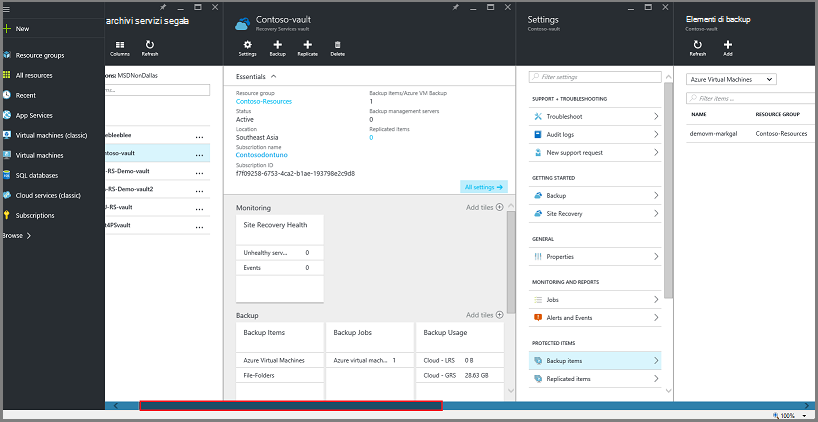

### Aprire un archivio di servizi di recupero nel dashboard:

1. Accedere al [portale di Azure](https://portal.azure.com/).

2. Nel menu Hub fare clic su **Sfoglia** e nell'elenco delle risorse, digitare **I servizi di recupero**. Quando si inizia a digitare, i filtri di elenco in base all'input. Fare clic su **archivio di servizi di recupero**.

    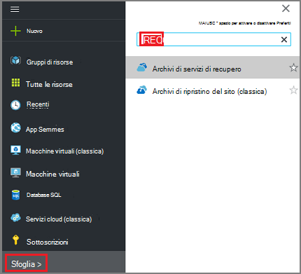  

    L'elenco degli archivi di servizi di recupero.

    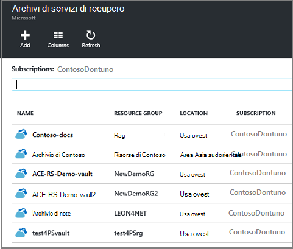  

    >[AZURE.TIP] Se si aggiunge un archivio al Dashboard di Azure, tale archivio è immediatamente accessibile quando si apre il portale di Azure. Per aggiungere un archivio per il dashboard nell'elenco archivio, mouse l'archivio e scegliere **Aggiungi a dashboard**.

3. Nell'elenco degli archivi, selezionare l'insieme di credenziali per aprire il dashboard. Quando si seleziona l'archivio, aprire il dashboard di archivio ed e **l'Impostazioni** . Nell'immagine seguente viene evidenziato nel dashboard di **archivio di Contoso** .

    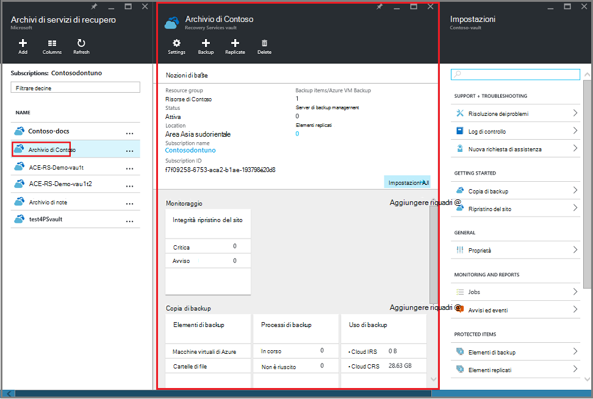

### Aprire un dashboard di elemento archivio

Nella procedura precedente è stato aperto il dashboard di archivio. Per aprire il dashboard elemento archivio:

1. Il dashboard di archivio sul riquadro **Gli elementi di Backup** , fare clic su **macchine virtuali di Azure**.

    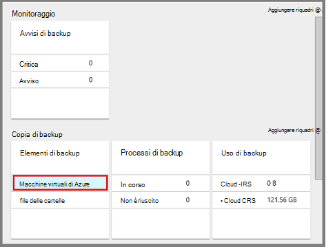

    E il **Backup di elementi** sono elencati il processo di backup ultimo per ogni elemento. In questo esempio è una macchina virtuale, demovm markgal, protetta da questo archivio.  

    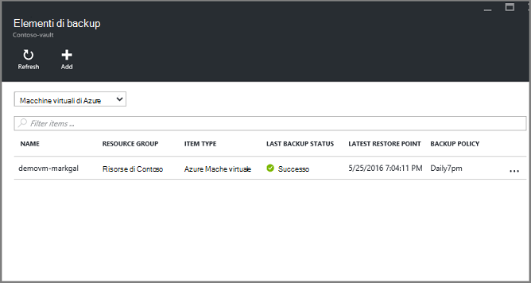

    >[AZURE.TIP] Per facilitare l'accesso, è possibile aggiungere un elemento dell'archivio al Dashboard di Azure. Per aggiungere un elemento dell'archivio nell'elenco di elementi archivio, pulsante destro del mouse sull'elemento e selezionare **Aggiungi a dashboard**.

2. Selezionare l'elemento per aprire il dashboard elemento archivio e il **Backup elementi** .

    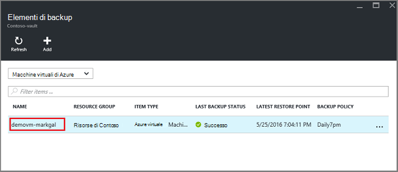

    Aprire il dashboard elemento archivio e il relativo blade **Impostazioni** .

    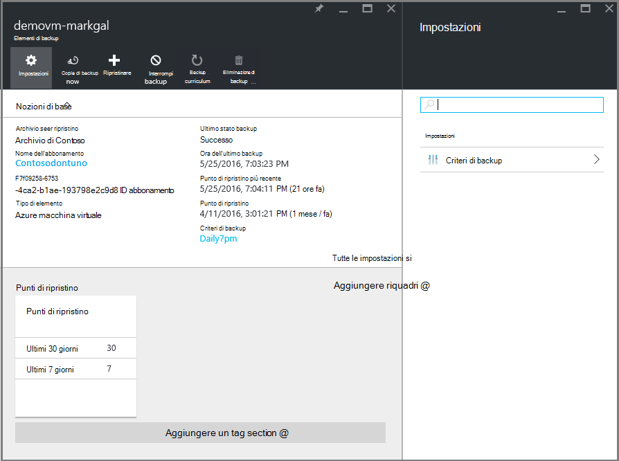

    Dal dashboard elemento archivio, è possibile eseguire molte attività di gestione delle chiavi, ad esempio:

    - modificare i criteri o creare un nuovo criterio backup < br\>
    - visualizzare i punti di ripristino e vedere lo stato di coerenza < br\>
    - backup su richiesta di una macchina virtuale < br\>
    - arrestare la protezione macchine virtuali < br\>
    - riprendere la protezione di una macchina virtuale < br\>
    - eliminare un backup dei dati (o punto di ripristino) < br\>
    - [ripristinare una copia di backup o punto di ripristino,](./backup-azure-arm-restore-vms.md#restore-a-recovery-point) < br\>

Per le procedure seguenti, il punto di partenza è il dashboard elemento archivio.

## Gestire i criteri di backup

1. Nel [dashboard di archivio elemento](backup-azure-manage-vms.md#open-a-vault-item-dashboard), fare clic su **Tutte le impostazioni** per aprire e **l'Impostazioni** .

    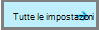

2. Scegliere **i criteri di Backup** per aprire tale blade e **l'Impostazioni** .

    In e il vengono visualizzati i dettagli di intervallo frequenza e la conservazione dei backup.

    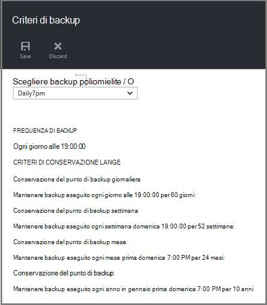

3. Dal menu **Scegli criteri di backup** :
    - Per modificare i criteri, selezionare un criterio diverso e fare clic su **Salva**. Il nuovo criterio viene applicato immediatamente all'archivio. < br\>
    - Per creare un criterio, selezionare **Crea nuovo**.

    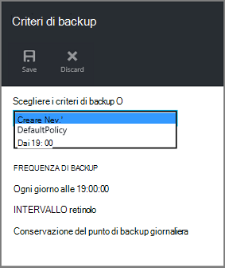

    Per istruzioni sulla creazione di un criterio di backup, vedere [definizione dei criteri di backup](backup-azure-manage-vms.md#defining-a-backup-policy).

[AZURE.INCLUDE [backup-create-backup-policy-for-vm](../../includes/backup-create-backup-policy-for-vm.md)]

## Backup su richiesta di una macchina virtuale
Dopo aver configurato per la protezione, è possibile eseguire backup di una macchina virtuale una richiesta. Se il backup iniziale non è in sospeso, backup su richiesta consente di creare una copia completa della macchina virtuale nell'archivio di servizi di recupero. Se viene completato il backup iniziale, una copia di backup su richiesta inviare solo le modifiche dal snapshot precedente nell'archivio di servizi di recupero. Vale a dire successivi sono sempre incrementale.

>[AZURE.NOTE] L'intervallo di criteri di conservazione per un backup su richiesta è il valore di conservazione specificato per il punto di backup giornaliero nei criteri. Se non è selezionato alcun punto di backup giornaliero, viene utilizzato il punto di backup settimana.

Per attivare un backup nella richiesta di una macchina virtuale:

- Nel [dashboard di archivio elemento](backup-azure-manage-vms.md#open-a-vault-item-dashboard), fare clic su **Esegui Backup**.

    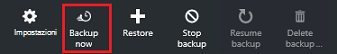

    Il portale consente di verificare che si desidera avviare un processo di backup su richiesta. Fare clic su **Sì** per avviare il processo di backup.

    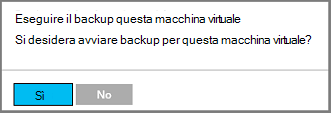

    Il processo di backup crea un punto di ripristino. L'intervallo di criteri di conservazione del punto di ripristino corrisponde al mantenimento specificato nel criterio associato alla macchina virtuale. Per verificare l'avanzamento del processo, nel dashboard di archivio, fare clic sul riquadro **Processi di Backup** .  

## Arrestare la protezione macchine virtuali
Se si sceglie di arrestare la protezione una macchina virtuale, viene chiesto se si desidera mantenere i punti di ripristino. Esistono due modi per arrestare la protezione macchine virtuali di:
- non tutti i processi di backup futuri ed eliminare tutti i punti di ripristino, o
- interrompere tutti i processi di backup futuri mantenendo i punti di ripristino  

Esiste un costo associato lasciando i punti di ripristino di spazio di archiviazione. Il vantaggio di lasciando i punti di ripristino invece che è possibile ripristinare la macchina virtuale in un secondo momento, se lo si desidera. Per informazioni sul costo di uscita i punti di ripristino, vedere [informazioni sui prezzi](https://azure.microsoft.com/pricing/details/backup/). Se si sceglie di eliminare tutti i punti di ripristino, sarà possibile ripristinare la macchina virtuale.

Per interrompere la protezione per una macchina virtuale:

1. Nel [dashboard di archivio elemento](backup-azure-manage-vms.md#open-a-vault-item-dashboard), fare clic su **Interrompi backup**.

    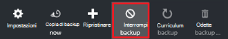

    Verrà visualizzata e l'interrompere la copia di Backup.

    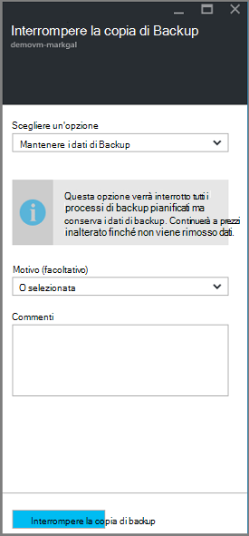

2. Scegliere se mantenere o eliminare i dati di backup e **l'Interrompere Backup** . Finestra di dialogo informazioni vengono fornite informazioni dettagliate sulla scelta.

    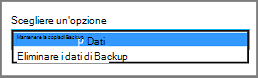

3. Se si è scelto di mantenere i dati di backup, andare al passaggio 4. Se si è scelto di eliminare i dati di backup, confermare che si desidera interrompere i processi di backup ed eliminare i punti di ripristino - digitare il nome dell'elemento.

    

    Se non si è certi del nome dell'elemento, passare il mouse sopra il punto esclamativo per visualizzare il nome. Inoltre, si trova sotto **Interrompere la copia di Backup** nella parte superiore e il nome dell'elemento.

4. Se lo si desidera specificare un **motivo** o un **commento**.

5. Per interrompere il processo di backup per l'elemento corrente, fare clic su  

    Un messaggio di notifica si filtrano che i processi di backup interrotta.

    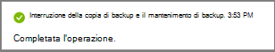

## Riprendere la protezione di una macchina virtuale
Se l'opzione **Mantieni dati di Backup** è stato selezionato quando si è interrotta la protezione per la macchina virtuale, è possibile riprendere la protezione. Se è stata selezionata l'opzione di **Eliminazione di dati di Backup** , non è possibile riprendere la protezione per la macchina virtuale.

Per riprendere la protezione per la macchina virtuale

1. Nel [dashboard di archivio elemento](backup-azure-manage-vms.md#open-a-vault-item-dashboard), fare clic su **Riprendi backup**.

    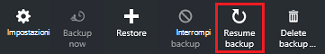

    Verrà visualizzata e il criterio di Backup.

    >[AZURE.NOTE] Quando si protegge nuovamente la macchina virtuale, è possibile scegliere criteri diversi rispetto ai criteri con cui è stato protetto da inizialmente macchina virtuale.

2. Seguire i passaggi descritti in [criteri di modifica o crea un nuovo criterio di backup](backup-azure-manage-vms.md#change-policies-or-create-a-new-backup-policy), per assegnare il criterio per la macchina virtuale.

    Una volta criteri di backup viene applicato alla macchina virtuale, viene visualizzato il messaggio seguente.

    

## Eliminare i dati di Backup
È possibile eliminare i dati di backup associati a una macchina virtuale durante il processo di **interrompere la copia di backup** o in qualsiasi momento dopo il backup completamento del processo. Potrebbe essere utile attendere giorni o settimane prima di eliminare i punti di ripristino. Diversamente da quanto succede quando si eliminano i dati di backup, ripristino punti di ripristino, non è possibile scegliere i punti di ripristino specifico da eliminare. Se si sceglie di eliminare i dati di backup, eliminare tutti i punti di ripristino associati all'elemento.

La procedura seguente presuppone che il processo di Backup per la macchina virtuale è stata interrotto o disattivato. Una volta il processo di Backup è disabilitato, le opzioni **riprendere backup** ed **eliminare backup** sono disponibili nel dashboard elemento archivio.

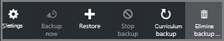

Per eliminare i dati di backup in un computer virtuale con *Backup disabilitato*:

1. Nel [dashboard di archivio elemento](backup-azure-manage-vms.md#open-a-vault-item-dashboard), fare clic su **Elimina copia di backup**.

    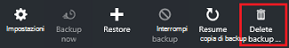

    Verrà visualizzata e **l'Eliminare dati di Backup** .

    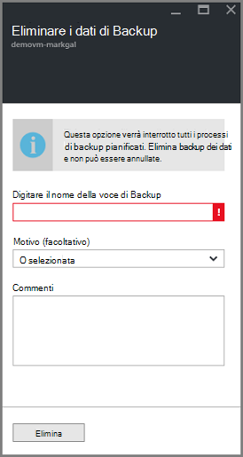

2. Digitare il nome dell'elemento per confermare che si desidera eliminare i punti di ripristino.

    

    Se non si è certi del nome dell'elemento, passare il mouse sopra il punto esclamativo per visualizzare il nome. Inoltre, il nome dell'elemento è in **Eliminazione di dati di Backup** nella parte superiore e il.

3. Se lo si desidera specificare un **motivo** o un **commento**.

4. Per eliminare i dati di backup per l'elemento corrente, fare clic su  

    Un messaggio di notifica si filtrano che i dati di backup sono stati eliminati.

## Passaggi successivi

Per informazioni su come creare nuovamente una macchina virtuale da un punto di ripristino, vedere [Ripristinare macchine virtuali di Azure](backup-azure-restore-vms.md). Per ulteriori informazioni sulla protezione macchine virtuali, vedere [prima di tutto: eseguire il backup di macchine virtuali in un archivio di servizi di recupero](backup-azure-vms-first-look-arm.md). Per informazioni sul monitoraggio eventi, vedere [gli avvisi di Monitor per i backup Azure macchina virtuale](backup-azure-monitor-vms.md).
