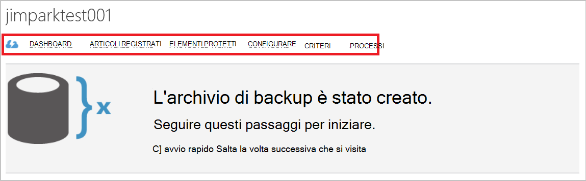

<properties
    pageTitle="Gestire archivi di Backup di Azure e server Azure utilizzando il modello di distribuzione classica | Microsoft Azure"
    description="Utilizzare questa esercitazione per imparare a gestire gli archivi di Backup di Azure e server."
    services="backup"
    documentationCenter=""
    authors="markgalioto"
    manager="jwhit"
    editor="tysonn"/>

<tags
    ms.service="backup"
    ms.workload="storage-backup-recovery"
    ms.tgt_pltfrm="na"
    ms.devlang="na"
    ms.topic="article"
    ms.date="09/27/2016"
    ms.author="jimpark;markgal"/>

# Gestire archivi di Backup di Azure e server utilizzando il modello di distribuzione classica

> [AZURE.SELECTOR]
- [Manager delle risorse](backup-azure-manage-windows-server.md)
- [Classica](backup-azure-manage-windows-server-classic.md)

In questo articolo sono disponibili una panoramica delle attività di gestione del backup disponibile tramite il portale classico Azure e l'agente di Microsoft Azure Backup.

[AZURE.INCLUDE [learn-about-deployment-models](../../includes/learn-about-deployment-models-classic-include.md)]Modello di distribuzione Manager delle risorse.

## Attività del portale di gestione
1. Accedere al [portale di gestione](https://manage.windowsazure.com).

2. Fare clic su **Servizi di recupero**, quindi fare clic sul nome dell'archivio di backup per visualizzare la pagina avvio rapido.

    

Selezionando le opzioni disponibili nella parte superiore della pagina di avvio rapido, è possibile visualizzare le attività di gestione disponibili.

### Dashboard
Selezionare **Dashboard** per visualizzare una panoramica di utilizzo per il server. **Panoramica di utilizzo** include:

- Il numero di Windows Server registrato cloud
- Il numero di Azure macchine virtuali protetta nel cloud
- Spazio di archiviazione totale consumata in Azure
- Lo stato dei processi recenti

Nella parte inferiore del Dashboard è possibile eseguire le operazioni seguenti:

- **Certificato di gestione** - se un certificato è stato utilizzato per registrare il server, quindi utilizzare questo comando per aggiornare il certificato. Se si usa l'archivio credenziali, non utilizzare **Gestione certificati**.
- **Elimina** - Elimina l'archivio di backup corrente. Se non viene utilizzato un archivio di backup, è possibile eliminarlo per liberare spazio di archiviazione. **Eliminare** è disponibile solo dopo aver eliminati dall'archivio di tutti i server registrati.

## Articoli registrati
Selezionare **Gli elementi registrati** per visualizzare i nomi dei server che sono registrate in questo archivio.

Il filtro di **tipo** predefinito per Azure Virtual Machine. Per visualizzare i nomi dei server registrati in questo archivio, selezionare **Windows server** dal menu a discesa.

Da qui è possibile eseguire le operazioni seguenti:

- **Consenti nuova registrazione** - quando si seleziona questa opzione per un server è possibile utilizzare la **Registrazione in linea** in agente di Microsoft Azure Backup locale per registrare il server con l'archivio di backup una seconda volta. Potrebbe essere necessario registrare nuovamente a causa di un errore nel certificato o se un server doveva essere ricreato.
- **Elimina** - Elimina un server dall'archivio di backup. Tutti i dati archiviati associati al server viene eliminato immediatamente.

    

## Elementi protetti
Selezionare **Gli elementi protetti** per visualizzare gli elementi che sono stato eseguito il backup dal server.

## Configurare

Nella scheda **Configura** è possibile selezionare l'opzione ridondanza di archiviazione appropriato. L'orario migliore per selezionare l'opzione ridondanza dello spazio di archiviazione è destra dopo la creazione di un insieme di credenziali e prima che tutti i computer sono registrati a tale.

>[AZURE.WARNING] Una volta un elemento è stato registrato all'archivio, l'opzione ridondanza dello spazio di archiviazione è bloccato e non può essere modificata.

Vedere l'articolo per ulteriori informazioni sulla [ridondanza dell'archiviazione](../storage/storage-redundancy.md).

## Attività di Microsoft Azure Backup agente

### Console

Aprire l' **agente di Microsoft Azure Backup** (è possibile trovare il computer in uso la ricerca di *Microsoft Azure Backup*).

Dalle **Azioni** disponibili a destra della console di agente di backup è possibile eseguire le attività di gestione dei seguenti:

- Registrare Server
- Programmazione Backup
- Esegui backup
- Modifica delle proprietà

>[AZURE.NOTE] Per **Recuperare dati**, vedere [ripristinare i file in un server di Windows o computer client di Windows](backup-azure-restore-windows-server.md).

### Modificare un backup esistente

1. In Microsoft Azure Backup agente fare clic su **Programmazione Backup**.

    

2. **Pianificazione guidata Backup** lasciare selezionata l'opzione di **apportare modifiche a elementi di backup o ore** e fare clic su **Avanti**.

    

3. Se si desidera aggiungere o modificare elementi, nella schermata di **Selezione di elementi eseguire il Backup** , fare clic su **Aggiungi elementi**.

    È inoltre possibile impostare **Le impostazioni di esclusione** da questa pagina della procedura guidata. Se si desidera escludere i file o i tipi di file leggere la procedura per aggiungere [le impostazioni di esclusione](#exclusion-settings).

4. Selezionare il file e cartelle che si desidera eseguire il backup e fare clic su **OK**.

    

5. Specificare la **pianificazione di backup** e fare clic su **Avanti**.

    È possibile pianificare backup settimanale o giornaliera (a un massimo di 3 ore al giorno).

    

    >[AZURE.NOTE] Specificare la pianificazione di backup sono illustrate in dettaglio in questo [articolo](backup-azure-backup-cloud-as-tape.md).

6. Selezionare il **Criterio di conservazione** per la copia di backup e fare clic su **Avanti**.

    

7. Nella schermata di **Conferma** esaminare le informazioni e fare clic su **Fine**.

8. Al termine della procedura guidata creare la **pianificazione di backup**, fare clic su **Chiudi**.

    Dopo aver modificato la protezione, è possibile verificare che l'esecuzione di backup attivano correttamente, passare alla scheda **processi** e confermare che le modifiche vengono eseguite anche i processi di backup.

### Attivare la limitazione di rete  
L'agente di Backup di Azure fornisce una scheda Throttling che consente di controllare l'utilizzo della larghezza di banda di rete durante il trasferimento di dati. Questo controllo può essere utile se è necessario eseguire il backup dei dati durante ore lavorative ma non si desidera che il processo di backup interferire con il traffico internet. Limitazione dei dati trasferimento viene applicato per eseguire il backup e ripristino.  

Per attivare la limitazione:

1. **Agente di Backup**, fare clic su **Modifica proprietà**.

2. Selezionare la casella di controllo **Abilita l'utilizzo della larghezza di banda internet la limitazione per le operazioni di backup** .

    

3. Dopo aver attivato la limitazione, specificare la larghezza di banda consentito per il trasferimento di dati di backup durante le **ore lavorative** e **Non le ore lavorative**.

    I valori della larghezza di banda iniziano da 512 KB al secondo (Kbps) e possono essere eseguita fino a 1023 megabyte al secondo (Mbps). È possibile impostare l'inizio e fine per **ore di lavoro**e i giorni della settimana sono considerati lavoro giorni. Ora all'esterno di ore di lavoro designate viene considerato non ore.

4. Fare clic su **OK**.

## Impostazioni di esclusione

1. Aprire l' **agente di Microsoft Azure Backup** (è possibile trovare il computer in uso la ricerca di *Microsoft Azure Backup*).

    

2. In Microsoft Azure Backup agente fare clic su **Programmazione Backup**.

    

3. Nella creazione guidata Backup programmazione lasciare selezionata l'opzione di **apportare modifiche a elementi di backup o ore** e fare clic su **Avanti**.

    

4. Fare clic su **Impostazioni esclusioni**.

    

5. Fare clic su **Aggiungi esclusione**.

    

6. Selezionare il percorso e quindi fare clic su **OK**.

    

7. Aggiungere l'estensione di file nel campo **Tipo di File** .

    

    Aggiunta di un'estensione mp3

    

    Per aggiungere un'altra estensione, fare clic su **Aggiungi esclusioni** e immettere un'altra estensione (aggiunta l'estensione JPEG).

    

8. Dopo avere aggiunto tutte le estensioni, fare clic su **OK**.

9. Continuare con la pianificazione guidata Backup, fare clic su **Avanti** fino alla **pagina di conferma**e quindi fare clic su **Fine**.

    

## Passaggi successivi
- [Ripristino Windows Server o Client di Windows Azure](backup-azure-restore-windows-server.md)
- Per ulteriori informazioni sui Backup di Azure, vedere [Panoramica di Backup di Azure](backup-introduction-to-azure-backup.md)
- Visitare il [Forum Backup Azure](http://go.microsoft.com/fwlink/p/?LinkId=290933)
