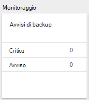

<properties
    pageTitle="Gestire archivi di servizi di recupero Azure e server | Microsoft Azure"
    description="Utilizzare questa esercitazione per imparare a gestire server e archivi di servizi di recupero Azure."
    services="backup"
    documentationCenter=""
    authors="markgalioto"
    manager="cfreeman"
    editor="tysonn"/>

<tags
    ms.service="backup"
    ms.workload="storage-backup-recovery"
    ms.tgt_pltfrm="na"
    ms.devlang="na"
    ms.topic="article"
    ms.date="10/19/2016"
    ms.author="jimpark; markgal"/>


# <a name="monitor-and-manage-azure-recovery-services-vaults-and-servers-for-windows-machines"></a>Monitorare e gestire gli archivi di servizi di recupero Azure e server per i computer Windows

> [AZURE.SELECTOR]
- [Manager delle risorse](backup-azure-manage-windows-server.md)
- [Classica](backup-azure-manage-windows-server-classic.md)

In questo articolo sono disponibili una panoramica delle attività di gestione del backup disponibile tramite il portale di Azure e l'agente di Microsoft Azure Backup.

[AZURE.INCLUDE [learn-about-deployment-models](../../includes/learn-about-deployment-models-rm-include.md)]modello di distribuzione classica.

## <a name="management-portal-tasks"></a>Attività del portale di gestione

### <a name="access-your-recovery-services-vaults"></a>Accedere a archivi i servizi di recupero

1. Accedere al [Portale di Azure](https://portal.azure.com/) usando l'abbonamento Azure.

2. Nel menu Hub fare clic su **Sfoglia** e nell'elenco delle risorse, digitare **I servizi di recupero**. Quando si inizia a digitare, l'elenco verrà applicato un filtro in base all'input. Fare clic su **servizi di recupero archivi**.

     <br/>

2. Selezionare il nome dell'archivio di cui che si desidera visualizzare nell'elenco per aprire e il ripristino servizi archivio dashboard.

     <br/>

## <a name="monitor-jobs-and-alerts"></a>Monitorare i processi e avvisi
Monitorare i processi e avvisi nel dashboard di archivio di servizi di recupero, in cui viene visualizzato:

- Dettagli avvisi backup
- I file e cartelle, nonché Azure macchine virtuali protette nel cloud
- Spazio di archiviazione totale consumata in Azure
- Stato dei processi di backup


Fare clic su informazioni in ognuna di esse verrà aperto e l'associato nel punto in cui si gestiscono le attività correlate.

Nella parte superiore del Dashboard:

- Impostazioni consente di accedere attività backup disponibili.
- Backup - consente di eseguire il backup nuovi file e cartelle (o macchine virtuali di Azure) per l'archivio di servizi di recupero.
- Elimina - se non viene utilizzato un archivio di servizi di recupero, è possibile eliminarlo per liberare spazio di archiviazione. Elimina è disponibile solo dopo aver eliminati dall'archivio di tutti i server protetti.


## <a name="alerts-for-backups-using-azure-backup-agent"></a>Avvisi per i backup con l'agente di backup Azure:
| Livello di avviso  | Avvisi inviati |
| ------------- | ------------- |
| Critica | Errore di backup, ripristino non riuscito  |
| Avviso  | Backup completato con avvisi (quando meno di cento non backup a causa di problemi di danneggiamento e più di un milione correttamente backup)  |
| Informativo  | Nessuno  |
## <a name="manage-backup-alerts"></a>Gestire gli avvisi di Backup
Fare clic sul riquadro **Gli avvisi di Backup** per aprire e il **Backup avvisi** e gestire gli avvisi.



Il riquadro degli avvisi di Backup Mostra il numero di:

- avvisi critici non risolti nelle ultime 24 ore
- avvertenze non risolti nelle ultime 24 ore

Fare clic su ognuno di questi collegamenti consente di accedere a e il **Backup avvisi** con una visualizzazione filtrata di questi avvisi (avvisi o critici).

Da e il Backup avvisi è:

- Scegliere le informazioni appropriate da includere con gli avvisi.

    

- Filtrare gli avvisi per i tempi di gravità, stato e inizio/fine.

    

- Configurare le notifiche per gravità, num_rate e i destinatari, nonché attivare o disattivare le avvisi.

    

Se è selezionata **Per ogni avviso** della frequenza di **notifica** raggruppamento o riduzione di messaggi di posta elettronica non. Tutti gli avvisi restituisce come risultato 1 notifica. Impostazione predefinita, messaggio di posta elettronica risoluzione viene inoltre inviato immediatamente.

Se è selezionato **Classificata oraria** come la **notifica** frequenza posta elettronica viene inviata all'utente che indica che sono presenti nuovi avvisi non risolti generati ultima ora. Viene inviato un messaggio di posta elettronica risoluzione alla fine dell'ora.

Possono essere inviati gli avvisi per i livelli di gravità seguenti:

- critica
- avviso
- informazioni

Si disattiva l'avviso con il pulsante **Disattiva** nel e dettagli processo. Quando si fa clic su Disattiva, è possibile fornire le note di risoluzione.

Scegliere le colonne da visualizzare come parte dell'avviso con il pulsante **Scegli colonne** .

>[AZURE.NOTE] Da e **l'Impostazioni** si gestiscono gli avvisi di backup selezionando **monitoraggio e report > avvisi ed eventi > avvisi Backup** e quindi facendo clic su **filtro** o **Configurare le notifiche**.

## <a name="manage-backup-items"></a>Gestione degli elementi di Backup
Gestione dei backup locale è ora disponibile nel portale di gestione. Nella sezione di Backup del dashboard, il riquadro di **Elementi di Backup** Mostra il numero di elementi backup protetto all'archivio.

Nella sezione elementi di Backup, fare clic su **Cartelle di File** .


E il Backup elementi verrà visualizzato con i filtri impostati alla cartella di File in cui viene visualizzato ogni backup specifico elemento nell'elenco.


Se si seleziona un elemento specifico a backup dall'elenco, vedere le informazioni essenziali per tale elemento.

>[AZURE.NOTE] Da e **l'Impostazioni** si gestiscono i file e cartelle selezionando **elementi protetti > elementi Backup** e quindi selezionare **Le cartelle di File** dal menu a discesa.


## <a name="manage-backup-jobs"></a>Gestire i processi di Backup
Processi di backup per entrambi in locale (quando il server locale è backup su Azure) e backup Azure sono visibili nel dashboard.

Nella sezione di Backup del dashboard, il riquadro di processo di Backup Mostra il numero di processi:

- in corso
- non è possibile nelle ultime 24 ore.

Per gestire i processi di backup, fare clic sul riquadro **Processi di Backup** , che apre e il processi di Backup.


Modificare le informazioni disponibili in e il processi di Backup con il pulsante **Scegli colonne** nella parte superiore della pagina.

Usare il pulsante **filtro** di selezionare il file e cartelle e copia di backup di Azure macchina virtuale.

Se non viene visualizzato il backup dei file e cartelle, fare clic sul pulsante **filtro** nella parte superiore della pagina e selezionare **file e cartelle** dal menu tipo di elemento.

>[AZURE.NOTE] Da e **l'Impostazioni** gestire processi di backup selezionando **monitoraggio e report > processi > processi di Backup** e quindi selezionare **Le cartelle di File** dal menu a discesa.

## <a name="monitor-backup-usage"></a>Monitorare l'utilizzo di Backup
Nella sezione di Backup del dashboard, il riquadro l'utilizzo di Backup Mostra archiviazione utilizzato in Azure. Uso archiviazione è disponibili per:
- Uso di archiviazione cloud LRS associato l'archivio
- Uso di archiviazione cloud GRS associato l'archivio

## <a name="production-servers"></a>Server di produzione
Per gestire il server di produzione, fare clic su **Impostazioni**. In Gestione fare clic su **dell'infrastruttura di Backup > server di produzione**.

Elenchi di blade server di produzione di tutti i server di produzione disponibili. Fare clic su un server nell'elenco per aprire i dettagli di server.


## <a name="microsoft-azure-backup-agent-tasks"></a>Attività di Microsoft Azure Backup agente

## <a name="open-the-backup-agent"></a>Aprire l'agente di backup

Aprire l' **agente di Microsoft Azure Backup** (risulta cercandone il computer in uso *Microsoft Azure Backup*).


Dalle **Azioni** disponibili a destra della console di agente di backup è eseguire attività di gestione delle operazioni seguenti:

- Registrare Server
- Programmazione Backup
- Esegui backup
- Modifica delle proprietà


>[AZURE.NOTE] Per **Recuperare dati**, vedere [ripristinare i file in un server di Windows o computer client di Windows](backup-azure-restore-windows-server.md).

## <a name="modify-an-existing-backup"></a>Modificare un backup esistente

1. In Microsoft Azure Backup agente fare clic su **Programmazione Backup**.

    

2. **Pianificazione guidata Backup** lasciare selezionata l'opzione di **apportare modifiche a elementi di backup o ore** e fare clic su **Avanti**.

    

3. Se si desidera aggiungere o modificare elementi, nella schermata di **Selezione di elementi eseguire il Backup** , fare clic su **Aggiungi elementi**.

    È inoltre possibile impostare **Le impostazioni di esclusione** da questa pagina della procedura guidata. Se si desidera escludere i file o i tipi di file leggere la procedura per aggiungere [le impostazioni di esclusione](#exclusion-settings).

4. Selezionare il file e cartelle che si desidera eseguire il backup e fare clic su **OK**.

    

5. Specificare la **pianificazione di backup** e fare clic su **Avanti**.

    È possibile pianificare backup settimanale o giornaliera (a un massimo di 3 ore al giorno).

    

    >[AZURE.NOTE] Specificare la pianificazione di backup sono illustrate in dettaglio in questo [articolo](backup-azure-backup-cloud-as-tape.md).

6. Selezionare il **Criterio di conservazione** per la copia di backup e fare clic su **Avanti**.

    

7. Nella schermata di **Conferma** esaminare le informazioni e fare clic su **Fine**.

8. Al termine della procedura guidata creare la **pianificazione di backup**, fare clic su **Chiudi**.

    Dopo aver modificato la protezione, è possibile verificare che l'esecuzione di backup attivano correttamente, passare alla scheda **processi** e confermare che le modifiche vengono eseguite anche i processi di backup.

## <a name="enable-network-throttling"></a>Attivare la limitazione di rete  
L'agente di Backup di Azure fornisce una scheda Throttling che consente di controllare l'utilizzo della larghezza di banda di rete durante il trasferimento di dati. Questo controllo può essere utile se è necessario eseguire il backup dei dati durante ore lavorative ma non si desidera che il processo di backup interferire con il traffico internet. Limitazione dei dati trasferimento viene applicato per eseguire il backup e ripristino.  

Per attivare la limitazione:

1. **Agente di Backup**, fare clic su **Modifica proprietà**.

2. **La limitazione della scheda, selezionare **Abilita l'utilizzo della larghezza di banda internet la limitazione per backup operazioni * *.

    

    Dopo aver attivato la limitazione, specificare la larghezza di banda consentito per il trasferimento di dati di backup durante le **ore lavorative** e **Non le ore lavorative**.

    I valori della larghezza di banda iniziano da 512 KB al secondo (Kbps) e possono essere eseguita fino a 1023 megabyte al secondo (Mbps). È possibile impostare l'inizio e fine per **ore di lavoro**e i giorni della settimana sono considerati lavoro giorni. Ora all'esterno di ore di lavoro designate viene considerato non ore.

3. Fare clic su **OK**.

## <a name="manage-exclusion-settings"></a>Gestire le impostazioni di esclusione

1. Aprire l' **agente di Microsoft Azure Backup** (è possibile trovare il computer in uso la ricerca di *Microsoft Azure Backup*).

    

2. In Microsoft Azure Backup agente fare clic su **Programmazione Backup**.

    

3. Nella creazione guidata Backup programmazione lasciare selezionata l'opzione di **apportare modifiche a elementi di backup o ore** e fare clic su **Avanti**.

    

4. Fare clic su **Impostazioni esclusioni**.

    

5. Fare clic su **Aggiungi esclusione**.

    

6. Selezionare il percorso e quindi fare clic su **OK**.

    

7. Aggiungere l'estensione di file nel campo **Tipo di File** .

    

    Aggiunta di un'estensione mp3

    

    Per aggiungere un'altra estensione, fare clic su **Aggiungi esclusioni** e immettere un'altra estensione (aggiunta l'estensione JPEG).

    

8. Dopo avere aggiunto tutte le estensioni, fare clic su **OK**.

9. Continuare con la pianificazione guidata Backup, fare clic su **Avanti** fino alla **pagina di conferma**e quindi fare clic su **Fine**.

    

## <a name="frequently-asked-questions"></a>Domande frequenti
**T1. Processo di backup viene visualizzato lo stato come completata in Azure l'agente di backup, perché non è visualizzato rifletteranno nel portale?**

A1. Vi è in ritardo massimo di 15 minuti tra lo stato del processo di backup applicato in Azure agente di backup e il portale di Azure.

**Q.2 quando non è un processo di backup, come tempo per generare un avviso?**

2 un avviso viene generato all'interno di 20 minuti di Azure errori di backup.

**T3. Esiste un caso in cui un messaggio di posta elettronica non verrà inviata se sono state configurate le notifiche?**

A3. Di seguito sono i casi, quando non è possibile inviare la notifica per ridurre il rumore avviso:

   - Se le notifiche sono configurate in ogni ora e un avviso viene generato e risolto all'interno dell'ora
   - Processo viene annullato.
   - Processo di backup secondo perché il processo di backup originale è in corso.

## <a name="troubleshooting-monitoring-issues"></a>Risoluzione dei problemi di monitoraggio

**Problema:** Processi e/o gli avvisi di agente di Backup di Azure non viene visualizzato nel portale.

**Operazioni seguenti:** Il processo, ```OBRecoveryServicesManagementAgent```, invia dati processo e avviso per il servizio di Backup di Azure. In alcuni casi questo processo può diventare bloccato o arresto.

1. Per verificare il processo non è in esecuzione, aprire **Task Manager** e controllare se il ```OBRecoveryServicesManagementAgent``` processo è in esecuzione.

2. Supponendo che il processo non è in esecuzione, aprire **Il pannello di controllo** e visualizzare l'elenco dei servizi. Avviare o riavviare **Agente di gestione dei servizi di recupero di Microsoft Azure**.

    Per ulteriori informazioni, visitare i registri in:<br/>
`<AzureBackup_agent_install_folder>\Microsoft Azure Recovery Services Agent\Temp\GatewayProvider*`. Per esempio:<br/> `C:\Program Files\Microsoft Azure Recovery Services Agent\Temp\GatewayProvider0.errlog`.

## <a name="next-steps"></a>Passaggi successivi
- [Ripristino Windows Server o Client di Windows Azure](backup-azure-restore-windows-server.md)
- Per ulteriori informazioni sui Backup di Azure, vedere [Panoramica di Backup di Azure](backup-introduction-to-azure-backup.md)
- Visitare il [Forum Backup Azure](http://go.microsoft.com/fwlink/p/?LinkId=290933)
