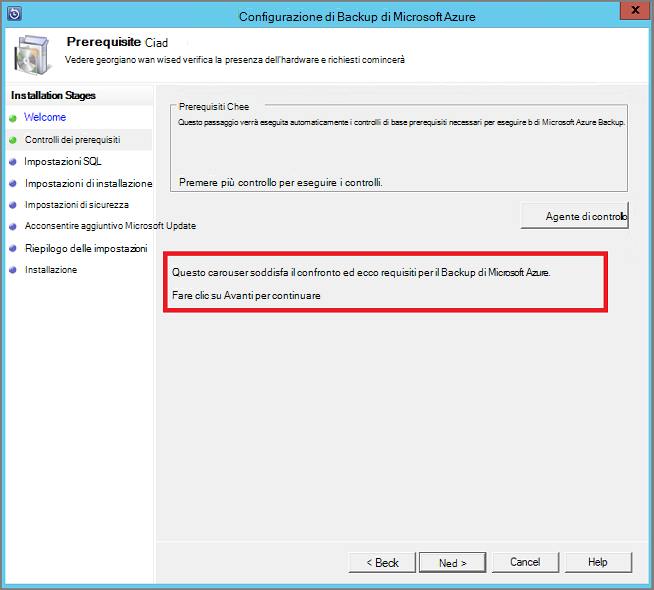

<properties
  pageTitle="Preparare l'ambiente per eseguire il backup carichi di lavoro tramite il Server di Backup di Azure | Microsoft Azure"
  description="Verificare che l'ambiente sia predisposto correttamente per eseguire il backup carichi di lavoro tramite il Server di Backup di Azure"
  services="backup"
  documentationCenter=""
  authors="pvrk"
  manager="shivamg"
  editor=""
  keywords="Azure server backup. archivio di backup"/>

<tags
  ms.service="backup"
  ms.workload="storage-backup-recovery"
  ms.tgt_pltfrm="na"
  ms.devlang="na"
  ms.topic="article"
  ms.date="08/22/2016"
  ms.author="jimpark;trinadhk;pullabhk; markgal"/>

# <a name="preparing-to-back-up-workloads-using-azure-backup-server"></a>Preparazione del backup carichi di lavoro tramite il Server di Backup di Azure

> [AZURE.SELECTOR]
- [Server di Backup Azure](backup-azure-microsoft-azure-backup.md)
- [SCDPM](backup-azure-dpm-introduction.md)
- [Server di Backup Azure (classica)](backup-azure-microsoft-azure-backup-classic.md)
- [SCDPM (classico)](backup-azure-dpm-introduction-classic.md)


In questo articolo è relativo preparare l'ambiente per eseguire il backup carichi di lavoro tramite il Server di Backup di Azure. Con il Server di Backup di Azure, è possibile proteggere carichi di lavoro di applicazione, ad esempio macchine virtuali di Hyper-V, Microsoft SQL Server, SharePoint Server e Microsoft Exchange client Windows da un'unica console.

>[AZURE.WARNING] Server di Backup Azure eredita le funzionalità di Data Protection Manager (DPM) per il backup di carico di lavoro. Sono disponibili collegamenti alla documentazione di Data Protection Manager per alcune di queste funzionalità. Server di Backup Azure tuttavia non proteggere con nastro o integrazione con System Center.

## <a name="1-windows-server-machine"></a>1. computer Server Windows


Il primo passo per iniziare il Server di Backup Azure è necessario un computer Windows Server.

| Posizione | Requisiti minimi | Ulteriori istruzioni |
| -------- | -------------------- | ----------------------- |
| Azure | Azure IaaS virtuale computer<br><br>A2 Standard: 2 core, 3,5 GB di RAM | È possibile iniziare con una semplice nella galleria del Data Center di Windows Server 2012 R2. [Protezione IaaS carichi di lavoro utilizzando Azure Backup Server (Data Protection Manager)](https://technet.microsoft.com/library/jj852163.aspx) sono molte sfumature. Assicurarsi di letto l'articolo completamente prima di distribuire il computer. |
| Locale | Macchine Virtuali di Hyper-V,<br> Macchine Virtuali VMWare,<br> o un host fisico<br><br>2 core e 4GB di RAM | È possibile deduplicate lo spazio di archiviazione Data Protection Manager utilizzando Windows Server Deduplication. Ulteriori informazioni su Data Protection Manager deduplication interazione [e](https://technet.microsoft.com/library/dn891438.aspx) quando vengono distribuiti in macchine virtuali di Hyper-V. |

> [AZURE.NOTE] È consigliabile installare Server Azure Backup in un computer con Data Center di Windows Server 2012 R2. Molte i prerequisiti rientrano automaticamente con l'ultima versione del sistema operativo Windows.

Se si prevede di aggiungere il server a un dominio a un certo punto, si consiglia di eseguire l'attività di partecipazione a dominio prima dell'installazione di Azure Backup Server. Spostare una macchina Server Backup Azure esistente in un nuovo dominio dopo la distribuzione *non è supportato*.

## <a name="2-backup-vault"></a>2. backup archivio


Se si invia dati di backup in Azure o lasciarla invariata per fare in locale, il software deve essere connesso a Azure. In modo più specifico, del Server di Backup Azure deve essere registrato con un archivio di backup.

Per creare un archivio di backup:

1. Accedere al [portale di gestione](http://manage.windowsazure.com/).

2. Fare clic su **Nuovo** > **servizi dati** > **servizi di recupero** > **archivio di Backup** > **Creazione rapida**. Se si hanno più abbonamenti associati all'account dell'organizzazione, scegliere l'abbonamento corretta da associare l'archivio di backup.

3. In **nome**immettere un nome descrittivo per identificare l'archivio. Questa operazione deve essere univoco per ogni sottoscrizione.

4. Nell' **area geografica**, selezionare la località geografica per l'archivio. L'area geografica dell'archivio è in genere scelto sulla base di vincoli latenza sovranità o in rete dati.

    

5. Fare clic su **Crea archivio**. Può richiedere un po' di tempo per l'archivio di backup da creare. Eseguire il monitoraggio delle notifiche sullo stato nella parte inferiore del portale.

    

6. Un messaggio di conferma che l'archivio è stato creato e sarà elencato nella pagina Servizi di recupero come attivo.
    

  > [AZURE.IMPORTANT] Assicurarsi che l'opzione ridondanza di archiviazione appropriato sia selezionato subito dopo l'archivio è stata creata. Per saperne di più sui [geografico ridondanti](../storage/storage-redundancy.md#geo-redundant-storage) e opzioni [localmente ridondanti](../storage/storage-redundancy.md#locally-redundant-storage) in questa [Panoramica](../storage/storage-redundancy.md).


## <a name="3-software-package"></a>3. pacchetto software


### <a name="downloading-the-software-package"></a>Il download del pacchetto di software

Analogamente a archivio credenziali, è possibile scaricare Microsoft Azure Backup per carichi di lavoro di applicazione dalla **Pagina iniziale rapido** dell'archivio di backup.

1. Fare clic su **applicazione carichi di lavoro (del disco nel Cloud)**. Verrà visualizzata alla pagina area Download nel punto in cui può essere scaricato il pacchetto di software.

    

2. Fare clic su **Scarica**.

    

3. Selezionare tutti i file e fare clic su **Avanti**. Scaricare tutti i file provenienti da una pagina di download di Microsoft Azure Backup e posizionare tutti i file nella stessa cartella.


    Poiché le dimensioni di download di tutti i file insieme > 3G, su un 10Mbps collegamento per il download che potrebbe richiedere fino a 60 minuti per il completamento del download.


### <a name="extracting-the-software-package"></a>L'estrazione del pacchetto software

Dopo aver scaricato tutti i file, fare clic su **MicrosoftAzureBackupInstaller.exe**. Verrà avviata la **Configurazione guidata di Microsoft Azure Backup** per estrarre i file di configurazione in un percorso specificato dall'utente. Continuare la procedura guidata e fare clic sul pulsante **Estrai** per avviare il processo di estrazione.

> [AZURE.WARNING] Almeno 4GB di spazio libero sono necessarie per estrarre i file di installazione.


Dopo l'estrazione elaborare completa, selezionare la casella per avviare appena estratti *setup.exe* per iniziare l'installazione di Microsoft Azure Backup Server e fare clic sul pulsante **Fine** .

### <a name="installing-the-software-package"></a>Installazione del pacchetto software

1. Fare clic su **Microsoft Azure Backup** per avviare la configurazione guidata.

    

2. Nella schermata iniziale fare clic sul pulsante **Avanti** . Verrà visualizzato nella sezione *Controlla prerequisiti* . In questa schermata, fare clic sul pulsante **Controlla** per determinare se sono stati soddisfatti i prerequisiti hardware e software per il Server di Backup di Azure. Se tutti i prerequisiti sono state soddisfatte correttamente, verrà visualizzato un messaggio che indica che il computer soddisfi i requisiti. Fare clic sul pulsante **Avanti** .

    

3. Server di Microsoft Azure Backup richiede SQL Server Standard e il pacchetto di installazione di Azure Backup Server fornito in dotazione con i file binari appropriati di SQL Server necessari. Quando a partire da una nuova installazione Azure Backup Server, è necessario selezionare l'opzione **Installa nuova istanza di SQL Server con il programma di installazione** e fare clic sul pulsante **verificare e installare** . Una volta completata siano installati i prerequisiti, fare clic su **Avanti**.

    

    In caso di errore con un suggerimento per riavviare il computer, eseguire questa operazione e fare clic su **Selezionare nuovo**.

    > [AZURE.NOTE] Server di Backup Azure non funziona con un'istanza di SQL Server remota. L'istanza utilizzata dal Server di Backup Azure deve essere locale.

4. Specificare un percorso per l'installazione di Microsoft Azure Backup server file e fare clic su **Avanti**.

    

    La posizione iniziale è un requisito di backup su Azure. Assicurarsi che la posizione iniziale 5% almeno dei dati pianificato in origine per eseguire il backup nel cloud. Per la protezione del disco, è necessario configurare una volta completata l'installazione dischi separati. Per ulteriori informazioni sui pool di archiviazione, vedere [configurazione di pool di archiviazione e spazio su disco](https://technet.microsoft.com/library/hh758075.aspx).

5. Fornire una password complessa per gli account utente locali con restrizioni e fare clic su **Avanti**.

    

6. Selezionare se si desidera utilizzare *Microsoft Update* per verificare la presenza di aggiornamenti e fare clic su **Avanti**.

    >[AZURE.NOTE] Si consiglia di gestire Windows Update di reindirizzamento a Microsoft Update, che offre protezione e aggiornamenti importanti per Windows e altri prodotti come Microsoft Azure Backup Server.

    

7. Esaminare il *Riepilogo delle impostazioni* e fare clic su **Installa**.

    

8. L'installazione viene eseguita in fasi. Nella prima fase l'agente di servizi di recupero di Microsoft Azure viene installato sul server. Controlla anche la procedura guidata per la connettività Internet. Se è disponibile la connettività Internet è possibile procedere con l'installazione, in caso contrario, è necessario fornire dettagli proxy per la connessione a Internet.

    Il passaggio successivo consiste nel configurare l'agente di servizi di recupero di Microsoft Azure. Come parte della configurazione, sarà necessario fornire che si le credenziali di archivio per registrare il computer per l'archivio di backup. Fornire anche una frase per crittografia/decrittografia i dati inviati tra Azure e le locale. Automaticamente, è possibile generare una frase o fornire il proprio minima passphrase 16 caratteri. Continuare la procedura guidata fino a quando non è stato configurato l'agente.

    

9. Una volta completata la registrazione del server di Microsoft Azure Backup correttamente, la configurazione guidata di complessiva procede per l'installazione e configurazione di SQL Server e i componenti di Azure Backup Server. Al termine dell'installazione del componente di SQL Server, i componenti di Azure Backup Server siano installati.

    


Al termine di fase dell'installazione, le icone del desktop del prodotto saranno state create anche. Fare doppio clic sull'icona per avviare il prodotto.

### <a name="add-backup-storage"></a>Aggiungere spazio di archiviazione backup

La copia di backup prima verrà mantenuta nello spazio di archiviazione collegato al computer Server Backup Azure. Per ulteriori informazioni sull'aggiunta di dischi, vedere [configurazione di pool di archiviazione e spazio su disco](https://technet.microsoft.com/library/hh758075.aspx).

> [AZURE.NOTE] È necessario aggiungere spazio di archiviazione backup anche se si intende inviare dati a Azure. Architettura corrente del Server di Backup di Azure, l'archivio di Azure Backup contiene la *seconda* copia dei dati durante l'archiviazione locale contiene la copia di backup prima (e obbligatoria).  

## <a name="4-network-connectivity"></a>4. la connettività di rete


Azure Server di Backup richiede una connessione al servizio di Backup di Azure per il prodotto per il corretto funzionamento. Per stabilire se il computer abbia la connettività di Azure, utilizzare la ```Get-DPMCloudConnection``` cmdlet nella console di Azure Backup Server PowerShell. Se l'output del cmdlet è vero è presente la connettività, altro non esiste alcun connettività.

Nello stesso momento la sottoscrizione Azure deve essere funzionante. Per individuare lo stato dell'abbonamento e gestirlo, accedere al [portale di sottoscrizione]( https://account.windowsazure.com/Subscriptions).

Dopo aver appreso lo stato di connettività Azure e della sottoscrizione Azure, è possibile utilizzare la tabella seguente per individuare l'impatto sulle funzionalità backup e ripristino offerta.

| Stato di integrazione applicativa | Abbonamento Azure | Copia di backup in Azure| Backup su disco | Ripristinare da Azure | Ripristinare da disco |
| -------- | ------- | --------------------- | ------------------- | --------------------------- | ----------------------- |
| Connesso | Attiva | È consentito | È consentito | È consentito | È consentito |
| Connesso | Scaduto | Arrestato | Arrestato | È consentito | È consentito |
| Connesso | Annullamento del provisioning | Arrestato | Arrestato | Punti di ripristino interrotte e Azure eliminati | Arrestato |
| Perso la connettività > 15 giorni | Attiva | Arrestato | Arrestato | È consentito | È consentito |
| Perso la connettività > 15 giorni | Scaduto | Arrestato | Arrestato | È consentito | È consentito |
| Perso la connettività > 15 giorni | Annullamento del provisioning | Arrestato | Arrestato |  Punti di ripristino interrotte e Azure eliminati | Arrestato |

### <a name="recovering-from-loss-of-connectivity"></a>Il ripristino da perdita di integrazione applicativa
Se si usa un firewall o un proxy che impedisce l'accesso a Azure, è necessario proprietà consentite gli indirizzi di dominio seguenti nel profilo del firewall/proxy:

- www.msftncsi.com
- \*. Microsoft.com
- \*. WindowsAzure.com
- \*. microsoftonline.com
- \*. windows.net

Una volta connettività a Azure è stata ripristinata nel computer Server di Backup di Azure, le operazioni che è possono eseguire dipendono dallo stato della sottoscrizione Azure. Nella tabella precedente è le operazioni consentite una volta al computer "connessa" i dettagli.

### <a name="handling-subscription-states"></a>Gestione degli stati di abbonamento

È possibile eseguire una sottoscrizione Azure da uno stato *scaduto* o *Deprovisioned* per lo stato *attivo* . Tuttavia questo comporta alcune implicazioni sul comportamento del prodotto mentre lo stato non è *attivo*:

- Una sottoscrizione *Deprovisioned* perde le funzionalità per il periodo viene rimosso con deprovisioning. Sull'attivazione *attivo*, viene ripristinata la funzionalità di prodotto di backup e ripristino. I dati di backup sul disco locale possono essere recuperati anche se è stata mantenuta con un periodo di conservazione sufficiente. Tuttavia, i dati di backup in Azure sono perditi definitiva dopo l'abbonamento entra nello stato *Deprovisioned* .
- Un abbonamento *scaduto* perde solo le funzionalità per fino a quando sono già state *Attiva* nuovamente. Eventuali backup pianificato per il periodo che l'abbonamento è stato *scaduto* non verrà eseguito.


## <a name="troubleshooting"></a>Risoluzione dei problemi

Server di Microsoft Azure Backup ha esito negativo errori durante la fase di installazione (o di una copia di backup o ripristino), fare riferimento al [documento di codici di errore](https://support.microsoft.com/kb/3041338) per ulteriori informazioni.
È inoltre possibile fare riferimento a [che backup Azure correlato domande frequenti](backup-azure-backup-faq.md)


## <a name="next-steps"></a>Passaggi successivi

Per informazioni dettagliate sulla [Preparazione dell'ambiente per Data Protection Manager](https://technet.microsoft.com/library/hh758176.aspx) nel sito Microsoft TechNet. Contiene inoltre informazioni sulle configurazioni supportate su cui distribuito e utilizzato il Server di Backup di Azure.

È possibile usare questi articoli per ottenere una maggiore comprensione di protezione di carico di lavoro utilizzando il server di Microsoft Azure Backup.

- [Copia di backup di SQL Server](backup-azure-backup-sql.md)
- [Copia di backup di SharePoint server](backup-azure-backup-sharepoint.md)
- [Copia di backup in un server alternativo](backup-azure-alternate-dpm-server.md)
